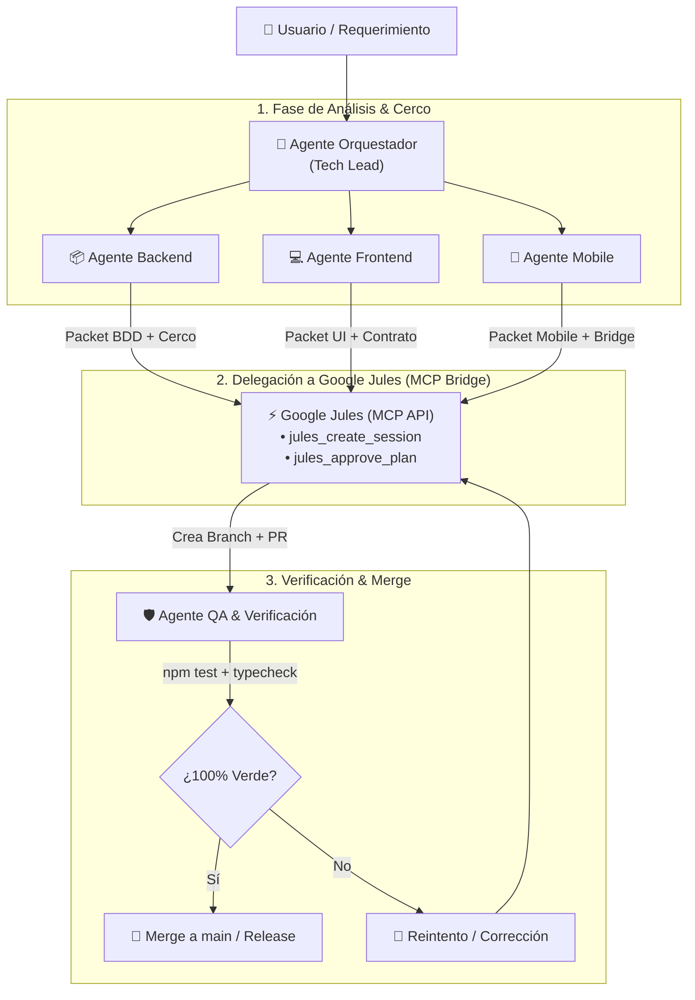

# 🤖 Escuadrón de Agentes Autónomos VetConnect (`.agents`)

> **Propósito:** Este directorio define la organización, roles, directivas operativas y protocolos de delegación del equipo autónomo de IA para el proyecto **VetConnect**. Reemplaza y amplifica las funciones del equipo humano de ingeniería, coordinando el trabajo continuo y derivando las tareas de codificación e implementación pesada a **Google Jules** mediante el **Model Context Protocol (MCP)**.

---

## 🗺️ 1. Estructura del Escuadrón de Agentes

El equipo está modelado a partir de la estructura real de ingeniería de software de alto rendimiento (FAANG Tier), compuesto por 5 roles especializados:

```
.agents/
├── README.md                      # Manifiesto Maestro del Escuadrón (este archivo)
├── jules-mcp.config.json          # Especificación de conexión MCP con Google Jules
├── orquestador/                   # Tech Lead / TPM: Priorización, gobernanza y puente MCP a Jules
│   ├── AGENT.md                   # Definición del agente orquestador, ciclo de vida y toma de decisiones
│   ├── PROMPTS.md                 # Plantillas operativas para interactuar y delegar
│   └── DELEGACION_JULES.md        # Protocolo formal de delegación y aprobación de planes a Jules MCP
├── backend/                       # Backend Engineer: Express 5, Prisma 6, PostgreSQL, WebSockets
│   ├── AGENT.md                   # Misión, stack, contratos y límites del módulo
│   ├── REGLAS_INGENIERIA.md       # Guardarraíles, RFC 7807, idempotencia, soft-deletes
│   └── JULES_INTEGRATION.md       # Cómo formula task packets backend para ejecución en Jules
├── frontend/                      # Frontend Web Engineer: React 18.3.1 LTS, Vite, Tailwind, TanStack Query
│   ├── AGENT.md                   # Misión, stack, arquitectura de componentes y LiveKit UI
│   ├── REGLAS_UI_DISENO.md        # Cero placeholders, Design Tokens 60-30-10, Storybook
│   └── JULES_INTEGRATION.md       # Cómo delega componentes y vistas web a Jules
├── mobile/                        # Mobile Engineer: Expo SDK 54, React 19.1.0, Expo Router, NativeWind
│   ├── AGENT.md                   # Misión, stack, WebView Bridge, SecureStore, ADB reverse
│   ├── REGLAS_MOBILE.md           # Guardarraíles móviles, 5 estados obligatorios, deep linking
│   └── JULES_INTEGRATION.md       # Cómo delega pantallas y flujos nativos a Jules
├── qa/                            # QA & Verification Engineer: Jest, Vitest, CI/CD, Anti-regresiones
│   ├── AGENT.md                   # Misión, suites de pruebas (160 tests), gates de calidad
│   └── PROTOCOLO_VERIFICACION.md  # Comandos obligatorios de Definition of Done (DoD)
└── compliance/                    # Chief Legal, Data Privacy, Sanitary & Accessibility Officer
    ├── AGENT.md                   # Misión, Ley 25.326, SENASA, Defensa del Consumidor, WCAG 2.1 AA
    ├── POLITICAS_LEGALES.md       # Términos, Privacidad, Cookies, Reembolsos y Consentimiento
    ├── ACCESIBILIDAD_WCAG.md      # Guía de contraste, navegación por teclado, alt texts y aria-labels
    └── MATRIZ_RIESGOS_LEGALES.md  # Datos del negocio, mitigación de demandas y copyright de imágenes
```

---

## ⚡ 2. Flujo Operativo: De la Necesidad al Pull Request



---

## 🔌 3. Integración MCP con Google Jules

Cualquier operación de programación, refactorización o creación de código se delega a **Google Jules** a través de su servidor MCP (`jules-mcp`).

* **Herramientas MCP habilitadas:**
  * `jules_list_sources`: Lista los repositorios GitHub vinculados para obtener el ID de contexto.
  * `jules_create_session`: Inicia una sesión de codificación autónoma pasando el prompt con el protocolo del **Quirófano de Código**.
  * `jules_list_sessions`: Monitorea el progreso, logs de ejecución y URL del Pull Request generado.
  * `jules_approve_plan`: Aprueba el cerco de seguridad y la lista de archivos antes de que Jules empiece a escribir código.

* **Configuración Global Antigravity:**
  El servidor MCP está registrado en `~/.gemini/config/mcp_config.json` y se inicializa mediante:
  ```json
  {
    "mcpServers": {
      "jules": {
        "command": "cmd.exe",
        "args": ["/c", "npx", "-y", "jules-mcp"],
        "env": {
          "JULES_API_KEY": "<CONFIGURADO_LOCALMENTE>"
        }
      }
    }
  }
  ```

---

## 🛡️ 4. Jerarquía Inmutable de Verdad (SSOT — ADR-025)

Todo agente que opere en este repositorio está subordinado a la siguiente precedencia:
1. **Nivel 1:** `backend/prisma/schema.prisma` y controladores Express en `backend/src/modules/`.
2. **Nivel 2:** `docs/TECH_REFERENCE.md` y `docs/web/AGENT_CODING_SPEC.md` / `docs/mobile/AGENT_CODING_SPEC_MOBILE.md`.
3. **Nivel 3:** `docs/ARCHITECTURE.md`, `docs/DECISIONS.md` (27 ADRs) y `docs/FRONTEND_ARCHITECTURE.md`.
4. **Nivel 4:** Wireframes y narrativa de diseño (`docs/web/00..11`, `docs/SISTEMA_DE_DISENO.md`).

*Regla de Oro:* **Queda prohibido inventar endpoints o campos basados en documentos de Nivel 4.**

---

## 🧰 5. Hub de Skills Extensibles & Conexión con Antigravity Remoto

Cada agente del escuadrón está calibrado al nivel de inteligencia y razonamiento de **Claude Opus 5.5 / Staff FAANG Tier**, operando con matrices formales de habilidades (Skills) nativas y hooks de extensibilidad:

* **Estructura de Skills:** Toda skill reside en una carpeta con un manifiesto `SKILL.md` con frontmatter YAML declarando su nombre y descripción de activación.
* **Integración con PC Secundaria Antigravity:** Cuando se copian o vinculan las skills adicionales desde la otra máquina (`~/.gemini/antigravity/builtin/skills/` o `.gemini/skills/`), el Orquestador las detecta dinámicamente y las activa en el agente de capa correspondiente:
  * Skills de base de datos y optimización SQL (`skill-pg-query-optimizer`) ➔ **Agente Backend**.
  * Skills de UI generativa y visual diff (`generative_ui`, `skill-visual-diff`) ➔ **Agente Frontend**.
  * Skills de emuladores y profiling móvil (`skill-hermes-profiler`) ➔ **Agente Mobile**.
  * Skills de mutación y escaneo de vulnerabilidades (`skill-security-scan`) ➔ **Agente QA**.
  * Skills de linteo contractual y fuga de PII (`skill-pii-leak-detector`) ➔ **Agente Compliance**.

