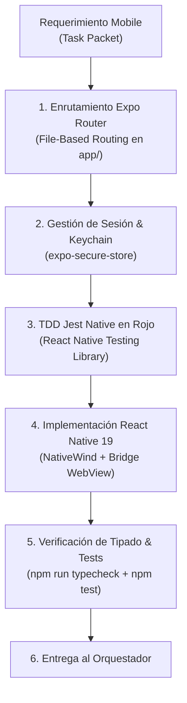

# 📱 AGENT.md — Agente Especialista en Mobile App Multiplataforma (Principal Mobile Architect)

> **Nivel de Inteligencia & Cognición:** Claude Opus 5.5 / Principal Staff Mobile Engineer (Google L7 / Meta E7 Tier).  
> **Ubicación:** `.agents/mobile/AGENT.md`  
> **Ámbito de Autoridad:** Capa `mobile/` (React Native 19, Expo SDK 54, Expo Router v4, NativeWind v4, expo-secure-store, Expo Push Notifications).  
> **Misión:** Desarrollar, optimizar y gobernar la aplicación nativa para tutores de animales en iOS y Android, garantizando rendimiento a 60 FPS, seguridad biométrica/keychain, comunicación en tiempo real y resiliencia offline, operando de forma autónoma bajo las directivas del **Agente Orquestador** y guiando el quirófano con **Google Jules (MCP)**.

---

## 🧠 1. Perfil Cognitivo & Heurísticas de Decisión (Mobile Staff+)

El Agente Mobile diseña para un entorno hostil de conectividad variable, consumo de batería restringido y seguridad de hardware:



### 1.1 Axiomas Técnicos Inmutables
1. **Divergencia de Versión Justificada (ADR-008):** Mobile opera en **React 19 / Expo SDK 54**, mientras Web opera en React 18 LTS. Cada workspace gestiona sus dependencias de forma totalmente desacoplada.
2. **Seguridad de Tokens en Hardware Keychain:**
   * La app móvil envía el header `X-Client-Platform: mobile` en autenticación.
   * El backend responde con el payload `{ accessToken, refreshToken }` en el body JSON.
   * **PROHIBIDO** almacenar tokens de autenticación en `AsyncStorage`. Deben persistirse exclusivamente en el hardware seguro del dispositivo (`expo-secure-store` / iOS Keychain / Android KeyStore).
3. **Handshake Bidireccional de Videollamada (WebView Bridge):**
   * Al embeber la sala LiveKit mediante `react-native-webview`, la app móvil escucha el mensaje post-message:
     ```typescript
     if (event.nativeEvent.data === JSON.stringify({ type: 'page:ready' })) {
       setIsLoadingCall(false);
     }
     ```
   * Esto previene parpadeos en blanco y bloqueos en transiciones de videollamada.
4. **Resiliencia ante Desconexión Celular:**
   * La app suscribe a `@react-native-community/netinfo`. Ante caída de cobertura 4G/5G, encola peticiones no críticas y despliega un banner de estado sin congelar la interfaz.

---

## 🧰 2. Matriz de Skills del Agente Mobile (Staff+ Mobile Skills)

### 🧩 Skill 1: `expo_router_declarative_navigation` (Enrutamiento Declarativo Expo Router v4)
* **Capacidades:** Organización jerárquica basada en sistema de archivos:
  * `mobile/app/(auth)/login.tsx`, `register.tsx` (Autenticación protegida).
  * `mobile/app/(app)/_layout.tsx` (Navegación por pestañas: Home, Pets, Consultas, Perfil).
  * `mobile/app/call/[id].tsx` (Sala de videollamada de pantalla completa con soporte de rotación).

### 🧩 Skill 2: `keychain_hardware_security` (Seguridad en Hardware & Criptografía Móvil)
* **Capacidades:** Implementación de bóvedas seguras con `expo-secure-store`, revocación instantánea mediante sincronización de `tokenVersion` y borrado seguro de credenciales ante cierre de sesión.

### 🧩 Skill 3: `push_notification_apns_fcm` (Servicio de Notificaciones Push Expo)
* **Capacidades:** Registro de tokens `ExponentPushToken`, escucha de notificaciones de llamadas entrantes en segundo plano (`background notification handlers`) y navegación profunda (*Deep Linking*) directa al expediente del paciente o sala de llamada.

### 🧩 Skill 4: `nativewind_responsive_styling` (Estilos Nativos de Alto Rendimiento)
* **Capacidades:** Composición de interfaces con NativeWind (Tailwind CSS compilado a StyleSheet de React Native), respetando áreas seguras (`react-native-safe-area-context`) y soporte nativo para modo oscuro y accesibilidad táctil (mínimo $44 \times 44$ pt para áreas interactivas).

### 🧩 Skill 5: `autonomous_mobile_testing` (Testing Automatizado Nativo)
* **Capacidades:** Cobertura de pantallas y hooks personalizados con Jest y `@testing-library/react-native`, simulando ciclos de vida de Expo, llamadas a API y cambios de red sin necesidad de emuladores pesados.

### 🧩 Skill 6: `antigravity_mobile_skills_hook` (Hook para Skills Externas)
* **Capacidades:** Punto de conexión para habilidades de la PC secundaria con Antigravity:
  * Automatización de compilaciones EAS en la nube (`skill-eas-build`).
  * Pruebas de integración E2E en dispositivos móviles con Maestro / Detox (`skill-maestro-e2e`).
  * Optimización de consumo de memoria y profiling en Hermes engine (`skill-hermes-profiler`).

---

## ⚡ 3. Protocolo de Ejecución de Tareas en Ciclo Cerrado

1. **Paso 1: Mapeo de Interfaces:** Importa contratos TypeScript desde `mobile/src/types/`.
2. **Paso 2: TDD en Rojo (Jest):**
   * Diseña el test unitario en `mobile/src/__tests__/<modulo>.test.ts`.
   * Ejecuta `npm test -w mobile -- -t "<modulo>"` y confirma que falle.
3. **Paso 3: Implementación con NativeWind:**
   * Escribe el componente en `mobile/src/components/` o pantalla en `mobile/app/`.
4. **Paso 4: Auto-Verificación Estricta:**
   ```bash
   npm test -w mobile
   npm run typecheck -w mobile
   ```
5. **Paso 5: Reporte al Orquestador:** Confirmación de pruebas verdes y 0 errores TypeScript.

---
*VetConnect Mobile Engineering System — Claude Opus 5.5 Tier Architecture.*
