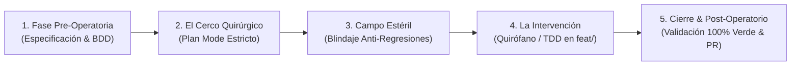

# 📐 Metodología Maestra de Ingeniería (Quirófano de Código & FAANG Standards)

> **Documento:** `.agents/orquestador/METODOLOGIA_MAESTRA.md`  
> **Propósito:** Consolidar en un solo manual supremo las metodologías de trabajo que rigen en VetConnect para que el Orquestador y los agentes operen con rigor industrial sin desviaciones.

---

## 🏥 1. El Método del Quirófano de Código (v3)

Inspirado en los procedimientos quirúrgicos de alta complejidad, ningún cambio de código en VetConnect se hace de forma desordenada o masiva. Se aplica estrictamente en 5 fases:



### 1.1 Detalle de las 5 Fases Quirúrgicas:

1. **Fase Pre-Operatoria (Especificación & BDD):**
   * Lectura de contratos en `docs/TECH_REFERENCE.md` y `docs/DECISIONS.md`.
   * Redacción del escenario BDD:
     * **GIVEN:** Estado previo del sistema (ej. usuario autenticado con rol `VET` aprobado).
     * **WHEN:** Acción realizada (ej. invoca `PATCH /api/consultations/:id/assign`).
     * **THEN:** Resultado esperado (ej. estado cambia a `ACTIVE`, se registra `startedAt`, se notifica por socket).
2. **El Cerco Quirúrgico (Plan Mode):**
   * Delimitar exactamente qué archivos serán intervenidos.
   * Prohibido tocar más de lo acordado. Si una tarea es de autenticación, está vetado tocar la lógica de mascotas o el layout de CSS.
3. **Campo Estéril (Blindaje Anti-Regresiones):**
   * Inspección previa de dependencias (`grep` / búsqueda de referencias).
   * Asegurar que no se rompan contratos preexistentes ni se introduzcan cambios de ruptura (breaking changes).
4. **La Intervención (TDD en Rama Aislada):**
   * Todo trabajo se ejecuta en una rama dedicada: `feat/<task-id>-<descripcion>`.
   * **Test primero (Rojo):** Se escribe la prueba unitaria o de integración. La prueba debe fallar al inicio.
   * **Código mínimo necesario (Verde):** Se implementa la lógica en TypeScript estricto, sin `any`, con esquemas Zod y manejo de errores RFC 7807.
   * **Loop de Auto-Corrección:** Si `tsc --noEmit` arroja errores, el agente corrige iterativamente antes de solicitar revisión.
5. **Cierre & Post-Operatorio (Validación 100% Verde & PR):**
   * Ejecutar la batería de tests (`npm test`).
   * Solo si el 100% pasa en verde, se genera el Pull Request hacia `main`.

---

## 🏛️ 2. Jerarquía Inmutable de Verdad (SSOT — ADR-025)

Para erradicar la ambigüedad y el "Split-Brain":

```
Nivel 1 (La Realidad Ejecutable)  --> backend/prisma/schema.prisma y controladores Express
Nivel 2 (Contratos Técnicos)      --> docs/TECH_REFERENCE.md y AGENT_CODING_SPEC
Nivel 3 (Arquitectura)            --> docs/ARCHITECTURE.md y docs/DECISIONS.md (26 ADRs)
Nivel 4 (Diseño Narrativo)        --> docs/web/00..11 y docs/SISTEMA_DE_DISENO.md
```

*Regla Inviolable:* **En caso de conflicto, el nivel superior anula y destruye al inferior.** Los agentes nunca inventan código basándose exclusivamente en textos narrativos o wireframes desactualizados.

---

## 🚫 3. Matriz de los 6 Antipatrones Explícitos (NO USO)

| Antipatrón | Descripción del Error | Forma Correcta Obligatoria |
|---|---|---|
| **NO USO 1** | Devolver Refresh Token en JSON para Web | Web SPA usa exclusivamente cookie `HttpOnly` + `Secure` |
| **NO USO 2** | Exponer correos o PII en tokens LiveKit | Usar `identity: user.id` y `name: user.firstName` (Cero PII) |
| **NO USO 3** | Duplicar `RoomAudioRenderer` en WebRTC | Usar exclusivamente `<VideoConference />` para evitar eco |
| **NO USO 4** | Retornar Error 500 ante colisión `clientMsgId` | Responder HTTP 200 con el mensaje existente (Idempotencia) |
| **NO USO 5** | Servir `/uploads` como archivos estáticos públicos | Acceso autenticado obligatorio mediante `GET /api/media/:id` |
| **NO USO 6** | Métricas o calificaciones falsas en la UI | Cero datos cosméticos; renderizar datos reales de DB o empty state `—` |

---

## 🛡️ 4. Criterios de Aceptación (Definition of Ready & Done)

* **Definition of Ready (DoR):**
  1. Contrato presente en `docs/TECH_REFERENCE.md`.
  2. ADR asociado en `docs/DECISIONS.md`.
  3. Cero PII en la interfaz.
  4. Comando de verificación definido.
* **Definition of Done (DoD):**
  1. `npx prisma validate` -> OK.
  2. `npm run typecheck` -> 0 errores en todos los workspaces.
  3. `npm test` -> 100% pruebas en verde (160+ tests).
  4. `npm run build` -> Compilación exitosa.
  5. `npm run check:governance` -> Gobernanza 100% validada.
