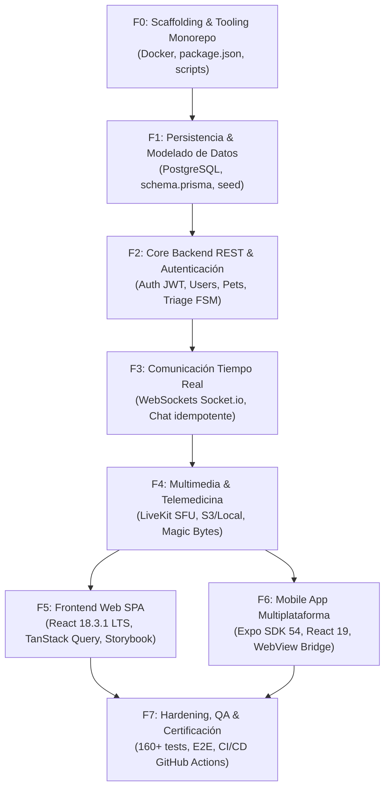

# 🚦 Sistema de Fases, Flujo Continuo y Quality Gates

> **Documento:** `.agents/orquestador/SISTEMA_DE_FASES_Y_GATES.md`  
> **Propósito:** Especificar la secuencia ordenada de ejecución por fases (F0 a F7), la gestión de transiciones continuas sin bloqueos y los puntos de control obligatorios (**Quality Gates**).

---

## 🗺️ 1. Matriz de Fases de Construcción (F0 a F7)

El desarrollo del sistema VetConnect se organiza en 8 fases secuenciales con dependencias deterministas:



### Detalle de Fases & Entregables:

| Fase | Nombre | Capa Principal | Task Packets | Criterio de Verificación |
|---|---|---|---|---|
| **F0** | Scaffolding & Tooling | Raíz / DevOps | TASK-0.1, TASK-0.2 | `npm install && npm run docker:up` |
| **F1** | Prisma ORM & BD | `backend/prisma/` | TASK-1.1, TASK-1.2 | `npx prisma validate && npm run seed` |
| **F2** | REST API & Auth | `backend/src/modules/` | TASK-2.1 a TASK-2.5 | `npm test -w backend -- -t "auth\|pets"` |
| **F3** | Sockets & Chat | `backend/src/realtime/`| TASK-3.1, TASK-3.2 | `npm test -w backend -- -t "realtime"` |
| **F4** | Telemedicina & Media| `backend/src/modules/` | TASK-4.1, TASK-4.2 | `npm test -w backend -- -t "media\|calls"`|
| **F5** | Frontend Web SPA | `web/` | TASK-5.1 a TASK-5.4 | `npm test -w web && npm run build -w web` |
| **F6** | Mobile App Nativa | `mobile/` | TASK-6.1 a TASK-6.3 | `npm test -w mobile && npm run typecheck -w mobile` |
| **F7** | QA & Certificación | Todo el Monorepo | TASK-7.1, TASK-7.2 | `npm test --workspaces && npm run check:governance` |

---

## 🚪 2. Los 5 Quality Gates Inmutables

Un Quality Gate es una aduana de verificación obligatoria. Si un gate no se cumple al 100%, **el proceso se detiene automáticamente** y no se avanza al siguiente paso.

```
+-----------------------------------------------------------------------------------------+
|                                  LOS 5 QUALITY GATES                                    |
+--------+----------------------------+-----------------------+---------------------------+
| Gate   | Nombre del Control         | Responsable           | Condición para Superar    |
+--------+----------------------------+-----------------------+---------------------------+
| GATE 1 | Aprobación de Documentación| Usuario Humano        | OK explícito del dossier  |
| GATE 2 | Cerco de Seguridad Aprobado| Agente Orquestador    | 0 archivos prohibidos     |
| GATE 3 | TDD Rojo -> Verde          | Jules MCP / Capa      | Test falla antes de código|
| GATE 4 | Auto-Verificación Estricta | Agente QA             | 0 errores tsc, 100% tests |
| GATE 5 | Certificación Gold Master  | Orquestador + QA      | Build prod + Gobernanza OK|
+--------+----------------------------+-----------------------+---------------------------+
```

### 🔹 GATE 1: Aprobación de Documentación (Human-in-the-Loop)
* **Disparador:** El Orquestador finaliza la redacción y síntesis de la documentación masterizada (`docs/`, contratos, esquemas, BDD).
* **Condición de Salida:** El usuario humano revisa el resumen y da su aprobación afirmativa.
* **Bloqueo:** Sin esta aprobación, **ningún agente puede modificar código ejecutable**.

### 🔹 GATE 2: Cerco de Seguridad de la Tarea (Plan Mode)
* **Disparador:** Antes de que Jules o cualquier agente toque archivos en una tarea.
* **Condición de Salida:**
  * Lista explícita de archivos a crear (no más de 1 a 3 archivos).
  * Lista explícita de archivos a modificar.
  * Declaración jurada de archivos fuera de alcance (ej. `.env`, otros módulos).
  * Si el plan propone modificar archivos vecinos no justificados: **RECHAZO INMEDIATO**.

### 🔹 GATE 3: Ciclo TDD (Test Rojo antes de Código Verde)
* **Disparador:** Inicio de la fase de implementación (Quirófano).
* **Condición de Salida:** Se escribe la prueba unitaria o de integración en Jest/Vitest. La prueba debe ejecutarse y fallar (rojo) por ausencia de la funcionalidad, demostrando que prueba algo real. Luego se escribe el código de negocio hasta que pase a verde.

### 🔹 GATE 4: Auto-Verificación y Blindaje Anti-Regresiones
* **Disparador:** Finalización de la codificación de un Task Packet.
* **Condición de Salida:**
  1. `npm run typecheck` no arroja ningún error de tipos (cero `any`).
  2. Todos los tests de la suite pasan (160 tests o superior).
  3. No hay regresiones en módulos previamente aprobados.

### 🔹 GATE 5: Certificación de Release & Merge a Main
* **Disparador:** Conclusión de todos los Task Packets de una Fase.
* **Condición de Salida:**
  * Compilación de producción exitosa: `npm run build`.
  * Verificación de consistencia semántica: `npm run check:governance`.
  * Generación de Conventional Commit (`feat(fase-X): ...`) y merge limpio a `main`.

---

## 🔁 3. Ejecución Continua y Desatendida (Autonomous Loop)

Una vez que el **GATE 1** es aprobado por el usuario, el Orquestador ejecuta un bucle de trabajo continuo:

1. Toma el siguiente Task Packet pendiente del backlog (`PLAN_ACCION_VETCONNECT.md`).
2. Formula el cerco y los requerimientos BDD.
3. Despacha la tarea a Google Jules vía MCP.
4. Aprueba el plan de Jules automáticamente en el momento en que se valide el cerco.
5. Recibe el Pull Request generado por Jules.
6. Corre las pruebas locales del Gate 4.
   * Si pasan: aprueba el merge y continúa inmediatamente con el siguiente Task Packet sin esperar confirmación del usuario.
   * Si fallan: envía el log de error a Jules para que ejecute el Self-Correction Loop.
7. Al completar todos los Task Packets de todas las fases, notifica al usuario con el reporte final de certificación Gold Master.
