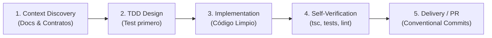

# 🤖 AGENTS.md — Sistema Operativo para Agentes de IA Autónomos & Estándar de Ingeniería (VetConnect)

> **Propósito:** Este documento es el protocolo operativo supremo para cualquier agente de IA autónomo o semi-autónomo (**Google Jules**, Antigravity, Claude Code, Cursor, Copilot Workspace) que trabaje en el repositorio **VetConnect**. Establece cómo los agentes deben planificar y trazar sus propios flujos de trabajo de forma proactiva, garantizando calidad de nivel FAANG desde el primer commit.

---

## 🧭 1. Principios de Autonomía & Flujo Proactivo (The Agent Workflow)

Los agentes en VetConnect no esperan micro-instrucciones ni confirmaciones triviales. Operan mediante el siguiente ciclo continuo de ingeniería:



### 1.1 Ciclo de Ejecución Paso a Paso:
1. **Descubrimiento y Anclaje a Contratos:**
   - Antes de escribir una sola línea de código, el agente consulta `docs/TECH_REFERENCE.md` (modelos Prisma, endpoints, eventos Socket), `docs/DECISIONS.md` (24 ADRs) y `docs/SPEC.md`.
   - **Prohibido asumir rutas o campos:** Si se requiere un endpoint, debe coincidir exactamente con el contrato en `docs/TECH_REFERENCE.md`.
2. **Diseño Dirigido por Pruebas (TDD):**
   - El agente escribe o prepara el archivo de prueba unitaria/integración en Jest o Vitest antes de la lógica de negocio.
   - El test debe fallar inicialmente si la funcionalidad no existe (rojo), confirmando que prueba algo real.
3. **Implementación Estricta:**
   - Código modular en TypeScript estricto, sin `any`, con validaciones Zod y manejo de errores RFC 7807.
4. **Auto-Verificación Obligatoria:**
   - El agente ejecuta las herramientas de validación localmente (`npx prisma validate`, `npm run typecheck`, `npm test`) y corrige iterativamente cualquier error antes de finalizar.
5. **Entrega Limpia:**
   - Commits estructurados bajo Conventional Commits (`feat:`, `fix:`, `test:`, `refactor:`, `docs:`, `chore:`).

---

### 1.2 Criterio de Entrada: Definition of Ready (DoR) para Tareas Agénticas
Ningún subagente debe iniciar una tarea sin validar que:
1. **Contrato Congelado:** Los contratos requeridos están presentes en `docs/TECH_REFERENCE.md` sin campos de v2.1+.
2. **ADR Vinculante:** La tarea referencia su ADR de los 24 aprobados en `docs/DECISIONS.md`.
3. **Pipeline Previo Verde:** Las pruebas de la fase previa compilan y pasan exitosamente.
4. **Cero PII en diseño:** No se requiere ni permite el transporte de correos o teléfonos en tokens WebRTC ni logs.
5. **Comando de Verificación:** El prompt o task packet define el comando exacto para verificar el resultado.

---

## 🛡️ 2. Guardarraíles Absolutos de Seguridad

1. **Gestión de Secretos (`.env` Guardrail):**
   - **NUNCA** leer, editar, commitear ni imprimir claves secretas o archivos `.env`.
   - Modificar únicamente `.env.example` cuando se agreguen variables nuevas al sistema.
2. **Preservación del Historial Git:**
   - **NUNCA** ejecutar comandos destructivos (`git filter-repo`, `git push --force`, purge de ramas) de forma autónoma.
3. **Eliminaciones Lógicas Exclusivas (Soft-Deletes):**
   - **NUNCA** ejecutar `prisma.<model>.delete()` físico sobre datos clínicos o de usuarios. Usar siempre `deletedAt = new Date()`.
4. **Protección de Datos Personales (PII):**
   - **NUNCA** inyectar emails o teléfonos de usuarios en tokens de LiveKit, logs de auditoría o respuestas públicas de API. Usar identificadores opacos (`user.id`) y nombre público (`user.firstName`).

---

## 🏗️ 3. Arquitectura del Monorepo

```
vetconnect/
├── .github/workflows/ci.yml        # Pipeline CI automatizado (Typecheck, Lint, Tests, Security)
├── .jules/instructions.md          # Instrucciones nativas para Google Jules
├── docker-compose.yml              # Servicios locales de desarrollo (PostgreSQL 16 + Redis 7)
├── package.json                    # Root workspaces (backend, web, mobile)
├── backend/                        # API REST Express 5 + TypeScript + Prisma 6 + Socket.io
│   ├── prisma/schema.prisma        # Modelo relacional PostgreSQL con snake_case mappings
│   └── src/modules/                # Módulos DDD: auth, users, pets, consultations, calls, media, notifications
├── web/                            # SPA React 18.3.1 (LTS) + Vite + Tailwind CSS + TanStack Query + LiveKit
├── mobile/                         # App React Native + Expo SDK 54 + Expo Router + NativeWind
└── docs/                           # Documentación técnica, contratos y decisiones de arquitectura
```

### 3.1 Política de Workspaces y Descarte de `packages/shared` (ADR-008)
- El monorepo consta exclusivamente de 3 workspaces independientes: `backend`, `web` y `mobile`.
- **Decisión Arquitectónica (ADR-008):** Se descarta formalmente el uso de un workspace `packages/shared`. La fuente de verdad para validaciones y contratos radica en los esquemas Zod y DTOs del backend (`backend/src/contracts/`), los cuales se sincronizan como interfaces TypeScript nativas en web y mobile. Esto previene la sobrecarga de tooling de monorepos complejos (Nx/Turborepo), scripts de transpilación intermedia y fallos en builds desacoplados.

---

## 📏 4. Estándar de Codificación Obligatorio por Capa

### 4.1 Base de Datos & Prisma ORM 6
- **Mapeo SQL Explícito:** Toda columna multi-palabra debe tener `@map("snake_case")` (ej. `isEmailVerified` → `@map("is_email_verified")`, `tokenVersion` → `@map("token_version")`).
- **Tablas Pluralizadas:** Cada modelo mapea a tabla snake_case plural con `@@map("users")`, `@@map("consultations")`.
- **Índices Compuestos:** Mantener índices de alto rendimiento para búsquedas frecuentes:
  - `@@index([role, isOnline, vetStatus, deletedAt])`
  - `@@index([clientId, status, deletedAt])`
  - `@@index([vetId, status, deletedAt])`

### 4.2 Backend API REST & Sockets (Express 5 + Socket.io)
- **Validación Estricta:** Todo payload entrante (`req.body`, `req.query`, `req.params`) debe validarse mediante esquemas **Zod**.
- **Manejo de Errores RFC 7807:** Respuestas uniformes de fallo:
  ```json
  {
    "success": false,
    "error": {
      "code": "VALIDATION_ERROR",
      "message": "Datos de entrada inválidos",
      "timestamp": "2026-09-14T20:00:00.000Z"
    }
  }
  ```
- **Seguridad JWT:** Firmas con algoritmo fijo `algorithms: ['HS256']`, verificación de `tokenVersion` contra base de datos para revocación instantánea de sesiones.
- **Idempotencia en Chat:** Reintentos con `clientMsgId` existente deben retornar HTTP 200 con el mensaje preexistente, nunca HTTP 500 ni mensajes duplicados.

### 4.3 Frontend Web & Mobile App (React 18.3.1 LTS & Expo SDK 54)
> *Nota técnica:* El frontend web emplea **React 18.3.1 (LTS)** para compatibilidad estricta de peer-dependencies con `@livekit/components-react` y `@testing-library/react`. La migración a React 19 está programada post-soporte oficial upstream.
- **Cero `any`:** Prohibido el uso de `any` explícito o implícito. Utilizar interfaces TypeScript estrictas.
- **Minimización de PII:** En listas de veterinarios y directorios públicos, redactar `email` y `phone`. Solo exponerlos al veterinario asignado durante una consulta activa.
- **Resiliencia de UI:** Todo componente asíncrono debe manejar estados de: `cargando`, `error`, `vacío (empty state)` y `reconectando`.

---

## 🚫 5. Antipatrones Explícitos (Ejemplos de NO Uso)

### ❌ NO USO 1: Devolver Refresh Tokens en el JSON de respuesta (Web SPA)
```typescript
// BAD: Expone el token de refresco a ataques XSS en navegadores
app.post('/api/auth/login', async (req, res) => {
  return res.json({ accessToken, refreshToken }); // ❌ NUNCA en Web SPA
});

// GOOD — Web SPA: Transmitir en cookie HttpOnly + Secure
res.cookie('refreshToken', refreshToken, { httpOnly: true, secure: isProduction, sameSite: isProduction ? 'none' : 'lax' });
return res.json({ accessToken, user });

// GOOD — Mobile (React Native): Detectar plataforma y retornar en body para expo-secure-store
// El header X-Client-Platform: mobile discrimina el cliente
if (req.headers['x-client-platform'] === 'mobile') {
  return res.json({ accessToken, refreshToken, user }); // ✅ Seguro: persiste en hardware keychain
}
res.cookie('refreshToken', refreshToken, { httpOnly: true, secure: isProduction, sameSite: isProduction ? 'none' : 'lax' });
return res.json({ accessToken, user });
```

### ❌ NO USO 2: Exponer correos o PII en los tokens JWT de LiveKit
```typescript
// BAD: Inyecta email privado en los logs inmutables de LiveKit Cloud
const token = new AccessToken(apiKey, apiSecret, { name: req.user.email });

// GOOD: Usar ID opaco y nombre de pila público
const token = new AccessToken(apiKey, apiSecret, { identity: user.id, name: user.firstName });
```

### ❌ NO USO 3: Duplicar `RoomAudioRenderer` en llamadas WebRTC con React
```tsx
// BAD: Provoca eco, doble acople y distorsión de audio
<LiveKitRoom token={token}>
  <VideoConference />
  <RoomAudioRenderer /> {/* BAD: VideoConference ya incluye el renderer */}
</LiveKitRoom>

// GOOD: Usar exclusivamente VideoConference
<LiveKitRoom token={token}>
  <VideoConference />
</LiveKitRoom>
```

### ❌ NO USO 4: Devolver Error 500 ante colisión de `clientMsgId` en Chat
```typescript
// BAD: Asume que un reintento de red es un fallo catastrófico del servidor
catch (error) { return res.status(500).json({ error: "DB Error" }); }

// GOOD: Responder con HTTP 200 y el mensaje existente (Idempotencia)
if (error.code === 'P2002') {
  const existing = await prisma.message.findUnique({ where: { clientMsgId } });
  return res.status(200).json({ success: true, data: existing });
}
```

### ❌ NO USO 5: Servir Archivos Médicos Clínicos como Estáticos Públicos
```typescript
// BAD: Expone documentación médica sin autenticación (viola Ley 25.326)
app.use('/uploads', express.static(path.join(__dirname, '../uploads')));
// Cualquier persona con la URL accede a fotos de lesiones, análisis y recetas.

// GOOD: Endpoint protegido con control de acceso estricto
app.get('/api/media/:id', authenticate, async (req, res) => {
  const file = await prisma.mediaFile.findUnique({ where: { id: req.params.id } });
  const isAuthorized = file.ownerId === req.user.id
    || file.consultationVetId === req.user.id
    || req.user.role === 'ADMIN';
  if (!isAuthorized) return res.status(403).json({ success: false, error: { code: 'FORBIDDEN' } });
  // En producción S3: retornar Presigned URL con TTL 5 min
  // En local: res.sendFile(path.resolve(file.localPath));
});
```

---

## 🤖 6. Matriz de Especialización para Subagentes Autónomos

Cuando un agente Tech Lead o el desarrollador delega trabajo en subagentes o sesiones independientes de Jules, cada agente asume un rol especializado:

| Rol de Agente | Dominio Principal | Entregables Clave | Comandos de Verificación |
|---|---|---|---|
| **Scaffolding Agent** | Monorepo root & Tooling | `package.json`, `docker-compose.yml`, scripts | `npm run docker:up && npm install` |
| **Database Agent** | Prisma ORM & PostgreSQL | `schema.prisma`, migraciones, seeds | `npx prisma validate && npx prisma db push` |
| **Backend REST Agent** | API Express 5 & Auth | Rutas, controladores, middleware JWT, Zod | `npm test -w backend` |
| **Realtime Agent** | WebSockets & Socket.io | Gateways, rooms, presencia, Redis adapter | `npm test -w backend -- -t "realtime"` |
| **Media & Video Agent** | LiveKit SFU & Uploads | Tokens LiveKit, Magic Bytes, S3/Local, `GET /api/media/:id` auth | `npm test -w backend -- -t "media"` |
| **Web Frontend Agent** *(Híbrido)* | React 18.3.1 (LTS) & Vite SPA | Scaffolding técnico, contratos API, catálogo atómico en Storybook y armado UI post-Figma | `npm run build -w web && npm test -w web` |
| **Mobile App Agent** | React Native & Expo SDK 54 | Expo Router, NativeWind, expo-secure-store, offline sync | `npm run typecheck -w mobile` |
| **QA & Verification Agent** | Testing E2E & Seguridad | Jest 120+ tests, Playwright, CI audit | `npm test --workspaces && npm run typecheck` |
| **Debugger Agent** | Regresiones & Fallos | Análisis de diff, aislamiento de fallos, Self-Correction Loop | `npm test -- --verbose` |

> 📌 Ver protocolo metodológico de diseño colaborativo y exportación en [06_SISTEMA_DE_DISENO_UI_KIT.md (§7)](./docs/web/06_SISTEMA_DE_DISENO_UI_KIT.md#7-metodología-híbrida-storybook--figma).

---

## ⚡ 7. Comandos de Verificación para Agentes

Todo agente debe ejecutar y verificar su trabajo con estos comandos antes de reportar una tarea como completada:

```bash
# 1. Base de datos
cd backend && npx prisma validate

# 2. Typecheck estricto en todas las capas del monorepo
npm run typecheck

# 3. Suite completa de pruebas automatizadas (meta: 120+ tests)
npm test

# 4. Compilación de producción
npm run build
```

---
*VetConnect Agent Operating System — Ecosistema de Ingeniería Greenfield 2026.*

