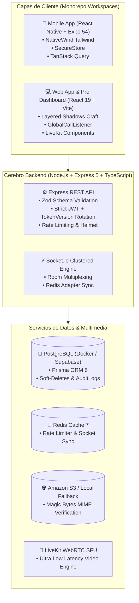

<div align="center">

# 🐾 VetConnect v2.0
### *Plataforma Integral de Telemedicina Veterinaria & Gestión Clínica de Alta Disponibilidad*
**Arquitectura Greenfield & Agent-First (Optimizada para Google Jules & Agentes de IA Autónomos)**

[](https://nodejs.org)
[](https://www.typescriptlang.org/)
[](https://react.dev)
[](https://expo.dev)
[](https://www.prisma.io)
[](https://livekit.io)
[](.jules/instructions.md)
[](https://jestjs.io)

</div>

---

## 📖 Índice General de Documentación & Sistema de Agentes

> **Enfoque Greenfield & Agent-First:** Este repositorio está estructurado para que tanto desarrolladores humanos como agentes de IA autónomos (**Google Jules**, Antigravity, Cursor, Claude Code) puedan trazar sus propios flujos de trabajo, ejecutar el ciclo TDD y construir el monorepo paso a paso mediante paquetes de tareas atómicas (*Task Packets*).

Toda la documentación técnica, operativa y de agentes de VetConnect se encuentra organizada en los siguientes documentos maestros:

### 🌟 Nivel 1 (Tier 1) — Fuentes Vivas de Ejecución Diaria (Single Sources of Truth - SSOT)
> **Autoridad Suprema:** Estos 5 documentos gobiernan el desarrollo diario. Cualquier cambio de contrato, decisión técnica, asignación o estándar debe actualizarse **únicamente** aquí:

| Documento | Descripción & Rol en Desarrollo | Enlace |
|---|---|---|
| 📚 **Referencia Técnica & Contratos** | Contratos de API REST (Zod), Socket.io y Prisma Schema v2.0 definitivo. | [Ver TECH_REFERENCE.md](docs/TECH_REFERENCE.md) |
| ⚖️ **Registro de Decisiones (ADRs)** | Las 23 decisiones arquitectónicas oficiales vinculantes (ADR-001 al ADR-023). | [Ver DECISIONS.md](docs/DECISIONS.md) |
| 📋 **Backlog Operativo de Agentes** | Backlog técnico por fases F0..F7 (TASK-0.1 a TASK-7.2) con DoR y DoD para Jules. | [Ver PLAN_ACCION_VETCONNECT.md](PLAN_ACCION_VETCONNECT.md) |
| 📊 **Plan de Proyecto y Gestión** | Product Backlog PB-01..40, Sprints 1..10, RACI balanceado y métricas KPIs. | [Ver PLAN_DE_PROYECTO_Y_GESTION.md](docs/PLAN_DE_PROYECTO_Y_GESTION.md) |
| 🤖 **Agent Operating System (AOS)** | Protocolo operativo supremo, ciclo TDD, guardarraíles y antipatrones con código. | [Ver AGENTS.md](AGENTS.md) |

### 🧊 Nivel 2 (Tier 2) — Baselines de Inicio & Archivo Histórico (Read-Only Post-Kickoff)
> **Línea Base Congelada:** Documentos aprobados para la fase de inicio que actúan como registro estático o de referencia contextual. No requieren mantenimiento diario sincronizado:

| Documento | Rol y Estado Post-Kickoff | Enlace |
|---|---|---|
| 📜 **Project Charter** | Carta fundacional y visión del proyecto *(Congelado al 01/Oct/2026)*. | [Ver Project Charter](docs/PROJECT_CHARTER.md) |
| 🧭 **Brief del Tech Lead** | Contexto maestro inicial de orquestación *(Congelado)*. | [Ver Tech Lead Brief](AI_TECHLEAD_BRIEF.md) |
| 📜 **Reconciliación Arquitectónica** | Informe de auditoría pre-kickoff y resolución de discrepancias *(Congelado)*. | [Ver Reconciliación](docs/RECONCILIACION_ARQUITECTURA_Y_DISCREPANCIAS.md) |
| 🖥️ **Presentación Ejecutiva** | Deck visual de 11 diapositivas para síntesis de stakeholders *(Congelado)*. | [Ver Presentación](docs/PRESENTACION_EJECUTIVA.md) |
| 📑 **Minuta de Stakeholder (v2.1+)** | Requerimientos de producto para fase futura Hitos M5..M8 *(Congelado)*. | [Ver Minuta de Stakeholder](docs/MINUTA_STAKEHOLDER_2026-09.md) |
| 🎥 **Auditoría & Checklist LiveKit** | Guía normativa maestra y checklist preventivo de WebRTC. | [Ver LiveKit Audit](docs/LIVEKIT_AUDIT.md) |
| 🎨 **Sistema de Diseño (Design System)** | Guía visual y UI Kit para prototipado (Actividad 26). | [Ver Sistema de Diseño](docs/SISTEMA_DE_DISENO.md) |
| 🚀 **Guía de Despliegue & Ops** | Manual de infraestructura: Coolify (VPS) y Vercel (Edge). | [Ver Guía de Deploy & Ops](docs/DEPLOY.md) |
| 📱 **Guía de Ejecución Local** | Tutorial de inicio local y configuración de depuración ADB. | [Ver Guía de Ejecución](GUIA_EJECUCION_VETCONNECT.md) |


---

## 🌟 Propuesta de Valor & Características Principales

**VetConnect** es una solución telemédica integral que digitaliza la interacción clínica entre tutores de mascotas y médicos veterinarios:

- **🚨 Triage Inteligente & Cola de Atención:** Solicitud de atención inmediata o programada con auto-asignación hacia veterinarios disponibles (`isOnline = true`).
- **💬 Chat en Vivo con Idempotencia:** Mensajería en tiempo real (<100ms) vía WebSockets, deduplicación por `clientMsgId`, imágenes clínicas con zoom y acuses de recibo.
- **📹 Teleconsulta por Videollamada (WebRTC / LiveKit):** Transmisión de audio y video de 720p adaptativa con timbrado bidireccional y tokens criptográficos sin exposición de PII.
- **💊 Recetas Digitales Estructuradas:** Prescripciones con dosificación, frecuencia y duración persistidas en la historia clínica del paciente.
- **🛡️ Blindaje Legal & Sala de Espera (SENASA):** Verificación manual de matrícula profesional (`vetStatus: PENDING → APPROVED`) antes de habilitar la atención médica; cumplimiento estricto de la **Ley de Protección de Datos Personales N° 25.326** con *Soft-Deletes* y minimización de PII.
- **📊 Registro Inmutable de Auditoría:** Registro de todas las mutaciones administrativas críticas (`AuditLog`) para trazabilidad total.

---

## 🏗️ Topología del Sistema (FAANG Architecture)



---

## 💻 Requisitos Previos

| Requisito | Versión Mínima | Instalación |
|---|---|---|
| **Node.js** | `>= 20.x LTS` | [nodejs.org](https://nodejs.org) |
| **npm** | `>= 10.x` | Incluido con Node.js |
| **Docker & Docker Compose** | Reciente | [docker.com](https://docker.com) |
| **Git** | `>= 2.30` | [git-scm.com](https://git-scm.com) |
| **Expo Go** (para Mobile) | SDK 54 | [Google Play Store](https://play.google.com/store/apps/details?id=host.exp.exponent) |
| **ADB (Android Platform Tools)** | Opcional | [developer.android.com](https://developer.android.com/tools/releases/platform-tools) |

---

## ⚡ Guía de Inicio Rápido (Local Setup)

### 1. Clonar e Iniciar Servicios de Base de Datos y Cache
```bash
# 1. Iniciar PostgreSQL 16 y Redis 7 locales en Docker
docker compose up -d

# 2. Instalar dependencias en todo el monorepo
npm install

# 3. Configurar variables de entorno iniciales
cp .env.example backend/.env
```

### 2. Ejecutar la Plataforma en Modo Desarrollo

#### Opción A: Inicio Automatizado (Scripts DX)
- **Backend y Web (Terminal 1):**
  ```powershell
  .\run.bat
  # O mediante npm: npm run dev
  ```
  *Inicia el backend en el puerto 3001 y la Web en el puerto 5173 simultáneamente.*

- **Mobile App (Terminal 2):**
  ```powershell
  .\start.ps1
  # O mediante npm: npm run dev:mobile
  ```
  *Detecta automáticamente tu celular por USB, configura ADB Reverse e inicia Expo Go sin depender de Wi-Fi.*

#### Opción B: Inicio por Módulo Específico
```bash
npm run dev:backend   # Inicia únicamente la API Express
npm run dev:web       # Inicia únicamente la SPA Web en Vite
npm run dev:mobile    # Inicia el bundler Metro de Expo
```

---

## 🧪 Pruebas Automatizadas & Calidad de Código

El proyecto adopta desarrollo dirigido por pruebas (TDD) con una meta de más de **120 pruebas automatizadas proyectadas** (>80% de cobertura):

```bash
# Ejecutar la suite de pruebas en todo el monorepo
npm test

# Ejecutar typecheck estricto de TypeScript en todas las capas
npm run typecheck

# Validar esquema relacional de Prisma
cd backend && npx prisma validate
```

---

## 👥 Equipo de Desarrollo & Créditos

- **Tobias Vera** — *Tech Lead & Backend Developer*
- **Juan Mendoza** — *Mobile Lead Developer*
- **Damian Orellana** — *Web Frontend Developer*
- **Ezequiel Charca** — *QA Automation Engineer & Product Designer*
- **Lara Bouso** — *Project Manager & Compliance Specialist*

*VetConnect — Grupo Pinnacle 2026. Todos los derechos reservados.*
