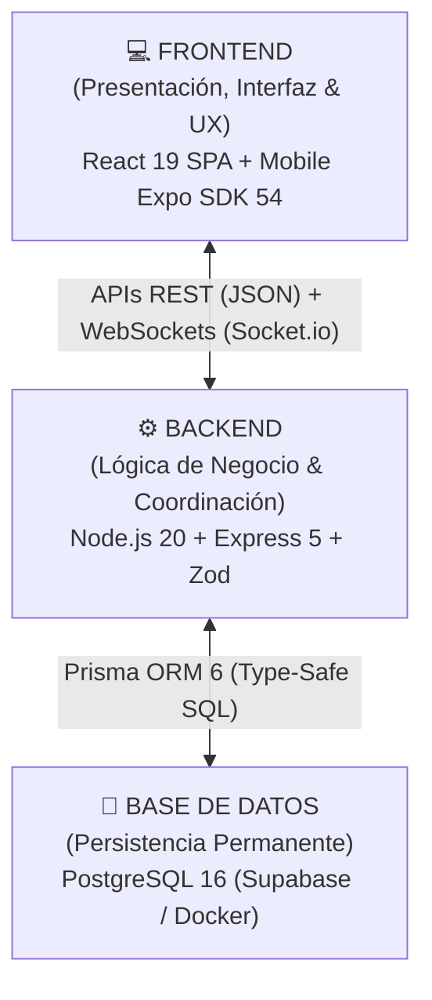
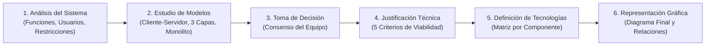

# 🏛️ Arquitectura del Sistema & Fundamentos de Ingeniería — VetConnect v2.0

> **Propósito:** Este documento define la estructura técnica global de la plataforma **VetConnect**. Establece la organización interna del software, sus componentes especializados, las responsabilidades de cada capa, los mecanismos de comunicación entre subsistemas, la selección tecnológica fundamentada y su articulación con el proceso integral de planificación de software.  
> **Marco Metodológico:** Incorpora formalmente la **Actividad 24 – Diseño de Arquitectura del Sistema** (Proceso de 6 Etapas: Análisis, Estudio de Modelos, Toma de Decisión, Justificación Técnica, Definición de Tecnologías y Representación Gráfica).

---

## 1. Introducción & Fundamentación Conceptual

Durante las etapas iniciales de un proyecto de software se toman numerosas decisiones relacionadas con la definición del problema, los usuarios destinatarios, las funcionalidades requeridas y la organización del trabajo. Estas definiciones permiten comprender **qué** sistema se construirá, **para quién** será desarrollado y **cómo** se gestionará el proceso.

Sin embargo, antes de comenzar a programar es indispensable responder una pregunta técnica fundamental:  
**¿Cómo estará organizado técnicamente el sistema?**

Del mismo modo que una casa requiere **planos estructurales** que permitan comprender la distribución de cargas, cañerías e instalaciones antes de iniciar la construcción, un proyecto de software necesita definir cómo se organizarán sus componentes internos antes de comenzar su desarrollo. Las decisiones relacionadas con la estructura técnica de una solución conforman la **arquitectura del sistema**.

### ¿Qué es la Arquitectura de Software?
La arquitectura de software es la **estructura general de un sistema informático**. Describe los componentes que forman parte de la solución, las responsabilidades específicas de cada uno de ellos y las relaciones y contratos que establecen entre sí para permitir el funcionamiento armónico del sistema.

> [!IMPORTANT]
> **Arquitectura vs. Funcionalidad:**  
> La arquitectura **no define las funcionalidades** que tendrá una aplicación ni los problemas de negocio puntuales que resolverá; su objetivo primordial es establecer **cómo estará organizada internamente la solución** para que pueda construirse, mantenerse, probarse y evolucionar de manera ordenada y predecible a lo largo del tiempo.

Una misma necesidad puede resolverse mediante diferentes arquitecturas. Por este motivo, la selección de una arquitectura constituye una **decisión técnica estratégica y estructurante** dentro del proceso de planificación. Una arquitectura adecuada facilita el desarrollo colaborativo, reduce drásticamente la deuda técnica, mejora el mantenimiento y favorece futuras ampliaciones sin requerir reescrituras traumáticas.

---

## 2. Componentes Habituales de un Sistema Web en VetConnect

La mayoría de las aplicaciones web modernas se organizan en componentes altamente especializados. En VetConnect, estos componentes se dividen claramente en tres subsistemas:



### 2.1 Frontend (Capa Visible & Experiencia de Usuario)
- **Definición:** Corresponde a la parte visible del sistema con la que interactúan directamente los usuarios (tutores de mascotas, veterinarios y administradores).
- **Función:** Presentar información clínica, renderizar formularios reactivos, menús de navegación, salas de videollamada y paneles interactivos. La experiencia de uso (UX), la accesibilidad (a11y) y la fluidez visual residen en esta capa.
- **Implementación en VetConnect:** Doble cliente omnicanal:
  - **Web SPA:** Desarrollada con **React 19**, **Vite**, **Tailwind CSS** y **TanStack Query v5**.
  - **Mobile App:** Desarrollada con **React Native**, **Expo SDK 54**, **Expo Router** y **NativeWind**.

### 2.2 Backend (Capa Interna & Lógica de Negocio)
- **Definición:** Corresponde al cerebro interno del sistema. Los usuarios no interactúan de forma directa con él, pero toda la confiabilidad y seguridad de la aplicación dependen de sus servicios.
- **Función:** Procesar solicitudes, aplicar reglas médicas de negocio (máquina de estados de consultas), verificar permisos y roles, ejecutar validaciones de entrada, coordinar eventos en tiempo real y emitir recetas digitales inmutables.
- **Implementación en VetConnect:** Monolito modular en **Node.js 20 LTS** con **Express 5**, tipado estricto en **TypeScript** y esquemas de validación **Zod**.

### 2.3 Base de Datos (Almacenamiento Permanente de la Información)
- **Definición:** Es el espacio destinado al almacenamiento estructurado, transaccional y persistente de los datos del sistema.
- **Función:** Registrar de forma segura y permanente usuarios, credenciales, mascotas, historias clínicas, consultas médicas, mensajes de chat, recetas y registros de auditoría. Permite consultar, filtrar, actualizar y anonimizar datos según las reglas de negocio.
- **Implementación en VetConnect:** Motor relacional **PostgreSQL 16** gestionado mediante **Prisma ORM 6** con pool de conexiones optimizado y políticas de eliminación lógica (*Soft-Deletes*).

---

## 3. Diseño de Arquitectura del Sistema (Actividad 24 — Proceso Metodológico en 6 Etapas)

Siguiendo las directivas de la **Actividad 24**, el equipo de ingeniería de VetConnect no eligió una arquitectura “ideal” en abstracto, sino aquella **más adecuada, viable y robusta** para los requerimientos, el alcance y las restricciones reales del proyecto, completando las siguientes 6 etapas:



---

### 3.1 Etapa 1 — Análisis Integral del Sistema
Antes de seleccionar la estructura técnica, el equipo analizó las cuatro dimensiones de partida:

1. **Funcionalidades Principales del Sistema:**
   - Autenticación y autorización basada en roles (`CLIENT`, `VET`, `ADMIN`) con rotación de sesiones (`tokenVersion`).
   - Gestión integral y ficha clínica digital de mascotas (CRUD con soft-delete y microchip opcional ISO 15 dígitos).
   - Cola de triage en tiempo real con clasificación de urgencias y auto-asignación dinámica de veterinarios.
   - Mensajería instantánea bidireccional de baja latencia (<80 ms) con acuses de recibo e idempotencia estricta (`clientMsgId`).
   - Videoconsulta telemédica de alta definición (720p adaptativa) mediante WebRTC sin instalación de software de terceros.
   - Emisión y persistencia de recetas médicas digitales estructuradas con firma y código QR único de validación.
   - Panel de control y auditoría legal con validación obligatoria de matrículas profesionales SENASA y registro `AuditLog`.
2. **Tipo de Usuarios:**
   - **Tutores de Mascotas (`CLIENT`):** Usuarios móviles y web con foco en inmediatez, simplicidad operativa (<3 clics para auxilio) y acceso 24/7 a historiales clínicos.
   - **Médicos Veterinarios (`VET`):** Profesionales clínicos que operan primariamente en computadoras de escritorio (Portal Web Pro), requiriendo visualización clara de síntomas, herramientas de videollamada y agilidad en la prescripción.
   - **Administradores y Auditores (`ADMIN`):** Personal de fiscalización sanitaria y soporte técnico que audita habilitaciones, guardias y registros de seguridad.
3. **Nivel de Complejidad del Proyecto:**
   - **Medio-Alto:** Combina flujos tradicionales transaccionales tipo CRUD (usuarios, mascotas, auditoría) con subsistemas sincrónicos intensivos en eventos de red y streaming multimedia en tiempo real (WebSockets distribuidos y WebRTC SFU).
4. **Restricciones de Tiempo, Recursos y Conocimientos del Equipo:**
   - **Tiempo:** Plazo de ejecución de 20 semanas dividido en 10 Sprints de desarrollo ágil de 2 semanas cada uno.
   - **Recursos Humanos:** Equipo integrado por 4 desarrolladores con roles especializados (Tech Lead, Web Lead, Mobile Lead, QA Lead).
   - **Conocimientos:** Dominio pleno del lenguaje **TypeScript** en todo el stack (Node.js, React, React Native), experiencia en bases de datos relacionales SQL y contenedores Docker. Conocimiento limitado en orquestación avanzada de microservicios distribuidos (Kubernetes, Service Mesh).
   - **Infraestructura & Presupuesto:** Presupuesto acotado que prioriza soluciones reproducibles en hardware estándar: despliegue en un único servidor VPS económico mediante **Coolify**, base de datos PostgreSQL y Edge Hosting en **Vercel**, evitando arquitecturas con altos costos fijos de nube.

---

### 3.2 Etapa 2 — Estudio Comparativo de Modelos de Arquitectura
El equipo evaluó rigurosamente los modelos arquitectónicos tradicionales frente a las necesidades particulares de VetConnect:

```
+-----------------------------------------------------------------------------------------------------------------------------------------------+
|                                      MATRIZ COMPARATIVA DE MODELOS ARQUITECTÓNICOS ESTUDIADOS                                                 |
+-------------------+-------------------------------+-------------------------------+-----------------------------------+-----------------------+
| Modelo Estudiado  | Principales Fortalezas        | Principales Desventajas       | Viabilidad para VetConnect        | Dictamen del Equipo   |
+-------------------+-------------------------------+-------------------------------+-----------------------------------+-----------------------+
| Cliente-Servidor  | Desacoplamiento total entre   | Servidor centralizado como    | Esencial: permite clientes web    | ✅ ADOPTADO           |
| Clásico           | interfaz de usuario y datos.  | punto de coordinación único.  | y móviles sobre una misma API.    | (Fundamento base)     |
+-------------------+-------------------------------+-------------------------------+-----------------------------------+-----------------------+
| Arquitectura en   | Separación de responsabilidade| Mayor número de archivos y    | Óptima: aísla la lógica médica    | ✅ ADOPTADO           |
| 3 Capas (3-Tier)  | y facilidad de testing unitario| capas intermedias de mapeo.   | de la persistencia de datos.      | (Estructura interna)  |
+-------------------+-------------------------------+-------------------------------+-----------------------------------+-----------------------+
| Monolito          | Simplicidad de despliegue,    | Riesgo de acoplamiento si     | Excelente: máxima cohesión con    | ✅ ADOPTADO           |
| Modular (DDD)     | cero latencia inter-módulos.  | no se respetan los módulos.   | monorepo TypeScript y Docker.     | (Patrón de Backend)   |
+-------------------+-------------------------------+-------------------------------+-----------------------------------+-----------------------+
| Arquitectura de   | Escalabilidad y despliegue    | Extrema sobrecarga operativa, | Inviable: sobreingeniería masiva, | ❌ DESCARTADO         |
| Microservicios    | independiente por servicio.   | latencia de red y costo alto. | complejidad innecesaria (K8s).    | (ADR-001)             |
+-------------------+-------------------------------+-------------------------------+-----------------------------------+-----------------------+
| Arquitectura      | Escalabilidad automática y    | Cold starts en conexiones     | Inviable: incompatible con sockets| ❌ DESCARTADO         |
| Serverless        | costo por ejecución cero.     | persistentes de WebSocket/SFU.| persistentes y WebRTC en vivo.    |                       |
+-------------------+-------------------------------+-------------------------------+-----------------------------------+-----------------------+
```

---

### 3.3 Etapa 3 — Toma de Decisión Consensuada
Por acuerdo unánime de los integrantes del equipo (Tobias Vera, Damian Orellana, Juan Mendoza, Ezequiel Charca), se resolvió adoptar la siguiente configuración arquitectónica:

> **Arquitectura Consensuada:**  
> **Arquitectura Cliente-Servidor Desacoplada** con **Backend Monolítico Modular en 3 Capas** (orientado al dominio mediante Domain-Driven Design) y **Servicios Especializados de Tiempo Real y Videoconferencia** (Socket.io sincronizado por clúster Redis y LiveKit SFU WebRTC).

---

### 3.4 Etapa 4 — Justificación Técnica Exhaustiva
La elección de esta arquitectura se fundamenta en los 5 criterios clave de viabilidad técnica:

1. **Requerimientos del Sistema:**
   - La plataforma exige una coordinación inmediata y transaccional entre módulos: cuando un tutor ingresa en la cola de triage, el sistema debe consultar veterinarios habilitados (`users`), verificar el historial de la mascota (`pets`), registrar la consulta (`consultations`), notificar mediante sockets y crear la sala de videollamada. Ejecutar estas operaciones dentro de un monolito modular con PostgreSQL garantiza **consistencia transaccional ACID estricta**, sin necesidad de protocolos complejos de dos fases (2PC) ni transacciones distribuidas tipo Saga.
2. **Complejidad del Proyecto:**
   - Un esquema de microservicios exigiría implementar API Gateways, service discovery (Consul/Eureka), trazas distribuidas (Jaeger/Zipkin), circuit breakers y múltiples bases de datos desacopladas. Esta complejidad desmedida consumiría más del 60% del tiempo de desarrollo en infraestructura en lugar de resolver la atención veterinaria. El **monolito modular** reduce la sobrecarga operativa a cero latencia interna de red y despliegue unificado en un único contenedor Docker.
3. **Capacidades Reales del Equipo:**
   - El equipo cuenta con 4 ingenieros altamente capacitados en el ecosistema TypeScript. Un monorepo con backend Express y clientes React/Expo permite **compartir esquemas de validación Zod, contratos TypeScript y utilitarios comunes de tipado**, multiplicando la velocidad de desarrollo y eliminando errores por discrepancias en interfaces de datos.
4. **Tecnologías Disponibles:**
   - Se seleccionaron tecnologías maduras, de código abierto y con un amplísimo soporte comunitario: **Node.js 20 LTS**, **Express 5**, **PostgreSQL 16** y **Prisma ORM 6**. Para la problemática específica de la videoconsulta, se adoptó **LiveKit SFU**, que resuelve la adaptación dinámica de bitrate y simulcast en redes 4G/WiFi sin obligar a los desarrolladores a construir un Selective Forwarding Unit desde cero.
5. **Mantenimiento y Ampliación Futura:**
   - El backend se divide internamente en **módulos DDD fuertemente cohesionados y débilmente acoplados** (`auth`, `users`, `pets`, `consultations`, `calls`, `media`, `notifications`). Esta separación asegura que, si en el futuro el volumen de usuarios crece a millones y el módulo de teleconsulta requiere escalar de forma independiente, pueda ser extraído hacia un microservicio autónomo sin necesidad de reescribir el resto del sistema.

---

### 3.5 Etapa 5 — Definición de Tecnologías por Componente
Cada componente de la arquitectura cuenta con una tecnología adoptada y justificada técnicamente:

```
+-------------------------------------------------------------------------------------------------------------------------------+
|                                      DEFINICIÓN DE TECNOLOGÍAS POR COMPONENTE (ACTIVIDAD 24)                                  |
+-----------------------+-------------------------------+-----------------------------------+-----------------------------------+
| Componente            | Rol Arquitectónico            | Tecnología Seleccionada           | Justificación Técnica             |
+-----------------------+-------------------------------+-----------------------------------+-----------------------------------+
| Frontend Web          | Presentación / Portal Pro     | React 19 + Vite + Tailwind CSS    | Concurrencia moderna, rendering   |
|                       | (Veterinarios y Admins)       | + TanStack Query v5               | ultrarrápido y componentes LiveKit|
+-----------------------+-------------------------------+-----------------------------------+-----------------------------------+
| Frontend Mobile       | Presentación / App Tutores    | React Native + Expo SDK 54        | Desarrollo multiplataforma nativo,|
|                       | (Android e iOS)               | + NativeWind + Expo Router        | acceso a cámara y puente WebView. |
+-----------------------+-------------------------------+-----------------------------------+-----------------------------------+
| Backend Core          | Lógica de Negocio & APIs      | Node.js 20 LTS + Express 5        | E/S no bloqueante, alto rendimiento|
|                       | (Monolito Modular)            | + TypeScript Estricto + Zod       | asíncrono y tipado de punta a fin.|
+-----------------------+-------------------------------+-----------------------------------+-----------------------------------+
| Motor de Tiempo Real  | Mensajería & Presencia        | Socket.io + @socket.io/redis-adap.| Salas dinámicas, reconexión auto, |
|                       | (Chat y Triage en Vivo)       | sobre clúster distribuido Redis 7 | latencia <80ms e idempotencia.    |
+-----------------------+-------------------------------+-----------------------------------+-----------------------------------+
| Servidor de Video SFU | Streaming Multimedia          | LiveKit SFU (WebRTC Cloud/Local)  | Adaptabilidad de ancho de banda,  |
|                       | (Videoconsulta 720p)          | Protocolo WebRTC con Simulcast    | audio ultra baja latencia <1500ms.|
+-----------------------+-------------------------------+-----------------------------------+-----------------------------------+
| Base de Datos         | Persistencia Relacional       | PostgreSQL 16 (Docker / Supabase) | Transacciones ACID, integridad de |
|                       | (Usuarios, Mascotas, Recetas) | Motor Relacional con Soft-Deletes | datos y consultas JSONB avanzadas.|
+-----------------------+-------------------------------+-----------------------------------+-----------------------------------+
| Capa ORM              | Acceso a Datos Type-Safe      | Prisma ORM 6                      | Mapeos explícitos snake_case,     |
|                       | (Data Access Layer)           | Migraciones reproducibles en DB   | prevención de inyección SQL (SQLi)|
+-----------------------+-------------------------------+-----------------------------------+-----------------------------------+
| Memoria & Caché       | Broker Pub/Sub & Sesiones     | Redis 7 Alpine                    | Rate limiting en memoria y sync   |
|                       | (Cluster de Sockets)          | Persistencia en RAM distribuida   | entre instancias de backend.      |
+-----------------------+-------------------------------+-----------------------------------+-----------------------------------+
| Infraestructura / Ops | Orquestación y Despliegue     | Coolify VPS + Traefik Reverse     | Despliegue continuo con SSL auto, |
|                       | (Producción)                  | Proxy + Vercel Edge Hosting       | cero costo de licencias y DX ágil.|
+-----------------------+-------------------------------+-----------------------------------+-----------------------------------+
```

---

### 3.6 Etapa 6 — Representación Gráfica de la Arquitectura Final
El siguiente diagrama detalla la arquitectura completa de VetConnect, ilustrando componentes, subsistemas, tecnologías concretas y los protocolos de comunicación que vinculan cada capa:

```mermaid
graph TB
    subgraph CapaPresentacion["📱 1. CAPA DE PRESENTACIÓN (CLIENTES HETEROGÉNEOS)"]
        Web["💻 Portal Web Profesional & Admin\nReact 19 + Vite + Tailwind CSS\nTanStack Query v5 + LiveKit Components"]
        Mob["📱 App Móvil Tutores (Android / iOS)\nReact Native + Expo SDK 54 + NativeWind\nExpo Router + WebView Bridge"]
    end

    subgraph CapaPuertaEnlace["🌐 2. CAPA DE INFRAESTRUCTURA & PROXY INVERSO"]
        Proxy["🛡️ Traefik Reverse Proxy / Coolify VPS\nTerminación SSL/TLS + Rate Limiting HTTP & WSS"]
        VercelCDN["⚡ Vercel Edge CDN\nDistribución Global de Assets SPA Web"]
    end

    subgraph CapaLogica["⚙️ 3. CAPA DE LÓGICA DE NEGOCIO (BACKEND MONOLITO MODULAR)"]
        direction TB
        subgraph ModulosDDD["Node.js 20 LTS + Express 5 (TypeScript Estricto & Validadores Zod)"]
            M_Auth["🔐 auth (JWT, tokenVersion)"]
            M_User["👤 users (Perfiles, Roles)"]
            M_Pets["🐾 pets (CRUD, Microchip)"]
            M_Cons["🩺 consultations (Triage, Asignación)"]
            M_Chat["💬 chat (Idempotencia clientMsgId)"]
            M_Call["📹 calls (Señalización LiveKit)"]
            M_Media["📁 media (Magic Bytes MIME)"]
            M_Admin["⚖️ admin (SENASA, AuditLog)"]
        end
        SocketServer["⚡ Clúster Socket.io Engine\nSalas médicas, presencia isOnline & mensajería"]
    end

    subgraph CapaMultimedia["🎥 4. SERVICIO ESPECIALIZADO DE TELEMEDICINA"]
        LiveKitSFU["🎥 LiveKit SFU (WebRTC Engine)\nDistribución de Audio/Video 720p Simulcast"]
    end

    subgraph CapaPersistencia["🗄️ 5. CAPA DE PERSISTENCIA & DATOS RELACIONALES"]
        Prisma["💎 Prisma ORM 6 (Data Access Layer - SQL Seguro)"]
        Postgres[("🐘 PostgreSQL 16 (Docker / Supabase)\nTablas snake_case pluralizadas con Soft-Delete")]
        RedisDB[("🔴 Redis 7 Alpine\nCaché en RAM, Pub/Sub Adapter & Rate Limiting")]
        Storage[("🪣 Almacenamiento Seguro (S3 / Local Fallback)\nAdjuntos clínicos y recetas verificadas")]
    end

    %% Relaciones y Protocolos
    Web -->|HTTPS / REST| VercelCDN
    VercelCDN -->|Proxy API| Proxy
    Mob -->|HTTPS / REST| Proxy
    Proxy -->|HTTP Interno| ModulosDDD

    Web -->|WSS / WebSockets| Proxy
    Mob -->|WSS / WebSockets| Proxy
    Proxy -->|WebSocket Interno| SocketServer

    Web -.->|WebRTC UDP / 720p Audio-Video| LiveKitSFU
    Mob -.->|WebRTC UDP / 720p Audio-Video| LiveKitSFU
    M_Call -->|Emisión de Tokens JWT| LiveKitSFU

    ModulosDDD -->|Llamadas TypeScript en Memoria (0 ms)| SocketServer
    ModulosDDD -->|Queries Type-Safe| Prisma
    Prisma -->|Conexión SQL Pooling (Puerto 5432)| Postgres
    SocketServer <-->|Redis Pub/Sub Sync (Puerto 6379)| RedisDB
    M_Media -->|Escritura de Archivos| Storage
```

---

## 4. Operaciones CRUD y Paneles de Administración

La gestión de datos en VetConnect se estructura en torno a las operaciones fundamentales **CRUD**:
- **Create (Crear):** Alta de usuarios, registro de nuevas mascotas con validación opcional de microchip ISO, creación de consultas médicas, emisión de recetas y subida de imágenes clínicas.
- **Read (Leer / Consultar):** Visualización de historias clínicas digitales, listado de veterinarios disponibles con ordenamiento por `rating_avg`, lectura de chats y visualización de diagnósticos previos.
- **Update (Actualizar / Modificar):** Cambio de disponibilidad del veterinario (`isOnline`), actualización de perfil de mascota, transición de estados de consulta (`WAITING → ACTIVE → COMPLETED`) y recálculo atómico de estrellas de calificación.
- **Delete (Eliminar):** Baja lógica de registros mediante **Soft-Deletes** (`deletedAt = new Date()`), preservando la inmutabilidad legal de las historias clínicas según la Ley N° 25.326.

### Panel de Administración Profesional
El sistema incorpora un **Panel Administrativo (`/admin`)** reservado a usuarios con rol `ADMIN`:
- **Supervisión de Matrículas SENASA:** Validación manual de credenciales de veterinarios registrados en estado `PENDING` para promoverlos a `APPROVED` (ADR-013).
- **Gestión Operativa de Recursos:** Visualización y edición asistida de usuarios, mascotas y consultas médicas desde una interfaz unificada y segura.
- **Auditoría Inmutable (`AuditLog`):** Registro no repudiable de cada acción administrativa crítica con captura de IP, timestamp y User-Agent (ADR-014).

---

## 5. Comunicación entre Componentes: APIs & WebSockets

Para que los componentes del sistema funcionen de forma coordinada, VetConnect implementa dos canales de comunicación complementarios:

```
[ Frontend Web / Mobile ]
      │             │
      │ HTTP/REST   │ WebSocket (WSS)
      ▼             ▼
[ Express API ] [ Socket.io Engine ]
      │             │
      │ SQL/Prisma  │ Redis Adapter (Cluster Sync)
      ▼             ▼
[ PostgreSQL ]  [ Redis 7 Cache ]
```

1. **APIs REST (Application Programming Interfaces):**
   - Protocolo HTTP/HTTPS sin estado (Stateless).
   - Formato de intercambio universal: **JSON**.
   - Validación estricta con **Zod** en `req.body`, `req.params` y `req.query`.
   - Respuestas de error estructuradas bajo el estándar internacional **RFC 7807** (`{ success: false, error: { code, message, timestamp } }`).
2. **WebSockets en Tiempo Real (Socket.io):**
   - Canal bidireccional de baja latencia (<80 ms) persistente.
   - Utilizado para chat en vivo dentro de la consulta activa, presencia de veterinarios (`isOnline`), acuses de recibo y señalización de videollamadas.
   - Sincronizado horizontalmente mediante `@socket.io/redis-adapter` sobre Redis 7 (ADR-009).

---

## 6. Selección Tecnológica vs. Arquitectura

La arquitectura define la **organización y relaciones** del sistema; las tecnologías son las **herramientas concretas** elegidas para materializar dicha organización:

| Componente Arquitectónico | Posibles Tecnologías de la Industria | Tecnología Adoptada en VetConnect | Fundamentación Técnica |
|---|---|---|---|
| **Frontend Web** | React, Vue.js, Angular, Svelte | **React 19 + Vite + Tailwind CSS** | Máxima velocidad de renderizado, amplio ecosistema de componentes WebRTC (LiveKit) y tipado estricto. |
| **Frontend Mobile** | Flutter, React Native, Swift nativo, Kotlin | **React Native + Expo SDK 54** | Código unificado TypeScript, acceso a periféricos de cámara/micrófono y navegación nativa con Expo Router. |
| **Backend Runtime** | Node.js, Python (FastAPI), Go, Java Spring | **Node.js 20 LTS + Express 5** | Arquitectura orientada a eventos no bloqueante, óptima para E/S intensiva de WebSockets y APIs. |
| **Capa de Persistencia** | PostgreSQL, MySQL, MongoDB, DynamoDB | **PostgreSQL 16 (Supabase / Docker)** | Integridad transaccional ACID, soporte relacional robusto, claves foráneas e índices compuestos de alto rendimiento. |
| **ORM / Mapeo de Datos** | TypeORM, Sequelize, Hibernate, Drizzle | **Prisma ORM 6** | Tipado generado de punta a punta, migraciones predecibles y prevención nativa de SQL Injections (ADR-002). |
| **Caché & Sockets** | Redis, Memcached, RabbitMQ | **Redis 7 Alpine** | Adaptador de clustering para Socket.io, almacenamiento de rate limiting en memoria y rendimiento sub-milisegundo (ADR-009). |
| **Telemedicina SFU** | WebRTC puro P2P, Twilio Video, Agora | **LiveKit SFU (WebRTC)** | Ultra baja latencia (<1500ms), simulcast adaptativo ante conexiones móviles fluctuantes y tokens JWT seguros (ADR-012). |

---

## 7. Relación con el Proceso Integral de Planificación de Software

Las decisiones de arquitectura no se toman de manera aislada; se integran orgánicamente dentro de la secuencia completa de planificación del ciclo de vida del software:

```
+---------------------------------------------------------------------------------------------------------------+
|                                    MATRIZ METODOLÓGICA DE PLANIFICACIÓN DEL SISTEMA                           |
+----+---------------------------------------------------+------------------------------------------------------+
| #  | Pregunta Fundamental del Proyecto                 | Herramienta Metodológica Aplicada en VetConnect      |
+----+---------------------------------------------------+------------------------------------------------------+
| 1  | ¿Qué problema queremos resolver?                  | 📜 Project Charter (`docs/PROJECT_CHARTER.md`)        |
| 2  | ¿Para quién desarrollamos la solución?            | 👥 Diseño Centrado en el Usuario (DCU / ISO 9241-210)|
| 3  | ¿Qué debe hacer el sistema?                       | 🎯 Especificación de Requerimientos & PMV (`SPEC.md`)|
| 4  | ¿Cómo organizaremos el trabajo del equipo?        | 🔄 Metodologías Ágiles (Scrumban & Sprint Planning)   |
| 5  | ¿Quién realizará cada tarea y responsabilidad?    | 👥 Roles del Equipo y Matriz RACI (`PLAN_DE_PROYECTO`)|
| 6  | ¿Qué tareas concretas deben desarrollarse?        | 📋 Product Backlog & Task Packets (`PLAN_ACCION`)    |
| 7  | ¿En qué orden secuencial se desarrollarán?        | 🚀 Planificación Ágil por Sprints (Sprints 1 al 10)  |
| 8  | ¿Cómo controlaremos el avance y la calidad?       | 📊 Tableros Kanban, Matriz de KPIs y Eventos Ágiles  |
| 9  | ¿Cuándo deberá realizarse cada actividad?         | 📅 Cronograma Maestro y Diagrama de Gantt            |
| 10 | ¿Cómo se integran y articulan todas estas fases?  | 📑 Plan de Proyecto y Gestión (`PLAN_DE_PROYECTO.md`)|
| 11 | ¿Cómo estará organizado técnicamente el sistema?  | 🏛️ Arquitectura de Software (`docs/ARCHITECTURE.md`) |
| 12 | ¿Cómo interactuará el usuario con el sistema?     | 🎨 Sistema de Diseño UX/UI & Prototipado Wireframes   |
+----+---------------------------------------------------+------------------------------------------------------+
```

---

## 8. Marco Legal, Resiliencia y Cumplimiento Normativo (Argentina)

VetConnect ha sido diseñado para cumplir estrictamente con el marco legal argentino y sanitario veterinario:

### A. Validación Profesional (Colegios Veterinarios & SENASA)
Todo usuario registrado con rol `VET` inicia en estado `PENDING`. El sistema bloquea el acceso a la sala de atención y chat hasta que un `ADMIN` verifica la matrícula profesional y habilitación sanitaria oficial, aprobando la cuenta a `APPROVED` (ADR-013).

### B. Inmutabilidad de Historias Clínicas & Soft-Deletes (Ley 25.326)
La normativa prohíbe la destrucción física de expedientes médicos veterinarios.
- **Eliminaciones Lógicas:** Se utiliza `deletedAt = new Date()` en lugar de `DELETE` físico.
- **Anonimización Cautelar:** Ante una solicitud de derecho al olvido por parte de un tutor, sus datos de contacto se anonimizan (`anon_${uuid}@deleted.vetconnect.internal`), pero las consultas y tratamientos de sus animales persisten inalterables vinculados al identificador opaco para fines de auditoría sanitaria.

### C. Registro Inmutable de Auditoría (`AuditLog`)
Toda mutación administrativa sensible (aprobaciones, modificaciones de roles, bajas lógicas) genera un registro inmutable en la tabla `AuditLog` con timestamp, dirección IP y User-Agent (ADR-014).

### D. Resiliencia & Alta Disponibilidad
- **Almacenamiento Híbrido:** El gestor de subida de archivos verifica dinámicamente la conectividad con Amazon S3. Si no está disponible, conmuta transparentemente a almacenamiento en disco local con URLs firmadas (ADR-010).
- **Validación Binaria Magic Bytes:** Todo archivo recibido en el backend es inspeccionado en sus primeros 32 bytes para confirmar su tipo MIME real (JPEG `FF D8 FF`, PNG `89 50 4E 47`, PDF `25 50 44 46`), mitigando ataques de DoS por OOM y MIME-spoofing (ADR-020).
- **Revocación Instantánea de Sesiones:** Incremento de `tokenVersion` en base de datos para invalidar inmediatamente tokens JWT comprometidos (ADR-004).

---

## 9. Criterios de Aceptación y Metas de Calidad Arquitectónica

El sistema se construye bajo una meta proyectada de excelencia técnica:
- **Seguridad (A+):** Hashing BCrypt con 12 rondas, cookies `HttpOnly` y `Secure`, tokens JWT con algoritmo fijo `HS256`, inyección SQL mitigada por Prisma y protección de PII.
- **Rendimiento (A+):** Sockets agrupados con Redis Adapter, paginación indexada delegada al motor PostgreSQL y consultas sub-100ms.
- **Mantenibilidad (A+):** Cero `any` en TypeScript, validación Zod estricta en el 100% de los endpoints y cumplimiento de la meta de **~120+ pruebas automatizadas en Jest con cobertura >80%**.
- **Despliegue Canónico:** Configuración lista para producción con **Coolify en VPS autohospedado** para Backend y Redis, y **Vercel** para Frontend Web (ADR-017).

---
*Documento de Arquitectura de Sistemas elaborado bajo estándares FAANG/PMI — Grupo Pinnacle 2026.*
