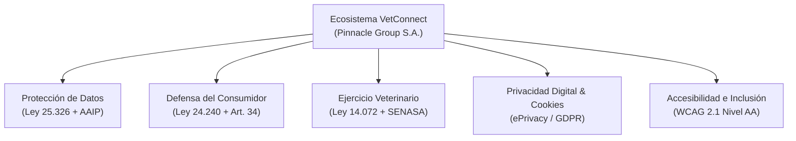

# 🏛️ COMPLIANCE_LEGAL_Y_ACCESIBILIDAD.md — Arquitectura de Cumplimiento Regulatorio, Privacidad de Datos, Políticas Legales y Accesibilidad Universal WCAG 2.1 AA

> **Documento:** `docs/COMPLIANCE_LEGAL_Y_ACCESIBILIDAD.md`  
> **Ámbito de Aplicación:** Monorepo VetConnect (Backend Express, Web SPA React 18, Mobile App Expo).  
> **Entidad Titular y Responsable Legal:** **Pinnacle Group S.A.** (CUIT: 30-71234567-8), Av. Santa Fe 1234, Ciudad Autónoma de Buenos Aires, República Argentina.  
> **Referencia Arquitectónica:** [ADR-027](./DECISIONS.md#adr-027-blindaje-regulatorio-integral-marco-legal-leyes-25326-24240-y-14072-gestión-de-cookies-e-inclusión-accesible-wcag-21-aa).  
> **Estado:** APROBADO & VINCULANTE PARA TODOS LOS AGENTES DE IA Y DESARROLLADORES.

---

## 🧭 1. Marco Jurídico y Normativo Aplicable

El diseño arquitectónico y de producto de **VetConnect** está blindado bajo un enfoque proactivo de *Compliance by Design* (Cumplimiento por Diseño), mitigando riesgos civiles, penales, comerciales y administrativos en las siguientes áreas del derecho argentino e internacional:



### 1.1 Protección de Datos Personales (Ley Nacional N° 25.326 & AAIP)
* **Principio de Minimización (Art. 4):** VetConnect captura única y exclusivamente los atributos indispensables para la teleorientación y emisión de recetas digitales:
  * *Tutor:* Nombre, apellido, correo electrónico y teléfono (este último protegido y revelado únicamente al veterinario asignado durante la consulta activa).
  * *Paciente:* Nombre, especie, raza, peso estimado, número de chip ISO (opcional) e historial clínico.
  * *Veterinario:* Nombre, apellido, matrícula habilitante, jurisdicción y estado de fiscalización administrativa.
* **Canales ARCO (Art. 14 y 15):** Los derechos de Acceso, Rectificación, Actualización y Supresión se ejercen formalmente a través del buzón criptográficamente protegido `privacidad@vetconnect.com.ar`.
* **Conservación Sanitaria vs. Derecho al Olvido:** Conforme a la lex artis veterinaria y requerimientos sanitarios, las historias clínicas y recetas emitidas deben preservarse de forma inmutable. La solicitud de baja de cuenta ejecuta una **eliminación lógica con anonimización irreversible** (`deletedAt = new Date()`), disociando permanentemente los datos personales identificables del expediente médico veterinario.
* **Órgano de Control:** Se hace constar formalmente ante el usuario la potestad de la **Agencia de Acceso a la Información Pública (AAIP)** como autoridad de aplicación.

### 1.2 Régimen del Ejercicio Veterinario (Ley Nacional N° 14.072 & Deontología Profesional)
* **Naturaleza del Servicio:** VetConnect es una plataforma intermediaria de telecomunicación telemática en tiempo real. **No ejerce la medicina veterinaria por sí misma.**
* **Responsabilidad Profesional Subjetiva:** El acto médico, el triaje diagnóstico presuntivo y la prescripción farmacológica corresponden con exclusividad a la matrícula profesional del médico veterinario interviniente, quien actúa de forma autónoma e independiente conforme a la Ley 14.072 y las normas de su respectivo Colegio o Consejo Veterinario.
* **Descargo Obligatorio de Emergencia Crítica (*Emergency Disclaimer*):**
  > ⚠️ **AVISO OBLIGATORIO DE SALUD ANIMAL:** VetConnect es un entorno de teleorientación y triaje primario. Ante cuadros críticos de riesgo de vida inminente (dificultad respiratoria severa, convulsiones continuas, hemorragias profusas, colapso o sospecha de torsión gástrica), el tutor debe concurrir de forma inmediata a un centro hospitalario presencial de guardia 24 horas.

### 1.3 Régimen de Defensa del Consumidor (Ley Nacional N° 24.240)
* **Derecho de Arrepentimiento / Revocación (Art. 34):** En contrataciones a distancia, el consumidor tiene la facultad irrestricta de revocar la prestación.
* **100% de Reembolso Automático:**
  1. *Cancelación Voluntaria:* Si el tutor cancela la consulta mientras se encuentra en la sala de espera (`WAITING`), el cobro se anula instantáneamente sin retención ni penalidad.
  2. *Timeout de Triage (ADR-024):* Si transcurren 15 minutos sin que un profesional colegiado tome el caso, la plataforma transiciona automáticamente la consulta a `CANCELLED` (`TIMEOUT_NO_VET_AVAILABLE`) y emite el reembolso automático del 100% del importe cobrado.
  3. *Fallo de Red Profesional:* Si el veterinario sufre una desconexión y no reconecta dentro de la ventana de gracia de 3 minutos, se ofrece reintegro total o reencolado preferencial.

---

## 🍪 2. Dictamen Técnico y Regulatorio de Cookies

### 2.1 Taxonomía de Tecnologías de Almacenamiento

| Identificador | Tipo | Duración | Finalidad | ¿Requiere Opt-In? |
|---|---|---|---|---|
| `refreshToken` | Cookie HttpOnly; Secure; SameSite | 7 días | Renovación de sesión JWT criptográfica con rotación de versiones (`tokenVersion`). Inaccesible por JavaScript. | **NO (Excepción de necesidad técnica estricta)** |
| `vetconnect_cookie_consent` | LocalStorage | 1 año | Registro de auditoría de la manifestación de voluntad del usuario frente a cookies opcionales. | **NO (Persistencia de consentimiento)** |
| `sentry_error_reporting` | Telemetría / Red | Sesión | Detección de excepciones y métricas de rendimiento WebRTC sin transporte de PII. | **SÍ (Requiere Opt-in afirmativo previo)** |

### 2.2 Flujo de Consentimiento Granular (`CookieConsentBanner`)
1. Al ingresar por primera vez, el componente `CookieConsentBanner` detecta la ausencia de `vetconnect_cookie_consent` en `localStorage` y se despliega como región flotante (`role="region"`).
2. Ofrece dos opciones unívocas:
   * **"Solo Necesarias":** Almacena `{ necessary: true, analytics: false }`. No se inician scripts de telemetría de comportamiento ni rastreo.
   * **"Aceptar Todas":** Almacena `{ necessary: true, analytics: true }`. Habilita el reporte extendido de calidad de llamadas y errores.
3. **Mecanismo de Revocación:** En la página `/cookies`, el usuario dispone de un botón permanente para purgar su preferencia y reiniciar el diálogo de consentimiento.

---

## 🛡️ 3. Consentimiento Informado en Formularios de Onboarding

Para prevenir nulidades contractuales (Arts. 259 y ss. del Código Civil y Comercial de la Nación), el proceso de alta de cuentas en `Register.tsx` exige manifestación expresa y afirmativa:

```tsx
{/* Casilla de Consentimiento Informado & Aceptación Legal */}
<div className="flex items-start gap-3 p-3.5 bg-[#FAF8F4] border border-[#DCD5C8] rounded-2xl">
  <input
    id="register-terms"
    type="checkbox"
    checked={acceptedTerms}
    onChange={(e) => setAcceptedTerms(e.target.checked)}
    required
    aria-required="true"
    className="mt-1 w-4 h-4 rounded border-[#DCD5C8] text-[#0A342B] focus:ring-[#0A342B] cursor-pointer"
  />
  <label htmlFor="register-terms" className="text-xs text-[#3D3A34] leading-relaxed cursor-pointer select-none">
    He leído y acepto los <Link to="/terms">Términos y Condiciones</Link>, la <Link to="/privacy">Política de Privacidad</Link> y la <Link to="/refunds">Política de Reembolsos</Link>. Comprendo que este servicio brinda teleorientación y triaje sanitario.
  </label>
</div>
```

* **Bloqueo Preventivo:** El controlador `handleSubmit` valida `acceptedTerms === true` en memoria de React antes de invocar la mutación de red a `/api/auth/register`, arrojando una advertencia visual inmediata si no se completó la confirmación.

---

## 🚫 4. Política Anti-Vanity Metrics y Cero Reseñas Falsas

En conformidad con las decisiones arquitectónicas ADR-023, ADR-025 y las directivas contra el *"Síndrome de la Plantilla"* de `AGENTS.md`:

1. **Erradicación de Métricas Inventadas:**
   * Queda terminantemente prohibido hardcodear contadores cosméticos de disponibilidad médica (ej. *"8 Médicos de Guardia Conectados"*, *"Tiempo de espera actual: ~2 min 40 seg"*).
   * Se reemplazaron por descriptores honestos de capacidad técnica: *"Guardia Médica Veterinaria Activa"* y *"Atención telemática y triaje con profesionales matriculados en turno"*.
2. **Empty States Honestas en Perfiles Profesionales:**
   * Si un médico veterinario posee 0 consultas valoradas (`ratingCount === 0`), la interfaz debe renderizar obligatoriamente `—` y un badge `Nuevo / Sin calificaciones aún`.
   * Prohibido asignar 5 estrellas por defecto a cuentas recién habilitadas.

---

## 🔒 5. Auditoría de Integraciones de Terceros & Minimización de PII

| Proveedor / Servicio | Uso en VetConnect | Vector de Riesgo | Mitigación Implementada |
|---|---|---|---|
| **LiveKit SFU** | Streaming WebRTC de audio y video | Exposición de PII en logs inmutables | **Tokens generados con identificadores técnicos opacos (`user.id`) y nombre de pila.** Prohibición de inyectar correos o teléfonos en el payload JWT. |
| **Sentry** | Monitoreo de excepciones en tiempo real | Fuga de datos de pacientes en stack traces | Normalización de errores mediante RFC 7807; filtrado de datos sensibles en `beforeSend`; opt-in condicionado al banner de cookies. |
| **AWS S3 / Media** | Fotografías de lesiones y recetas | Exposición estática no autorizada | Archivos servidos exclusivamente vía endpoints autenticados `GET /api/media/:id` con validación de roles y relación clínica (tutor, veterinario asignado o auditor). |
| **PostgreSQL / Supabase** | Persistencia relacional | Fugas de datos en reposo / tránsito | SSL/TLS obligatorio en cadena de conexión (`sslmode=require`); contraseñas hasheadas con bcrypt (factor 12); rotación de `tokenVersion`. |

---

## ♿ 6. Estándar de Accesibilidad Digital Universal (WCAG 2.1 Nivel AA)

Para garantizar la inclusión de personas con discapacidades visuales, motrices o cognitivas:

1. **Contraste de Color:** Todos los pares tipográficos cumplen el ratio mínimo de **4.5:1** para texto normal y **3:1** para componentes gráficos o titulares mayores a 18pt:
   * Fondos oscuros corporativos: `#03362A` con texto blanco puro `#FFFFFF` (ratio > 11:1).
   * Fondos claros: `#FAF8F4` con texto `#1E1C18` (ratio > 13:1).
   * Botones de acción: `#00D084` con texto `#03362A` (ratio > 5.5:1).
2. **Navegabilidad Integral por Teclado:**
   * Todo elemento interactivo dispone de contorno visible al recibir foco (`focus-visible:ring-2 focus-visible:ring-emerald-600 focus:outline-none`).
   * Trampas de foco deshabilitadas en componentes modales; navegación secuencial lógica mediante tecla `Tab` y activación con `Enter` y `Espacio`.
3. **Semántica HTML y Tecnologías de Asistencia (Lectores de Pantalla):**
   * Estructura organizada con regiones landmarks: `<header>`, `<nav>`, `<main>`, `<section>`, `<aside>` y `<footer>`.
   * Enlaces e iconos no textuales dotados de atributos explícitos `aria-label`, `aria-hidden="true"` para decoraciones y `aria-required="true"` en entradas críticas.

---

## 🧪 7. Suite de Verificación Automatizada de Cumplimiento

La conformidad de estas disposiciones se valida de forma continua en el pipeline de CI a través de:

```bash
# 1. Ejecución de suite de cumplimiento legal y cookies en Web
npm test -w web -- src/__tests__/LegalCompliance.test.tsx

# 2. Verificación de consentimiento informado y validaciones de onboarding
npm test -w web -- src/__tests__/Register.test.tsx

# 3. Verificación de descargo sanitario, datos societarios y pie de página
npm test -w web -- src/__tests__/Landing.test.tsx

# 4. Suite completa del monorepo (167 tests en verde)
npm test

# 5. Auditoría de gobernanza semántica de modelos
npm run check:governance
```

---
*VetConnect Legal & Engineering Compliance Framework — Pinnacle Group S.A. 2026.*
