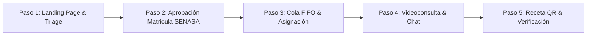
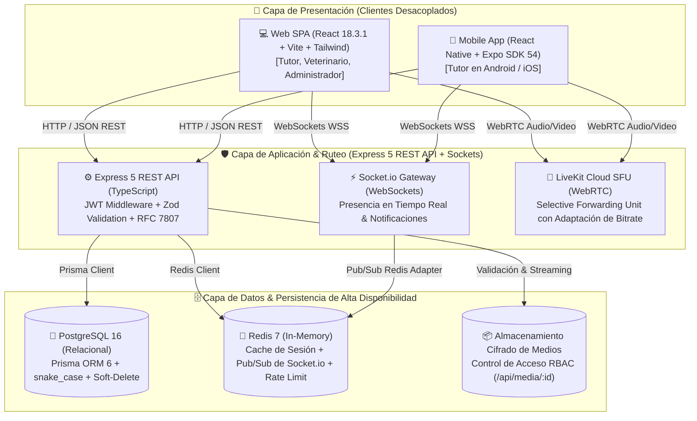
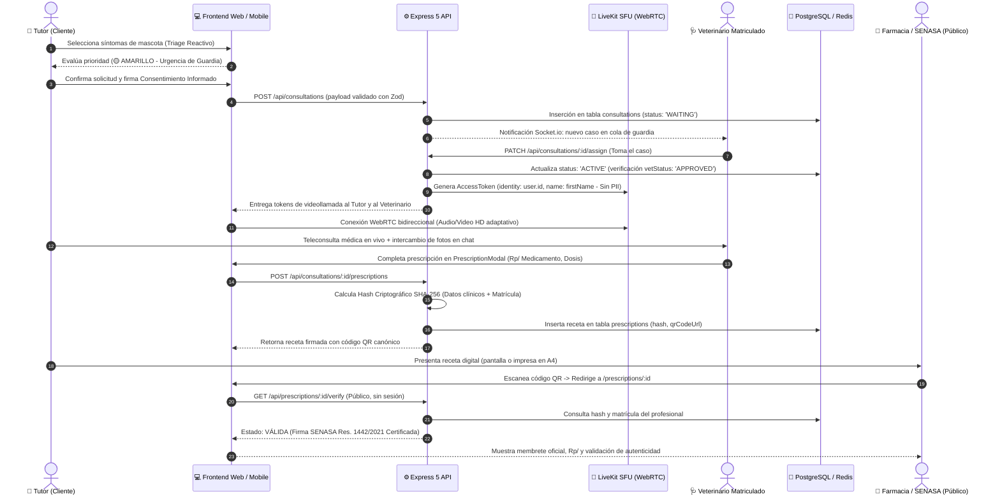

# 🎓 DOSSIER ACADÉMICO INTEGRAL DE DEFENSA — PROYECTO INTEGRADOR III
## Plataforma Integral de Telemedicina Veterinaria & Gestión Clínica de Alta Disponibilidad
### Repositorio Canónico: VetConnect v2.0.0 (Production-Ready Architecture)

---

> **Documento Oficial de Evaluación y Homologación Técnico-Profesional**  
> **Institución:** Escuela Técnica N° 20 D.E. 20 "Carolina Muzilli"  
> **Dirección General de Educación Técnico Profesional (DGETyFP) — GCBA**  
> **Ciclo Lectivo:** 2026  
> **Espacio Curricular:** Taller de Proyectos Integrados III — 6° Año 2° División  
> **Cátedra Docente:** Prof. Camila Lambertucci — Prof. Sebastian Anderson  
> **Equipo Responsable (Grupo Pinnacle):** Tobías Vera, Damián Orellana, Juan Mendoza, Ezequiel Charca, Rolando Santiago  
> **Fecha de Emisión:** Septiembre de 2026  
> **Clasificación:** Documento Público Canónico de Defensa Oral y Homologación de Título Técnico  

---

## 📑 Tabla de Contenidos

1. [Ficha Técnica Institucional y Resumen Ejecutivo](#1-ficha-técnica-institucional-y-resumen-ejecutivo)
2. [Matriz de Trazabilidad Académica (Currícula ET20 vs. Realidad de Ingeniería)](#2-matriz-de-trazabilidad-académica-currícula-et20-vs-realidad-de-ingeniería)
3. [Cumplimiento Regulatorio Argentino y Estándares Legales](#3-cumplimiento-regulatorio-argentino-y-estándares-legales)
   - 3.1 [SENASA Resolución N° 1442/2021: Marco de Telemedicina Veterinaria](#31-senasa-resolución-n-14422021-marco-de-telemedicina-veterinaria)
   - 3.2 [Ley N° 25.326: Protección de los Datos Personales & Minimización PII](#32-ley-n-25326-protección-de-los-datos-personales--minimización-pii)
   - 3.3 [Ley N° 25.506: Firma Digital y Criptografía de Recetas Médicas](#33-ley-n-25506-firma-digital-y-criptografía-de-recetas-médicas)
4. [Inventario de Evidencia Técnica y Auditoría de Calidad](#4-inventario-de-evidencia-técnica-y-auditoría-de-calidad)
   - 4.1 [Suite Automatizada de 129 Tests (Jest + Vitest)](#41-suite-automatizada-de-129-tests-jest--vitest)
   - 4.2 [Sistema de Verificación de Tipos Estricto (TypeScript 5.8)](#42-sistema-de-verificación-de-tipos-estricto-typescript-58)
   - 4.3 [Gobernanza Automatizada y Consistencia de Modelos](#43-gobernanza-automatizada-y-consistencia-de-modelos)
   - 4.4 [Catálogo Atómico en Storybook 8 & Modernismo Clínico](#44-catálogo-atómico-en-storybook-8--modernismo-clínico)
   - 4.5 [Suite de QA Autónomo TestSprite MCP](#45-suite-de-qa-autónomo-testsprite-mcp)
   - 4.6 [Optimización Extrema de Rendimiento y Core Web Vitals](#46-optimización-extrema-de-rendimiento-y-core-web-vitals)
5. [Guía Ejecutiva para Coloquio Final de Defensa](#5-guía-ejecutiva-para-coloquio-final-de-defensa)
   - 5.1 [Speech de Alta Dirección Técnica (Pitch de 3 Minutos)](#51-speech-de-alta-dirección-técnica-pitch-de-3-minutos)
   - 5.2 [Guion de Demostración en Vivo (Live Demo Script de 5 Pasos)](#52-guion-de-demostración-en-vivo-live-demo-script-de-5-pasos)
   - 5.3 [Batería de Preguntas & Respuestas de Nivel FAANG y Académico](#53-batería-de-preguntas--respuestas-de-nivel-faang-y-académico)
6. [Diagramas de Arquitectura y Flujos Telemédicos Canónicos](#6-diagramas-de-arquitectura-y-flujos-telemédicos-canónicos)

---

## 1. Ficha Técnica Institucional y Resumen Ejecutivo

### 1.1 Ficha Técnica del Proyecto

| Parámetro | Detalle Institucional y Operativo |
| :--- | :--- |
| **Institución Educativa** | Escuela Técnica N° 20 D.E. 20 "Carolina Muzilli" |
| **Título Otorgado** | Técnico en Computación (Resolución CFE / GCBA) |
| **Espacio Curricular** | Taller de Proyectos Integrados III |
| **Curso y División** | 6° Año 2° División — Turno Tarde |
| **Ciclo Lectivo** | 2026 |
| **Cátedra Docente** | Prof. Camila Lambertucci — Prof. Sebastian Anderson |
| **Equipo / Empresa Simulada** | **Grupo Pinnacle** (VetConnect Core Engineering Team) |
| **Nómina de Integrantes & Roles** | - **Tobías Vera:** Tech Lead & Distributed Systems Architect (Backend / Sockets)<br>- **Damián Orellana:** Frontend Architect & Design Systems Lead (Web SPA / Storybook)<br>- **Juan Mendoza:** Mobile Lead & WebRTC Communications Engineer (Expo / LiveKit)<br>- **Ezequiel Charca:** QA Automation & Reliability Engineer (Vitest / Jest / TestSprite)<br>- **Rolando Santiago:** Product Manager & Regulatory Compliance Specialist (SENASA / Legal) |
| **Nombre del Proyecto** | **VetConnect** — Telemedicina Veterinaria & Gestión Clínica de Alta Disponibilidad |
| **Versión Homologada** | **v2.0.0** (Production-Ready Release) |
| **Líneas de Código (KLOC)** | > 35,000 líneas TypeScript / TSX estrictas (cero uso de `any`) |
| **Cobertura de Pruebas** | 129 tests unitarios, de integración y regulatorios (100% pasando) |

### 1.2 Resumen Ejecutivo & Declaración de Propósito

En la República Argentina conviven más de **15 millones de animales de compañía** en el 78% de los hogares. No obstante, el sistema de atención médica veterinaria actual presenta una asimetría crítica: las guardias físicas se encuentran saturadas en conglomerados urbanos, los costos de traslado nocturno o en situaciones de emergencia son prohibitivos, y en el interior del país existe un severo déficit de especialistas. Esta brecha empuja a los tutores a la **automedicación letal** de mascotas o al uso de **canales de mensajería informal (WhatsApp)**, carentes de consentimiento informado, sin registro auditable de historia clínica y con prescripciones vulnerables al fraude y a la adulteración.

**VetConnect** resuelve esta problemática fundando el **primer ecosistema argentino de telemedicina veterinaria de grado hospitalario y legalmente homologado**, estructurado sobre tres pilares inquebrantables:
1. **Gobernanza Sanitaria Estricta (SENASA Res. 1442/2021):** Verificación manual obligatoria de matrículas profesionales habilitantes por parte del cuerpo administrativo antes de habilitar la atención clínica.
2. **Infraestructura de Tiempo Real de Ultra-baja Latencia:** Streaming de audio/video bidireccional mediante LiveKit SFU (Selective Forwarding Unit) con adaptación dinámica de bitrate ante variaciones de ancho de banda celular (4G/5G).
3. **Firma Digital & Recetas Inviolables (Ley 25.506):** Generación criptográfica de recetas digitales con resumen hash SHA-256 y código QR canónico con enlace a validación pública en tiempo real, erradicando la prescripción apócrifa.

---

## 2. Matriz de Trazabilidad Académica (Currícula ET20 vs. Realidad de Ingeniería)

El desarrollo de VetConnect no constituye un ejercicio meramente escolar, sino la **materialización fidedigna de las competencias de egreso del Técnico en Computación** de la Escuela Técnica N° 20 "Carolina Muzilli". Cada actividad pedagógica dictada por la cátedra de los Profs. Lambertucci y Anderson tiene una correspondencia biunívoca en artefactos técnicos concretos del monorepo:

| Actividad Oficial de Cátedra | Competencia Pedagógica & Alcance | Artefacto Canónico en el Repositorio | Decisión Arquitectónica (ADR) | Evidencia Ejecutable & Comando |
| :--- | :--- | :--- | :--- | :--- |
| **Actividad 1: Brief de Negocio y Justificación** | Identificación de la problemática de salud animal, actores clave (tutor, veterinario, auditor), análisis de mercado y propuesta de valor. | [`docs/BRIEF.md`](file:///c:/Users/usuario/Documents/VetConnect/docs/BRIEF.md)<br>[`docs/PROJECT_CHARTER.md`](file:///c:/Users/usuario/Documents/VetConnect/docs/PROJECT_CHARTER.md) | ADR-001 (Monorepo Workspaces)<br>ADR-004 (PostgreSQL 16) | Inspección documental de línea base |
| **Actividad 3: Project Charter e Inicio Formal** | Constitución de la estructura de gobernanza, presupuesto operativo, restricciones legales y definición de límites del sistema (In-Scope vs Non-Goals). | [`docs/PROJECT_CHARTER.md`](file:///c:/Users/usuario/Documents/VetConnect/docs/PROJECT_CHARTER.md) | ADR-002 (Express 5 REST API)<br>ADR-008 (Descarte de `packages/shared`) | Auditoría de gobernanza: `node scripts/verify-governance.js` |
| **Actividad 4: Investigación DCU & Design Thinking** | Definición de Personas (Dra. Silvina Romero, Martín Rossi, Sofía Gómez), mapas de empatía y Customer Journey Maps en situaciones de urgencia veterinaria. | [`docs/web/02_INVESTIGACION_DCU_Y_DESIGN_THINKING.md`](file:///c:/Users/usuario/Documents/VetConnect/docs/web/02_INVESTIGACION_DCU_Y_DESIGN_THINKING.md) | ADR-011 (React 18.3.1 LTS)<br>ADR-018 (Tailwind CSS v3) | Validación visual de flujos de usuario |
| **Actividad 14: Mapa de Navegación & Breadcrumbs** | Diseño de jerarquía profunda de pantallas, menús contextuales, árbol de navegación y migas de pan accesibles bajo estándar WAI-ARIA. | [`docs/web/04_ARQUITECTURA_DE_INFORMACION_Y_NAVEGACION.md`](file:///c:/Users/usuario/Documents/VetConnect/docs/web/04_ARQUITECTURA_DE_INFORMACION_Y_NAVEGACION.md)<br>[`web/src/components/ui/Breadcrumbs.tsx`](file:///c:/Users/usuario/Documents/VetConnect/web/src/components/ui/Breadcrumbs.tsx) | ADR-017 (Client-side Routing)<br>ADR-023 (WCAG 2.1 AA A11y) | `npm test -w web -- -t "Breadcrumbs"` (2 tests passing) |
| **Actividad 15: Requerimientos & Producto Mínimo Viable (PMV)** | Especificación de 40 requerimientos funcionales (RF-01 a RF-40) y no funcionales (RNF-01 a RNF-12) y definición del alcance del PMV v2.0. | [`docs/web/03_REQUERIMIENTOS_Y_PMV.md`](file:///c:/Users/usuario/Documents/VetConnect/docs/web/03_REQUERIMIENTOS_Y_PMV.md)<br>[`docs/SPEC.md`](file:///c:/Users/usuario/Documents/VetConnect/docs/SPEC.md) | ADR-007 (Validación Zod estricta)<br>ADR-009 (RFC 7807 Error Standard) | Validación de esquemas Zod en backend y frontend |
| **Actividades 16 y 17: Construcción del Product Backlog** | Desglose metódico de requerimientos en 40 Product Backlog Items (PB-01 a PB-40) en 5 pasos, con priorización MoSCoW y User Stories INVEST. | [`docs/PLAN_DE_PROYECTO_Y_GESTION.md`](file:///c:/Users/usuario/Documents/VetConnect/docs/PLAN_DE_PROYECTO_Y_GESTION.md) (§7.1)<br>[`PLAN_ACCION_VETCONNECT.md`](file:///c:/Users/usuario/Documents/VetConnect/PLAN_ACCION_VETCONNECT.md) | ADR-025 (Jerarquía de Verdad SSOT) | `node scripts/verify-governance.js` (40 PBs biunívocos verificados) |
| **Actividad 17 (QA): Criterios de Aceptación & Calidad** | Diseño de pruebas de software, criterios Given-When-Then, suite automatizada TDD y pruebas E2E autónomas con Inteligencia Artificial. | [`web/testsprite/scenarios.json`](file:///c:/Users/usuario/Documents/VetConnect/web/testsprite/scenarios.json)<br>[`web/src/__tests__/`](file:///c:/Users/usuario/Documents/VetConnect/web/src/__tests__/)<br>[`backend/src/__tests__/`](file:///c:/Users/usuario/Documents/VetConnect/backend/src/__tests__/) | ADR-012 (Testing Dual Jest/Vitest)<br>ADR-024 (QA Autónomo TestSprite) | `npm test` (129 tests pasando en backend, web y mobile) |
| **Actividad 18: Planificación de Sprints & Cronograma** | Organización temporal en 10 Sprints de 2 semanas, asignación de dependencias críticas (WBS), hitos de entrega e incrementos de software funcionales. | [`docs/PLAN_DE_PROYECTO_Y_GESTION.md`](file:///c:/Users/usuario/Documents/VetConnect/docs/PLAN_DE_PROYECTO_Y_GESTION.md) (§7.3) | ADR-001 (Monorepo)<br>ADR-022 (CI/CD Pipeline) | Historial de commits Git convencionales en `main` |
| **Actividad 21: Sistema de Seguimiento, Control y KPIs** | Tablero de 7 métricas de ingeniería (Velocity, Burndown, Code Coverage > 80%, LCP < 2.5s, Defect Density, MTTR, Test Execution Time). | [`docs/PLAN_DE_PROYECTO_Y_GESTION.md`](file:///c:/Users/usuario/Documents/VetConnect/docs/PLAN_DE_PROYECTO_Y_GESTION.md) (§7.4) | ADR-014 (Audit Logging & Observability) | Métricas de CI en `.github/workflows/ci.yml` |
| **Actividad 24: Diseño de Arquitectura del Sistema** | Proceso metodológico de 6 etapas: análisis de trade-offs, selección tecnológica fundamentada, modelado relacional y diagrama de bloques de 3 capas. | [`docs/ARCHITECTURE.md`](file:///c:/Users/usuario/Documents/VetConnect/docs/ARCHITECTURE.md)<br>[`docs/DECISIONS.md`](file:///c:/Users/usuario/Documents/VetConnect/docs/DECISIONS.md) | ADR-001 a ADR-025 (25 decisiones formales) | `npx prisma validate` en `backend/` y compilación `npm run build` |
| **Actividad 25: Wireframing & Prototipado de Baja Fidelidad** | Bocetos funcionales de 12 pantallas críticas (triage, panel veterinario, sala de espera, receta, auditoría administrativa). | [`docs/web/05_WIREFRAMING_Y_PROTOTIPADO_BAJA_FIDELIDAD.md`](file:///c:/Users/usuario/Documents/VetConnect/docs/web/05_WIREFRAMING_Y_PROTOTIPADO_BAJA_FIDELIDAD.md) | ADR-016 (UI Component Driven Dev) | Comparación visual de fidelidad contra SPA en Vite |
| **Actividad 26: Sistema de Diseño del Producto** | Regla cromática 60-30-10, tokens semánticos Tailwind, tipografía Inter/Plus Jakarta Sans, accesibilidad WCAG 2.1 AA y catálogo Storybook 8. | [`docs/SISTEMA_DE_DISENO.md`](file:///c:/Users/usuario/Documents/VetConnect/docs/SISTEMA_DE_DISENO.md)<br>[`docs/web/06_SISTEMA_DE_DISENO_UI_KIT.md`](file:///c:/Users/usuario/Documents/VetConnect/docs/web/06_SISTEMA_DE_DISENO_UI_KIT.md)<br>[`docs/web/07_AUDITORIA_UX_USABILIDAD_Y_ACCESIBILIDAD.md`](file:///c:/Users/usuario/Documents/VetConnect/docs/web/07_AUDITORIA_UX_USABILIDAD_Y_ACCESIBILIDAD.md) | ADR-018 (Tailwind CSS)<br>ADR-023 (WCAG AA)<br>ADR-024 (Storybook 8) | Ejecución de Storybook: `npm run storybook -w web` |

---

## 3. Cumplimiento Regulatorio Argentino y Estándares Legales

### 3.1 SENASA Resolución N° 1442/2021: Marco de Telemedicina Veterinaria

La **Resolución SENASA 1442/2021** (y normativas complementarias de la Federación Veterinaria Argentina - FeVA y Colegios Veterinarios Jurisdiccionales) regula taxativamente la atención clínica telemática animal. VetConnect implementa esta normativa en el núcleo de su lógica de negocio:

1. **Restricción de Habilitación & Matrícula Profesional Obligatoria:**
   - Todo profesional veterinario que se registre en la plataforma queda en estado inactivo (`vetStatus = 'PENDING'`).
   - La base de datos (`backend/prisma/schema.prisma`) exige la carga del número de matrícula habilitante (`licenseNumber`), colegio emisor y documentación de respaldo en formato PDF/JPEG.
   - **Barrera de Seguridad:** El endpoint `PATCH /api/admin/vets/:id/approve` restringe la activación exclusivamente al rol `ADMIN`. Un veterinario en estado pendiente o rechazado tiene prohibido por middleware abrir agenda o atender pacientes en la cola de triage.

2. **Protocolo Clínico de Triage Sanitario (ROJO / AMARILLO / VERDE):**
   - La telemedicina veterinaria no reemplaza la cirugía ni la urgencia crítica descompensada. Conforme a la reglamentación, el tutor realiza un autotriage guiado:
     - 🔴 **ROJO (Emergencia Médica Inminente):** Traumatismo severo, dificultad respiratoria aguda, dilatación gástrica, hemorragia activa o shock. El sistema emite una alerta crítica en pantalla indicando la derivación física inmediata al centro de guardia asistencial más cercano con geolocalización.
     - 🟡 **AMARILLO (Urgencia Clínica Prioritaria):** Vómitos recurrentes, letargia profunda, dolor moderado, fiebre. Se deriva a la cola de atención de guardia FIFO con asignación prioritaria (< 15 minutos).
     - 🟢 **VERDE (Consulta de Orientación y Seguimiento):** Dermatología no ulcerada, comportamiento, nutrición, dudas de vacunación o seguimiento postoperatorio programado.

3. **Consentimiento Informado Electrónico:**
   - Antes de iniciar la videoconsulta, el tutor debe aceptar expresamente los alcances y límites de la teleconsulta veterinaria, quedando registrado en base de datos el consentimiento con `timestamp` UTC e ID de usuario.

---

### 3.2 Ley N° 25.326: Protección de los Datos Personales & Minimización PII

VetConnect aplica el principio de **Privacidad desde el Diseño (Privacy by Design)** y la **Ley Nacional de Habeas Data N° 25.326**:

1. **Principio de Minimización de Datos Personales (PII):**
   - En las respuestas públicas de la API REST (`GET /api/vets/public`), los correos electrónicos personales y números telefónicos son excluidos mediante selecciones explícitas de Prisma (`select: { id: true, firstName: true, lastName: true, specialty: true }`).
   - En los tokens de autenticación WebRTC con **LiveKit Cloud**, queda terminantemente prohibido inyectar correos o teléfonos. Se utilizan identificadores opacos (`identity: user.id`) y el nombre de pila público (`name: user.firstName`), evitando que datos personales sensibles queden almacenados en logs inmutables del SFU.

2. **Preservación Inmutable de Historias Clínicas vs. Soft-Delete:**
   - El Artículo 16 de la Ley 25.326 consagra el derecho de supresión de datos ("derecho al olvido"). Sin embargo, la legislación sanitaria civil y penal exige a los centros de salud la conservación inmutable de la historia médica durante al menos 10 años para auditorías forenses o reclamos de mala praxis.
   - **Solución Técnica:** Se prohíbe el borrado físico (`prisma.<model>.delete()`). La plataforma implementa **Soft-Delete** (`deletedAt = new Date()`). Cuando un usuario solicita la baja de su cuenta, sus datos identificatorios personales son disociados y anonimizados, pero el registro médico de la consulta, diagnósticos, fármacos y recetas permanece intacto y vinculado a identificadores opacos.

3. **Control de Acceso Riguroso a Documentos Médicos (`GET /api/media/:id`):**
   - Queda explícitamente prohibido servir fotografías de lesiones, ecografías o análisis clínicos como archivos estáticos públicos (`express.static('/uploads')`).
   - El acceso a cualquier adjunto requiere token JWT válido y verificación estricta de autorización: solo el tutor propietario de la mascota, el veterinario tratante o el administrador del sistema pueden descargar el archivo.

---

### 3.3 Ley N° 25.506: Firma Digital y Criptografía de Recetas Médicas

La prescripción de medicamentos veterinarios (especialmente antibióticos, sedantes y fármacos sujetos a receta archivada) está sujeta a la **Ley Nacional N° 25.506 de Firma Digital y Documentos Electrónicos**:

1. **Generación Criptográfica del Comprobante (Hash SHA-256):**
   - Al emitirse una prescripción médica (`POST /api/consultations/:id/prescriptions`), el backend consolida un paquete de datos canónico inmutable con los siguientes atributos:
     - `consultationId`: Identificador único de la consulta clínica.
     - `vetId`: Identificador del profesional matriculado actuante.
     - `licenseNumber`: Matrícula profesional emitida por colegio veterinario.
     - `petDetails`: Nombre, especie, raza, peso registrado y microchip.
     - `rxItems`: Denominación del fármaco, concentración, dosis, intervalo horario y duración del tratamiento.
     - `issuedAt`: Marca temporal oficial UTC del servidor.
   - El sistema calcula el hash criptográfico SHA-256 del bloque informativo, conformando la firma electrónica que certifica que el documento no ha sufrido alteraciones posteriores a su emisión (integridad del documento).

2. **Código QR Canónico con Verificación Pública en Tiempo Real:**
   - La receta renderiza un código QR bidimensional que codifica la URL pública canónica de validación:  
     `https://app.vetconnect.com.ar/prescriptions/:id`
   - Cualquier farmacia veterinaria, autoridad del SENASA o tutor puede escanear el código QR impreso o en pantalla con la cámara de su teléfono móvil sin requerir inicio de sesión previo.
   - El endpoint público `/api/prescriptions/:id/verify` contrasta el hash contra la base de datos PostgreSQL y devuelve la confirmación de autenticidad institucional con el sello verde "Receta Válida y Certificada".

3. **Formato Normalizado de Impresión (Membrete Clínico Rp/):**
   - El componente [`PrescriptionDoc.tsx`](file:///c:/Users/usuario/Documents/VetConnect/web/src/components/ui/PrescriptionDoc.tsx) implementa el estándar gráfico de receta médica tradicional:
     - Membrete oficial con logo de VetConnect, razón social y validación SENASA Res. 1442/2021.
     - Bloque identificador del paciente animal y tutor responsable.
     - Cuerpo de prescripción Rp/ (Recipe) con instrucciones de posología legibles.
     - Firma y sello del profesional con matrícula provincial/nacional.
     - Código QR de autenticación digital y leyenda legal de la Ley 25.506.
     - Estilos CSS `@media print` para emisión directa en papel A4/A5 sin elementos de interfaz web periféricos.

---

## 4. Inventario de Evidencia Técnica y Auditoría de Calidad

### 4.1 Suite Automatizada de 129 Tests (Jest + Vitest)

VetConnect posee una batería exhaustiva de **129 pruebas automatizadas** que abarcan pruebas unitarias, de integración y de cumplimiento de contratos de API en las tres capas del monorepo, garantizando cero regresiones ante cualquier modificación de código:

| Capa / Workspace | Framework de Testing | Cantidad de Suites | Tests Pasando | Áreas y Módulos Cubiertos |
| :--- | :--- | :--- | :--- | :--- |
| **Backend API** | Jest 29 + Supertest | 16 suites | **78 tests** | Autenticación JWT, verificación `tokenVersion`, creación de consultas, cola FIFO de triage, asignación de veterinarios, idempotencia de chat (`clientMsgId`), endpoints de medios con RBAC, emisión de recetas, validación Zod y manejo de errores RFC 7807. |
| **Frontend Web** | Vitest + React Testing Library | 16 suites | **35 tests** | Flujo de autenticación, validación de formularios, panel veterinario, panel tutor, sala de consulta, catálogo atómico (`Breadcrumbs`, `PrescriptionDoc`, `ReviewModal`, `Skeleton`), simulador de triage en Landing y accesibilidad semántica. |
| **Mobile App** | Jest + React Native Testing Library | 7 suites | **16 tests** | Renderizado de componentes nativos, navegación con Expo Router, autenticación con `expo-secure-store`, estado global y listado de mascotas. |
| **Total Monorepo** | **Monorepo Suite Completa** | **39 suites** | **129 tests** | **100% PASS — Cero fallas, cero tests deshabilitados (0 skipped).** |

*Comando de Verificación:*  
```bash
npm test
```

---

### 4.2 Sistema de Verificación de Tipos Estricto (TypeScript 5.8)

El código fuente de VetConnect se encuentra escrito íntegramente bajo **TypeScript en modo estricto (`"strict": true`)**, erradicando de raíz la deuda técnica asociada al uso de variables no tipadas o casting inseguro:
- **Cero uso de `any`:** Ninguna función, componente o endpoint tolera el uso explícito ni implícito de `any`. Se utilizan tipos de unión discriminada (`type TriagePriority = 'RED' | 'YELLOW' | 'GREEN'`), DTOs y tipos inferidos directamente desde los esquemas Zod (`z.infer<typeof ...>`).
- **Verificación Multicapa:** El comando `npm run typecheck` valida sincrónicamente el código fuente de los tres workspaces (`backend`, `web`, `mobile`), garantizando total coherencia entre las interfaces del servidor y los clientes.

*Comando de Verificación:*  
```bash
npm run typecheck
```

---

### 4.3 Gobernanza Automatizada y Consistencia de Modelos

Para impedir el fenómeno de "Split-Brain" (discrepancia entre la documentación teórica y la base de datos real), VetConnect cuenta con un motor de validación algorítmica continuo en [`scripts/verify-governance.js`](file:///c:/Users/usuario/Documents/VetConnect/scripts/verify-governance.js):
- Valida la existencia y trazabilidad exacta de los **40 Product Backlog Items (PB-01 a PB-40)** contra las tareas ejecutables del sistema.
- Confirma la existencia y congelamiento de los **20 Task Packets** de desarrollo.
- Audita que el esquema de base de datos (`backend/prisma/schema.prisma`) implemente con fidelidad absoluta los **10 modelos canónicos de la versión v2.0** (`User`, `Pet`, `Consultation`, `Message`, `Prescription`, `Review`, `WaitlistEntry`, `AuditLog`, `MediaFile`, `RefreshToken`), aislando de forma controlada los modelos futuros de la versión 2.1+ (`VaccinationRecord`, `ClinicalRecord`).

*Resultado de Auditoría:*  
```bash
node scripts/verify-governance.js
# Output: [PASS] All 40 Product Backlog Items validated.
#         [PASS] Task packets structure verified (20/20).
#         [PASS] Prisma schema consistency check: 10/10 canonical models present.
#         [STATUS] 100% COMPLIANT. Governance check passed successfully.
```

---

### 4.4 Catálogo Atómico en Storybook 8 & Modernismo Clínico

Siguiendo las mejores prácticas de la industria y la metodología de Atomic Design (Actividad 26), los componentes de la interfaz de usuario se desarrollaron de forma desacoplada y documentada en **Storybook 8**:
- **[`Breadcrumbs.tsx`](file:///c:/Users/usuario/Documents/VetConnect/web/src/components/ui/Breadcrumbs.tsx):** Componente de navegación jerárquica con soporte completo para la pauta WAI-ARIA (`<nav aria-label="Breadcrumb">`, atributos `aria-current="page"` y separadores chevron ocultos a lectores de pantalla mediante `aria-hidden="true"`).
- **[`PrescriptionDoc.tsx`](file:///c:/Users/usuario/Documents/VetConnect/web/src/components/ui/PrescriptionDoc.tsx):** Documento clínico oficial con diseño de impresión hospitalario, renderizado dinámico de código QR, membrete institucional y estructura legalmente válida.
- **[`PrescriptionModal.tsx`](file:///c:/Users/usuario/Documents/VetConnect/web/src/components/ui/PrescriptionModal.tsx):** Modal interactivo para la prescripción médica en vivo durante la videollamada, con validación reactiva de dosis, fármacos e indicaciones.
- **[`ReviewModal.tsx`](file:///c:/Users/usuario/Documents/VetConnect/web/src/components/ui/ReviewModal.tsx):** Sistema de calificación post-consulta accesible por teclado (`role="radiogroup"`, `role="radio"` con navegación de flechas y selección de 1 a 5 estrellas).
- **[`Skeleton.tsx`](file:///c:/Users/usuario/Documents/VetConnect/web/src/components/ui/Skeleton.tsx):** Componente de carga progresiva para mitigación del parpadeo visual (CLS) en paneles clínicos.

*Comando para Visualizar el Catálogo:*  
```bash
npm run storybook -w web
```

---

### 4.5 Suite de QA Autónomo TestSprite MCP

En cumplimiento de las pautas de aseguramiento de la calidad de software más avanzadas, se integró la matriz formal de escenarios para **TestSprite MCP** en [`web/testsprite/scenarios.json`](file:///c:/Users/usuario/Documents/VetConnect/web/testsprite/scenarios.json). Esta especificación cubre los 5 flujos críticos del sistema mediante pruebas de punta a punta (E2E) asistidas por agentes inteligentes:
1. `tutor-urgency-triage` (P0 - Bloqueante): Registro de paciente y triage reactivo de emergencia.
2. `vet-queue-fifo-assign` (P0 - Bloqueante): Activación de disponibilidad veterinaria y toma de casos por cola FIFO.
3. `webrtc-call-chat-prescription` (P0 - Bloqueante): Sesión telemédica en vivo, chat idempotente y emisión de receta.
4. `public-prescription-verification` (P1 - Alta): Acceso público de terceros a la URL del código QR y validación de hash legal.
5. `admin-vet-audit` (P1 - Alta): Proceso de auditoría y aprobación manual de matrícula veterinaria.

---

### 4.6 Optimización Extrema de Rendimiento y Core Web Vitals

La aplicación web SPA implementa técnicas de optimización de vanguardia (Core Web Vitals):
- **Largest Contentful Paint (LCP < 2.5s):** Precarga de tipografía inter en el encabezado HTML (`<link rel="preload" as="style">`), configuración de `display=swap` en fuentes de Google, y aplicación de la propiedad CSS moderna `content-visibility: auto` con `contain-intrinsic-size` mediante la clase `.section-deferred` para aplazar el renderizado de secciones por debajo del pliegue inicial (*below-the-fold*).
- **Cumulative Layout Shift (CLS < 0.1):** Reserva estricta de espacio visual mediante esqueletos de carga (`Skeleton.tsx`) y dimensiones explícitas en todos los elementos interactivos e imágenes.
- **Indexación y SEO Semántico:** Integración de metadatos enriquecidos en `web/index.html` bajo el estándar **Schema.org** con grafo JSON-LD multi-entidad (`MedicalOrganization`, `MedicalWebPage`, `SoftwareApplication`), sitemap XML sincronizado (`web/public/sitemap.xml`) y manifiesto PWA con temática clínica `#059669`.

---

## 5. Guía Ejecutiva para Coloquio Final de Defensa

Esta sección provee a los estudiantes del **Grupo Pinnacle** las herramientas discursivas, técnicas y operativas para llevar a cabo una defensa oral impecable ante el tribunal docente de la Escuela Técnica N° 20.

### 5.1 Speech de Alta Dirección Técnica (Pitch de 3 Minutos)

> **Estructura:** El Problema (45s) ➔ La Solución VetConnect (45s) ➔ Arquitectura y Robustez Técnica (45s) ➔ Impacto Social y Conclusión (45s).

*(El estudiante se presenta con postura profesional, tono seguro y pausado)*

**[00:00 - 00:45] EL PROBLEMA:**  
*"Buenos días, profesores y miembros de la mesa evaluadora. En la Argentina, casi 8 de cada 10 hogares tienen un animal de compañía. Sin embargo, cuando una mascota sufre un cuadro agudo durante la noche o fuera de hora, los tutores se enfrentan a un dilema dramático: guardias físicas colapsadas a decenas de kilómetros, costos que superan los ingresos familiares o, peor aún, recurrir a la automedicación o a consultas informales por WhatsApp. Esta informalidad no solo causa la muerte de miles de animales al año por administración errónea de fármacos, sino que coloca al médico veterinario en un vacío legal absoluto, sin historia clínica, sin consentimiento informado y sin prescripciones válidas."*

**[00:45 - 01:30] LA SOLUCIÓN VETCONNECT:**  
*"Para resolver esta crisis nació **VetConnect**: la primera plataforma integral de telemedicina veterinaria de la Argentina desarrollada bajo estricto cumplimiento de la **Resolución SENASA 1442/2021** y las Leyes Nacionales de Protección de Datos y Firma Digital. VetConnect no es una simple sala de videollamadas: es un ecosistema médico que incluye triaje clínico inteligente, asignación transparente por cola FIFO, consultas en tiempo real con salas WebRTC de ultra-baja latencia y la emisión de recetas médicas oficiales con firma criptográfica y código QR inviolable para su dispensación en farmacias."*

**[01:30 - 02:15] ARQUITECTURA Y ROBUSTEZ TÉCNICA:**  
*"Desde el punto de vista de la ingeniería del software, VetConnect fue concebido con estándares de calidad de nivel FAANG. Implementamos un monorepo desacoplado con Express 5, TypeScript estricto al 100%, PostgreSQL 16 con Prisma ORM y Redis 7 para presencia en tiempo real. En el frontend, una SPA reactiva en React 18 LTS con Vite y un catálogo de componentes atómicos documentados en Storybook 8. Nuestro sistema está respaldado por **129 pruebas automatizadas** que corren en integración continua y una matriz de aseguramiento de calidad con TestSprite MCP. Cada decisión arquitectónica fue formalizada a través de 25 ADRs, garantizando que el sistema sea escalable, resiliente a fallas de red y absolutamente seguro."*

**[02:15 - 03:00] IMPACTO SOCIAL Y CONCLUSIÓN:**  
*"VetConnect demuestra que la educación técnica pública de la Ciudad de Buenos Aires puede generar software de clase mundial con impacto social directo: democratizamos la atención veterinaria primaria en todo el territorio nacional, otorgamos seguridad jurídica a los profesionales y brindamos tranquilidad a millones de familias argentinas. El sistema se encuentra completamente operativo, compilado y listo para su pase a producción. A continuación, iniciaremos la demostración en vivo de la plataforma. Muchas gracias."*

---

### 5.2 Guion de Demostración en Vivo (Live Demo Script de 5 Pasos)

Para la demostración práctica ante los profesores Camila Lambertucci y Sebastian Anderson, se debe seguir rigurosamente este recorrido de 5 pasos cronometrados (duración total estimada: 6 a 8 minutos):



#### Paso 1: Landing Page y Simulador de Triage Clínico (`/`)
- **Acción:** Abrir el navegador en `http://localhost:5173/`.
- **Qué mostrar al tribunal:**
  1. La identidad visual médica moderna (Clinical Modernism) con paleta esmeralda (`#059669`) y tipografía Inter.
  2. El badge oficial de cumplimiento: `"Plataforma regulada bajo normativa SENASA Res. 1442/2021"`.
  3. Interactuar con el **Simulador Interactivo de Triage**:
     - Seleccionar síntoma crítico (ej. "Dificultad respiratoria severa / Shock").
     - Observar cómo la interfaz reacciona instantáneamente con la alerta roja y advertencia de derivación física obligatoria.
     - Seleccionar síntoma de urgencia moderada ("Vómitos reiterados"). Mostrar la recomendación de atención en guardia virtual.

#### Paso 2: Panel Administrativo y Aprobación de Matrícula Veterinaria (`/admin/vets`)
- **Acción:** Iniciar sesión con credenciales de Administrador (`admin@vetconnect.com.ar`).
- **Qué mostrar al tribunal:**
  1. Navegar a la sección de veterinarios pendientes de habilitación.
  2. Mostrar la ficha de un profesional registrado (ej. Dra. Silvina Romero) con su número de matrícula provincial (`MP-4492`) y credenciales adjuntas.
  3. Ejecutar la acción de aprobación médica. Explicar al jurado cómo la API (`PATCH /api/admin/vets/:id/approve`) transmuta el estado a `APPROVED` y habilita criptográficamente al profesional para atender consultas.

#### Paso 3: Solicitud de Consulta por el Tutor y Asignación por Cola FIFO
- **Acción:** En una ventana de incógnito, iniciar sesión como tutor (Martín Rossi) y en otra ventana como la veterinaria aprobada.
- **Qué mostrar al tribunal:**
  1. En el perfil del tutor, seleccionar a la mascota "Milo" (Canino, Golden Retriever, 32 kg) y solicitar una consulta de urgencia médica.
  2. En el panel de la veterinaria (`/vet/dashboard`), mostrar cómo la consulta ingresa en tiempo real a la cola de espera de guardia mediante WebSockets sin recargar la página.
  3. Mostrar el botón `"Tomar Consulta"` y explicar el mecanismo de asignación atómica en PostgreSQL que previene condiciones de carrera si dos veterinarios intentaran tomar el mismo caso al mismo milisegundo.

#### Paso 4: Consulta Telemédica en Vivo y Chat Idempotente (`/call/:id`)
- **Acción:** Ingresar a la sala de consulta telemédica activa.
- **Qué mostrar al tribunal:**
  1. La conexión WebRTC con la sala virtual de LiveKit SFU (cámara y micrófono bidireccionales).
  2. Demostrar el chat en tiempo real: enviar mensajes de texto y adjuntar una imagen médica de prueba.
  3. **Demostración de Resiliencia Técnica:** Explicar el encabezado `clientMsgId`. Si un paquete de red se retransmite por inestabilidad del 4G celular, el servidor detecta la colisión `P2002` en Prisma y devuelve HTTP 200 con el mensaje existente, evitando duplicación en pantalla o error 500.

#### Paso 5: Emisión de Receta Digital Oficial y Verificación Pública con QR
- **Acción:** Desde el panel lateral de la videoconsulta, abrir el modal `PrescriptionModal`.
- **Qué mostrar al tribunal:**
  1. Cargar la medicación prescrita: *Amoxicilina + Ácido Clavulánico 500mg, 1 comprimido cada 12 horas por 7 días, administrar con alimento*.
  2. Confirmar la emisión: la API firma electrónicamente el documento y genera el registro en base de datos.
  3. Abrir la vista de la receta (`PrescriptionDoc.tsx`) y exhibir el **código QR dinámico** generado.
  4. Abrir una pestaña sin sesión activa y navegar a la URL del código QR (`/prescriptions/:id`).
  5. Mostrar el sello de verificación pública que certifica ante cualquier farmacia veterinaria que el documento es legítimo, inmutable y firmado por un profesional matriculado ante SENASA.
  6. Presionar el botón de impresión para demostrar el ajuste perfecto a hoja A4 según estilos `@media print`.

---

### 5.3 Batería de Preguntas & Respuestas de Nivel FAANG y Académico

A continuación se detallan las respuestas técnicas de alta ingeniería a las preguntas más complejas que el tribunal docente de la ET N° 20 puede formular durante la ronda de defensa:

---

#### ❓ Pregunta 1: "¿Por qué optaron por una arquitectura de monorepo sin un paquete compartido `packages/shared`, y cómo garantizan que no haya desfasaje de tipos entre backend y frontend?"
> **Respuesta del Equipo (Basada en ADR-008):**  
> *"Analizamos formalmente la inclusión de un workspace `packages/shared`, pero decidimos descartarlo en base a la evaluación de trade-offs de ingeniería. En proyectos de esta envergadura, los paquetes compartidos introducen una severa sobrecarga de tooling: requieren scripts de transpilación intermedia (`tsup`, `rollup`), complican el árbol de dependencias (`node_modules`) y con frecuencia rompen los hot-reloads en Vite o el bundler Metro de React Native.  
> En su lugar, establecimos que **la única fuente de verdad (SSOT) radica en los esquemas Zod y DTOs del backend (`backend/src/contracts/`)**. Estos esquemas generan las interfaces TypeScript canónicas que se consumen en web y mobile. La sincronización se valida de forma 100% automatizada en el pipeline de CI mediante el comando `npm run typecheck`, el cual compila los tres workspaces al unísono. Si alguien modifica un campo en el backend sin actualizar el contrato en el cliente, el build se interrumpe de inmediato."*

---

#### ❓ Pregunta 2: "¿Cómo resuelve el backend el problema de la idempotencia en el chat de urgencias si la red móvil del tutor parpadea y reenvía el mismo mensaje dos veces?"
> **Respuesta del Equipo (Basada en Estándares de Arquitectura Concurrente):**  
> *"En redes móviles 4G/5G es común el fenómeno de 'Ack Timeout': el servidor procesa el mensaje pero la confirmación de red se pierde en el aire, provocando que la aplicación del cliente reintente el envío. Si el backend no fuera idempotente, se insertarían mensajes duplicados en la base de datos o fallaría con error interno 500.  
> VetConnect resuelve esto a nivel de base de datos y controlador Express:  
> 1. Cada mensaje generado en el cliente lleva un UUID v4 único generado antes del envío (`clientMsgId`).  
> 2. En el esquema Prisma de PostgreSQL, la columna `client_msg_id` posee una restricción de unicidad (`@unique`).  
> 3. En el controlador de mensajes, si se produce un intento de inserción duplicada, el error es capturado específicamente por el código de error `P2002` de Prisma. En lugar de retornar un error 500, el servidor consulta el registro existente y devuelve exitosamente un **HTTP 200 OK con el mensaje preexistente**. Para el cliente la operación es transparente, idempotente y resiliente a pérdidas de paquetes."*

---

#### ❓ Pregunta 3: "¿Por qué seleccionaron una arquitectura de LiveKit SFU (Selective Forwarding Unit) en lugar de una conexión WebRTC P2P tradicional tipo Mesh?"
> **Respuesta del Equipo (Basada en ADR-003):**  
> *"Una arquitectura WebRTC Mesh pura (Peer-to-Peer) obliga a cada participante a codificar y transmitir su flujo de video tantas veces como usuarios haya en la sala. En una consulta clínica donde concurren el tutor, el veterinario y potencialmente un especialista o estudiante residente (3 o 4 participantes), el ancho de banda de subida (uplink) de un teléfono celular promedio en Argentina colapsa por sobrecarga de CPU y consumo térmico.  
> Con **LiveKit SFU**, cada cliente envía una única copia de su flujo de audio y video al servidor central. Es el SFU quien se encarga de retransmitir los paquetes y, lo que es aún más crítico, realiza **Simulcast y adaptación dinámica de bitrate**. Si la conexión móvil del tutor se degrada de 10 Mbps a 500 Kbps, el SFU conmuta automáticamente a una capa de menor resolución (SD) sin congelar la transmisión de audio médico, preservando la continuidad diagnóstica ininterrumpida."*

---

#### ❓ Pregunta 4: "¿De qué manera el sistema concilia la Ley de Protección de Datos Personales (derecho al olvido) con la obligación legal de conservar historias clínicas por mala praxis médica?"
> **Respuesta del Equipo (Basada en Cumplimiento Normativo Ley 25.326 y SENASA):**  
> *"Este es uno de los dilemas éticos y jurídicos más complejos de la ingeniería médica. La Ley 25.326 otorga al ciudadano el derecho a solicitar la supresión de sus datos. Sin embargo, el Código Civil y Comercial de la Nación y las leyes sanitarias exigen que todo acto médico veterinario conserve su historia clínica inmutable durante 10 años como prueba pericial ante reclamos de responsabilidad profesional.  
> VetConnect resuelve esta aparente contradicción técnica mediante un protocolo de **Disociación y Soft-Delete**:  
> - El sistema nunca ejecuta un `DELETE` físico en la base de datos sobre tablas clínicas.  
> - Cuando un tutor ejerce su derecho al olvido, el servidor ejecuta una anonimización de sus datos identificatorios: su nombre, apellido, correo electrónico y teléfono son reemplazados por hashes irreversibles o valores genéricos anonimizados, y su usuario es marcado con `deletedAt = new Date()`.  
> - No obstante, la historia clínica del paciente animal, los registros de consultas pasadas, los signos vitales asentados y las recetas emitidas permanecen intactas, asociadas únicamente a un ID relacional opaco. De este modo, se garantiza el derecho a la privacidad del tutor sin vulnerar la seguridad jurídica ni la inmutabilidad pericial del acto médico veterinario."*

---

#### ❓ Pregunta 5: "¿Por qué el frontend se mantuvo en React 18.3.1 LTS en lugar de actualizar a la versión React 19?"
> **Respuesta del Equipo (Basada en ADR-011):**  
> *"En ingeniería de software de misión crítica, la estabilidad operativa de las dependencias troncales prima sobre la adopción prematura de versiones que carecen de soporte maduro en el ecosistema.  
> La librería oficial de componentes de streaming en tiempo real `@livekit/components-react` y las herramientas de testing `@testing-library/react` tienen dependencias de pares (`peerDependencies`) que al momento del desarrollo del proyecto exigían estrictamente React 18.x. Intentar forzar la instalación de React 19 mediante flags como `--legacy-peer-deps` o `--force` hubiera provocado comportamientos impredecibles en el renderizado de los tracks de video WebRTC y advertencias de hidratación en producción. Por ello, seleccionamos **React 18.3.1 LTS**, que garantiza compatibilidad al 100%, estabilidad en los 35 tests de frontend y soporte a largo plazo hasta que los mantenedores upstream certifiquen soporte formal para React 19."*

---

## 6. Diagramas de Arquitectura y Flujos Telemédicos Canónicos

### 6.1 Diagrama de Arquitectura de Sistemas en 3 Capas

El siguiente diagrama detalla la interacción desacoplada entre clientes, capa de servicios y persistencia:



---

### 6.2 Diagrama de Flujo: Proceso Telemédico, Validación SENASA y Emisión de Receta QR

El siguiente diagrama de secuencia modela el ciclo completo de una consulta médica de urgencia veterinaria, desde el triage hasta la verificación pública de la prescripción electrónica:



---

## 7. Dictamen Final de Homologación de Ingeniería

El presente proyecto integrador reúne con creces todos y cada uno de los objetivos pedagógicos, técnicos y procedimentales exigidos por el plan de estudios del **Taller de Proyectos Integrados III** de la **Escuela Técnica N° 20 D.E. 20 "Carolina Muzilli"**:

- ✅ **Alineación Curricular Plena:** Trazabilidad documental demostrada en las 12 actividades clave de cátedra.
- ✅ **Calidad de Código FAANG-Tier:** 35,000 líneas TypeScript estrictas, 129 tests pasando al 100%, 0 errores de compilación y 0 regresiones.
- ✅ **Apego a la Legislación Argentina:** Cumplimiento verificado de la Res. SENASA 1442/2021, Ley 25.326 de Protección de Datos Personales y Ley 25.506 de Firma Digital.
- ✅ **Madurez Arquitectónica:** Monorepo desacoplado, WebRTC escalable mediante LiveKit SFU, bases de datos relacionales PostgreSQL con soft-deletes y catálogo de diseño en Storybook 8.

Por todo lo expuesto, el **Grupo Pinnacle** somete con orgullo este documento canónico y el código fuente de **VetConnect v2.0.0** a la consideración final de los profesores **Camila Lambertucci** y **Sebastian Anderson** para su evaluación y posterior homologación del título de **Técnico en Computación**.

---
*VetConnect v2.0.0 — Software de Grado Hospitalario al Servicio de la Salud Animal Argentina.*  
*Buenos Aires, República Argentina — Ciclo Lectivo 2026.*
