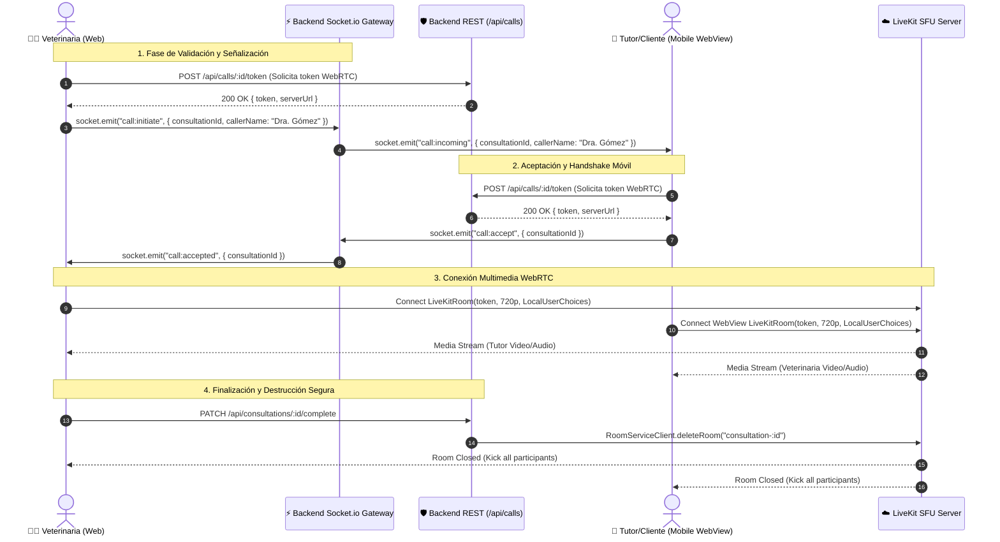

# 🎥 Guía Maestra & Checklist Preventivo de Implementación LiveKit SFU (WebRTC) — VetConnect

> **Fecha:** Septiembre 2026  
> **Alcance:** Integración de videollamadas WebRTC (Backend, Web Frontend y Mobile App)  
> **Referencia Oficial:** [LiveKit Documentation](https://docs.livekit.io/) · [LiveKit Docs MCP](https://docs.livekit.io/reference/developer-tools/docs-mcp/)  
> **Estado & Naturaleza:** **Checklist Técnico Preventivo y Normativa de Diseño Greenfield**. Al encontrarse el repositorio en fase de especificación y arquitectura pre-desarrollo (100% Greenfield desde cero), este documento unifica la auditoría preventiva, la resolución de puntos ciegos y los estándares obligatorios que los agentes de IA y desarrolladores deben seguir durante la implementación de la **Fase 4 (Telemedicina WebRTC)** en [`PLAN_ACCION_VETCONNECT.md`](../PLAN_ACCION_VETCONNECT.md) y los **Sprints 7 y 8** de [`PLAN_DE_PROYECTO_Y_GESTION.md`](PLAN_DE_PROYECTO_Y_GESTION.md).

---

## 📑 Índice General

1. [Arquitectura de Videollamadas WebRTC & Flujo de Señalización](#1-arquitectura-de-videollamadas-webrtc--flujo-de-señalización)
2. [Delimitación de Alcance (Scope MVP v2.0 vs. Post-MVP v2.2+)](#2-delimitación-de-alcance-scope-mvp-v20-vs-post-mvp-v22)
3. [Checklist Preventivo de 13 Directivas y Antipatrones](#3-checklist-preventivo-de-13-directivas-y-antipatrones)
4. [Patrones de Código de Referencia Aprobados (Golden Code)](#4-patrones-de-código-de-referencia-aprobados-golden-code)
5. [Matriz de Verificación y Criterios de Aceptación Pre-PR](#5-matriz-de-verificación-y-criterios-de-aceptación-pre-pr)

---

## 1. Arquitectura de Videollamadas WebRTC & Flujo de Señalización

VetConnect integra telemedicina sincrónica mediante **LiveKit SFU (Selective Forwarding Unit)**. La arquitectura desacopla la señalización de control (orquestada por Socket.io en el Backend) del transporte multimedia WebRTC (gestionado por LiveKit Cloud / Servidor SFU dedicado).

### 1.1 Diagrama de Señalización y Conexión WebRTC



### 1.2 Responsabilidades por Capa de Software

1. **Backend (`backend/src/modules/calls/` & `chat.gateway.ts`):**
   - **Autorización Estricta:** Validar que la consulta se encuentre en estado `ACTIVE` antes de expedir tokens o transmitir señalización.
   - **Minimización de PII:** Emisión criptográfica de JWTs efímeros con `livekit-server-sdk`, asignando identificadores opacos (`identity: user.id`) y nombres públicos (`name: user.firstName`), excluyendo estrictamente correos o teléfonos.
   - **Limpieza de Recursos:** Invocación de `RoomServiceClient.deleteRoom()` al finalizar la consulta para revocar accesos y cerrar la sala en el SFU.
2. **Web Client (`web/src/components/call/` & `CallPage.tsx`):**
   - **Experiencia Previa al Ingreso:** Captura fiel de `LocalUserChoices` en `PreJoinModal` para respetar micrófono/cámara apagados por voluntad del usuario.
   - **Renderizado Eficiente:** Montaje exclusivo de `<VideoConference />` sin duplicación de `<RoomAudioRenderer />`.
   - **Resiliencia de Red:** Handlers `onError` y `onMediaDeviceFailure` con UI de diagnóstico y reconexión.
3. **Mobile Client (`mobile/app/(app)/call/[consultationId].tsx`):**
   - **Handshake Robusto:** Protocolo reactivo de postMessage (`page:ready` (
ightarrow` `call:init`) para evitar condiciones de carrera en WebViews.
   - **Permisos de Hardware:** Solicitud transparente de micrófono y cámara en Android/iOS.

---

## 2. Delimitación de Alcance (Scope MVP v2.0 vs. Post-MVP v2.2+)

Para evitar distorsiones de alcance y garantizar la entrega oportuna en los Sprints 7 y 8, se establece la siguiente matriz de scope:

```
+-----------------------------------------------------------------------------------------------+
|                                  MATRIZ DE DELIMITACIÓN DE SCOPE                              |
+---------------------------------------------------+-------------------------------------------+
| DENTRO DEL SCOPE (MVP v2.0 - Sprints 7-8)         | FUERA DEL SCOPE (Post-MVP v2.2+)          |
+---------------------------------------------------+-------------------------------------------+
| • Generación server-side de JWT efímeros.        | • SDK Nativo React Native (@livekit/rn).  |
| • Privacidad estricta: PII scrubbing en claims.   | • LiveKit Egress (Grabación de video/S3). |
| • Puente Web-Mobile con handshake (page:ready).   | • LiveKit SIP (Integración telefonía fija)|
| • Cierre automático de salas con deleteRoom().    | • LiveKit Agents (Asistente de IA en vivo)|
| • Resolución 720p adaptativa con simulcast.       | • Transcripción automática de la llamada. |
| • Eventos completos: initiate, answer, cancel.    | • Fondos virtuales y filtros de video.    |
+---------------------------------------------------+-------------------------------------------+
```

---

## 3. Checklist Preventivo de 13 Directivas y Antipatrones

Este checklist consolida los 13 mandatos de ingeniería preventiva que deben implementarse rigurosamente en el código de videollamadas.

---

### 🛡️ DIRECTIVA-01: Corrección de Identidades en Señalización Socket
* **Principio:** El emisor de una llamada debe transmitir su propia identidad (`callerName`), no el nombre del destinatario.
* **❌ Antipatrón a Evitar:**
  ```typescript
  // BAD: Envía el nombre del destinatario al gateway
  socket.emit("call:initiate", consultationId, peerName);
  ```
* **✅ Patrón Correcto:**
  ```typescript
  // GOOD: Envía el nombre de pila propio del usuario autenticado
  socket.emit("call:initiate", { consultationId, callerName: user.firstName });
  ```
* **Criterio de Aceptación BDD (Preventivo):**
  > **Dado que** la Dra. María Gómez inicia una llamada hacia el cliente Carlos Pérez,  
  > **Cuando** se despacha el evento `call:initiate`,  
  > **Entonces** el destinatario debe recibir `call:incoming` con `callerName: "Dra. María"`, visualizando correctamente la identidad de quien llama.

---

### 🛡️ DIRECTIVA-02: Secuencia Estricta de Validación y Token Previo al Timbrado
* **Principio:** El cliente nunca debe hacer sonar el dispositivo del receptor antes de confirmar que el backend autorizó la llamada y emitió el token WebRTC.
* **❌ Antipatrón a Evitar:**
  ```typescript
  // BAD: Timbra primero, pide el token después
  socket.emit("call:initiate", ...);
  const { token } = await getCallToken(consultationId);
  ```
* **✅ Patrón Correcto:**
  ```typescript
  // GOOD: Valida y asegura el token antes de emitir señalización
  const { token, serverUrl } = await callsService.getCallToken(consultationId);
  socket.emit("call:initiate", { consultationId, callerName: user.firstName });
  ```
* **Criterio de Aceptación BDD (Preventivo):**
  > **Dado que** el servicio de tokens falla con HTTP 503 o credenciales no configuradas,  
  > **Cuando** el usuario presiona "Iniciar videollamada",  
  > **Entonces** no se emite ningún evento `call:initiate` por socket y se muestra una notificación de error local, evitando llamadas fantasma.

---

### 🛡️ DIRECTIVA-03: Consistencia Estricta de Estados (`status === 'ACTIVE'`)
* **Principio:** Solo se admiten videollamadas en consultas en estado `ACTIVE`. El gateway de sockets y el servicio REST deben aplicar idéntica validación.
* **❌ Antipatrón a Evitar:**
  ```typescript
  // BAD: Gateway admite 'PENDING', pero el servicio de llamadas exige 'ACTIVE'
  if (!['ACTIVE', 'PENDING'].includes(consultation.status)) throw new Error();
  ```
* **✅ Patrón Correcto:**
  ```typescript
  // GOOD: Validación estricta unificada
  if (consultation.status !== ConsultationStatus.ACTIVE) {
    throw new AppError('CALL_NOT_ALLOWED', 'Solo es posible iniciar videollamadas en consultas activas', 409);
  }
  ```
* **Criterio de Aceptación BDD (Preventivo):**
  > **Dado que** una consulta se encuentra en estado `WAITING` o `PENDING`,  
  > **Cuando** se intenta emitir `call:initiate` o solicitar `POST /api/calls/:id/token`,  
  > **Entonces** ambos canales rechazan la operación con código de error unificado.

---

### 🛡️ DIRECTIVA-04: Protección de PII en Tokens Criptográficos de LiveKit
* **Principio (Norma Oficial LiveKit):** *Participant identity and room name are recorded in logs and traces throughout LiveKit infrastructure. Never put PII in these fields.*
* **❌ Antipatrón a Evitar:**
  ```typescript
  // BAD: Expone email privado en los logs inmutables del SFU
  const token = new AccessToken(apiKey, apiSecret, {
    identity: user.email,
    name: user.email,
  });
  ```
* **✅ Patrón Correcto:**
  ```typescript
  // GOOD: Usa ID opaco UUID y nombre de pila público sin información de contacto
  const token = new AccessToken(apiKey, apiSecret, {
    identity: user.id,
    name: user.firstName,
    ttl: '1h',
  });
  ```
* **Criterio de Aceptación BDD (Preventivo):**
  > **Dado que** un usuario con correo `carlos.tutor@dominio.com` solicita un token,  
  > **Cuando** se decodifica el payload JWT generado,  
  > **Entonces** ninguna claim (`sub`, `name`, `metadata`) contiene correos electrónicos ni teléfonos personales.

---

### 🛡️ DIRECTIVA-05: Cero Duplicación de Renderizadores de Audio (`RoomAudioRenderer`)
* **Principio:** El componente prefab `<VideoConference />` de `@livekit/components-react` ya contiene internamente `<RoomAudioRenderer />`. No debe agregarse otro en el árbol.
* **❌ Antipatrón a Evitar:**
  ```tsx
  // BAD: Provoca acople de audio, eco y doble consumo de volumen
  <LiveKitRoom token={token} serverUrl={serverUrl}>
    <VideoConference />
    <RoomAudioRenderer />
  </LiveKitRoom>
  ```
* **✅ Patrón Correcto:**
  ```tsx
  // GOOD: VideoConference gestiona internamente la suscripción y reproducción de audio
  <LiveKitRoom token={token} serverUrl={serverUrl}>
    <VideoConference />
  </LiveKitRoom>
  ```
* **Criterio de Aceptación BDD (Preventivo):**
  > **Dado que** dos usuarios ingresan a la llamada y activan audio,  
  > **Cuando** se inspecciona el DOM de la aplicación Web,  
  > **Entonces** existe exactamente un elemento de renderizado de audio por track remoto, eliminando eco local y clipping.

---

### 🛡️ DIRECTIVA-06: Respeto Irrestricto a Preferencias en PreJoin (`LocalUserChoices`)
* **Principio:** Si el usuario elige apagar su cámara o micrófono en la pantalla previa de prueba, dicha selección debe propagarse fielmente a la sala.
* **❌ Antipatrón a Evitar:**
  ```tsx
  // BAD: Ignora las elecciones del usuario y fuerza encendido
  <PreJoin onSubmit={(choices) => {
    setPreJoined(true);
  }} />
  <LiveKitRoom video={true} audio={true} ... />
  ```
* **✅ Patrón Correcto:**
  ```tsx
  // GOOD: Almacena y transfiere LocalUserChoices a LiveKitRoom
  const [userChoices, setUserChoices] = useState<LocalUserChoices | null>(null);

  <PreJoin onSubmit={(choices) => setUserChoices(choices)} />
  {userChoices && (
    <LiveKitRoom
      video={userChoices.videoEnabled}
      audio={userChoices.audioEnabled}
      ...
    />
  )}
  ```
* **Criterio de Aceptación BDD (Preventivo):**
  > **Dado que** un usuario desmarca la cámara en `PreJoin` antes de unirse,  
  > **Cuando** la sala WebRTC se conecta,  
  > **Entonces** el track de video local se inicializa en estado silenciado (`muted / disabled`).

---

### 🛡️ DIRECTIVA-07: Protocolo de Handshake Bidireccional Web (leftrightarrow` Mobile WebView
* **Principio:** La app móvil en React Native jamás debe inyectar credenciales hasta que la página Web receptora confirme que está completamente montada e hidratada.
* **❌ Antipatrón a Evitar:**
  ```typescript
  // BAD: Inyecta JavaScript ciegamente en el evento onLoad (Race Condition)
  <WebView onLoad={() => webViewRef.current?.injectJavaScript(`init("${token}")`)} />
  ```
* **✅ Patrón Correcto:**
  ```typescript
  // GOOD: Handshake reactivo bidireccional
  // 1. Web emite 'page:ready' en useEffect:
  window.ReactNativeWebView?.postMessage(JSON.stringify({ type: 'page:ready' }));

  // 2. Mobile espera 'page:ready' para despachar el token:
  const onMessage = (event: WebViewMessageEvent) => {
    const data = JSON.parse(event.nativeEvent.data);
    if (data.type === 'page:ready') {
      webViewRef.current?.postMessage(JSON.stringify({ type: 'call:credentials', token, serverUrl }));
    }
  };
  ```
* **Criterio de Aceptación BDD (Preventivo):**
  > **Dado que** la página Web utiliza carga diferida (`React.lazy`),  
  > **Cuando** se abre el WebView en el dispositivo móvil,  
  > **Entonces** el token se transmite únicamente tras confirmarse el montaje del componente, garantizando conexión sin pantallas congeladas.

---

### 🛡️ DIRECTIVA-08: Redirección Adaptativa al Abandonar la Llamada
* **Principio:** No utilizar deep-links nativos (`vetconnect://`) en navegadores de escritorio. Detectar el entorno de ejecución antes de redirigir.
* **❌ Antipatrón a Evitar:**
  ```typescript
  // BAD: Rompe la experiencia en navegadores web de escritorio
  const handleLeave = () => {
    window.location.href = "vetconnect://call-ended";
  };
  ```
* **✅ Patrón Correcto:**
  ```typescript
  // GOOD: Detección inteligente de WebView vs Navegador Desktop
  const handleLeave = () => {
    if (window.ReactNativeWebView) {
      window.ReactNativeWebView.postMessage(JSON.stringify({ type: 'call:ended' }));
    } else {
      navigate('/dashboard/consultations');
    }
  };
  ```
* **Criterio de Aceptación BDD (Preventivo):**
  > **Dado que** un veterinario finaliza la llamada desde Chrome Desktop,  
  > **Cuando** presiona "Abandonar llamada",  
  > **Entonces** la aplicación navega hacia el panel de consultas sin disparar errores de protocolo no reconocido.

---

### 🛡️ DIRECTIVA-09: Manejo Obligatorio de Fallos WebRTC, Tokens y Hardware
* **Principio:** Todo contenedor `<LiveKitRoom>` debe capturar errores de conexión, expiración de tokens y denegación de periféricos.
* **❌ Antipatrón a Evitar:**
  ```tsx
  // BAD: Errores no capturados dejan una pantalla negra sin explicación
  <LiveKitRoom serverUrl={serverUrl} token={token}>
    <VideoConference />
  </LiveKitRoom>
  ```
* **✅ Patrón Correcto:**
  ```tsx
  // GOOD: Callbacks de captura de fallos con UI de recuperación
  <LiveKitRoom
    serverUrl={serverUrl}
    token={token}
    onError={(error) => setCallError(`Error de conexión WebRTC: ${error.message}`)}
    onMediaDeviceFailure={(err) => setCallError('No se pudo acceder a la cámara o micrófono. Verifique los permisos.')}
    onDisconnected={() => handleCallDisconnected()}
  >
    <VideoConference />
  </LiveKitRoom>
  ```
* **Criterio de Aceptación BDD (Preventivo):**
  > **Dado que** un token expiró o la red bloquea tráfico UDP,  
  > **Cuando** LiveKitRoom detecta la falla,  
  > **Entonces** se presenta un banner con diagnóstico claro y botón para reintentar o volver al chat.

---

### 🛡️ DIRECTIVA-10: Preset de Video de Alta Fidelidad Clínica (720p Adaptativo)
* **Principio:** Para inspección veterinaria visual (piel, ojos, movilidad), la resolución mínima adecuada es 720p (1280x720) con simulcast adaptativo gestionado por el SFU.
* **❌ Antipatrón a Evitar:**
  ```typescript
  // BAD: Video degradado a 360p y 400kbps ilegible clínicamente
  options={{ videoCaptureDefaults: { resolution: VideoPresets.h360, maxBitrate: 400_000 } }}
  ```
* **✅ Patrón Correcto:**
  ```typescript
  // GOOD: 720p adaptativo con simulcast multi-capa
  options={{
    videoCaptureDefaults: {
      resolution: VideoPresets.h720.resolution,
    },
    publishDefaults: {
      simulcast: true,
      videoSimulcastLayers: [
        VideoPresets.h180,
        VideoPresets.h360,
        VideoPresets.h720,
      ],
    },
  }}
  ```
* **Criterio de Aceptación BDD (Preventivo):**
  > **Dado que** la conexión de red es estable,  
  > **Cuando** el video del paciente se transmite,  
  > **Entonces** el SFU entrega resolución 720p; ante degradación de red, desciende gradualmente sin congelar la transmisión.

---

### 🛡️ DIRECTIVA-11: Simetría de Señalización con Cancelación de Llamada (`call:cancel`)
* **Principio:** Si el emisor cancela la llamada antes de que el receptor atienda, el diálogo de llamada entrante debe cerrarse de inmediato en todos los dispositivos.
* **❌ Antipatrón a Evitar:**
  ```typescript
  // BAD: Emisor cuelga pero no avisa, receptor sigue con ringtone sonando
  const cancelCall = () => { setShowCallingModal(false); };
  ```
* **✅ Patrón Correcto:**
  ```typescript
  // GOOD: Emisión y propagación de call:cancel
  const cancelCall = () => {
    socket.emit("call:cancel", { consultationId });
    setShowCallingModal(false);
  };
  ```
* **Criterio de Aceptación BDD (Preventivo):**
  > **Dado que** la llamada está sonando en el móvil del cliente,  
  > **Cuando** el veterinario presiona "Cancelar llamada",  
  > **Entonces** el evento `call:cancelled` silencia el ringtone y cierra el modal entrante en el móvil en menos de 500 ms.

---

### 🛡️ DIRECTIVA-12: Destrucción Server-Side de Salas (`deleteRoom`) al Finalizar Consulta
* **Principio:** Al marcar una consulta médica como completada en base de datos, el backend debe expulsar activamente a los participantes y destruir la sala en LiveKit.
* **❌ Antipatrón a Evitar:**
  ```typescript
  // BAD: Actualiza la base de datos pero deja la sala WebRTC abierta
  await prisma.consultation.update({ where: { id }, data: { status: 'COMPLETED' } });
  ```
* **✅ Patrón Correcto:**
  ```typescript
  // GOOD: Invalida la sala en el SFU liberando puertos y ancho de banda
  await prisma.consultation.update({ where: { id }, data: { status: 'COMPLETED' } });
  const roomService = new RoomServiceClient(livekitHost, apiKey, apiSecret);
  await roomService.deleteRoom(`consultation-${id}`).catch((err) => {
    logger.warn(`Room consultation-${id} was already inactive: ${err.message}`);
  });
  ```
* **Criterio de Aceptación BDD (Preventivo):**
  > **Dado que** una consulta pasa a estado `COMPLETED`,  
  > **Cuando** se ejecuta la mutación de cierre,  
  > **Entonces** la sala en LiveKit se destruye y ningún participante puede seguir transmitiendo medios.

---

### 🛡️ DIRECTIVA-13: Sanitización de Dependencias por Entorno (Node.js vs. Browser)
* **Principio:** `livekit-client` requiere APIs de navegador (`window`, `RTCPeerConnection`). En el Backend solo debe instalarse `livekit-server-sdk`.
* **❌ Antipatrón a Evitar:**
  ```json
  // BAD (backend/package.json):
  "dependencies": {
    "livekit-client": "^2.21.0",
    "livekit-server-sdk": "^2.17.0"
  }
  ```
* **✅ Patrón Correcto:**
  ```json
  // GOOD (backend/package.json):
  "dependencies": {
    "livekit-server-sdk": "^2.17.0"
  }

  // GOOD (web/package.json):
  "dependencies": {
    "livekit-client": "^2.21.0",
    "@livekit/components-react": "^2.6.0"
  }
  ```
* **Criterio de Aceptación BDD (Preventivo):**
  > **Dado que** se compila el backend con TypeScript,  
  > **Cuando** se analiza el grafo de dependencias de producción,  
  > **Entonces** cero librerías con dependencias DOM/WebRTC cliente están vinculadas al servidor Node.js.

---

## 4. Patrones de Código de Referencia Aprobados (Golden Code)

### 4.1 Backend: Emisión de Tokens Seguros (`backend/src/modules/calls/calls.service.ts`)

```typescript
import { AccessToken, RoomServiceClient } from 'livekit-server-sdk';
import { prisma } from '../../shared/prisma';
import { AppError } from '../../shared/errors';

export class CallsService {
  private roomService: RoomServiceClient;

  constructor() {
    this.roomService = new RoomServiceClient(
      process.env.LIVEKIT_URL!,
      process.env.LIVEKIT_API_KEY!,
      process.env.LIVEKIT_API_SECRET!
    );
  }

  async generateCallToken(consultationId: string, userId: string): Promise<{ token: string; serverUrl: string }> {
    const consultation = await prisma.consultation.findUnique({
      where: { id: consultationId },
      include: { client: true, vet: true },
    });

    if (!consultation || consultation.deletedAt) {
      throw new AppError('CONSULTATION_NOT_FOUND', 'Consulta no encontrada', 404);
    }

    if (consultation.status !== 'ACTIVE') {
      throw new AppError('CALL_NOT_ALLOWED', 'Solo es posible llamar en consultas activas', 409);
    }

    const isParticipant = consultation.clientId === userId || consultation.vetId === userId;
    if (!isParticipant) {
      throw new AppError('FORBIDDEN_CALL', 'No es participante de esta consulta', 403);
    }

    const currentUser = consultation.clientId === userId ? consultation.client : consultation.vet;
    const roomName = `consultation-${consultationId}`;

    // Directiva-04: Identificador opaco y nombre de pila SIN email ni teléfono
    const at = new AccessToken(
      process.env.LIVEKIT_API_KEY!,
      process.env.LIVEKIT_API_SECRET!,
      {
        identity: currentUser.id,
        name: currentUser.firstName,
        ttl: '1h',
      }
    );

    at.addGrant({
      roomJoin: true,
      room: roomName,
      canPublish: true,
      canSubscribe: true,
      canPublishData: true,
      roomAdmin: currentUser.role === 'VET',
    });

    return {
      token: await at.toJwt(),
      serverUrl: process.env.LIVEKIT_URL!,
    };
  }

  async closeCallRoom(consultationId: string): Promise<void> {
    const roomName = `consultation-${consultationId}`;
    try {
      await this.roomService.deleteRoom(roomName);
    } catch (error: unknown) {
      // Si la sala ya expiró o no fue creada, se registra sin interrumpir el flujo
      console.warn(`[CallsService] Sala ${roomName} no requirió eliminación forzada`);
    }
  }
}
```

---

### 4.2 Frontend Web: Sala de Videollamada (`web/src/components/call/CallRoom.tsx`)

```tsx
import React, { useState } from 'react';
import {
  LiveKitRoom,
  VideoConference,
  PreJoin,
  LocalUserChoices,
} from '@livekit/components-react';
import { VideoPresets } from 'livekit-client';
import '@livekit/components-styles';

interface CallRoomProps {
  token: string;
  serverUrl: string;
  onLeave: () => void;
}

export const CallRoom: React.FC<CallRoomProps> = ({ token, serverUrl, onLeave }) => {
  const [userChoices, setUserChoices] = useState<LocalUserChoices | null>(null);
  const [errorMessage, setErrorMessage] = useState<string | null>(null);

  if (!userChoices) {
    return (
      <div className="flex flex-col items-center justify-center min-h-[500px] p-6">
        <h2 className="text-xl font-bold text-slate-800 mb-4">Configuración de Cámara y Micrófono</h2>
        <PreJoin
          onSubmit={(choices) => setUserChoices(choices)}
          onError={(err) => setErrorMessage('Error al acceder a periféricos: ' + err.message)}
        />
        {errorMessage && (
          <p className="mt-4 text-sm text-red-600 font-medium">{errorMessage}</p>
        )}
      </div>
    );
  }

  return (
    <div className="relative w-full h-full min-h-[600px] bg-slate-950 rounded-2xl overflow-hidden shadow-2xl">
      <LiveKitRoom
        token={token}
        serverUrl={serverUrl}
        connect={true}
        video={userChoices.videoEnabled}
        audio={userChoices.audioEnabled}
        options={{
          videoCaptureDefaults: {
            resolution: VideoPresets.h720.resolution,
          },
          publishDefaults: {
            simulcast: true,
          },
        }}
        onError={(err) => setErrorMessage('Fallo en la conexión de llamada: ' + err.message)}
        onMediaDeviceFailure={() => setErrorMessage('Periférico de medios desconectado o inaccesible')}
        onDisconnected={onLeave}
        data-lk-theme="default"
      >
        {/* Directiva-05: Solo VideoConference, CERO RoomAudioRenderer duplicado */}
        <VideoConference />
      </LiveKitRoom>

      {errorMessage && (
        <div className="absolute top-4 left-1/2 -translate-x-1/2 bg-red-600/90 text-white px-4 py-2 rounded-lg text-sm font-semibold shadow-lg">
          {errorMessage}
        </div>
      )}
    </div>
  );
};
```

---

## 5. Matriz de Verificación y Criterios de Aceptación Pre-PR

Antes de fusionar código de videollamadas, los agentes deben validar este checklist:

| ID | Verificación de Calidad | Comando / Mecanismo | Estado Esperado |
|:---|:---|:---|:---:|
| **CHK-01** | Sin PII en claims de token | `npm test -w backend -- -t "calls.token"` | ✅ PII Scrubbing verificado |
| **CHK-02** | Cierre con `deleteRoom` al completar | `npm test -w backend -- -t "consultations.complete"` | ✅ Invocación probada |
| **CHK-03** | Presencia única de `livekit-server-sdk` | `npm ls livekit-client -w backend` | ✅ Cero dependencias client |
| **CHK-04** | Cero `<RoomAudioRenderer>` extra | `grep -rn "RoomAudioRenderer" web/src/` | ✅ 0 ocurrencias redundantes |
| **CHK-05** | Handshake bidireccional WebView | `npm test -w mobile -- -t "call.handshake"` | ✅ Handshake `page:ready` |
| **CHK-06** | Typecheck estricto sin `any` | `npm run typecheck` | ✅ 0 errores de tipado |

---
*VetConnect Engineering Standard — Documento Maestro de Implementación LiveKit SFU 2026.*
