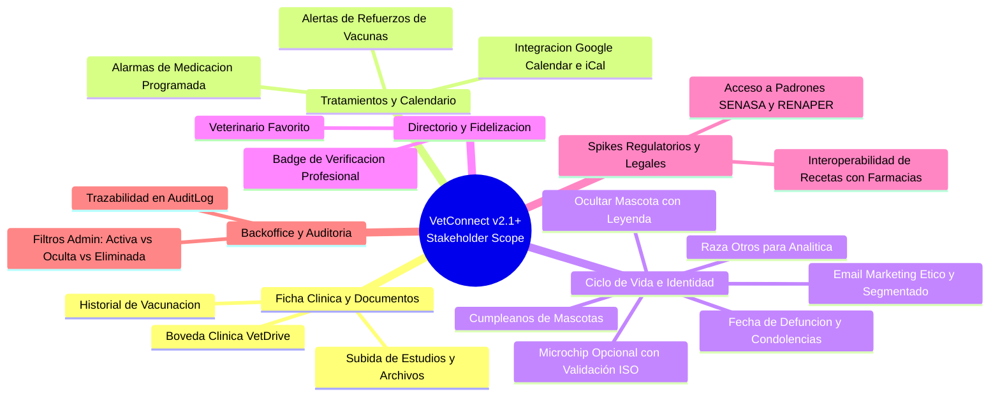

# 📋 MINUTA DE REUNIÓN & BACKLOG DE REQUERIMIENTOS — STAKEHOLDER INTERNO

> 🧊 **DOCUMENTO DE ARCHIVO HISTÓRICO / BASELINE INICIAL (READ-ONLY)**  
> *Este documento representa la línea base conceptual aprobada para el Kickoff del 1 de octubre de 2026. A partir de esa fecha, toda modificación o evolución técnica se gobierna exclusivamente en las 5 Fuentes Vivas de Ejecución (Tier 1: `docs/TECH_REFERENCE.md`, `docs/DECISIONS.md`, `PLAN_ACCION_VETCONNECT.md`, `docs/PLAN_DE_PROYECTO_Y_GESTION.md` y `AGENTS.md`). No editar este archivo de forma activa durante los sprints.*

---

## Proyecto: VetConnect v2.0+
**Document ID:** `MEETING-STAKEHOLDER-2026-09`  
**Fecha de Emisión:** 14 de Septiembre de 2026  
**Participantes:** Stakeholder Interno de Producto/Negocio, Staff Architect & Tech Lead  
**Estado:** `DOCUMENTED & CLASSIFIED (READY FOR GROOMING)`  
**Clasificación:** Requerimientos Funcionales, Regulatorios & Roadmap Técnico  

---

## 1. Resumen de la Reunión & Contexto

En la presente sesión con el stakeholder interno se identificaron y recopilaron necesidades prioritarias de evolución para la plataforma **VetConnect**. Los requerimientos apuntan a robustecer la experiencia clínica y de fidelización del tutor, optimizar el cumplimiento regulatorio veterinario en Argentina, ofrecer herramientas avanzadas de gestión clínica (documentos y calendario) y habilitar una estrategia empática y ética en la gestión del ciclo de vida y duelo de las mascotas.

---

## 2. Apuntes Crudos de la Reunión (Transcripción Original)

Los siguientes puntos representan la captura textual y directa de las notas tomadas durante el intercambio:

1. **Subir historial de vacunación** (con alarma para las fechas de vacunación).
2. **Agregar opción de alarmas / calendario personalizable para el usuario** (medicación programada para la mascota).
3. **Agregar en raza "otros"** (más que nada para sacar datos y analizarlos).
4. **Si no tiene microchip se puede registrar de todas formas, este dato es opcional**.
5. **Agregar "veterinario favorito"**.
6. **Subir estudios + adjuntar archivo**.
7. **Un apartado estilo "Drive" para las fichas médicas**.
8. **Que los veterinarios tengan verificación y el registro en sus perfiles**.
9. **Pedir base de datos de veterinarios en Argentina, RENAPER** para gestionar mejor los registros de veterinarios matriculados o cualquier otro registro oficial que avale su autenticidad.
10. **Averiguar si la receta tiene que estar conectada con una entidad como con las recetas de las personas**, es decir, que a los farmacéuticos les aparezca en su base de datos sin necesidad de ir con la receta en mano.
11. **Función de ocultar una mascota (no eliminar)** y que esta misma esté prevista para que las notificaciones ya no lleguen porque el usuario puede tener su mascota fallecida, principalmente porque nosotros dejemos de mandar recordatorios de vacunación (aclarar en una leyenda breve) y usar el correo del usuario para mandar alguna oferta de alimentos y no dañar el ánimo del usuario al recordar a su mascota perdida o fallecida, ya que podemos posteriormente vincularnos con marcas a futuro para promoción de algún producto.
12. **Agregar fecha de fallecimiento**, para mandar email por ejemplo de condolencias, además para gestión administrativa y ya no mandar mails o recordatorios.
13. **Cumpleaños de perros** (y mascotas).
14. **El admin puede ver si el usuario eliminó una mascota o la ocultó**.
15. **El calendario se vinculará con apps externas como Google Calendar**.

---

## 3. Desglose Funcional por Épicas & Dominios de Negocio

A continuación, los 15 puntos se clasifican y estructuran en 6 Épicas de producto con su respectiva justificación y alcance:



### Épica 1: Ficha Clínica Digital & Bóveda Documental ("VetDrive")
* **Items cubiertos:** (1), (6), (7).
* **Descripción:** 
  - **VetDrive Centralizado:** Creación de una sección dentro del perfil de la mascota con estética y usabilidad tipo Google Drive / Dropbox, estructurada en carpetas: `Estudios y Laboratorios`, `Imágenes (Rayos X, Ecografías)`, `Recetas y Prescripciones`, `Certificados Sanitarios`.
  - **Subida y Adjuntos:** Capacidad de subir archivos multimedia (PDF, DICOM, JPG, PNG) tanto desde la app móvil (cámara/galería) como desde el panel web del veterinario o tutor, aplicando validación de Magic Bytes y almacenamiento seguro en S3/local.
  - **Historial de Inmunizaciones:** Cuadernillo digital de vacunación que registre: tipo de vacuna (Antirrábica, Séxtuple, Triple Felina, etc.), fecha de aplicación, lote, profesional actuante y fecha del próximo refuerzo.

---

### Épica 2: Tratamientos, Alarmas & Calendario Interoperable
* **Items cubiertos:** (1), (2), (15).
* **Descripción:**
  - **Calendario Clínico Personalizable:** Visor mensual/semanal donde el tutor visualiza eventos médicos: consultas agendadas, dosis de medicamentos activos y fechas límites de vacunas.
  - **Recordatorios de Medicación Programada:** Configuración de alarmas periódicas (ej. cada 8 horas por 7 días) para administración de antibióticos, antiparasitarios o analgésicos, con notificaciones Push locales y remotas.
  - **Sincronización Externa (Google Calendar / iCal):** Generación de enlaces de suscripción WebCal / `.ics` y deep-links para exportar citas y alarmas a Google Calendar, Outlook y Apple Calendar con un solo tap.

---

### Épica 3: Identidad Animal, Analítica de Razas & Gestión del Ciclo de Vida
* **Items cubiertos:** (3), (4), (11), (12), (13).
* **Descripción:**
  - **Validación Estricta de Microchip (Opcional en Alta):** En el formulario de alta (`createPetSchema`), si el tutor provee el número de microchip, se valida estrictamente el formato estándar ISO 11784/11785 (15 dígitos numéricos) y unicidad en base de datos. Si el animal no posee microchip, el campo es opcional y se almacena como `null`, permitiendo completar el registro sin bloqueos.
  - **Raza "Otros / Mestizo":** Incorporación de la opción estándar `"Otros"` con un subcampo libre o selector descriptivo, estructurado para capturar métricas de población animal y posterior análisis de datos biométricos.
  - **Cumpleaños de Perros / Mascotas:** Cálculo de fecha de aniversario a partir de `birthDate`, activando push notifications conmemorativas y correos de saludo institucional.
  - **Mascota Oculta (No Eliminada) con Leyenda Explicativa:** 
    - El tutor puede ocultar a una mascota de su vista principal sin destruirla de la base de datos (preservando la historia clínica legal).
    - El sistema muestra una leyenda breve explicativa informando que se suspenden todas las alertas de salud, turnos y vacunación.
    - Se previene el impacto emocional negativo de seguir recibiendo avisos cuando la mascota falleció o se encuentra extraviada.
  - **Fecha de Fallecimiento & Gestión de Condolencias:** 
    - Registro de `deathDate` y `isDeceased = true`.
    - Envío automático de un correo institucional de condolencias y contención empática.
    - Exclusión automática e inmediata de cualquier lista de correo transaccional clínica o recordatorio.
  - **Marketing Ético y Alianzas de Alimentos:** 
    - Habilitación de una etiqueta de segmentación en el CRM para reorientar al tutor hacia comunicaciones comerciales no invasivas (ej. promociones generales de alimentos o productos) transcurrido un período de prudencia, facilitando acuerdos comerciales con marcas aliadas sin dañar la sensibilidad del usuario.

---

### Épica 4: Directorio Veterinario, Verificación & Fidelización
* **Items cubiertos:** (5), (8).
* **Descripción:**
  - **Veterinario Favorito:** Funcionalidad para que el tutor guarde profesionales de confianza, con acceso directo a su disponibilidad, solicitud de consulta prioritaria y filtrado en el directorio.
  - **Perfil Verificado con Registro Oficial:** Sello visual distintivo (*Verified Badge*) en el perfil público del veterinario y en la cabecera de la videoconsulta/chat, exponiendo número de matrícula nacional/provincial, colegio emisor y fecha de validación.

---

### Épica 5: Backoffice, Gestión Administrativa & Auditoría Forense
* **Items cubiertos:** (14).
* **Descripción:**
  - **Visibilidad Administrativa Diferenciada:** En el Panel Web Admin (`WebAdmin`), la grilla de mascotas debe mostrar con claridad el estado de cada animal mediante badges de estado:
    - 🟢 `Activa` (Visible para el usuario)
    - 🟡 `Oculta / Archivada` (Ocultada voluntariamente por el tutor)
    - ⚫ `Fallecida` (Con fecha de defunción registrada)
    - 🔴 `Eliminada` (`deletedAt != null` vía Soft-Delete)
  - **Trazabilidad:** Cada cambio de estado genera un evento inmutable en `AuditLog`.

---

### Épica 6: Spikes de Investigación Regulatoria & Legal (Argentina)
* **Items cubiertos:** (9), (10).
* **Descripción:**
  - **Spike 1: Padrón Oficial de Veterinarios (SENASA / RENAPER / Colegios):**
    - *Objetivo:* Gestionar reuniones institucionales y evaluar viabilidad de acuerdos con SENASA, Federación Veterinaria Argentina (FeVA), Colegios Provinciales (ej. CVPBA, CPMV) y RENAPER (validación DNI biométrica).
    - *Entregable:* Documento de factibilidad técnica con especificación de APIs o procesos batch de validación de matrículas activas/suspendidas.
  - **Spike 2: Regulación de Receta Digital Veterinaria y Farmacias:**
    - *Objetivo:* Investigar la aplicabilidad de la Ley Nacional N° 27.553 (Recetas Electrónicas o Digitales) al ámbito de medicamentos de uso veterinario y la obligatoriedad de interconexión con repositorios de farmacias o si el código QR verificable en la nube es legalmente suficiente.
    - *Entregable:* Dictamen técnico-legal sobre la necesidad de integración con farmacias externas o cámaras farmacéuticas veterinarias.

---

## 4. Matriz de Trazabilidad Técnica e Impacto de Arquitectura

| Requerimiento | Módulos Afectados | Modelo de Datos (Prisma) | Frontend Web / Admin | Mobile App | Servicios Externos / Async |
|---|---|---|---|---|---|
| **Historial de Vacunación & Alarmas** | `pets`, `notifications` | Modelo `VaccinationRecord` vinculado a `Pet` | Pestaña "Vacunas" en Ficha Clínica | Visualización de carnet y recordatorios push | Scheduler de notificaciones previas (cron / BullMQ) |
| **Calendario & Alarmas Medicación** | `pets`, `notifications` | Modelo `MedicationSchedule` vinculado a `Pet` | Calendario interactivo en Dashboard | Alarma local con sonido y push notification | Motor de eventos temporales |
| **Sincronización Google Calendar** | `pets`, `consultations` | Token o endpoint iCal (`/api/pets/:id/calendar.ics`) | Botón "Añadir a Google Calendar" | Deep-link a app de calendario del SO | Google Calendar URL generator / iCalendar RFC 5545 |
| **Microchip Opcional (ISO 15)** | `pets` | `microchip String? @unique` (nullable en base de datos, 15 dígitos numéricos si se provee) | Validación de 15 dígitos en formulario de alta si se ingresa | Validación en formulario con escáner de código de barras opcional | - |
| **Raza "Otros"** | `pets` | Enum o string con flag `isOtherBreed Boolean` | Dropdown con opción "Otros" y campo de texto | Dropdown con opción "Otros" | Pipeline de Analytics / BI |
| **Veterinario Favorito** | `users` | Modelo `FavoriteVet` (ya existente en Prisma) | Toggle de estrella en card de veterinario | Botón de favorito y filtro "Mis Favoritos" | - |
| **Estudios & VetDrive** | `media`, `pets` | Modelo `PetDocument` con categoría y URL S3 | Gestor de archivos estilo Drive con carpetas y preview | Visor de documentos y subida desde cámara | AWS S3 / Local Storage con Magic Bytes |
| **Badge de Verificación Vet** | `users`, `auth` | `vetStatus` (`APPROVED`), `verifiedAt DateTime?` | Insignia azul/verde en perfil público y chat | Badge "Verificado" en tarjeta de profesional | - |
| **Ocultar Mascota & Leyenda** | `pets`, `notifications` | `isHidden Boolean @default(false)` | Switch "Ocultar Mascota" con modal informativo | Switch en ajustes de mascota con leyenda | Supresión en motor de notificaciones |
| **Fecha Fallecimiento & Condolencias** | `pets`, `notifications` | `deathDate DateTime?`, `isDeceased Boolean` (en schema) | Formulario de reporte de fallecimiento con aviso | Registro de fecha y confirmación | Mailer: Template de condolencias institucional |
| **Cumpleaños de Perros** | `pets`, `notifications` | `birthDate DateTime?` (ya en schema) | Indicador visual de próximo cumpleaños | Push conmemorativo en el día del cumpleaños | Cron diario de cumpleaños |
| **Admin: Eliminada vs Oculta** | `users`, `pets`, `audit` | Query con `deletedAt` e `isHidden` | Tabla Admin con badges diferenciados por estado | N/A | Auditoría en `AuditLog` |

---

## 5. Matriz de Priorización MoSCoW para Próximos Sprints

```
+---------------------------------------------------------------------------------------------------+
|                                     PRIORIZACIÓN MoSCoW                                           |
+------------------------------------+--------------------------------------------------------------+
| Categoría                          | Requerimientos Asignados                                     |
+------------------------------------+--------------------------------------------------------------+
| 🟢 MUST HAVE (Obligatorio v2.1)    | - Validación estándar de microchip de 15 dígitos (opcional en registro de mascota).              |
|                                    | - Raza "Otros" en formularios para recolección de datos.     |
|                                    | - Ocultar mascota (soft-hide) con cese de notificaciones.    |
|                                    | - Registro de fecha de fallecimiento y mail de condolencias. |
|                                    | - Visibilidad en Admin de mascotas eliminadas vs ocultas.    |
|                                    | - Badge de verificación y registro en perfil del veterinario.|
|                                    | - Superficie de UI para "Veterinario Favorito".              |
+------------------------------------+--------------------------------------------------------------+
| 🟡 SHOULD HAVE (Importante v2.2)   | - Subida de estudios clínicos y visor "VetDrive" básico.     |
|                                    | - Historial de vacunas con alarmas de vencimiento.           |
|                                    | - Alertas de cumpleaños de mascotas.                         |
|                                    | - Gestión de consultas regulatorias (SENASA / RENAPER).     |
+------------------------------------+--------------------------------------------------------------+
| 🔵 COULD HAVE (Deseable v2.3)      | - Calendario personalizable de medicaciones horarias.        |
|                                    | - Integración y exportación a Google Calendar / iCal.        |
|                                    | - Segmentación de marketing y alianzas de alimentos para CRM.|
+------------------------------------+--------------------------------------------------------------+
| ⚪ WON'T HAVE (Para Fase 3 / PoC)   | - Conexión directa a red centralizada de farmacias humanas   |
|                                    |   (requiere dictamen previo de Spike legal y viabilidad).    |
+------------------------------------+--------------------------------------------------------------+
```

---

## 6. Historias de Usuario Principales (User Stories & Criterios de Aceptación)

### US-01: Microchip con Validación Estándar en el Alta (Opcional)
* **Como:** Tutor de mascota.  
* **Quiero:** Poder registrar a mi mascota indicando su microchip si lo tiene, o completar el registro si aún no cuenta con uno.  
* **Para:** Garantizar la identificación de mi mascota cuando disponga de microchip, sin que la falta de este me impida acceder a la atención veterinaria.  
* **Criterio de Aceptación (Gherkin):**
  ```gherkin
  Escenario: Registro exitoso sin microchip
    Dado que el usuario completa el formulario de registro de mascota
    Cuando deja el campo "microchip" vacío o nulo
    Entonces el backend crea la mascota exitosamente con `microchip = null`.

  Escenario: Intento de registro con formato de microchip inválido
    Dado que el usuario completa el formulario de registro de mascota
    Cuando ingresa un microchip con formato distinto a 15 dígitos numéricos
    Entonces el backend rechaza la petición con código 400 y mensaje "El microchip debe contener exactamente 15 dígitos numéricos estándar ISO".
  ```

### US-02: Ocultamiento Empático de Mascota
* **Como:** Tutor que ha sufrido la pérdida o defunción de su mascota.  
* **Quiero:** Ocultar su perfil de mi vista principal sin que se borre su historial.  
* **Para:** Dejar de recibir notificaciones dolorosas (vacunas, recordatorios) y preservar la historia clínica.  
* **Criterio de Aceptación (Gherkin):**
  ```gherkin
  Escenario: Ocultar mascota activa
    Dado que el usuario selecciona "Ocultar mascota"
    Cuando confirma la acción tras leer la leyenda informativa
    Entonces la mascota pasa a estado `isHidden = true`
    Y el scheduler de notificaciones cancela inmediatamente cualquier recordatorio pendiente
    Y la mascota ya no aparece en el listado activo del usuario
    Y los registros médicos permanecen inmutables para fines de auditoría
  ```

### US-03: Bóveda Clínica "VetDrive"
* **Como:** Tutor o Médico Veterinario.  
* **Quiero:** Acceder a un repositorio categorizado de archivos médicos de la mascota.  
* **Para:** Consultar análisis de sangre, radiografías y recetas previas en cualquier momento sin depender del historial de un chat individual.  
* **Criterio de Aceptación (Gherkin):**
  ```gherkin
  Escenario: Carga de estudio complementario
    Dado que un veterinario o tutor adjunta un archivo PDF o imagen en "Estudios"
    Cuando el backend valida los Magic Bytes permitidos (PDF, PNG, JPG)
    Entonces el archivo se almacena cifrado en S3/local y se registra en `pet_documents`
    Y aparece disponible en la carpeta correspondiente del VetDrive de la mascota
  ```

---

## 7. Próximos Pasos Operativos

1. **Equipo Legal & PM (Lara Bouso):** Iniciar consultas con asesores legales sobre el marco de Receta Digital Veterinaria en Argentina y canales formales con SENASA / Colegios Veterinarios.
2. **Arquitectura & Backend (Tobias Vera):** Diseñar las migraciones Prisma para `VaccinationRecord`, `PetDocument` y actualización de validadores en `createPetSchema` (`microchip` opcional con formato 15 dígitos).
3. **Diseño de Producto & Frontend (Damian Orellana, Ezequiel Charca, Juan Mendoza):** Diseñar los mockups y flujos para la vista "VetDrive", la leyenda de "Ocultar mascota" y el badge de "Veterinario Verificado".
