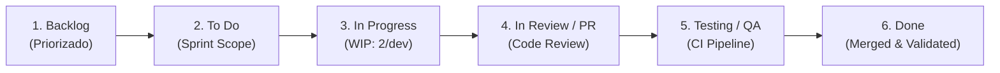
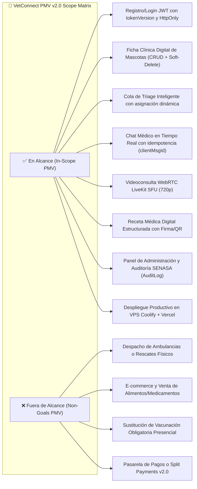
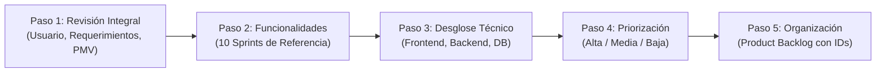

# 📋 Plan de Proyecto & Gestión de Desarrollo — VetConnect

> **Documento Maestro de Planificación, Gestión de Proyecto & Arquitectura Agéntica**  
> **Alineado con:** Trabajo Práctico: Plan de Proyecto, Estándares PMI, ISO 9241-210 (DCU), ISO 9241-11 (Usabilidad), WCAG 2.1 AA y Scrumban Framework.  
> **Proyecto:** VetConnect v2.0 — Plataforma Integral de Telemedicina Veterinaria & Gestión Clínica  
> **Equipo de Desarrollo:** Tobias Vera, Damian Orellana, Juan Mendoza, Ezequiel Charca *(Sponsor/Legal: Lara)*  
> **Fecha de Emisión:** Septiembre 2026 | **Estado:** `APPROVED (ACTIVE MASTER PROJECT PLAN)`

---

## 📑 Índice General

1. [Descripción General del Proyecto](#1-descripción-general-del-proyecto)
   - 1.1 [Nombre del Proyecto](#11-nombre-del-proyecto)
   - 1.2 [Descripción Breve de la Propuesta](#12-descripción-breve-de-la-propuesta)
   - 1.3 [Problema u Oportunidad Identificada](#13-problema-u-oportunidad-identificada)
   - 1.4 [Objetivos Generales y Específicos](#14-objetivos-generales-y-específicos)
2. [Usuario y Necesidades](#2-usuario-y-necesidades)
   - 2.1 [Usuario Objetivo](#21-usuario-objetivo)
   - 2.2 [Principales Necesidades Detectadas](#22-principales-necesidades-detectadas)
   - 2.3 [Decisiones Relevantes Surgidas Durante el Análisis](#23-decisiones-relevantes-surgidas-durante-el-análisis)
   - 2.4 [Análisis & Mapa de Stakeholders (Poder / Influencia vs. Interés)](#24-análisis--mapa-de-stakeholders-poder--influencia-vs-interés)
3. [Metodología de Trabajo](#3-metodología-de-trabajo)
   - 3.1 [Metodología Seleccionada: Scrumban](#31-metodología-seleccionada-scrumban)
   - 3.2 [Justificación de la Elección Realizada por el Equipo](#32-justificación-de-la-elección-realizada-por-el-equipo)
   - 3.3 [Flujo de Trabajo en Tablero Kanban, Límites WIP & Gestión del Cambio](#33-flujo-de-trabajo-en-tablero-kanban-límites-wip--gestión-del-cambio)
   - 3.4 [Eventos y Ceremonias Ágiles](#34-eventos-y-ceremonias-ágiles)
4. [Producto Mínimo Viable (PMV)](#4-producto-mínimo-viable-pmv)
   - 4.1 [Definición del PMV](#41-definición-del-pmv)
   - 4.2 [Alcance Previsto para la Primera Versión Funcional (In-Scope vs. Non-Goals)](#42-alcance-previsto-para-la-primera-versión-funcional-in-scope-vs-non-goals)
   - 4.3 [Generación de Valor Agregado & Criterios de Aceptación](#43-generación-de-valor-agregado--criterios-de-aceptación)
5. [Requerimientos del Sistema](#5-requerimientos-del-sistema)
   - 5.1 [Requerimientos Funcionales Principales](#51-requerimientos-funcionales-principales)
   - 5.2 [Funcionalidades Prioritarias del Sistema](#52-funcionalidades-prioritarias-del-sistema)
   - 5.3 [Requerimientos No Funcionales Críticos (RNF)](#53-requerimientos-no-funcionales-críticos-rnf)
6. [Organización del Equipo](#6-organización-del-equipo)
   - 6.1 [Integrantes del Equipo](#61-integrantes-del-equipo)
   - 6.2 [Roles Previstos & Responsabilidades](#62-roles-previstos--responsabilidades)
   - 6.3 [Estrategia de Rotación de Roles](#63-estrategia-de-rotación-de-roles)
7. [Planificación del Desarrollo](#7-planificación-del-desarrollo)
   - 7.1 [Construcción Metodológica del Product Backlog (Actividad 17 - 5 Pasos)](#71-construcción-metodológica-del-product-backlog-actividad-17---5-pasos)
   - 7.2 [Matriz Maestra del Product Backlog (40 Tareas PB-01 a PB-40)](#72-matriz-maestra-del-product-backlog-40-tareas-pb-01-a-pb-40)
   - 7.3 [Planificación de Sprints (Actividad 18 - Sprints 1 al 10)](#73-planificación-de-sprints-actividad-18---sprints-1-al-10)
   - 7.4 [Sistema de Seguimiento, Control y KPIs (Actividad 21 - 7 Indicadores)](#74-sistema-de-seguimiento-control-y-kpis-actividad-21---7-indicadores)
8. [Organización Formal](#8-organización-formal)
   - 8.1 [Matriz RACI](#81-matriz-raci)
   - 8.2 [Cronograma de Ejecución del Proyecto & Diagrama de Gantt](#82-cronograma-de-ejecución-del-proyecto--diagrama-de-gantt)
9. [Diseño Centrado en el Usuario (DCU), Usabilidad & Accesibilidad](#9-diseño-centrado-en-el-usuario-dcu-usabilidad--accesibilidad)
   - 9.1 [Diseño Centrado en el Usuario (ISO 9241-210) & Design Thinking](#91-diseño-centrado-en-el-usuario-iso-9241-210--design-thinking)
   - 9.2 [Usabilidad (ISO 9241-11) y Accesibilidad (WCAG 2.1 AA)](#92-usabilidad-iso-9241-11-y-accesibilidad-wcag-21-aa)
   - 9.3 [Sistema de Diseño Visual (Regla 60-30-10 & Gestalt)](#93-sistema-de-diseño-visual-regla-60-30-10--gestalt)
10. [Arquitectura de Software & Matriz de Selección Tecnológica](#10-arquitectura-de-software--matriz-de-selección-tecnológica)
   - 10.1 [Articulación Metodológica (Matriz de 12 Preguntas de Planificación)](#101-articulación-metodológica-matriz-de-12-preguntas-de-planificación)
   - 10.2 [Matriz de Selección Tecnológica Justificada](#102-matriz-de-selección-tecnológica-justificada)

---

## 1. Descripción General del Proyecto

### 1.1 Nombre del Proyecto
**VetConnect** — Plataforma Integral de Telemedicina Veterinaria & Gestión Clínica de Alta Disponibilidad.

### 1.2 Descripción Breve de la Propuesta
VetConnect es una solución telemédica multiplataforma (Web SPA y Mobile App nativa) diseñada para conectar en tiempo real a tutores de animales de compañía con médicos veterinarios matriculados y verificados. La plataforma digitaliza y optimiza la atención clínica primaria mediante triage automatizado de urgencias, salas de videoconsulta de alta definición y baja latencia, chat interactivo con intercambio seguro de archivos médicos y emisión de recetas digitales inmutables con validación por código QR.

### 1.3 Problema u Oportunidad Identificada
- **Problema:** En América Latina, más del 70% de los hogares conviven con animales de compañía, pero la atención veterinaria fuera del horario comercial habitual se encuentra colapsada. Los tutores sufren largas esperas en guardias presenciales para consultas no críticas o enfrentan barreras geográficas y de movilidad para trasladar animales convalecientes. Esta situación empuja frecuentemente a la automedicación de mascotas o al uso precario de canales de mensajería informal (WhatsApp), donde no existe resguardo de la historia clínica, se pierden estudios y los profesionales ejercen sin respaldo legal.
- **Oportunidad:** Desarrollar el primer ecosistema tecnológico formal, regulado y auditable de telemedicina veterinaria que:
  1. Clasifique y reduzca el tiempo de respuesta inicial en urgencias a menos de 5 minutos.
  2. Valide la matrícula profesional ante organismos oficiales (SENASA / Colegios Veterinarios).
  3. Garantice la inmutabilidad y confidencialidad de los historiales clínicos bajo la Ley N° 25.326 de Protección de Datos Personales.

### 1.4 Objetivos Generales y Específicos
- **Objetivo General:**  
  Diseñar, desarrollar y desplegar una plataforma omnicanal (Web React 18.3.1 LTS y Mobile Expo SDK 54) con backend modular escalable (Node.js, Express 5, PostgreSQL y Prisma ORM 6) que brinde atención veterinaria primaria a distancia, resguarde la seguridad del paciente y garantice trazabilidad legal e inmutabilidad clínica.
- **Objetivos Específicos:**
  1. Reducir el tiempo $P_{95}$ de espera en la cola de triage médico a menos de 5 minutos.
  2. Implementar canales de comunicación sincrónicos de grado médico: mensajería en tiempo real con latencia menor a 80 ms y videollamadas WebRTC (720p) con conexión inicial menor a 1500 ms.
  3. Digitalizar el 100% de las historias clínicas y recetas emitidas, garantizando inmutabilidad mediante firmas digitales, códigos QR y almacenamiento con soft-delete.
  4. Cumplir estrictamente con el marco legal sanitario (validación documental de matrícula SENASA) y de protección de datos (anonimización de PII según Ley N° 25.326).

---

## 2. Usuario y Necesidades

### 2.1 Usuario Objetivo
VetConnect atiende a tres arquetipos de usuario diferenciados con roles de acceso específicos:

```
+-----------------------------------------------------------------------------------------------+
|                                    PERFILES DE USUARIOS OBJETIVO                              |
+-------------------+-----------------------------------+---------------------------------------+
| Rol / Arquetipo   | Descripción y Perfil Demográfico  | Canal de Interacción Primario         |
+-------------------+-----------------------------------+---------------------------------------+
| Tutor de Mascota  | Personas o familias con animales  | App Móvil (Expo SDK 54) y Web SPA     |
| (CLIENT)          | de compañía (perros, gatos, etc.) | Flujos rápidos de solicitud y triage. |
+-------------------+-----------------------------------+---------------------------------------+
| Médico Veterinario| Profesionales de la salud animal  | Portal Web Pro (React 18.3.1 LTS/Vite)|
| (VET)             | matriculados y en ejercicio legal | Consola clínica, videoconsulta y receta|
+-------------------+-----------------------------------+---------------------------------------+
| Administrador     | Personal de gestión, auditoría    | Dashboard /admin Web Pro              |
| (ADMIN)           | clínica y fiscalización SENASA    | Aprobación de matrículas y AuditLogs. |
+-------------------+-----------------------------------+---------------------------------------+
```

### 2.2 Principales Necesidades Detectadas
A partir del trabajo de campo y entrevistas cualitativas con tutores y veterinarios, se construyó el **Mapa de Empatía del Tutor de Mascota**:
- **¿Qué siente y piensa?:** Angustia y preocupación cuando su mascota muestra síntomas anómalos; temor a demorarse en actuar; frustración por la falta de orientación profesional inmediata.
- **¿Qué ve?:** Clínicas veterinarias con salas de espera llenas y estrés para el animal; información médica dispersa, desactualizada o contradictoria en redes sociales.
- **¿Qué oye?:** Recomendaciones caseras de conocidos que conllevan peligro de toxicidad o retraso en diagnósticos reales.
- **¿Qué hace y dice?:** Busca soluciones inmediatas desde su teléfono inteligente; exige diagnósticos claros, prescripciones formales y seguimiento profesional.
- **Frustraciones principales:** Traslados innecesarios en situaciones no urgentes; extravío recurrente de carnets de vacunación en papel; falta de atención veterinaria en horarios nocturnos.
- **Necesidades clave:** Acceso ágil a un veterinario calificado en menos de 5 minutos, historial médico digital accesible 24/7 y recetas electrónicas verificables en farmacias.

### 2.3 Decisiones Relevantes Surgidas Durante el Análisis
Durante las sesiones de análisis técnico y funcional, se adoptaron las siguientes decisiones de diseño fundamentales:
1. **Conservación de Datos Clínicos e Historial Inmutable (Ley 25.326):** Se determinó la prohibición absoluta de borrado físico en base de datos. Se utiliza *Soft-Delete* (`deletedAt = new Date()`) y disociación de PII para preservar la validez probatoria de la historia médica sin violar el derecho a la privacidad.
2. **Validación de Matrículas SENASA:** Los profesionales veterinarios que se registran quedan en estado `vetStatus: PENDING` y no pueden atender pacientes ni emitir recetas hasta que un administrador valide manualmente su matrícula habilitante en el panel oficial.
3. **Videollamadas Ligeras sin Dependencias Externas:** Adopción de LiveKit WebRTC en modo SFU (720p adaptativo) directamente integrado en el navegador y en la app móvil (vía WebView optimizada con handshake bidireccional), evitando obligar a los tutores a instalar apps de terceros como Zoom o Meet.
4. **Idempotencia en Mensajería Crítica:** Incorporación del encabezado y campo `clientMsgId` en cada mensaje de chat. Esto garantiza que ante reconexiones de red móvil 4G/WiFi no se dupliquen mensajes ni se generen errores 500 en el servidor.
5. **Identidad Animal & Inclusión de Microchip:** Incorporación de campo Microchip con validador de algoritmo estándar ISO de 15 dígitos, pero con carácter *opcional* durante el alta para no excluir animales rescatados o mestizos.

### 2.4 Análisis & Mapa de Stakeholders (Poder / Influencia vs. Interés)

```
+-----------------------------------------------------------------------------------------------+
|                                MATRIZ DE ANÁLISIS DE STAKEHOLDERS                             |
+-------------------+---------------------------------------+-----------------------------------+
| PODER / INFLUENCIA| BAJO INTERÉS                          | ALTO INTERÉS                      |
+-------------------+---------------------------------------+-----------------------------------+
| ALTO PODER        | 🟡 MANTENER SATISFECHOS               | 🔴 GESTIONAR ATENTAMENTE          |
|                   | • Organismos Reguladores (SENASA/DNPDP)| • Stakeholders Internos / Sponsor  |
|                   | • Proveedores Cloud (Supabase/LiveKit)| • Tech Lead / Equipo de Desarrollo|
+-------------------+---------------------------------------+-----------------------------------+
| BAJO PODER        | ⚪ MONITOREAR (MÍNIMO ESFUERZO)       | 🔵 MANTENER INFORMADOS            |
|                   | • Proveedores de Hosting secundario   | • Médicos Veterinarios (VETs)     |
|                   | • Auditores externos ocasionales      | • Tutores de Mascotas (CLIENTs)   |
|                   |                                       | • Red de Clínicas Asociadas       |
+-------------------+---------------------------------------+-----------------------------------+
```

---

## 3. Metodología de Trabajo

### 3.1 Metodología Seleccionada: Scrumban
El equipo de VetConnect adopta **Scrumban**, un marco metodológico ágil híbrido que fusiona:
- La cadencia estructurada, los roles y las ceremonias de planificación por iteraciones de **Scrum** (Sprints de 2 semanas).
- La visualización del flujo de valor continuo, la eliminación de cuellos de botella y los límites de trabajo en curso (WIP Limits) de **Kanban**.

### 3.2 Justificación de la Elección Realizada por el Equipo
1. **Naturaleza del Sistema Telemédico:** VetConnect combina el desarrollo programado de nuevas funcionalidades (CRUDs, videoconsultas, perfiles de mascotas) con demandas técnicas inmediatas y operativas (soporte de sockets en tiempo real, refactorización de migraciones de base de datos, spikes de WebRTC).
2. **Previsibilidad vs. Adaptabilidad:** Scrum aporta cadencia regular mediante 10 Sprints de referencia con incrementos de producto verificables por los stakeholders. Kanban otorga la flexibilidad de reaccionar ante bloqueos sin quebrar el sprint.
3. **Prevención de Sobrecarga Técnica:** El establecimiento de límites estrictos de trabajo en progreso evita que los desarrolladores abran múltiples frentes sin cerrar tareas, asegurando un flujo de código constante, revisado y testeado bajo *Definition of Done* (DoD).

### 3.3 Flujo de Trabajo en Tablero Kanban, Límites WIP & Gestión del Cambio
El ciclo de vida de cada tarea técnica en el tablero Kanban se gestiona a través de 6 estados:
1. `Backlog`: Tareas técnicas refinadas y priorizadas del Product Backlog general.
2. `To Do`: Tareas seleccionadas formalmente para el Sprint en curso.
3. `In Progress` **(WIP Limit = 2 tareas por desarrollador)**: Trabajo activo de codificación.
4. `In Review / PR` **(WIP Limit = 2 tareas)**: Revisión de código obligatoria por pares (*Code Review* con Zod, TypeScript estricto y sin `any`).
5. `Testing / QA` **(WIP Limit = 3 tareas)**: Validación de pruebas automatizadas en CI y pruebas de integración.
6. `Done`: Tarea completada, validada bajo DoD y lista para merge en la rama principal.



#### Protocolo de Gestión del Cambio (Change Management - PMI)
- **Evaluación de Impacto:** Cualquier cambio fuera del alcance del sprint se evalúa técnica y temporalmente antes de su admisión.
- **Comité de Control de Cambios (CCB):** El Tech Lead y el Product Owner aprueban o rechazan el cambio preservando el objetivo del sprint.

### 3.4 Eventos y Ceremonias Ágiles
- **Sprint Planning (2 horas al inicio del Sprint):** Definición del objetivo de la iteración y selección de tareas del Product Backlog.
- **Daily Standup (15 minutos diarios):** Sincronización breve respondiendo: ¿Qué avancé ayer? ¿Qué haré hoy? ¿Existe algún bloqueo técnico?
- **Sprint Review (1 hora al cierre del Sprint):** Demostración interactiva del incremento de producto funcional a los stakeholders.
- **Sprint Retrospective (1 hora al cierre del Sprint):** Análisis de oportunidades de mejora interna del equipo, revisión del Burndown Chart y ajuste dinámico de los KPIs del proyecto.

---

## 4. Producto Mínimo Viable (PMV)

### 4.1 Definición del PMV
El **Producto Mínimo Viable (PMV v2.0)** de VetConnect es la versión inicial del sistema que contiene el conjunto mínimo e indispensable de funcionalidades para resolver de forma segura, legal y satisfactoria la atención veterinaria telemédica en vivo. Su propósito es validar en un entorno productivo real la interacción entre tutores y veterinarios matriculados, midiendo la adopción y la calidad clínica sin incurrir en sobrecomplejidad inicial.

### 4.2 Alcance Previsto para la Primera Versión Funcional (In-Scope vs. Non-Goals)



### 4.3 Generación de Valor Agregado & Criterios de Aceptación
1. **Reducción del Tiempo de Atención:** Triage y derivación médica en menos de 5 minutos, eliminando el estrés del traslado en casos leves o moderados.
2. **Validez Legal y Profesional:** Matrículas verificadas ante SENASA y recetas electrónicas inmutables con código QR que previenen fraudes y errores de medicación.
3. **Experiencia Fluida y Accesible:** Proceso de solicitud de atención completado en menos de 3 clics o 60 segundos, con soporte para estándares de accesibilidad WCAG 2.1 AA.

---

## 5. Requerimientos del Sistema

### 5.1 Requerimientos Funcionales Principales
El sistema se rige por la especificación formal detallada en [`docs/SPEC.md`](SPEC.md):
- **RF-01 (Autenticación y Sesiones):** Registro y login diferenciado por rol (`CLIENT`, `VET`, `ADMIN`) con tokens JWT firmados (HS256) y rotación por `tokenVersion`.
- **RF-02 (Gestión de Mascotas):** Registro, actualización y baja lógica de mascotas con datos clínicos (nombre, especie, raza, fecha de nacimiento, microchip opcional de 15 dígitos ISO y observaciones).
- **RF-03 (Triage Médico Inteligente):** Cuestionario guiado de clasificación de síntomas y nivel de urgencia con encolamiento en tiempo real.
- **RF-04 (Asignación Médica Dinámica):** Balanceo automático de consultas a profesionales veterinarios en estado `isOnline: true` y matriculación habilitada.
- **RF-05 (Mensajería en Tiempo Real):** Chat médico bidireccional mediante WebSockets (Socket.io) con confirmación de lectura e idempotencia por `clientMsgId`.
- **RF-06 (Intercambio Seguro de Archivos):** Subida de imágenes y reportes clínicos con validación de tipo MIME por *Magic Bytes* (primeros 32 bytes) y cuota diaria.
- **RF-07 (Videoconsulta de Telemedicina):** Sesión de videoconferencia WebRTC a través de LiveKit SFU en 720p con tokens opacos libres de datos personales (PII).
- **RF-08 (Receta Digital Estructurada):** Emisión formal de prescripciones médicas con firma digital del profesional, fecha de vencimiento y código QR único de validación.
- **RF-09 (Panel de Administración y Auditoría SENASA):** Visualización de solicitudes de veterinarios, verificación documental de matrícula y registro inmutable en tabla `AuditLog`.
- **RF-10 (Sistema de Calificación y Reseñas):** Módulo de calificación post-atención (1 a 5 estrellas con tags clínicos) y recálculo atómico del promedio del profesional.

### 5.2 Funcionalidades Prioritarias del Sistema
1. **Triage y Asignación Médica en Vivo:** Funcionalidad nuclear que conecta la necesidad de auxilio del tutor con el profesional disponible.
2. **Videoconsulta de Telemedicina WebRTC:** Herramienta clínica imprescindible para la evaluación visual en tiempo real de la mascota.
3. **Chat Médico con Idempotencia:** Canal sincrónico de soporte para intercambio de signos vitales, fotos de heridas y evolución clínica.
4. **Receta Médica Digital con QR:** Cierre formal del acto médico veterinario, con validez legal para la compra de fármacos en farmacias habilitadas.

### 5.3 Requerimientos No Funcionales Críticos (RNF)
- **RNF-01 (Rendimiento en Tiempo Real):** Latencia Round-Trip Time (RTT) de Socket.io inferior a 80 ms; tiempo de establecimiento WebRTC inferior a 1500 ms.
- **RNF-02 (Seguridad & IAM):** Cero exposición de tokens de refresco en JSON (transmitidos exclusivamente en cookies HttpOnly, Secure y SameSite); contraseñas hasheadas con bcrypt (12 rounds).
- **RNF-03 (Privacidad & Protección de Datos):** Cumplimiento de Ley N° 25.326; supresión de PII en tokens públicos y logs de auditoría; soft-delete generalizado en datos clínicos.
- **RNF-04 (Disponibilidad y Confiabilidad):** Disponibilidad operativa del backend de 99.9% mediante contenedor Docker con healthchecks automáticos en PostgreSQL y Redis.
- **RNF-05 (Calidad de Código y Tipado):** TypeScript estricto al 100%, cero uso de `any`, esquemas de validación Zod en todos los endpoints REST y suite de más de 120 pruebas automatizadas en Jest/Vitest.
- **RNF-06 (Almacenamiento y Protección de Media):** Límite individual de 10 MB por archivo; cuota agregada de 50 MB/día por usuario persistida en `DailyUploadCounter` (`totalBytes`); validación estricta de Magic Bytes en disco (JPEG, PNG, PDF); prohibición de serving estático público con acceso autenticado exclusivo (ADR-010 y ADR-020).

---

## 6. Organización del Equipo

### 6.1 Integrantes del Equipo
El proyecto VetConnect está conformado por un equipo multidisciplinario de ingeniería:

```
+-----------------------------------------------------------------------------------------------+
|                                    NÓMINA DEL EQUIPO DE DESARROLLO                            |
+---------------------------+-----------------------------------+-------------------------------+
| Integrante                | Rol Principal Asignado            | Especialidad Técnica          |
+---------------------------+-----------------------------------+-------------------------------+
| Tobias Vera               | Tech Lead & Solutions Architect   | Node.js, Express, DevOps, CI  |
| Damian Orellana           | Técnico Multimedial & Web Lead    | UI/UX Figma, React 18.3.1, Tailwind|
| Juan Mendoza              | Mobile App Lead                   | React Native, Expo SDK 54     |
| Ezequiel Charca           | QA & Security Automation Lead     | Jest, Vitest, Playwright, IAM |
| Lara Bouso                | Project Manager & Compliance Lead | Product Owner, SENASA, Legal  |
+---------------------------+-----------------------------------+-------------------------------+
```

### 6.2 Roles Previstos & Responsabilidades
- **Tech Lead & Arquitectura (Tobias Vera):** Diseño de la arquitectura de sistemas, definición de modelos relacionales Prisma, orquestación Docker, infraestructura en la nube (Coolify/Vercel) y revisión de código maestro.
- **Técnico Multimedial & Frontend Web Lead (Damian Orellana):** Creación y custodia del diseño visual en **Figma** (identidad de marca, wireframes, prototipos de alta fidelidad, design tokens y flujos UI/UX) bajo norma ISO 9241-11. Dirección del diseño de interfaz en colaboración virtuosa con el equipo de desarrollo, donde los componentes atómicos se construyen y auditan en Storybook con tokens Tailwind sincronizados y se exportan e importan bidireccionalmente hacia Figma mediante `html.to.design`.
- **Mobile App Lead (Juan Mendoza):** Desarrollo de la aplicación móvil para tutores con Expo Router, diseño de navegación en NativeWind, integración del bridge WebView con LiveKit y manejo de permisos de cámara y micrófono.
- **QA & Security Engineer (Ezequiel Charca):** Automatización de pruebas unitarias y de integración en Jest (meta: 120+ tests), auditoría de seguridad en JWT, validación de carga y pruebas de accesibilidad WCAG 2.1.
- **Project Manager, Product Owner & Compliance (Lara Bouso):** Articula el puente de gobernanza entre la dirección de producto/legal y la ingeniería del proyecto. Como Product Owner y Asesora Legal, valida los criterios de aceptación, el cumplimiento de la Ley 25.326 y la normativa SENASA. Como Project Manager, asegura el cumplimiento de hitos, plazos de entregables regulatorios y la facilitación de revisiones formales con stakeholders externos.

### 6.3 Estrategia de Rotación de Roles
Para evitar la formación de silos de conocimiento, mitigar el *bus factor* y potenciar el desarrollo integral del equipo, se implementa una **estrategia de rotación formal** estructurada en tres mecanismos:

1. **Rotación del Rol de Facilitador Ágil (Scrum Master / Timekeeper):**
   - La moderación de los Daily Standups y la facilitación de las Sprint Retrospectives rota cada dos sprints entre los cuatro desarrolladores:
     - *Sprints 1 y 2:* Tobias Vera (Establecimiento de cadencia inicial).
     - *Sprints 3 y 4:* Damian Orellana (Enfoque en diseño de interfaces y navegación).
     - *Sprints 5 y 6:* Juan Mendoza (Enfoque en formularios, CRUDs y experiencia móvil).
     - *Sprints 7 y 8:* Ezequiel Charca (Enfoque en pruebas de integración, chat y videollamadas).
     - *Sprints 9 y 10:* Rotativo colaborativo para pruebas finales y despliegue a producción.
2. **Rotación en Revisiones de Código (Peer Code Review) & Cross-Testing:**
   - Todo Pull Request requiere la aprobación de al menos un revisor par cruzado.
   - En los Sprints 5 y 9 se ejecuta una jornada obligatoria de **Cross-Testing (Dogfooding Cruzado)**: el desarrollador Web prueba de punta a punta la aplicación móvil y el desarrollador Mobile ejecuta el portal Web Pro, garantizando coherencia visual y usabilidad compartida.
3. **Pair Programming en Integraciones Críticas:**
   - Durante los Sprints 7 y 8 (WebSockets en tiempo real y señalización LiveKit WebRTC), se programan sesiones de programación en parejas entre Backend y los líderes de Frontend (Web y Mobile), asegurando que el contrato de comunicación y los eventos de red sean comprendidos y dominados por todo el equipo.

---

## 7. Planificación del Desarrollo

> **Marco de Referencia Metodológico:**  
> - **Actividad 17:** Construcción del Product Backlog en 5 pasos a partir de requerimientos y PMV.  
> - **Actividad 18:** Planificación por Sprints asignando tareas, entregables, dependencias e incrementos.  
> - **Actividad 21:** Definición de KPIs para seguimiento continuo y ajuste dinámico en retrospectivas.

### 7.1 Construcción Metodológica del Product Backlog (Actividad 17 - 5 Pasos)



1. **Paso 1 — Revisión Integral del Proyecto:** Análisis exhaustivo de los requerimientos funcionales (RF-01 al RF-14), no funcionales (RNF-01 al RNF-08) y de las necesidades de tutores y veterinarios.
2. **Paso 2 — Identificación de Funcionalidades Generales (10 Sprints de Referencia):** Mapeo de las funcionalidades a los 10 Sprints canónicos del taller formativo.
3. **Paso 3 — Desglose de Funcionalidades en Tareas Técnicas:** División de cada requerimiento en entregables de Frontend, Backend y Base de Datos.
4. **Paso 4 — Criterios de Priorización:** Clasificación en Alta (Crítica/PMV), Media (Importante) y Baja (Complementaria/Post-PMV).
5. **Paso 5 — Organización con Identificadores:** Asignación de códigos `PB-01` a `PB-40`, estimación en Story Points y asignación de roles RACI.

---

### 7.2 Matriz Maestra del Product Backlog (40 Tareas PB-01 a PB-40)

```
+-----------------------------------------------------------------------------------------------------------------------------------------+
|                                                        PRODUCT BACKLOG DE VETCONNECT                                                    |
+-------+-------------------------+-----------------------------------+------------------------------------------+-----------+----+-------+
| ID    | Sprint / Funcionalidad  | Tarea Técnica Concreta            | Descripción del Trabajo Específico       | Prioridad | SP | Rol   |
+-------+-------------------------+-----------------------------------+------------------------------------------+-----------+----+-------+
| PB-01 | Sprint 1: Org. Inicial  | Scaffolding Monorepo & Workspaces | Configurar package.json, npm workspaces. | 🔴 ALTA   | 3  | TL    |
| PB-02 | Sprint 1: Org. Inicial  | Servicios Docker Compose          | PostgreSQL 16 y Redis 7 con healthchecks.| 🔴 ALTA   | 2  | TL    |
| PB-03 | Sprint 1: Org. Inicial  | Variables & Scripts DX            | .env.example, run.bat y start.ps1.       | 🟡 MEDIA  | 2  | TL    |
+-------+-------------------------+-----------------------------------+------------------------------------------+-----------+----+-------+
| PB-04 | Sprint 2: Login+Register| Diseño de Formularios de Auth     | Inputs con validación de cliente (Zod).  | 🔴 ALTA   | 3  | FE-Web|
| PB-05 | Sprint 2: Login+Register| Modelado de Tabla `users`         | Migración Prisma con snake_case mappings.| 🔴 ALTA   | 3  | BE    |
| PB-06 | Sprint 2: Login+Register| Endpoint REST Registro Clientes   | POST /api/auth/register (solo CLIENT).   | 🔴 ALTA   | 3  | BE    |
| PB-07 | Sprint 2: Login+Register| Endpoint REST Login & JWT         | POST /api/auth/login + Cookie HttpOnly.  | 🔴 ALTA   | 5  | BE    |
| PB-08 | Sprint 2: Login+Register| Revocación por `tokenVersion`     | Control de sesión instantáneo en DB.     | 🔴 ALTA   | 3  | BE    |
+-------+-------------------------+-----------------------------------+------------------------------------------+-----------+----+-------+
| PB-09 | Sprint 3: Interfaz&Nav  | Maquetación Landing Page          | Hero section, llamada a la acción y a11y.| 🟡 MEDIA  | 3  | FE-Web|
| PB-10 | Sprint 3: Interfaz&Nav  | Navbar Reactivo & Routing Base    | Menú responsive con rutas y deep-links.  | 🔴 ALTA   | 3  | FE-Web|
| PB-11 | Sprint 3: Interfaz&Nav  | Layouts Base & Sistema de Temas   | Dashboard wrapper con soporte a roles.   | 🟡 MEDIA  | 2  | FE-Web|
+-------+-------------------------+-----------------------------------+------------------------------------------+-----------+----+-------+
| PB-12 | Sprint 4: Panel Admin   | Maquetación Dashboard Admin       | Interfaz /admin con métricas en vivo.    | 🟡 MEDIA  | 3  | FE-Web|
| PB-13 | Sprint 4: Panel Admin   | Listado de Vets Paginado          | GET /api/admin/vets con filtro vetStatus.| 🔴 ALTA   | 3  | BE    |
| PB-14 | Sprint 4: Panel Admin   | Validación Matrícula SENASA       | PATCH /api/admin/vets/:id/approve.       | 🔴 ALTA   | 3  | BE    |
| PB-15 | Sprint 4: Panel Admin   | Registro de Auditoría Inmutable   | Tabla AuditLog y middleware de tracking. | 🔴 ALTA   | 3  | BE    |
+-------+-------------------------+-----------------------------------+------------------------------------------+-----------+----+-------+
| PB-16 | Sprint 5: Operac. CRUD  | Modelado de Tabla `pets`          | Mapeo Prisma con soft-delete (deletedAt).| 🔴 ALTA   | 3  | BE    |
| PB-17 | Sprint 5: Operac. CRUD  | Formulario Alta con Microchip     | Validación opcional ISO 15 dígitos.      | 🔴 ALTA   | 3  | FE-Web|
| PB-18 | Sprint 5: Operac. CRUD  | Endpoints CRUD de Mascotas        | GET/POST/PATCH/DELETE lógico para dueños.| 🔴 ALTA   | 5  | BE    |
| PB-19 | Sprint 5: Operac. CRUD  | Ficha Médica e Historial Clínico  | Visualización de vacunas y atenciones.   | 🟡 MEDIA  | 3  | FE-Mob|
+-------+-------------------------+-----------------------------------+------------------------------------------+-----------+----+-------+
| PB-20 | Sprint 6: Formularios   | Formulario de Solicitud Triage    | Selección de motivo, mascota y urgencia. | 🔴 ALTA   | 3  | FE-Mob|
| PB-21 | Sprint 6: Formularios   | Máquina de Estados de Consultas   | WAITING -> ACTIVE -> COMPLETED.          | 🔴 ALTA   | 5  | BE    |
| PB-22 | Sprint 6: Formularios   | Algoritmo de Auto-Asignación      | Balanceo a veterinarios online activos.  | 🔴 ALTA   | 5  | BE    |
| PB-23 | Sprint 6: Formularios   | Formulario Contacto & FAQ         | Soporte a usuarios y preguntas frecuentes| 🟢 BAJA   | 2  | FE-Web|
+-------+-------------------------+-----------------------------------+------------------------------------------+-----------+----+-------+
| PB-24 | Sprint 7: Chat Realtime | Servidor Socket.io Clustered      | Integración con @socket.io/redis-adapter.| 🔴 ALTA   | 5  | BE    |
| PB-25 | Sprint 7: Chat Realtime | Autenticación de Sockets con JWT  | Middleware handshake con extracción JWT. | 🔴 ALTA   | 3  | BE    |
| PB-26 | Sprint 7: Chat Realtime | Interfaz de Chat Médico en Vivo   | Historial de mensajes, scroll & lectura. | 🔴 ALTA   | 5  | FE-Web|
| PB-27 | Sprint 7: Chat Realtime | Idempotencia por `clientMsgId`    | Captura P2002 y retorno HTTP 200 limpio. | 🔴 ALTA   | 3  | BE    |
| PB-28 | Sprint 7: Chat Realtime | Subida Segura con Magic Bytes     | Inspección de primeros 32 bytes (MIME).  | 🟡 MEDIA  | 5  | BE    |
+-------+-------------------------+-----------------------------------+------------------------------------------+-----------+----+-------+
| PB-29 | Sprint 8: Telemedicina  | Generación de Tokens LiveKit      | Token SFU opaco sin PII en los claims.   | 🔴 ALTA   | 5  | BE    |
| PB-30 | Sprint 8: Telemedicina  | Sala de Videollamada Web 720p     | VideoConference sin audio renderer extra.| 🔴 ALTA   | 5  | FE-Web|
| PB-31 | Sprint 8: Telemedicina  | Bridge Mobile WebView Handshake   | Handshake page:ready e inyección segura. | 🟡 MEDIA  | 5  | FE-Mob|
| PB-32 | Sprint 8: Telemedicina  | Teardown de Sala (deleteRoom)     | Destrucción de sesión al finalizar.      | 🟡 MEDIA  | 3  | BE    |
+-------+-------------------------+-----------------------------------+------------------------------------------+-----------+----+-------+
| PB-33 | Sprint 9: Usabilidad    | Evaluación Heurística ISO 9241-11 | Auditoría de usabilidad y accesibilidad. | 🔴 ALTA   | 3  | QA    |
| PB-34 | Sprint 9: Usabilidad    | Pruebas con Tutores y Tiempos UX  | Validación de flujo de solicitud < 60s.  | 🔴 ALTA   | 3  | QA    |
| PB-35 | Sprint 9: Usabilidad    | Emisión de Recetas Estructuradas  | Prescripciones inmutables con firma/QR.  | 🔴 ALTA   | 5  | BE    |
| PB-36 | Sprint 9: Usabilidad    | Sistema de Calificación (1 a 5)   | Recálculo atómico de rating_avg en DB.   | 🟡 MEDIA  | 3  | BE    |
+-------+-------------------------+-----------------------------------+------------------------------------------+-----------+----+-------+
| PB-37 | Sprint 10: Mejoras&Prod | Refactor & TypeScript Clean       | Tipado estricto al 100%, cero any.       | 🔴 ALTA   | 3  | TL    |
| PB-38 | Sprint 10: Mejoras&Prod | Suite de 120+ Tests en Jest       | Pruebas unitarias e integración (>80%).  | 🔴 ALTA   | 5  | QA    |
| PB-39 | Sprint 10: Mejoras&Prod | Pipeline CI/CD en GitHub Actions  | Automatización de lint, test y build.    | 🔴 ALTA   | 3  | TL    |
| PB-40 | Sprint 10: Mejoras&Prod | Deploy a Producción Coolify/Vercel| Dockerfile multi-stage y publicación web.| 🔴 ALTA   | 5  | TL    |
+-------+-------------------------+-----------------------------------+------------------------------------------+-----------+----+-------+
```

---

### 7.3 Planificación de Sprints (Actividad 18 - Sprints 1 al 10)

```
+-----------------------------------------------------------------------------------------------------------------------------------------------+
|                                                PLANIFICACIÓN DE SPRINTS (ACTIVIDAD 18)                                                        |
+-----------+-------------------+-----------------------------------+-------------------------------+-------------------------------------------+
| Sprint    | Tareas Asignadas  | Entregable Esperado               | Dependencias                  | Incremento de Producto Generado           |
+-----------+-------------------+-----------------------------------+-------------------------------+-------------------------------------------+
| Sprint 1  | PB-01, PB-02,     | Monorepo npm workspaces con Docker| Ninguna (Hito de inicio).     | Entorno de ingeniería reproducible listo  |
|           | PB-03             | Compose (Postgres+Redis) y scripts|                               | para la codificación del sistema.         |
+-----------+-------------------+-----------------------------------+-------------------------------+-------------------------------------------+
| Sprint 2  | PB-04, PB-05,     | Módulo completo de autenticación  | Sprint 1 (Base de datos y     | Sistema de registro y login seguro con    |
|           | PB-06, PB-07,     | con JWT, Cookie HttpOnly y control| servidor Express base).       | emisión de tokens y control de sesiones.  |
|           | PB-08             | de sesiones por tokenVersion.     |                               |                                           |
+-----------+-------------------+-----------------------------------+-------------------------------+-------------------------------------------+
| Sprint 3  | PB-09, PB-10,     | Landing Page institucional, Navbar| Sprint 2 (Estado de auth y    | Interfaz pública y estructura de          |
|           | PB-11             | responsive y sistema de routing.  | perfiles de usuario).         | navegación completa con layouts base.     |
+-----------+-------------------+-----------------------------------+-------------------------------+-------------------------------------------+
| Sprint 4  | PB-12, PB-13,     | Panel /admin con métricas en vivo,| Sprint 2 y Sprint 3           | Capacidad administrativa para validar     |
|           | PB-14, PB-15      | aprobación de veterinarios SENASA | (Autenticación ADMIN y UI).   | médicos veterinarios y auditar acciones.  |
|           |                   | y tabla AuditLog inmutable.       |                               |                                           |
+-----------+-------------------+-----------------------------------+-------------------------------+-------------------------------------------+
| Sprint 5  | PB-16, PB-17,     | Módulo CRUD de mascotas con soft- | Sprint 2 (Usuario tutor) y    | Tutores pueden gestionar mascotas y       |
|           | PB-18, PB-19      | delete y ficha médica histórica   | Sprint 1 (Prisma ORM).        | consultar su historial clínico digital.   |
|           |                   | con validación opcional microchip.|                               |                                           |
+-----------+-------------------+-----------------------------------+-------------------------------+-------------------------------------------+
| Sprint 6  | PB-20, PB-21,     | Flujo de solicitud de triage con  | Sprint 4 (Veterinarios        | Solicitud de atención médica y enrutamiento|
|           | PB-22, PB-23      | máquina de estados y auto-        | aprobados) y Sprint 5         | dinámico en cola de espera en tiempo real.|
|           |                   | asignación a vets online activos. | (Mascotas registradas).       |                                           |
+-----------+-------------------+-----------------------------------+-------------------------------+-------------------------------------------+
| Sprint 7  | PB-24, PB-25,     | Chat médico en tiempo real con    | Sprint 6 (Consulta en estado  | Comunicación bidireccional instantánea    |
|           | PB-26, PB-27,     | Socket.io, idempotencia por       | ACTIVE asignada).             | con intercambio seguro de imágenes y      |
|           | PB-28             | clientMsgId y subida Magic Bytes. |                               | cero duplicación de mensajes.             |
+-----------+-------------------+-----------------------------------+-------------------------------+-------------------------------------------+
| Sprint 8  | PB-29, PB-30,     | Módulo de videoconsultas LiveKit  | Sprint 7 (Consulta activa con | Videollamadas de telemedicina operativas  |
|           | PB-31, PB-32      | WebRTC 720p para Web y Mobile     | señalización y chat).         | con alta fidelidad y cierre automático.   |
|           |                   | WebView con handshake bidirecc.   |                               |                                           |
+-----------+-------------------+-----------------------------------+-------------------------------+-------------------------------------------+
| Sprint 9  | PB-33, PB-34,     | Informe de usabilidad clínica ISO | Sprints 3 al 8 (Flujos        | Plataforma validada con usuarios reales,  |
|           | PB-35, PB-36      | 9241-11, recetas estructuradas con| completos disponibles).       | con recetas digitales inmutables y sistema|
|           |                   | firma/QR y calificación 1 a 5.    |                               | de valoraciones por estrellas calibrado.  |
+-----------+-------------------+-----------------------------------+-------------------------------+-------------------------------------------+
| Sprint 10 | PB-37, PB-38,     | Release v2.0 de producción con    | Sprint 9 (Feedback de pruebas | Sistema productivo 100% operativo,       |
|           | PB-39, PB-40      | 120+ tests en Jest (>80%), CI/CD y| de usabilidad incorporado).   | auditado, sin deuda técnica y desplegado  |
|           |                   | deploy en Coolify VPS y Vercel.   |                               | en infraestructura Cloud de alta disponib.|
+-----------+-------------------+-----------------------------------+-------------------------------+-------------------------------------------+
```

---

### 7.4 Sistema de Seguimiento, Control y KPIs (Actividad 21 - 7 Indicadores)

El seguimiento cuantitativo y cualitativo de VetConnect se realiza mediante un sistema de **Indicadores Clave de Rendimiento (KPIs)** orientados a 4 ámbitos estratégicos:

```
+---------------------------------------------------------------------------------------------------------------------------------------------------------------+
|                                                             MATRIZ CONSOLIDADA DE KPIs DEL PROYECTO                                                          |
+----------+----------------------------+-----------------------+----------------------------------+--------------------+---------------------------------------+
| ID       | Nombre del KPI             | Ámbito Orientado      | Aspecto Medido                   | Forma de Registro  | Valor Objetivo                        |
+----------+----------------------------+-----------------------+----------------------------------+--------------------+---------------------------------------+
| KPI-01   | Sprint Completion Rate     | Sprint Específico     | Cumplimiento de tareas DoD       | Burndown Chart     | >= 90% tareas estimadas               |
| KPI-02   | Delayed Tasks & Spillover  | Sprint y Proyecto     | Tareas atrasadas y retrabajos    | Tablero Kanban     | < 5% tareas con atraso / desborde     |
| KPI-03   | Team Participation Index   | Funcionamiento Equipo | Equidad de carga y colaboración  | RACI / Git PRs     | Desviación <= 15%; 100% activos       |
| KPI-04   | Test Coverage & CI Pass    | Desarrollo Producto   | Salud de código y no-regresiones | Jest / CI Pipeline | 100% tests pasando; >= 80% cobertura  |
| KPI-05   | Triage Queue P95           | Producto y Proyecto   | Espera en derivación de urgencia | Logs Backend REST  | P95 < 5 minutos                       |
| KPI-06   | Realtime & WebRTC Latency  | Desarrollo Producto   | Latencia de chat y videollamada  | APM / LiveKit Tele | Sockets < 80 ms; WebRTC < 1500 ms     |
| KPI-07   | CSAT & Retention           | Proyecto en General   | Satisfacción del tutor post-uso  | Rating 1-5 / DB    | CSAT >= 4.7 / 5.0; >= 95% éxito       |
+----------+----------------------------+-----------------------+----------------------------------+--------------------+---------------------------------------+
```

#### Protocolo de Ajuste Dinámico de KPIs
1. **Inspección en Retrospectivas:** Cada sprint cierra con una revisión de estos 7 indicadores. Desvíos en dos sprints consecutivos detonan una acción correctiva obligatoria (reducción de alcance, refactorización técnica o redistribución de asignaciones RACI).
2. **Maduración Progresiva de Umbrales:** A medida que la arquitectura se consolida, los umbrales de latencia y de cobertura de tests se vuelven más estrictos.
3. **Escalamiento por Balance de Carga:** El índice de participación (KPI-03) previene sobrecargas individuales redistribuyendo tareas antes del inicio de la siguiente iteración.

---

## 8. Organización Formal

### 8.1 Matriz RACI
Se define la asignación formal de responsabilidades para garantizar una rendición de cuentas inequívoca:
- **R - Responsible (Responsable):** Quien ejecuta la tarea técnica.
- **A - Accountable (Aprobador Final):** Quien asume la responsabilidad y tiene poder de veto/aprobación.
- **C - Consulted (Consultado):** Experto técnico o legal consultado antes y durante el trabajo.
- **I - Informed (Informado):** Integrante notificado de los avances y resultados.

```
+-----------------------------------------------------------------------------------------------------------------------+
|                                              MATRIZ RACI FORMAL DE VETCONNECT                                         |
+------------------------------------+-------------+----------------+---------------+---------------+-------------------+
| Entregables / Módulos Clave        | Tobias Vera | Damian Orellana| Juan Mendoza  |Ezequiel Charca|   Lara (Sponsor)  |
|                                    | (Tech Lead) | (Frontend Web) | (Mobile App)  | (QA/Security) |  (PO / Legal)     |
+------------------------------------+-------------+----------------+---------------+---------------+-------------------+
| Arquitectura del Sistema & SPEC    |    A / R    |       C        |       C       |       C       |         I         |
| Modelo Prisma & Migraciones DB     |      A      |       I        |       I       |       C       |         I         |
| Autenticación JWT & Middleware Zod |    A / R    |       I        |       I       |       C       |         I         |
| Panel Admin & Validación SENASA    |      A      |       R        |       I       |       C       |        A/R        |
| Módulo CRUD de Mascotas & Ficha    |      A      |       R        |       R       |       C       |         I         |
| Flujo de Triage & Máquina Estados  |      A      |       C        |       R       |       C       |         C         |
| Chat Socket.io & Redis Adapter     |    A / R    |       R        |       C       |       C       |         I         |
| Videoconsulta LiveKit SFU (Web/Mob)|      A      |       R        |       R       |       C       |         I         |
| Receta Médica Digital con QR       |      A      |       R        |       C       |       C       |        A/R        |
| Pruebas Automatizadas (120+ tests) |      A      |       C        |       C       |     A / R     |         I         |
| Despliegue Backend (VPS Coolify)   |    A / R    |       I        |       I       |  C (Backup Ops)|        I         |
| Despliegue Web Frontend (Vercel)   |      A      |     A / R      |       I       |       C       |         I         |
| Compilación & Release Mobile (EAS) |      A      |       I        |     A / R     |       C       |         I         |
+------------------------------------+-------------+----------------+---------------+---------------+-------------------+
```

### 8.2 Cronograma de Ejecución del Proyecto & Diagrama de Gantt
El desarrollo de VetConnect se extiende a lo largo de un ciclo de **20 semanas de ejecución** organizadas en 10 Sprints de 2 semanas, estructuradas en 5 Hitos Estratégicos (M0 a M4):

```mermaid
gantt
    title Cronograma de Ejecucion del Proyecto VetConnect (20 Semanas / 10 Sprints)
    dateFormat  YYYY-MM-DD
    axisFormat  %b %d

    section M0: Scaffolding & Auth
    Sprint 1 - Org. Inicial, Docker & CI       :crit, s1, 2026-10-01, 2026-10-14
    Sprint 2 - Login, Registro & JWT Sessions  :crit, s2, 2026-10-15, 2026-10-28

    section M1: UI Base & Admin
    Sprint 3 - Interfaz Principal & Navegacion :s3, 2026-10-29, 2026-11-11
    Sprint 4 - Panel Admin & Auditoria SENASA  :s4, 2026-11-12, 2026-11-25

    section M2: Core Clinico
    Sprint 5 - Operaciones CRUD & Ficha Medica :s5, 2026-11-26, 2026-12-09
    Sprint 6 - Formularios & Triage en Vivo    :s6, 2026-12-10, 2026-12-23

    section M3: Canales Realtime
    Sprint 7 - Chat Medico Sockets & MagicBytes:s7, 2026-12-24, 2027-01-06
    Sprint 8 - Telemedicina WebRTC LiveKit SFU :s8, 2027-01-07, 2027-01-20

    section M4: Calidad & Deploy
    Sprint 9 - Pruebas Usabilidad, Recetas & QR:s9, 2027-01-21, 2027-02-03
    Sprint 10 - Hardening, 120+ Tests & Deploy :crit, s10, 2027-02-04, 2027-02-17

    section Buffers de Contingencia Técnica
    Buffer M3: Estabilización WebRTC/LiveKit   :active, b1, 2027-01-14, 2027-01-20
    Buffer M4: Hardening de Seguridad & Release:active, b2, 2027-02-11, 2027-02-17
```

> 🛡️ **Estrategia de Buffers de Contingencia Técnica:**  
> Para mitigar el riesgo de variabilidad en telecomunicaciones e imprevistos de red móvil (R-06), el cronograma reserva formalmente dos ventanas de contingencia protegidas:  
> 1. **Buffer de Telemedicina (Sprint 8 / Días 10 al 14):** Dedicado exclusivamente a pruebas de estrés sobre LiveKit SFU, optimización de códecs y calibración de latencia en redes 4G inestables.  
> 2. **Buffer de Hardening & Release (Sprint 10 / Días 10 al 14):** Dedicado a auditoría de seguridad, penetración, revisión de cero-vulnerabilidades en Docker y simulacro de despliegue en VPS Coolify y Vercel.

```
+-----------------------------------------------------------------------------------------------------------------------+
|                                             CRONOGRAMA DE HITOS ESTRATÉGICOS (M0 a M4)                                |
+------+------------------------------------+---------------+-------------------+---------------------------------------+
| Hito | Nombre del Hito                    | Sprints       | Fechas Estimadas  | Entregable Principal                  |
+------+------------------------------------+---------------+-------------------+---------------------------------------+
| M0   | Cimientos, Workspaces & Auth Core  | Sprints 1 y 2 | Semanas 1 a 4     | Monorepo, DB Docker y Auth JWT segura.|
| M1   | Navegación, UI & Validación SENASA | Sprints 3 y 4 | Semanas 5 a 8     | Layouts, Routing y Panel Admin live.  |
| M2   | Core Clínico, Fichas & Triage      | Sprints 5 y 6 | Semanas 9 a 12    | CRUD Mascotas y Asignación de Triage. |
| M3   | Comunicación Realtime & Video SFU  | Sprints 7 y 8 | Semanas 13 a 16   | Chat Sockets y Videoconsulta WebRTC.  |
| M4   | Calidad, Recetas QR & Despliegue   | Sprints 9 y 10| Semanas 17 a 20   | Recetas inmutables, 120+ tests y Prod.|
+------+------------------------------------+---------------+-------------------+---------------------------------------+
```

---

## 9. Diseño Centrado en el Usuario (DCU), Usabilidad & Sistema de Diseño (Actividad 26)

> **Marco Metodológico (Actividad 26 – Definición del Sistema de Diseño del Producto):**  
> Las decisiones visuales y funcionales del producto se consolidan en el documento maestro [`docs/SISTEMA_DE_DISENO.md`](SISTEMA_DE_DISENO.md), estructurado en 3 apartados: (1) Experiencia de Usuario - UX (Objetivos, Flujo principal y Arquitectura de información), (2) Interfaz de Usuario - UI (Identidad visual, Estilo Clean Clinical Modernism, Paleta 60-30-10, Tipografías Inter/Jakarta, Iconos Lucide y UI Kit de Componentes), y (3) Justificación Teórica (Leyes de Fitts, Hick, Miller, Gestalt y WCAG 2.1 AA).

### 9.1 Diseño Centrado en el Usuario (ISO 9241-210) & Design Thinking
El desarrollo sigue el estándar internacional **ISO 9241-210** estructurado en las 5 etapas de **Design Thinking**:

1. **Empatizar:** Entrevistas contextuales con tutores y veterinarios de guardia.
2. **Definir:** Delimitación de fricciones críticas (demoras en atención, pérdida de recetas, recetas no legibles).
3. **Idear:** Co-diseño de interfaces de solicitud de atención simplificada en menos de 3 pasos.
4. **Prototipar:** Wireframes interactivos y prototipos de alta fidelidad en Figma.
5. **Evaluar:** Pruebas de usabilidad con usuarios representativos para verificar tiempos de respuesta y claridad visual.

### 9.2 Usabilidad (ISO 9241-11) y Accesibilidad (WCAG 2.1 AA)
- **Eficacia:** 100% de éxito en la solicitud de consultas y recepción de recetas estructuradas.
- **Eficiencia:** Completar la solicitud de atención en menos de 60 segundos por parte de usuarios primerizos.
- **Satisfacción:** Índice CSAT superior a 4.7 / 5.0 en encuestas post-consulta.
- **Accesibilidad:** Cumplimiento con pautas WCAG 2.1 nivel AA: contraste tipográfico mínimo de 4.5:1, etiquetas ARIA en componentes interactivos y soporte para lectores de pantalla.

### 9.3 Sistema de Diseño Visual (Regla 60-30-10 & Gestalt)
- **60% Color Predominante (Fondos y Superficies):** `#F8FAFC` (Slate 50) — Sensación de higiene y claridad clínica.
- **30% Color Secundario (Estructura, Tarjetas, Textos):** `#0F172A` (Slate 900) y `#1E293B` (Slate 800) — Jerarquía tipográfica y alto contraste.
- **10% Color de Acento (Acciones Primarias y Botones):** `#2563EB` (Medical Blue) y `#059669` (Teal Clínico) — Llamados a la acción inmediatos y estados de éxito.
- **Principios Gestalt:** Proximidad en tarjetas clínicas, similitud de controles interactivos y continuidad en indicadores de progreso de triage.

---

## 10. Arquitectura de Software & Matriz de Selección Tecnológica (Actividad 24)

> **Marco Metodológico (Actividad 24 – Diseño de Arquitectura del Sistema):**  
> La definición técnica de VetConnect se desarrolló mediante un proceso estructurado en 6 etapas: (1) Análisis del Sistema, (2) Estudio Comparativo de Modelos, (3) Toma de Decisión Consensuada (Monolito Modular en 3 Capas), (4) Justificación Técnica basada en viabilidad y recursos, (5) Definición de Tecnologías por Componente, y (6) Representación Gráfica Integral. El detalle completo y diagramas formales se encuentran en [`docs/ARCHITECTURE.md`](ARCHITECTURE.md).

### 10.1 Articulación Metodológica (Matriz de 12 Preguntas de Planificación)
La arquitectura de software es el plano maestro que vincula los requerimientos funcionales con las decisiones de implementación:


```
+---------------------------------------------------------------------------------------------------------------+
|                                    MATRIZ METODOLÓGICA DE PLANIFICACIÓN DEL SISTEMA                           |
+----+---------------------------------------------------+------------------------------------------------------+
| #  | Pregunta Fundamental del Proyecto                 | Herramienta Metodológica Aplicada en VetConnect      |
+----+---------------------------------------------------+------------------------------------------------------+
| 1  | ¿Qué problema queremos resolver?                  | 📜 Project Charter (`docs/PROJECT_CHARTER.md`)        |
| 2  | ¿Para quién desarrollamos la solución?            | 👥 Diseño Centrado en el Usuario (DCU / ISO 9241-210)|
| 3  | ¿Qué debe hacer el sistema?                       | 🎯 Especificación de Requerimientos & PMV (`SPEC.md`)|
| 4  | ¿Cómo organizaremos el trabajo del equipo?        | 🔄 Metodologías Ágiles (Scrumban & Sprint Planning)   |
| 5  | ¿Quién realizará cada tarea y responsabilidad?    | 👥 Roles del Equipo y Matriz RACI (`PLAN_DE_PROYECTO`)|
| 6  | ¿Qué tareas concretas deben desarrollarse?        | 📋 Product Backlog & Task Packets (`PLAN_ACCION`)    |
| 7  | ¿En qué orden secuencial se desarrollarán?        | 🚀 Planificación Ágil por Sprints (Sprints 1 al 10)   |
| 8  | ¿Cómo controlaremos el avance y la calidad?       | 📊 Tableros Kanban, Matriz de KPIs y Eventos Ágiles  |
| 9  | ¿Cuándo deberá realizarse cada actividad?         | 📅 Cronograma Maestro y Diagrama de Gantt            |
| 10 | ¿Cómo se integran y articulan todas estas fases?  | 📑 Plan de Proyecto y Gestión (`PLAN_DE_PROYECTO.md`)|
| 11 | ¿Cómo estará organizado técnicamente el sistema?  | 🏛️ Arquitectura de Software (`docs/ARCHITECTURE.md`) |
| 12 | ¿Cómo interactuará el usuario con el sistema?     | 🎨 Sistema de Diseño UX/UI & Prototipado Wireframes   |
+----+---------------------------------------------------+------------------------------------------------------+
```

### 10.2 Matriz de Selección Tecnológica Justificada

```
+-----------------------------------------------------------------------------------------------+
|                                  MATRIZ DE SELECCIÓN TECNOLÓGICA                              |
+-------------------+-----------------------+---------------------------------------------------+
| Componente        | Tecnología Adoptada   | Justificación Técnica / Criterio                  |
+-------------------+-----------------------+---------------------------------------------------+
| Backend Runtime   | Node.js 20 LTS        | Non-blocking I/O, alto rendimiento en E/S async.  |
| Web Framework     | Express 5 TypeScript  | Robustez, tipado estricto Zod y gran ecosistema.  |
| Persistencia      | PostgreSQL (Supabase) | Consistencia ACID, relacional e índices JSONB.    |
| ORM Layer         | Prisma ORM 6          | Migraciones seguras, type-safe query builder.     |
| Realtime Sockets  | Socket.io + Redis     | Múltiples salas, reconexión automática y cluster.|
| Video SFU         | LiveKit Cloud / SFU   | Ultra baja latencia WebRTC, simulcast adaptativo. |
| Web Frontend      | React 18.3.1 LTS+Vite  | Renderizado veloz, compatibilidad WebRTC y SPA.   |
| Mobile Frontend   | Expo SDK 54 / RN      | Desarrollo multiplataforma nativo con Expo Router.|
| Reverse Proxy/Ops | Coolify VPS + Vercel  | Despliegue automatizado, Traefik SSL y CDN Edge.  |
+-------------------+-----------------------+---------------------------------------------------+
```

> **Detalle Arquitectónico Completo:** Para la justificación exhaustiva de patrones (Monolito Modular, 3 Capas, Cliente-Servidor, idempotencia y protocolos de seguridad), consultar [`docs/ARCHITECTURE.md`](ARCHITECTURE.md).

---
*Plan de Proyecto y Gestión elaborado bajo estándares FAANG/PMI — Grupo Pinnacle 2026.*
