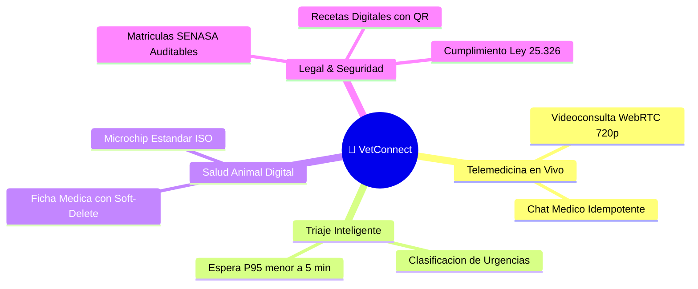
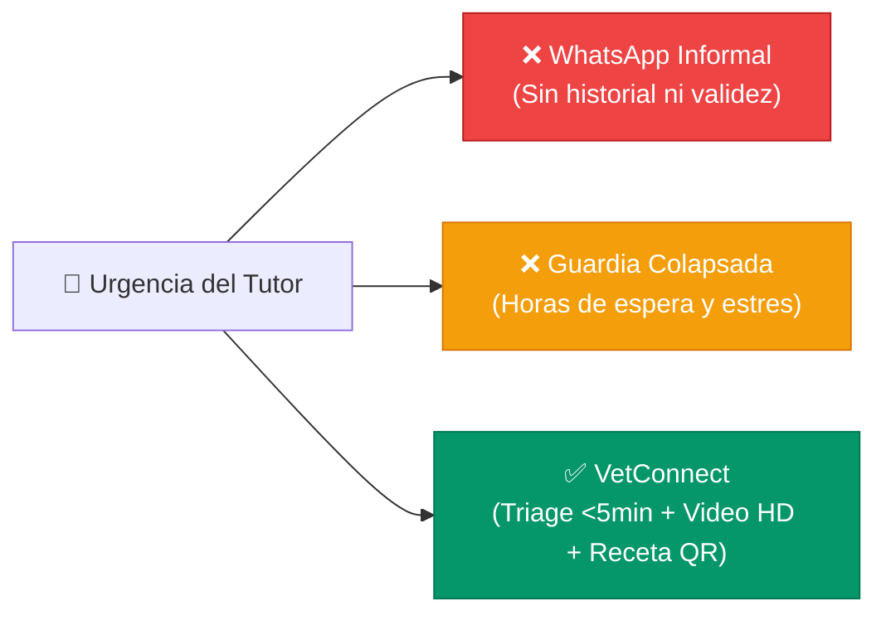
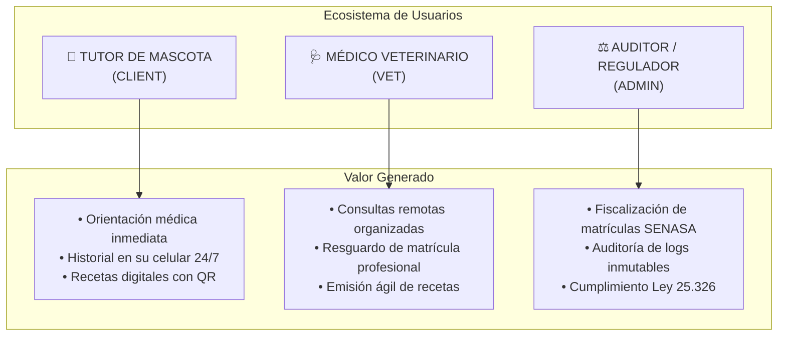
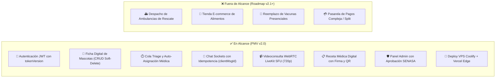
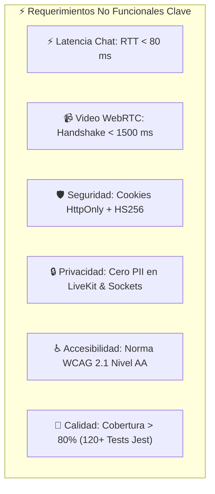
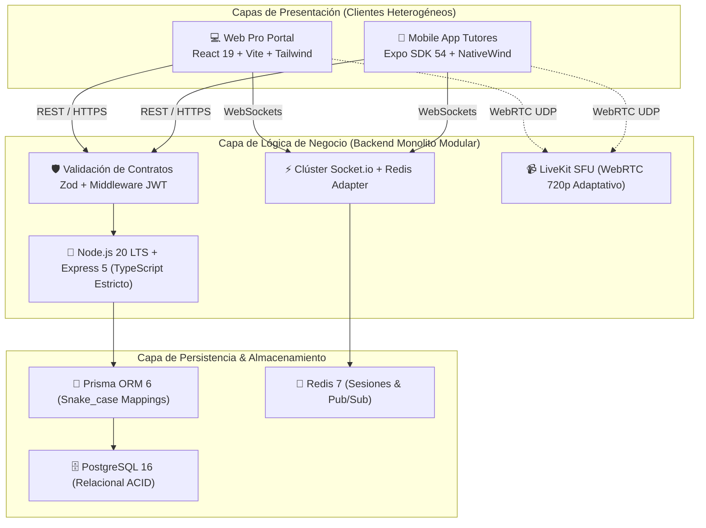
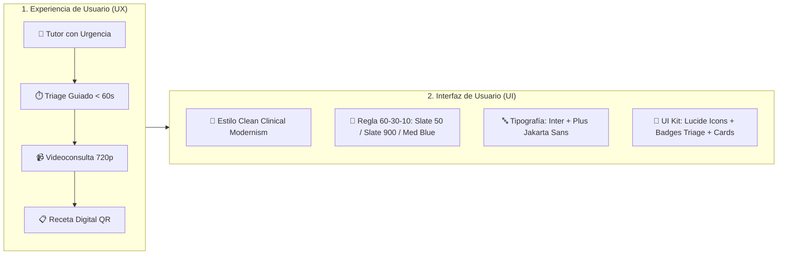
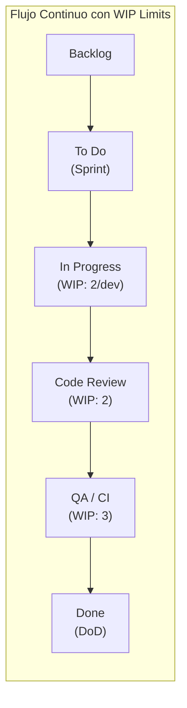
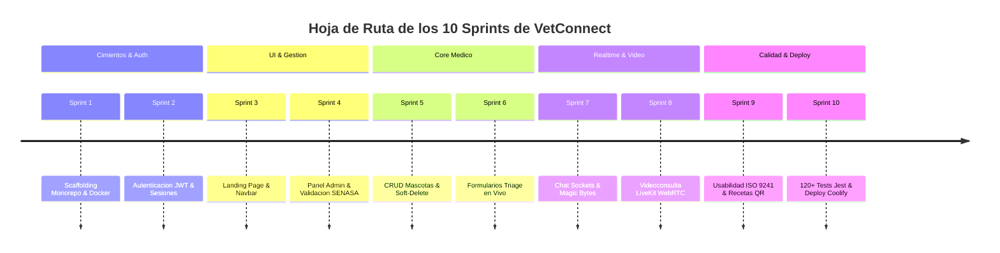
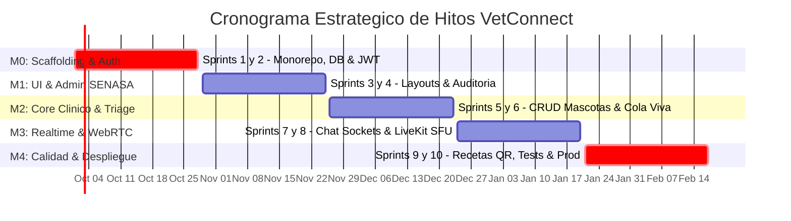

# 🖥️ Presentación Ejecutiva del Proyecto — VetConnect

> 🧊 **DOCUMENTO DE ARCHIVO HISTÓRICO / BASELINE INICIAL (READ-ONLY)**  
> *Este documento representa la línea base conceptual aprobada para el Kickoff del 1 de octubre de 2026. A partir de esa fecha, toda modificación o evolución técnica se gobierna exclusivamente en las 5 Fuentes Vivas de Ejecución (Tier 1: `docs/TECH_REFERENCE.md`, `docs/DECISIONS.md`, `PLAN_ACCION_VETCONNECT.md`, `docs/PLAN_DE_PROYECTO_Y_GESTION.md` y `AGENTS.md`). No editar este archivo de forma activa durante los sprints.*

---


> **Sistemas de Información & Gestión de Proyectos de Software**  
> **Formato:** Diapositivas Ejecutivas de Alta Densidad Visual  
> **Proyecto:** VetConnect — Plataforma Integral de Telemedicina Veterinaria & Gestión Clínica  
> **Equipo:** Tobias Vera (Tech Lead), Damian Orellana (Web), Juan Mendoza (Mobile), Ezequiel Charca (QA)  
> **Stakeholders:** Médicos Veterinarios, Tutores de Mascotas, SENASA  
> **Fecha:** Septiembre 2026

---

<!-- SLIDE 1: PORTADA -->
```
====================================================================================================
  DIAPOSITIVA 1 | IDENTIDAD & VISIÓN DEL PROYECTO
====================================================================================================
```

# 🐾 VetConnect
### *Plataforma Integral de Telemedicina Veterinaria & Gestión Clínica de Alta Disponibilidad*



> **Misión:** Democratizar el acceso a la atención médica veterinaria primaria mediante telemedicina regulada, reduciendo la espera clínica y erradicando la automedicación de mascotas.

---

<!-- SLIDE 2: EL PROBLEMA VS LA OPORTUNIDAD -->
```
====================================================================================================
  DIAPOSITIVA 2 | DIAGNÓSTICO: PROBLEMA VS. OPORTUNIDAD
====================================================================================================
```

## ⚠️ La Problemática Actual vs. La Solución VetConnect

```
+-------------------------------------------------------+-------------------------------------------------------+
|              🔴 SITUACIÓN ACTUAL (PROBLEMA)           |           🟢 PROPUESTA VETCONNECT (OPORTUNIDAD)        |
+-------------------------------------------------------+-------------------------------------------------------+
| • Guardias presenciales saturadas por consultas leves.| • Triage remoto en vivo: derivación en < 5 minutos.   |
| • Tutores sin transporte o con barreras geográficas.  | • Atención omnicanal instantánea (Web + Móvil).       |
| • Automedicación animal y consultas por WhatsApp.     | • Canal médico regulado con trazabilidad legal.       |
| • Pérdida recurrente de historias clínicas en papel.  | • Historia clínica digital unificada e inmutable.     |
| • Ejercicio profesional sin resguardo legal formal.   | • Validación SENASA y recetas electrónicas con QR.   |
+-------------------------------------------------------+-------------------------------------------------------+
```



---

<!-- SLIDE 3: USUARIOS Y NECESIDADES -->
```
====================================================================================================
  DIAPOSITIVA 3 | USUARIOS OBJETIVO & MAPA DE VALOR
====================================================================================================
```

## 👥 Arquetipos de Usuario & Propuesta de Valor



---

<!-- SLIDE 4: PRODUCTO MÍNIMO VIABLE (PMV) -->
```
====================================================================================================
  DIAPOSITIVA 4 | ALCANCE DEL PRODUCTO MÍNIMO VIABLE (PMV v2.0)
====================================================================================================
```

## 🎯 Arquitectura de Alcance: En Alcance vs. Fuera de Alcance



---

<!-- SLIDE 5: REQUERIMIENTOS PRIORITARIOS -->
```
====================================================================================================
  DIAPOSITIVA 5 | REQUERIMIENTOS DEL SISTEMA
====================================================================================================
```

## 📋 Pirámide de Requerimientos Funcionales y No Funcionales

```
+---------------------------------------------------------------------------------------------------+
| [NIVEL 1: CRÍTICOS]    RF-01 (Auth JWT) | RF-03 (Triage) | RF-05 (Chat) | RF-07 (Video LiveKit)    |
| [NIVEL 2: OPERATIVOS]  RF-02 (CRUD Pets) | RF-04 (Auto-Asignación) | RF-08 (Receta QR) | RF-09 (Admin)|
| [NIVEL 3: EXPERIENCIA] RF-06 (Magic Bytes) | RF-10 (Review 1-5 Estrellas) | Soft-Deletes Clínicos |
+---------------------------------------------------------------------------------------------------+
```



---

<!-- SLIDE 6: ARQUITECTURA TÉCNICA & ACTIVIDAD 24 -->
```
====================================================================================================
  DIAPOSITIVA 6 | DISEÑO DE ARQUITECTURA DEL SISTEMA (ACTIVIDAD 24)
====================================================================================================
```

## 🏛️ Organización del Sistema, Consenso del Equipo & Stack Tecnológico

```
+---------------------------------------------------------------------------------------------------+
| PROCESO METODOLÓGICO DE TOMA DE DECISIÓN (ACTIVIDAD 24 — 6 ETAPAS):                              |
| 1. Análisis: Triage en vivo, videoconsulta, tutores/vets, complejidad media-alta, equipo de 4 devs.|
| 2. Modelos: Comparación Cliente-Servidor, 3 Capas, Monolito Modular vs Microservicios (Descartado)|
| 3. Decisión: Monolito Modular en 3 Capas (DDD) + Servicios Especializados de Tiempo Real (SFU).    |
| 4. Justificación: Consistencia ACID estricta, cero latencia inter-módulos y TypeScript compartido.|
| 5. Tecnologías: React 19, Expo SDK 54, Node 20/Express 5, Prisma 6, Postgres 16, LiveKit & Redis 7|
| 6. Gráfico: Arquitectura desacoplada con protocolos REST/HTTPS, WebSockets WSS y WebRTC UDP.      |
+---------------------------------------------------------------------------------------------------+
```




---

<!-- SLIDE 7: SISTEMA DE DISEÑO UX/UI (ACTIVIDAD 26) -->
```
====================================================================================================
  DIAPOSITIVA 7 | SISTEMA DE DISEÑO DEL PRODUCTO (ACTIVIDAD 26)
====================================================================================================
```

## 🎨 Experiencia de Usuario (UX) & Sistema de Diseño (UI)



```
+---------------------------------------------------------------------------------------------------+
| SÍNTESIS DEL SISTEMA DE DISEÑO (ACTIVIDAD 26):                                                    |
| • Estilo Visual: Clean Clinical Modernism (superficies asépticas, bordes rounded-xl, sin fricción)|
| • Paleta 60-30-10: 60% Slate 50 (#F8FAFC) | 30% Slate 900 (#0F172A) | 10% Medical Blue (#2563EB)  |
| • Tipografía: Inter (cuerpo/datos clínicos) + Plus Jakarta Sans (títulos cálidos y legibles)      |
| • Fundamento Teórico: Leyes de Fitts (botones 48px), Hick (triage cerrado), Miller y WCAG 2.1 AA  |
+---------------------------------------------------------------------------------------------------+
```

---

<!-- SLIDE 8: METODOLOGÍA & ORGANIZACIÓN DEL EQUIPO -->
```
====================================================================================================
  DIAPOSITIVA 8 | METODOLOGÍA SCRUMBAN & EQUIPO DE TRABAJO
====================================================================================================
```

## 🔄 Marco Metodológico Scrumban & Gobernanza del Equipo



### 👥 Integrantes & Estrategia de Rotación de Roles

```
+-------------------+-----------------------------------+---------------------------------------+
| Integrante        | Rol Especializado Principal       | Estrategia de Rotación Activa         |
+-------------------+-----------------------------------+---------------------------------------+
| Tobias Vera       | Tech Lead & Solutions Architect   | Facilitador Ágil (S1-S2); CI Mentor.  |
| Damian Orellana   | Frontend Web Lead (React 19)      | Facilitador Ágil (S3-S4); Cross-Test. |
| Juan Mendoza      | Mobile App Lead (Expo SDK 54)     | Facilitador Ágil (S5-S6); Cross-Test. |
| Ezequiel Charca   | QA Automation & Security Lead     | Facilitador Ágil (S7-S8); Security PR.|
+-------------------+-----------------------------------+---------------------------------------+
```

---

<!-- SLIDE 9: PLANIFICACIÓN ÁGIL DE SPRINTS -->
```
====================================================================================================
  DIAPOSITIVA 9 | PLANIFICACIÓN ÁGIL POR SPRINTS (1 AL 10)
====================================================================================================
```

## 🚀 Hoja de Ruta de los 10 Sprints de Desarrollo



```
+---------------------------------------------------------------------------------------------------+
| MÉTRICAS DEL BACKLOG:  40 Tareas Técnicas (PB-01 a PB-40) | 139 Story Points Totales              |
| VELOCIDAD ESTIMADA:    ~14 SP por Sprint (Equipo de 4 Desarrolladores)                            |
+---------------------------------------------------------------------------------------------------+
```

---

<!-- SLIDE 10: CUADRO DE MANDO DE KPIS -->
```
====================================================================================================
  DIAPOSITIVA 10 | CUADRO DE MANDO DE KPIS (ACTIVIDAD 21)
====================================================================================================
```

## 📊 Tablero Integral de Control y Rendimiento

```
+----------+----------------------------+-----------------------+--------------------+------------------+
| KPI      | Indicador Clave            | Ámbito Estratégico    | Registro / Fuente  | Meta Objetivo    |
+----------+----------------------------+-----------------------+--------------------+------------------+
| KPI-01   | Sprint Completion Rate     | ⚡ Sprint Específico   | Burndown Chart     | >= 90% tareas    |
| KPI-02   | Delayed Tasks & Spillover  | ⚡ Sprint y Proyecto   | Tablero Kanban     | < 5% atrasos     |
| KPI-03   | Team Participation Index   | 👥 Equipo de Trabajo  | RACI / Git PRs     | Desviación <=15% |
| KPI-04   | Test Coverage & CI Pass    | 🚀 Calidad Producto   | Jest / CI Pipeline | 100% verde (>80%)|
| KPI-05   | Triage Queue P95           | 🚀 Producto y Negocio | Logs Backend REST  | P95 < 5 minutos  |
| KPI-06   | Realtime & WebRTC Latency  | 🚀 Rendimiento Técnico| APM / LiveKit Tele | WS<80ms ICE<1.5s |
| KPI-07   | CSAT & Retención           | 🌐 Proyecto General   | Calificación 1 a 5 | CSAT >= 4.7 / 5  |
+----------+----------------------------+-----------------------+--------------------+------------------+
```

> **Protocolo de Ajuste Dinámico:** Dos sprints consecutivos sin alcanzar meta $\to$ Acción correctiva inmediata en la Sprint Retrospective (reducción de alcance, refactorización técnica o redistribución de carga RACI).

---

<!-- SLIDE 11: GOBERNANZA FORMAL & GANTT -->
```
====================================================================================================
  DIAPOSITIVA 11 | GOBERNANZA FORMAL, MATRIZ RACI & HITOS
====================================================================================================
```

## 📅 Cronograma Maestro de 20 Semanas & Matriz RACI



```
+---------------------------------------------------------------------------------------------------+
| RESUMEN DE RESPONSABILIDADES RACI:                                                                |
| • Arquitectura & Backend Core: Tobias Vera (A/R) | Damian (C) | Juan (C) | Ezequiel (C)           |
| • Experiencia Web Pro (React 19): Damian Orellana (A/R) | Tobias (A) | Ezequiel (C)               |
| • App Móvil Tutores (Expo SDK 54): Juan Mendoza (A/R) | Tobias (A) | Ezequiel (C)                 |
| • Testing Automatizado & Seguridad: Ezequiel Charca (A/R) | Tobias (A) | Damian (C) | Juan (C)    |
| • Auditoría Legal & Aprobación SENASA: Lara / Sponsor (A/R) | Tobias (C)                          |
+---------------------------------------------------------------------------------------------------+
```

---

## 🎯 Conclusión Ejecutiva

VetConnect cuenta con una planificación exhaustiva, blindaje normativo (SENASA y Ley 25.326), arquitectura de alta disponibilidad y una hoja de ruta ágil de 10 Sprints perfectamente delimitada para iniciar la ejecución del código con calidad de nivel FAANG.
