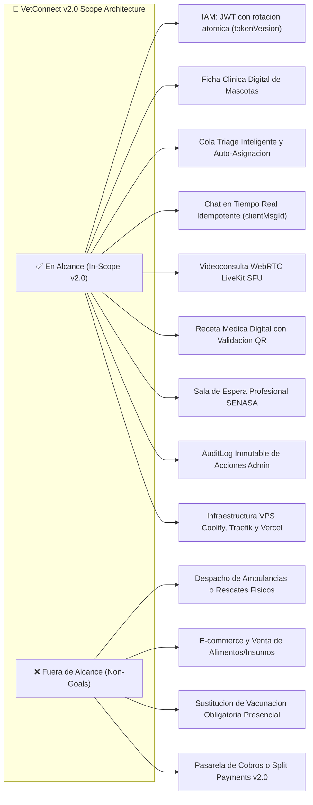

# 📜 PROJECT CHARTER: VETCONNECT
## Plataforma Integral de Telemedicina Veterinaria & Gestión Clínica de Alta Disponibilidad
**Document ID:** `CHARTER-VETCONNECT-2026-V2`  
**Autor:** Senior / Staff Technical Program Manager & Solutions Architect (FAANG Tier)  
**Organización:** Grupo Pinnacle / VetConnect Team  
**Fecha de Emisión:** Septiembre 2026  
**Estado:** `APPROVED (ACTIVE GOVERNANCE CHARTER)`  
**Nivel de Estándar:** FAANG Engineering Governance (Google / Meta / Stripe / Vercel level)  

---

## 1. Resumen Ejecutivo & Mandato de Autorización

### 1.1 Mandato del Proyecto
El presente **Project Charter** otorga formalmente la autoridad al equipo de ingeniería de VetConnect para planificar, ejecutar, asegurar y desplegar la plataforma **VetConnect v2.0**. Este documento establece los objetivos estratégicos, los límites del alcance, la estructura de gobernanza, el presupuesto operativo de infraestructura y el criterio riguroso de *Definition of Done (DoD)* bajo estándares de ingeniería de primer nivel.

### 1.2 Declaración de Propósito
VetConnect nace para proveer una solución tecnológica escalable, resiliente y legalmente blindada para la telemedicina veterinaria en América Latina, facilitando la atención clínica primaria de animales de compañía, garantizando la validación de matrículas profesionales y asegurando la integridad de las historias clínicas conforme a la legislación vigente.

---

## 2. Justificación del Negocio & Alineación Estratégica

### 2.1 Caso de Negocio (Business Case)
El mercado veterinario en América Latina carece de plataformas telemáticas reguladas. Más del **70% de los hogares poseen mascotas**, pero la atención fuera de horarios comerciales se encuentra colapsada, empujando a los tutores a la automedicación de animales o a la consulta precaria por canales de mensajería informal (WhatsApp).
* **Riesgo Sanitario:** Pérdida de vidas animales por administración de fármacos contraindicados.
* **Riesgo Legal para Profesionales:** Ejercicio telemático sin registro auditable ni consentimiento informado.
* **Oportunidad:** Construir la plataforma de telemedicina líder que integre triaje en tiempo real, videollamadas con adaptabilidad de bitrate, recetas digitales oficiales y repositorio clínico interoperable.

### 2.2 Alineación con Normativas Sanitarias y de Privacidad (Argentina / LatAm)
- **Ley N° 25.326 de Protección de los Datos Personales:** Implementación de protocolos de *Soft-Delete* con disociación y anonimización de PII, preservando la inmutabilidad de la historia clínica médica ante auditorías judiciales.
- **Resoluciones SENASA & Colegios Médicos Veterinarios:** Procedimiento obligatorio de verificación documental y validación manual de matrículas profesionales habilitantes antes de permitir la atención a pacientes.

---

## 3. Alcance del Proyecto & Estructura de Desglose del Trabajo (WBS)

### 3.1 Matriz de Alcance: En Alcance vs. Fuera de Alcance



### 3.2 Desglose del Trabajo WBS (Work Breakdown Structure)

```
1.0 VetConnect Ecosistema Core
  ├── 1.1 Seguridad, IAM & Base de Datos
  │     ├── 1.1.1 Esquema PostgreSQL relacional con Prisma ORM 6
  │     ├── 1.1.2 Sincronización estricta de nombres de columnas (@map)
  │     ├── 1.1.3 Autenticación JWT con tokenVersion y cookies HttpOnly
  │     └── 1.1.4 Pipeline de Soft-Delete y anonimización de PII
  ├── 1.2 Motor de Tiempo Real & Multimedia
  │     ├── 1.2.1 Clúster Socket.io con Redis Adapter distribuido
  │     ├── 1.2.2 Deduplicación de mensajería con clientMsgId
  │     ├── 1.2.3 Señalización y emisión de tokens WebRTC LiveKit SFU
  │     └── 1.2.4 Almacenamiento S3 con verificación de Magic Bytes
  ├── 1.3 Aplicación Móvil de Tutores (React Native / Expo)
  │     ├── 1.3.1 Gestión de fichas clínicas de mascotas
  │     ├── 1.3.2 Solicitud de triaje y visualización de cola
  │     ├── 1.3.3 Chat bidireccional y visor de recetas descargables
  │     └── 1.3.4 WebView optimizado con permisos de hardware para LiveKit
  ├── 1.4 Panel Web Profesional de Veterinarios (React 19 / Vite)
  │     ├── 1.4.1 Módulo de atención telemática con controles de videollamada
  │     ├── 1.4.2 Generador de recetas médicas estructuradas con QR
  │     └── 1.4.3 Registro de evolución clínica y notas de diagnóstico
  ├── 1.5 Panel de Control & Auditoría Legal (Web Admin)
  │     ├── 1.5.1 Flujo de aprobación de matrículas profesionales
  │     ├── 1.5.2 Visor inmutable de AuditLogs
  │     └── 1.5.3 Métricas de utilización y balanceo de guardias
  └── 1.6 Despliegue Cloud & Operaciones
        ├── 1.6.1 Orquestación VPS con Coolify y Traefik Reverse Proxy
        ├── 1.6.2 Despliegue Frontend Web en CDN Edge (Vercel)
        └── 1.6.3 Compilación y empaquetado móvil vía Expo EAS
```

---

## 4. Cronograma de Hitos & Camino Crítico

```mermaid
gantt
    title Cronograma Estratégico de Hitos VetConnect (20 Semanas / 10 Sprints)
    dateFormat  YYYY-MM-DD
    axisFormat  %b %d

    section Hito 0 (M0) - Cimientos & Auth
    S1-S2: Workspaces, DB Docker, Auth JWT      :crit, m0, 2026-10-01, 2026-10-28

    section Hito 1 (M1) - UI Base & Admin
    S3-S4: Layouts Web, Expo Router, SENASA Admin :m1, 2026-10-29, 2026-11-25

    section Hito 2 (M2) - Core Clínico
    S5-S6: CRUD Mascotas, Triage & Máquina Estados:m2, 2026-11-26, 2026-12-23

    section Hito 3 (M3) - Realtime & Video
    S7-S8: Chat Sockets, LiveKit SFU & Buffer WebRTC:m3, 2026-12-24, 2027-01-20

    section Hito 4 (M4) - Calidad & Release
    S9-S10: Recetas QR, 120+ Tests, Buffer & Deploy:crit, m4, 2027-01-21, 2027-02-17
```

> **Nota de Contexto & Cronograma:** Septiembre de 2026 constituye la fase de planificación, especificación exhaustiva y diseño de arquitectura pre-desarrollo (100% Greenfield). El inicio formal de desarrollo e implementación de código (Sprints 1 al 10 / M0 a M4) está calendarizado para el **01 de Octubre de 2026**, desarrollándose a lo largo de 20 semanas (10 sprints de 2 semanas) hasta mediados de Febrero de 2027.

| Hito | Nombre | Sprints y Fechas | Entregables Principales | Estado |
|---|---|---|---|---|
| **M0** | **Cimientos & Auth Core** | Sprints 1 y 2 (01-Oct a 28-Oct-2026) | Monorepo npm workspaces, Docker Compose (Postgres 16 + Redis 7), esquema Prisma snake_case, Auth JWT con tokenVersion. | `PLANNED` |
| **M1** | **Navegación, UI & Validación SENASA** | Sprints 3 y 4 (29-Oct a 25-Nov-2026) | Scaffolding Web React 19 y Mobile Expo, Panel Admin con aprobación bloqueante SENASA (ADR-013) y AuditLog. | `PLANNED` |
| **M2** | **Core Clínico, Fichas & Triage** | Sprints 5 y 6 (26-Nov a 23-Dic-2026) | CRUD Mascotas con microchip ISO, cola de triage con auto-asignación y máquina de estados médicas. | `PLANNED` |
| **M3** | **Comunicación Realtime & Video SFU** | Sprints 7 y 8 (24-Dic-2026 a 20-Ene-2027) | Chat Socket.io idempotente, LiveKit SFU 720p sin PII, subida de media con Magic Bytes y **Buffer técnico WebRTC**. | `PLANNED` |
| **M4** | **Calidad, Recetas QR & Despliegue** | Sprints 9 y 10 (21-Ene a 17-Feb-2027) | Recetas oficiales QR, rating 1-5 (ADR-023), 120+ tests en Jest (>80%), deploy Coolify VPS (ADR-017) y Vercel (ADR-022). | `PLANNED` |

### 4.2 Hitos Futuros — Roadmap v2.1+ (Requerimientos de Stakeholders)
Alineado con los acuerdos tomados en la reunión con el stakeholder interno ([`MINUTA_STAKEHOLDER_2026-09.md`](MINUTA_STAKEHOLDER_2026-09.md)):
- **Hito 5 (M5) — Ficha Clínica Expandida & Bóveda "VetDrive":** Bóveda documental estructurada para estudios clínicos y recetas, carnet de vacunación digital con alarmas preventivas.
- **Hito 6 (M6) — Identidad Animal & Ciclo de Vida Empático:** Validación de microchip (15 dígitos estándar ISO, opcional en alta), raza "Otros" para analítica de datos, cumpleaños de mascotas, ocultamiento empático de mascotas (silenciado de alertas con leyenda explicativa), fecha de fallecimiento, emails de condolencias y visualización diferenciada en Panel Admin.
- **Hito 7 (M7) — Tratamientos, Calendario & Fidelización:** Alarmas personalizadas de medicación, exportación/sincronización con Google Calendar e iCal, veterinarios favoritos y badges de verificación profesional con matrícula visible.
- **Hito 8 (M8) — Spikes Regulatorios e Interoperabilidad:** Gestión de padrones oficiales (SENASA / RENAPER / Colegios) e investigación de recetas digitales veterinarias en el circuito farmacéutico.

---

## 5. Gobernanza del Equipo & Matriz de Responsabilidades (RACI)

```
+-----------------------------------------------------------------------------------------+
|                                    MATRIZ RACI                                          |
+------------------------------------+--------+--------+--------+----------+--------------+
| Módulo / Iniciativa                | Tobias |  Juan  | Damian | Ezequiel |     Lara     |
|                                    | (Tech) | (Mob.) | (Web)  |   (QA)   | (PM / Legal) |
+------------------------------------+--------+--------+--------+----------+--------------+
| Arquitectura de API & Base Datos   |  A/R   |   C    |   C    |    I     |      I       |
| Infraestructura Redis & WebSockets |  A/R   |   C    |   C    |    I     |      I       |
| App Móvil React Native (Expo)      |   C    |  A/R   |   I    |    C     |      I       |
| Frontend Web (React 19 / Vite)     |   C    |   I    |  A/R   |    C     |      I       |
| Teleconsulta LiveKit SFU           |   C    |   R    |   R    |    A     |      I       |
| Pruebas Automatizadas & QA         |   C    |   C    |   C    |   A/R    |      I       |
| Validación Legal SENASA & PII      |   C    |   I    |   I    |    I     |     A/R      |
| Despliegue VPS Coolify & EAS       |  A/R   |   R    |   R    |    C     |      I       |
+------------------------------------+--------+--------+--------+----------+--------------+
```
*Leyenda: **A** = Accountable (Aprobador final); **R** = Responsible (Ejecutor); **C** = Consulted (Consultado); **I** = Informed (Informado).*

---

## 6. Recursos, Infraestructura & Presupuesto Operativo

El sistema prioriza una arquitectura de **bajo costo recurrente y alto rendimiento**, utilizando servicios autohospedados modernos combinados con capas gratuitas o eficientes de servicios cloud:

| Capa | Proveedor / Tecnología | Propósito | Costo Estimado |
|---|---|---|---|
| **Cómputo Backend** | VPS Ubuntu 24.04 (Hostinger / Hetzner) | Host de Coolify, VetConnect API (Docker) y Redis Server | \$8 - \$15 USD / mes |
| **Base de Datos** | Supabase Managed PostgreSQL | Base de datos relacional con backups diarios y réplicas | \$0 - \$25 USD / mes |
| **Frontend Web** | Vercel Edge Network | Despliegue SPA global con CDN, HTTPS automático y compresión | \$0 (Hobby / Pro) |
| **Media WebRTC** | LiveKit Cloud / LiveKit Self-hosted | Servidor SFU para videollamadas de baja latencia | Free tier / \$10 USD |
| **Almacenamiento** | Amazon S3 / Cloudinary (con fallback local) | Almacenamiento seguro de adjuntos médicos y avatares | \$1 - \$5 USD / mes |
| **Distribución Mobile** | Expo Application Services (EAS) | Compilación en la nube de binarios Android (AAB/APK) | Free tier |

---

## 7. Matriz de Gestión de Riesgos & Amenazas

| ID | Riesgo Identificado | Severidad | Probabilidad | Estrategia de Mitigación / Contingencia |
|---|---|---|---|---|
| **R-01** | **Exposición accidental de credenciales en desarrollo** | P0 (Crítico) | Media | Guardarraíles en pre-commit (`.gitignore`, `.env.example` sin secretos), escaneo en CI (`trufflehog`) y rotación inmediata de llaves. |
| **R-02** | **Desincronización de columnas Prisma vs SQL** | P0 (Crítico) | Media | Mapeo explícito `@map` en `schema.prisma` y verificación en CI (`prisma migrate status`). |
| **R-03** | **Degradación de llamada en conexiones 4G débiles** | P1 (Alto) | Alta | Implementar simulcast y streaming adaptativo en LiveKit; fallback automático a chat con imágenes. |
| **R-04** | **Rechazo de app en Google Play Store** | P1 (Alto) | Media | Ajuste estricto de políticas de privacidad para apps de salud y justificación de permisos en `app.json`. |
| **R-05** | **Agotamiento del pool de conexiones PostgreSQL** | P2 (Medio) | Baja | Singleton `PrismaClient` con pool acotado (`limit=20`) y Supabase Connection Pooler habilitado. |
| **R-06** | **Variabilidad e incertidumbre técnica en WebRTC/Mobile** | P1 (Alto) | Media | Asignación de días de buffer técnico en Sprints 8 y 10; desconexión server-side (`deleteRoom`) y reconexión resiliente en WebView. |
| **R-07** | **Divergencia entre tablero de producto y prompts de IA** | P2 (Medio) | Media | Gobernanza dual con Matriz de Mapeo Biunívoco PB (01-40) ↔ TASK (0.1-7.2) documentada en PLAN_ACCION y PLAN_DE_PROYECTO. |

---

## 8. Criterio de "Listo para Producción" (Definition of Done - DoD)

Para que cualquier componente o versión de VetConnect sea promovido a Producción bajo estándar FAANG, debe cumplir:
1. **Compilación Limpia:** `npx tsc --noEmit` ejecuta con **0 errores** en `backend`, `web` y `mobile`.
2. **Linting Estricto:** Cero advertencias (`warnings`) sin justificar en pipelines de análisis estático.
3. **Tests Automatizados:** $100\%$ de la suite de Jest en backend ejecutada en verde (meta proyectada: $> 120\text{ pruebas}$).
4. **Zero-Secrets:** Ningún archivo `.env` o credencial privada presente en el repositorio.
5. **Auditoría de Accesibilidad:** Cumplimiento de WCAG 2.1 AA en todas las vistas críticas de tutores y veterinarios.
6. **Resiliencia de Red:** Reconexión automática de WebSockets validada ante cortes abruptos de conexión.
7. **Documentación Viva:** Documentos técnicos actualizados reflejando el código fuente en el mismo pull request.

---

## 9. Aprobación y Firmas de Autorización

| Nombre | Rol | Estado | Fecha |
|---|---|---|---|
| **Tobias Vera** | Lead Backend Engineer & Tech Lead | `APPROVED` | 2026-09-12 |
| **Juan Mendoza** | Lead Mobile Developer | `APPROVED` | 2026-09-12 |
| **Damian Orellana** | Lead Web Frontend Developer | `APPROVED` | 2026-09-12 |
| **Ezequiel Charca** | QA Engineer & Product Designer | `APPROVED` | 2026-09-12 |
| **Lara Bouso** | Project Manager & Legal Operations | `APPROVED` | 2026-09-12 |
