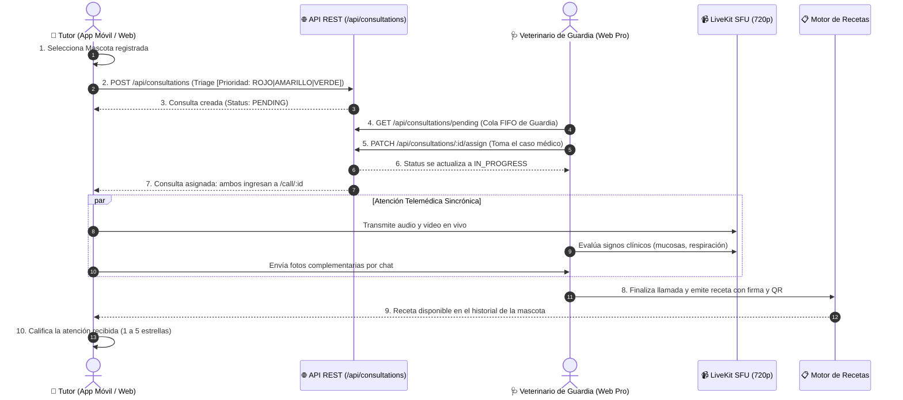
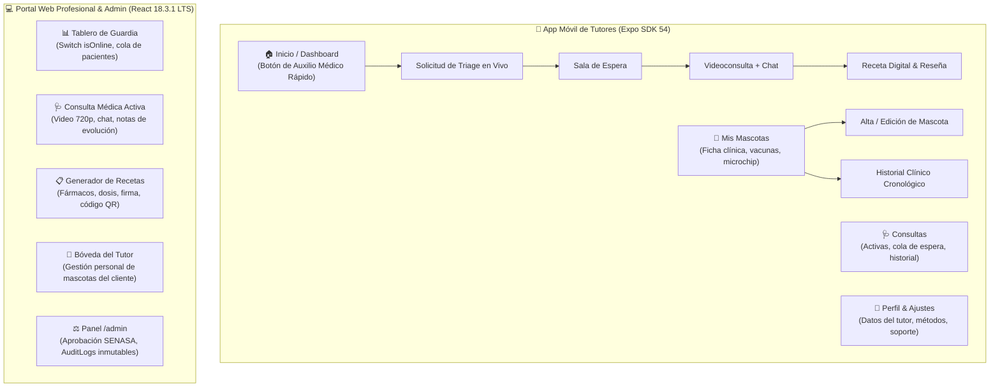
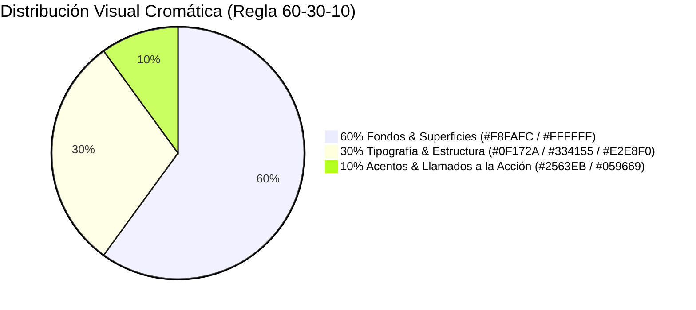

# 🎨 Sistema de Diseño del Producto (Design System) — VetConnect

> **Documento Oficial de UX/UI & Sistema de Diseño (Design Tokens & UI Kit)**  
> **Marco Metodológico:** Incorpora formalmente la **Actividad 26 – Definición del Sistema de Diseño del Producto**  
> **Normativas Aplicadas:** ISO 9241-210 (Diseño Centrado en el Usuario), ISO 9241-11 (Usabilidad), WCAG 2.1 Nivel AA (Accesibilidad Web) y Leyes de la Psicología del Diseño (Fitts, Hick, Miller y Gestalt).  
> **Proyecto:** VetConnect — Plataforma Integral de Telemedicina Veterinaria & Gestión Clínica  
> **Equipo de Diseño & Desarrollo:** Tobias Vera, Damian Orellana (Técnico Multimedial & UI/UX Lead en Figma), Juan Mendoza, Ezequiel Charca
> **Fecha:** Septiembre 2026 | **Estado:** `APPROVED (ACTIVE DESIGN SYSTEM SPECIFICATION)`

---

## 📑 Índice General del Sistema de Diseño

1. [Experiencia de Usuario (UX)](#1-experiencia-de-usuario-ux)
   - 1.1 [Objetivo Principal de los Usuarios](#11-objetivo-principal-de-los-usuarios)
   - 1.2 [Flujo Principal de Navegación (User Journey Clínico)](#12-flujo-principal-de-navegación-user-journey-clínico)
   - 1.3 [Arquitectura de la Información & Mapa del Sitio](#13-arquitectura-de-la-información--mapa-del-sitio)
2. [Interfaz de Usuario (UI)](#2-interfaz-de-usuario-ui)
   - 2.1 [Identidad Visual (Nombre, Logotipo & Personalidad)](#21-identidad-visual-nombre-logotipo--personalidad)
   - 2.2 [Estilo Visual (Clean Clinical Modernism)](#22-estilo-visual-clean-clinical-modernism)
   - 2.3 [Paleta Cromática & Aplicación de la Regla 60-30-10](#23-paleta-cromática--aplicación-de-la-regla-60-30-10)
   - 2.4 [Tipografía (Principal & Secundaria)](#24-tipografía-principal--secundaria)
   - 2.5 [Recursos Gráficos (Iconografía, Ilustraciones & Fotografía)](#25-recursos-gráficos-iconografía-ilustraciones--fotografía)
   - 2.6 [Componentes de Interfaz (Design System & UI Kit)](#26-componentes-de-interfaz-design-system--ui-kit)
3. [Justificación Teórica & Cierre](#3-justificación-teórica--cierre)
   - 3.1 [Fundamentación en Leyes de UX y Psicología Cognitiva](#31-fundamentación-en-leyes-de-ux-y-psicología-cognitiva)
   - 3.2 [Conclusión de Coherencia y Mantenibilidad del Producto](#32-conclusión-de-coherencia-y-mantenibilidad-del-producto)

---

## 1. Experiencia de Usuario (UX)

### 1.1 Objetivo Principal de los Usuarios

El sistema está diseñado para resolver las metas esenciales de cada arquetipo de usuario sin fricciones cognitivas:

> 📌 Ver arquetipos de usuario canónicos y mapas de empatía en [02_INVESTIGACION_DCU_Y_DESIGN_THINKING.md (§2)](./web/02_INVESTIGACION_DCU_Y_DESIGN_THINKING.md#2-arquetipos-de-usuario-y-contexto-real-de-uso).

---

### 1.2 Flujo Principal de Navegación (User Journey Clínico)

El siguiente diagrama representa el recorrido óptimo del tutor de mascotas desde que detecta un síntoma anómalo hasta la recepción del diagnóstico y prescripción médica:



#### Fases Clave del Flujo:
1. **Acceso Rápido:** Autenticación biométrica o sesión persistente; selección de la mascota con un solo toque.
2. **Triaje Guiado:** Formulario de preguntas cerradas de alta velocidad que evita la redacción extensa en situaciones de pánico.
3. **Espera con Retroalimentación en Vivo:** Contador de posición en cola y tiempo estimado para mitigar la ansiedad del tutor.
4. **Consulta Multicanal:** Videollamada 720p fluida con chat lateral para intercambio de estudios o fotos con zoom.
5. **Cierre Formal:** Emisión instantánea de la prescripción electrónica en formato PDF estándar con código QR.

---

### 1.3 Arquitectura de la Información & Mapa del Sitio

La información se organiza siguiendo el principio de **agrupamiento por contexto clínico**, estructurando dos experiencias adaptadas al soporte físico:



#### Criterios de Organización de la Información:
- **Jerarquía Visual Clara:** En la aplicación móvil, el botón de **Solicitar Atención** domina el tercio superior de la pantalla principal (*Thumb Zone* ergonómica).
- **Proximidad Contextual & Multicanal Sincrónico (ADR-012):**
  - **Portal Web (Veterinario):** Layout de pantalla dividida con área de Video HD 720p central del paciente, ficha clínica de la mascota y panel de **Chat en Vivo** acoplado en el lateral derecho con soporte para recepción de fotografías en alta resolución y visor Lightbox con zoom 100% (para inspección macroscópica de lesiones, mucosas o vómitos).
  - **Mobile App (Tutor):** Video 720p a pantalla completa optimizado para dispositivos de gama baja (bitrate adaptativo 1.2 Mbps a 24fps con prioridad ininterrumpida de audio). Botón táctil prominente de **Conmutación de Cámara (Frontal / Trasera)** con autoenfoque activo para examinar al paciente sin posturas forzadas. Botón flotante de **Chat / Macro-Fotos** que despliega un panel inferior (*Bottom Sheet*) no bloqueante o modo Picture-in-Picture (PiP) para escribir o capturar y adjuntar imágenes vía `POST /api/media` sin pausar la videollamada ni el audio.
- **Historial Cronológico Inmutable:** Las consultas pasadas y recetas se presentan ordenadas temporalmente en orden descendente con indicadores de estado claros (`Completada`, `Urgencia Derivada`, `En Tratamiento`).

> 🛑 **Nota de Seguridad & Cumplimiento Ley 25.326:** En cumplimiento de la Ley 25.326 y el secreto médico, se descarta cualquier buscador o listado global de pacientes (`/patients`) para veterinarios. El profesional accede a los datos de la mascota exclusivamente dentro de una consulta activa asignada.

---

## 2. Interfaz de Usuario (UI)

### 2.1 Identidad Visual (Nombre, Logotipo & Personalidad)

- **Nombre del Producto:**  
  **VetConnect** — Conectando la salud animal con tecnología de precisión.
- **Logotipo & Símbolo Identificatorio:**  
  El isotipo fusiona tres conceptos clave:
  1. **La Cruz Médica:** Representa rigor clínico, habilitación sanitaria y primeros auxilios.
  2. **La Huella Canina/Felina:** Simboliza afecto, empatía y dedicación hacia los animales de compañía.
  3. **Ondas de Conexión en Tiempo Real:** Expresan telemedicina, inmediatez y tecnología de vanguardia.
- **Personalidad de la Marca (5 Palabras Clave):**
  1. 🩺 **Clínica:** Rigurosa, profesional y respaldada por normativas sanitarias oficiales.
  2. 🐾 **Empática:** Cálida, comprensiva y consciente del vínculo afectivo humano-animal.
  3. ⚡ **Ágil:** Rápida, intuitiva y libre de burocracia en momentos de emergencia.
  4. 🛡️ **Confiable:** Segura, inmutable y respetuosa de la privacidad legal de los datos.
  5. 🌐 **Accesible:** Clara, legible y utilizable por personas de cualquier nivel de destreza digital.

---

### 2.2 Estilo Visual (Clean Clinical Modernism)

VetConnect adopta el estilo **Clean Clinical Modernism (Modernismo Clínico Limpio)**:
- **Líneas Puras y Superficies Despejadas:** Fondos neutros y luminosos que transmiten asertividad y orden clínico, evitando el desorden visual que incrementa la ansiedad en situaciones de urgencia.
- **Bordes Amigables:** Radios de curvatura suaves (`rounded-xl` / 12px en tarjetas e inputs, `rounded-full` en avatares y badges), que eliminan la agresividad visual de las esquinas en punta.
- **Elevación por Capas Sutiles (*Layered Shadows Craft*):** Jerarquía tridimensional construida mediante sombras suaves y difusas (`shadow-sm`, `shadow-md`), evitando bordes duros artificiales.
- **Ergonomía Adaptada al Contexto:** Botones táctiles de gran tamaño (área mínima de $48 \times 48\text{ px}$) para facilitar la interacción con una sola mano en la aplicación móvil mientras se sostiene a la mascota.

---

### 2.3 Paleta Cromática & Aplicación de la Regla 60-30-10

La paleta se rige por la **regla clásica de armonía cromática 60-30-10**, complementada con colores funcionales de estado médico:

```
+---------------------------------------------------------------------------------------------------------------+
|                                      PALETA CROMÁTICA OFICIAL DE VETCONNECT                                   |
+-------------------+---------------+-------------------+-----------+-------------------------------------------+
| Proporción / Rol  | Tono Semántico| Código Hex        | Nombre    | Uso y Justificación Psicológica           |
+-------------------+---------------+-------------------+-----------+-------------------------------------------+
| 60% Dominante     | Fondo Base    | #F8FAFC           | Slate 50  | Fondo principal. Sensación de higiene,    |
|                   | Superficie Tar| #FFFFFF           | Blanco    | orden y claridad clínica sin fatigar.     |
+-------------------+---------------+-------------------+-----------+-------------------------------------------+
| 30% Secundario    | Texto Mayor   | #0F172A           | Slate 900 | Títulos y lectura principal (Contraste    |
|                   | Texto Menor   | #334155           | Slate 700 | 14.2:1, supera ampliamente WCAG AAA).     |
|                   | Bordes/Líneas | #E2E8F0           | Slate 200 | Separadores y bordes sutiles de tarjetas. |
+-------------------+---------------+-------------------+-----------+-------------------------------------------+
| 10% Acento        | Acción / CTA  | #2563EB           | Med Blue  | Botones principales de auxilio y llamada. |
|                   | Acción Marca  | #0D9488           | Teal 600  | Acción secundaria de salud y marca (Button.tsx). |
|                   | Éxito / Triage| #059669           | Emerald 600| Estado de triage GREEN, vet online y éxito. |
+-------------------+---------------+-------------------+-----------+-------------------------------------------+
| Estados Clínicos  | Alerta Crítica| #DC2626           | Red Alert | Triage Rojo (Emergencia vital inmediata). |
| (Funcionales)     | Alerta Media  | #D97706           | Amber Med | Triage Amarillo (Urgencia moderada).      |
|                   | Informativo   | #0284C7           | Sky Info  | Notificaciones de sistema y consejos.     |
+-------------------+---------------+-------------------+-----------+-------------------------------------------+
```



---

### 2.4 Tipografía (Principal & Secundaria)

El sistema tipográfico combina neutralidad, alta legibilidad en pantallas de baja resolución y calidez institucional:

```
+---------------------------------------------------------------------------------------------------------------+
|                                      SISTEMA TIPOGRÁFICO DE VETCONNECT                                        |
+-------------------+-----------------------+-----------------------+-------------------------------------------+
| Clasificación     | Fuente Tipográfica    | Variantes Utilizadas  | Justificación & Aplicación                |
+-------------------+-----------------------+-----------------------+-------------------------------------------+
| Principal         | Inter                 | Regular (400)         | Diseñada específicamente para interfaces  |
| (Cuerpo & Datos)  | (Sans-Serif Geométrica| Medium (500)          | digitales. Altura de la 'x' generosa,     |
|                   | de alta legibilidad)  | SemiBold (600)        | números tabulares para signos vitales y   |
|                   |                       | Bold (700)            | excelente definición en tamaños pequeños. |
+-------------------+-----------------------+-----------------------+-------------------------------------------+
| Secundaria        | Plus Jakarta Sans     | SemiBold (600)        | Tipografía moderna y abierta con curvas   |
| (Headings & Títulos| (Sans-Serif Amigable) | Bold (700)            | sutilmente humanistas. Utilizada en H1-H3 |
|                   |                       | ExtraBold (800)       | para transmitir calidez y bienvenida.     |
+-------------------+-----------------------+-----------------------+-------------------------------------------+
```

#### Escala Tipográfica Modular (Ratio 1.25 — Major Third):
- **Display / Hero (`H1`):** `32px` (2rem) — Bold — Títulos de sección principal e interfaces de triage.
- **Título de Sección (`H2`):** `24px` (1.5rem) — SemiBold — Nombres de mascotas y encabezados de panel.
- **Subtítulo (`H3`):** `18px` (1.125rem) — SemiBold — Títulos de tarjetas clínicas y modales.
- **Cuerpo Base (`Body`):** `15px` (0.9375rem) — Regular — Diagnósticos médicos, chats y descripciones.
- **Metadatos & Labels (`Caption`):** `12px` (0.75rem) — Medium — Timestamps, dosificaciones y tags de estado.

---

### 2.5 Recursos Gráficos (Iconografía, Ilustraciones & Fotografía)

1. **Iconografía (Lucide Icons):**
   - Trazos lineales con grosor constante de `2px` y esquinas redondeadas.
   - Metáforas directas del dominio clínico: `Activity` (signos vitales), `Video` (videoconsulta), `MessageSquare` (chat), `FileText` (receta), `ShieldCheck` (matrícula SENASA), `Calendar` (turnos).
2. **Ilustraciones Vectoriales (*Empty States* & Onboarding):**
   - Estilo *Flat Minimalist* con colores desaturados de la paleta institucional (azul clínico, verde suave y blanco).
   - Aplicación: Pantalla de "Aún no tienes mascotas registradas", "Buscando veterinario disponible", "Sala de espera en curso". Evitan la sensación de error transmitiendo tranquilidad.
3. **Fotografía Médica & Animal:**
   - Fotografía realista de animales en situaciones de confort hogareño (perros y gatos saludables).
   - Retratos de veterinarios de frente, con amabilidad visual, guardapolvo clínico y matrícula profesional visible, reforzando la confianza del tutor.

---

### 2.6 Componentes de Interfaz (Design System & UI Kit)

El sistema de diseño define especificaciones visuales y de interacción para los componentes centrales:

#### A. Botones Interactivos (Buttons)
- **Botón Primario (CTA / Emergencia):** Fondo `#2563EB`, texto blanco `#FFFFFF`, esquinas `rounded-xl` (12px), altura mínima `48px`, sombra suave. Estado `Hover`: oscurecimiento a `#1D4ED8`. Estado `Active`: escala al 98%.
- **Botón Secundario (Acción Alternativa):** Fondo `#FFFFFF`, borde `1.5px` sólido `#E2E8F0`, texto `#0F172A`.
- **Botón Destructivo (Cancelar Atención / Eliminar):** Fondo `#DC2626`, texto blanco, confirmación modal obligatoria.
- **Accesibilidad:** Todos los botones poseen un anillo de foco visible (`focus:ring-2 focus:ring-blue-500 focus:ring-offset-2`).

#### B. Tarjeta Clínica de Mascota (Pet Card)
- **Estructura:** Contenedor blanco `#FFFFFF` con borde `#E2E8F0`, `padding: 16px`, elevación `shadow-sm`.
- **Contenido:** Avatar circular de la mascota (64x64px), nombre en `H2` (Plus Jakarta Sans Bold), badge de especie/raza, edad calculada automáticamente y microchip con icono de verificación.
- **Interacción:** `cursor-pointer`, elevación sutil en hover (`hover:shadow-md hover:-translate-y-0.5`).

#### C. Tarjeta Profesional de Veterinario (Doctor Card)
- **Estructura:** Contenedor estructurado con badge de disponibilidad en vivo:
  - Punto verde pulsante `#059669` si `isOnline = true`.
  - Matrícula SENASA visible con badge de verificación oficial.
  - Puntuación visual en estrellas (1 a 5 estrellas con recálculo atómico de `rating_avg`).

#### D. Badges Semánticos de Triage
- **Triage Verde (Leve):** Fondo `#ECFDF5`, borde `#A7F3D0`, texto `#065F46` ("Atención Regular").
- **Triage Amarillo (Moderado):** Fondo `#FFFBEB`, borde `#FDE68A`, texto `#92400E` ("Prioridad Media").
- **Triage Rojo (Urgencia Vital):** Fondo `#FEF2F2`, borde `#FECACA`, texto `#991B1B` ("Emergencia Prioritaria").

#### E. Formulario & Campos de Entrada (Inputs)
- **Estados:** `Default`, `Focused` (borde azul `#2563EB` con transición suave de 150ms), `Error` (borde rojo `#DC2626` con mensaje RFC 7807 debajo).
- **Entradas Especiales:** Selector de especies con iconos gráficos y máscara de entrada de Microchip (15 dígitos estándar ISO con validación de algoritmo numérico en tiempo real).

---

## 3. Justificación Teórica & Cierre

### 3.1 Fundamentación en Leyes de UX y Psicología Cognitiva

Las decisiones del Sistema de Diseño de VetConnect se sustentan en principios comprobados de diseño de interacción y psicología cognitiva:

```
+---------------------------------------------------------------------------------------------------------------+
|                                FUNDAMENTACIÓN TEÓRICA DEL SISTEMA DE DISEÑO                                   |
+-------------------+-----------------------------------+-------------------------------------------------------+
| Ley / Principio   | Enunciado Teórico                 | Aplicación Práctica en VetConnect                     |
+-------------------+-----------------------------------+-------------------------------------------------------+
| Ley de Fitts      | El tiempo para alcanzar un blanco | El botón de "Solicitar Triage / Auxilio" posee gran   |
|                   | depende de su distancia y tamaño. | tamaño (48px de alto) y se ubica en el área inferior  |
|                   |                                   | de fácil alcance del pulgar en la pantalla móvil.     |
+-------------------+-----------------------------------+-------------------------------------------------------+
| Ley de Hick       | El tiempo de decisión aumenta con | El triage no presenta campos abiertos confusos, sino  |
|                   | el número y complejidad de opciones| un flujo guiado de pasos secuenciales con opciones     |
|                   |                                   | binarias o categóricas cerradas de alta velocidad.    |
+-------------------+-----------------------------------+-------------------------------------------------------+
| Ley de Miller     | La memoria de trabajo procesa     | La información clínica se divide en bloques o         |
| (Chunking)        | entre 5 y 7 elementos a la vez.   | tarjetas aisladas (datos básicos, vacunas, recetas),  |
|                   |                                   | evitando la sobrecarga cognitiva del usuario.         |
+-------------------+-----------------------------------+-------------------------------------------------------+
| Principio de      | Los elementos visualmente         | Los botones de acción primaria comparten estilo en    |
| Similitud Gestalt | semejantes se perciben como afines| toda la plataforma; los badges de estado usan código  |
|                   | y con funciones equivalentes.     | de semáforo estandarizado en móvil y web.             |
+-------------------+-----------------------------------+-------------------------------------------------------+
| Principio de      | Los objetos cercanos entre sí se  | El motivo de consulta, la mascota y sus antecedentes  |
| Proximidad Gestalt| perciben como un grupo unitario.  | se agrupan dentro del mismo contenedor de tarjeta.    |
+-------------------+-----------------------------------+-------------------------------------------------------+
| Accesibilidad     | Perceptible, Operable,            | Contraste mínimo de 4.5:1 en textos, estados de foco  |
| WCAG 2.1 Nivel AA | Comprensible y Robusto.           | visibles con teclado y etiquetas semánticas ARIA.     |
+-------------------+-----------------------------------+-------------------------------------------------------+
```

---

### 3.2 Conclusión de Coherencia y Mantenibilidad del Producto

El **Sistema de Diseño de VetConnect** establece un lenguaje visual y funcional común entre desarrolladores, diseñadores y agentes de inteligencia artificial autónomos. Su dirección visual de arte reside en **Figma a cargo del Técnico Multimedial (Damian Orellana)**, mientras que el equipo de desarrollo y los agentes construyen los componentes atómicos en **Storybook** utilizando tokens sincronizados de Tailwind CSS, con exportación hacia Figma mediante `html.to.design` para sincronizar estados dinámicos de WebRTC y tiempo real.

Al fundamentarse en estándares internacionales (**ISO 9241-210** para Diseño Centrado en el Usuario e **ISO 9241-11** para Usabilidad) y aplicar de forma rigurosa la regla cromática 60-30-10 y componentes atómicos reutilizables:
1. **Reduce el tiempo de aprendizaje:** Los usuarios tutores y médicos reconocen patrones interactivos consistentes en cualquier pantalla.
2. **Minimiza errores médicos:** La jerarquía tipográfica y el código de colores previenen confusiones en dosis de medicamentos o estados de urgencia.
3. **Agiliza el desarrollo:** Los agentes autónomos (como Google Jules) cuentan con especificaciones inequívocas de estilos, espaciados y contratos visuales para proveer scaffolding y contratos, mientras el equipo humano y los agentes plasman fielmente el catálogo en React 18.3.1 LTS y Expo SDK 54.

---
*Documento de Sistema de Diseño elaborado bajo estándares FAANG/ISO — Grupo Pinnacle 2026.*
