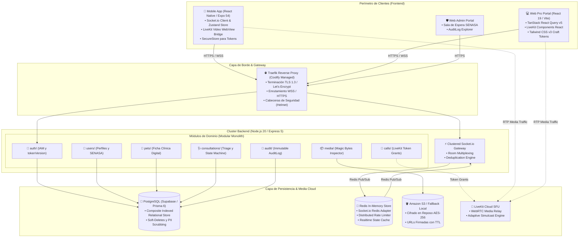
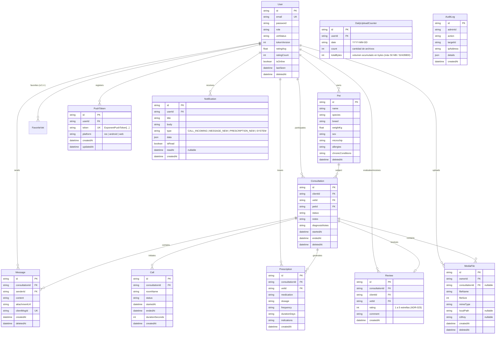
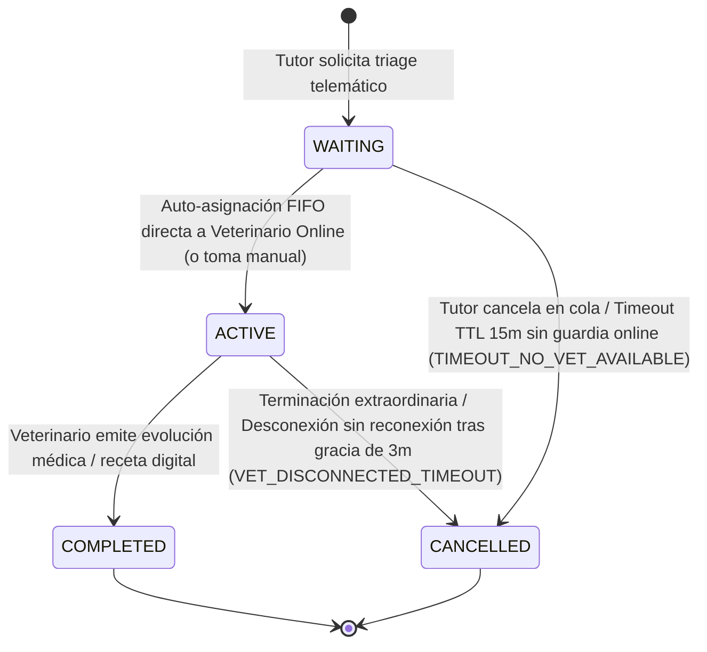
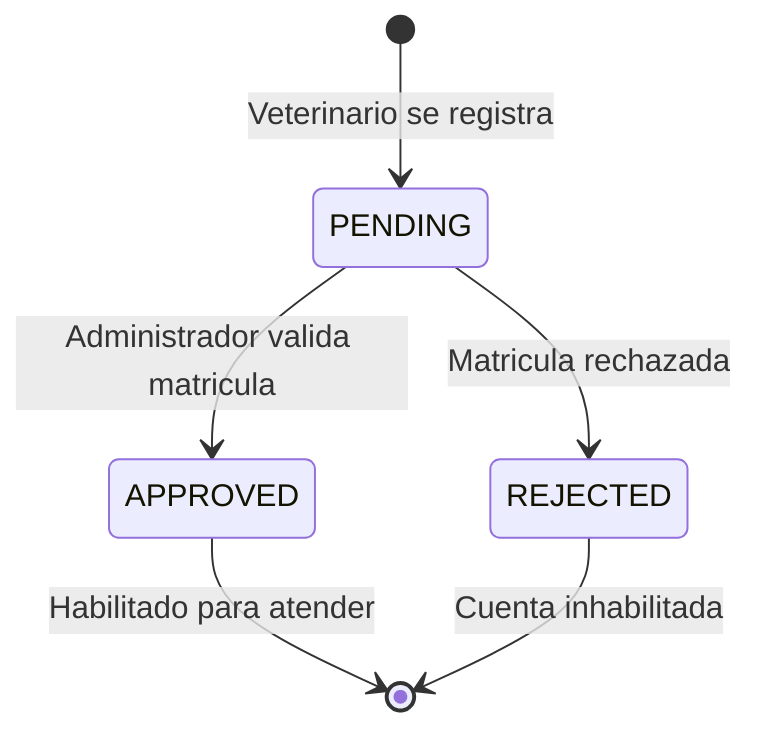

# 📐 SYSTEM & TECHNICAL SPECIFICATION (SPEC)
## Proyecto: VetConnect — Especificación Técnica y Arquitectónica Integral
**Document ID:** `SPEC-VETCONNECT-2026-V2`  
**Autor:** Senior / Staff Systems Architect & Tech Lead (FAANG Tier Standards)  
**Organización:** Grupo Pinnacle / VetConnect Team  
**Fecha de Emisión:** Septiembre 2026  
**Estado:** `APPROVED (ACTIVE SYSTEM SPEC)`  
**Clasificación:** Tier-1 Engineering RFC & Implementation Specification  

---

## 1. Visión General & Objetivos del Sistema

Esta especificación técnica define de manera exhaustiva la arquitectura, contratos de datos, protocolos de tiempo real, seguridad y modelos de falla para la plataforma **VetConnect v2.0**. 

### 1.1 Objetivos de Ingeniería
- **Latencia Ultra Baja:** Entrega de mensajería en tiempo real con latencia P95 $< 80\text{ ms}$ e inicio de videollamadas WebRTC P95 $< 1500\text{ ms}$.
- **Concurrencia & Desacoplamiento:** Soporte de clustering horizontal sin estado en la capa de cómputo Node.js mediante adaptadores distribuidos Redis.
- **Idempotencia Garantizada:** Tolerancia a reintentos en redes móviles inestables con deduplicación criptográfica de mensajes.
- **Blindaje Legal & Sanitario:** Trazabilidad inmutable de historias clínicas y cumplimiento del 100% de la **Ley N° 25.326** y resoluciones de **SENASA**.

---

## 2. Topología del Sistema & Arquitectura de Componentes

El backend se estructura bajo el patrón **Modular Monolith (Domain-Driven Design)**, desplegado en un runtime único de **Node.js 20 LTS** con **Express 5**, desacoplado de la persistencia mediante **PostgreSQL** y **Redis**.



---

## 3. Modelo de Datos, Esquema Prisma & Máquinas de Estado

### 3.1 Mapeo Relacional & Convenciones de Nomenclatura
Para prevenir desincronizaciones entre la convención de código JavaScript (`camelCase`) y la nomenclatura de base de datos SQL (`snake_case`), **todas las columnas multi-palabra están mapeadas explícitamente con `@map`**.



### 3.2 Estrategia de Indexación Compuesta
Optimizada para consultas de alta concurrencia:
1. `users`: `@@index([role, isOnline, vetStatus, deletedAt])` — Filtrado instantáneo de veterinarios disponibles en triage.
2. `consultations`: `@@index([clientId, status, deletedAt])` y `@@index([vetId, status, deletedAt])` — Consultas activas de dashboards.
3. `messages`: `@@index([consultationId, createdAt])` — Paginación cronológica del chat clínico.
4. `messages`: `@@unique([clientMsgId])` — Deduplicación atómica garantizada por motor SQL.
5. `media_files`: `@@index([ownerId, deletedAt])` y `@@index([consultationId, deletedAt])` — Búsqueda y control de acceso de adjuntos clínicos.
6. `push_tokens`: `@@unique([token])` y `@@index([userId])` — Registro idempotente y despacho de notificaciones push.
7. `notifications`: `@@index([userId, isRead, createdAt])` — Consulta eficiente de bandeja in-app y badge de no leídas.
8. `daily_upload_counters`: `@@unique([userId, date])` — Validación atómica de cuota diaria de subida (RNF-06).

---

### 3.3 Máquinas de Estado Finitas (FSM)

#### A. Ciclo de Vida de la Consulta Telemática (FSM Determinista de 4 Estados — ADR-024)


**Reglas Deterministas de Transición y Resiliencia Temporal:**
1. **Ausencia de Guardia Online en Triage:** Si un tutor solicita triage y no hay veterinarios online (`isOnline = true`, `vetStatus = APPROVED`), el sistema informa el estado en la UI e inicia un temporizador de espera máxima con TTL de **15 minutos**. Si ningún profesional se conecta o toma la consulta al cumplirse el TTL, la consulta transiciona automáticamente a `CANCELLED` con código de auditoría `TIMEOUT_NO_VET_AVAILABLE`, notificando al tutor vía Push y WebSocket.
2. **Ventana de Gracia por Desconexión en Consulta `ACTIVE`:** Si el veterinario pierde la conexión durante una consulta activa, el sistema abre una **ventana de gracia de 3 minutos** (basada en el socket heartbeat y presencia Redis). Si el profesional se reconecta dentro de este intervalo, la sesión continúa sin interrupción. Si se agota el tiempo de gracia, la consulta transiciona a `CANCELLED` (`VET_DISCONNECTED_TIMEOUT`) o se ofrece al tutor la opción de reencolado prioritario en `WAITING`.

#### B. Onboarding & Validación Profesional (SENASA)


---

## 4. Contratos de API REST & Protocolo de Tiempo Real

### 4.1 Contratos de Endpoints REST Clave
Todos los payloads de entrada y salida se validan estrictamente mediante esquemas **Zod**.

| Método | Ruta | Descripción | Acceso | Código Éxito |
|---|---|---|---|---|
| `POST` | `/api/auth/register` | Registro de usuarios (CLIENT o VET PENDING) | Público | 201 Created |
| `POST` | `/api/auth/login` | Login y JWT. Web: Cookie `HttpOnly`. Mobile (`X-Client-Platform: mobile`): Body JSON con `refreshToken` | Público | 200 OK |
| `POST` | `/api/auth/refresh` | Renovación de access token (Web: Cookie / Mobile: Payload `{ refreshToken }`) | Público | 200 OK |
| `POST` | `/api/auth/logout` | Revocación de sesión e invalidación de credenciales | Autenticado | 200 OK |
| `GET` | `/api/pets` | Listado de mascotas del tutor | CLIENT / ADMIN | 200 OK |
| `POST` | `/api/pets` | Registro de nueva ficha de mascota (microchip ISO opcional) | CLIENT / ADMIN | 201 Created |
| `GET` | `/api/pets/:id` | Detalle clínico e historial de la mascota | Dueño / Vet asignado / ADMIN | 200 OK |
| `POST` | `/api/consultations` | Ingreso a cola de triage (`WAITING`, TTL 15 min) | CLIENT | 201 Created |
| `PATCH`| `/api/consultations/:id/assign` | Toma directa de guardia o auto-asignación FIFO | VET (APPROVED) / ADMIN | 200 OK |
| `PATCH`| `/api/consultations/:id/cancel` | Cancelación voluntaria o por timeout de consulta | Participantes / ADMIN | 200 OK |
| `PATCH`| `/api/consultations/:id/complete` | Cierre clínico con evolución y diagnóstico | VET asignado | 200 OK |
| `POST` | `/api/consultations/:id/prescriptions` | Emisión de receta oficial con firma/QR | VET asignado | 201 Created |
| `GET`  | `/api/consultations/:id/messages` | Historial de chat y sincronización incremental (`?after={ISO_TIMESTAMP}`) | Participantes | 200 OK |
| `POST` | `/api/consultations/:id/messages` | Envío de mensaje en chat con deduplicación por `clientMsgId` | Participantes | 201 Created |
| `POST` | `/api/consultations/:id/review` | Calificación de atención (1 a 5 estrellas, ADR-023) | CLIENT asignado | 201 Created |
| `POST` | `/api/calls/:consultationId/token` | Generación de token efímero LiveKit SFU (sin PII) | Participantes | 200 OK |
| `POST` | `/api/media` | Subida de archivos con chequeo binario de Magic Bytes y cuota diaria | Autenticado | 201 Created |
| `GET`  | `/api/media/:id` | Descarga/streaming seguro autenticado (acceso restringido a participantes y ADMIN) | Participantes / ADMIN | 200 OK |
| `PATCH`| `/api/admin/vets/:id/approve` | Aprobación de matrícula SENASA | ADMIN | 200 OK |

### 4.2 Formato Estándar de Errores (RFC 7807 Pattern)
```json
{
  "success": false,
  "error": {
    "code": "VET_CREDENTIALS_PENDING_APPROVAL",
    "message": "Su matrícula se encuentra en proceso de validación por el equipo de auditoría.",
    "details": null,
    "timestamp": "2026-09-12T22:30:00.000Z"
  }
}
```

---

### 4.3 Matriz de Eventos de Tiempo Real (Socket.io)

| Evento | Dirección | Payload | Propósito |
|---|---|---|---|
| `join:consultation` | Cliente $\to$ Server | `{ consultationId: string }` | Suscribe el socket a la sala privada `consultation:{id}`. |
| `message:send` | Cliente $\to$ Server | `{ consultationId, content, clientMsgId, attachmentUrl }` | Envío de mensaje con deduplicación idempotente. |
| `message:new` | Server $\to$ Room | `MessageDTO` | Broadcast instantáneo a los participantes de la sala. |
| `call:incoming` | Server $\to$ Peer | `{ consultationId, callerName, roomName }` | Dispara la alerta de timbrado en Web y Mobile. |
| `call:answered` | Peer $\to$ Server | `{ consultationId }` | Detiene el timbrado y confirma inicio de sesión WebRTC. |
| `call:rejected` | Peer $\to$ Server | `{ consultationId, reason }` | Cancela el timbrado en el par emisor. |
| `prescription:new` | Server $\to$ Tutor | `PrescriptionDTO` | Notifica la emisión inmediata de la receta médica con QR. |

---

## 5. Arquitectura de Seguridad, IAM & Criptografía

### 5.1 Revocación Atómica de Sesión (`tokenVersion`)
1. El modelo `User` almacena un entero incremental `tokenVersion` (por defecto `1`).
2. Al firmar el JWT (HMAC-SHA256 con `JWT_SECRET`), se incluye en el payload: `{ userId: user.id, tokenVersion: user.tokenVersion }`.
3. El middleware `auth.middleware.ts` decodifica el token y valida que `payload.tokenVersion === user.tokenVersion`.
4. Ante cambio de password, baneo administrativo o logout global, se ejecuta `UPDATE users SET token_version = token_version + 1 WHERE id = :userId`, invalidando inmediatamente todos los tokens en circulación sin consultar listas negras pesadas.

### 5.2 Inspección Binaria de Archivos (*Magic Bytes*)
Para neutralizar la subida de ejecutables camuflados, el middleware interceptor inspecciona los primeros bytes del buffer en memoria:
- **JPEG:** `FF D8 FF`
- **PNG:** `89 50 4E 47 0D 0A 1A 0A`
- **PDF:** `25 50 44 46`
Si la firma binaria no concuerda con el MIME type declarado en la cabecera HTTP, la solicitud es rechazada de inmediato con `HTTP 400 Bad Request`.

### 5.3 Soft-Delete y Anonimización Legal (Ley 25.326)
Cuando se solicita la baja de una cuenta:
- Se reemplaza `email` por `anon_${uuid}@deleted.vetconnect.internal`.
- Se reemplaza `firstName` y `lastName` por `"Usuario Eliminado"`.
- Se limpian `phone`, `bio` y `photoUrl`.
- Se establece `deletedAt = now()`.
- **Historias clínicas y consultas permanecen intactas**, asociadas al ID persistido para cumplir con el plazo legal de conservación médica sin exponer datos personales del tutor.

---

## 6. Requerimientos No Funcionales (NFRs) & Service Level Objectives (SLOs)

```
+-----------------------------------------------------------------------------------------+
|                                  SLI / SLO TARGET MATRIX                                |
+------------------------------------+-----------------------------+----------------------+
| Indicador (SLI)                    | Método de Medición          | SLO Target           |
+------------------------------------+-----------------------------+----------------------+
| Disponibilidad de la API           | Uptime HTTP mensual         | >= 99.9%             |
| Latencia REST (P95)                | Tiempo respuesta endpoints  | < 120 ms             |
| Latencia WebSockets (P95)          | Tiempo round-trip de mensaje| < 80 ms              |
| Conexión WebRTC LiveKit (P95)      | Handshake a primer frame    | < 1500 ms            |
| Tasa de Pérdida de Paquetes Video  | Packet loss en streaming SFU| < 2.0%               |
| Integridad Criptográfica de Repo   | Escaneo en CI pre-merge     | 0 secretos expuestos |
+------------------------------------+-----------------------------+----------------------+
```

### 6.1 Requerimientos No Funcionales de Almacenamiento & Media (RNF-06)
- **Tamaño Máximo por Archivo:** 10 MB por adjunto individual. Archivos que superen este umbral son rechazados inmediatamente con `HTTP 413 Payload Too Large` (`FILE_TOO_LARGE`).
- **Cuota Agregada Diaria por Usuario:** Máximo de **50 MB / día (52.428.800 bytes)** acumulados por usuario en una ventana móvil de 24 horas. El consumo se audita en la tabla `DailyUploadCounter` (`totalBytes`). Al superarse, se bloquea la subida retornando `HTTP 429 Too Many Requests` (`UPLOAD_QUOTA_EXCEEDED`).
- **Inspección Binaria Obligatoria (Magic Bytes):** Verificación forzosa de los primeros 32 bytes en disco (`uploads/tmp/`) antes de procesar:
  - JPEG: `FF D8 FF`
  - PNG: `89 50 4E 47`
  - PDF: `25 50 44 46`
  Extensiones disfrazadas o payloads maliciosos son rechazados con `HTTP 400 Bad Request` (`INVALID_FILE_TYPE`).
- **Control de Acceso Estricto (ADR-010 & ADR-020):** Prohibido el uso de `express.static()` para archivos clínicos. Las descargas se realizan exclusivamente por `GET /api/media/:id`, validando que el solicitante sea dueño de la mascota, veterinario asignado o administrador. En AWS S3 se generan presigned URLs con TTL de 300 segundos (5 minutos); en almacenamiento local se transmiten por streaming protegido.

---

## 7. Análisis de Modos de Falla & Resiliencia (FMEA)

| Escenario de Falla | Componente | Detección | Impacto | Mecanismo de Mitigación / Auto-Recovery |
|---|---|---|---|---|
| **Caída de Redis Clúster** | Redis Store | Error de conexión en `@socket.io/redis-adapter` | Imposibilidad de sincronizar entre múltiples réplicas | Fallback automático a `Socket.io in-memory` por nodo; logs de alerta SEV-2 en APM. |
| **Indisponibilidad de LiveKit SFU** | WebRTC Server | Error en handshake `POST /api/calls/:consultationId/token` | Falla en inicio de videoconsulta | El cliente conmuta a **Modo Chat de Contingencia con Notas de Audio e Imágenes**. |
| **Falla en Almacenamiento S3** | Amazon S3 | Excepción en llamada a SDK AWS | Error al adjuntar exámenes clínicos | Fallback transparente a almacenamiento local en disco (`/uploads`) con permisos restringidos. |
| **Microcortes en Red Móvil 4G** | Dispositivo Tutor | Evento `disconnect` en Socket.io | Mensaje en tránsito potencialmente perdido | Reintento automático con backoff exponencial y deduplicación por clave única `clientMsgId`. |
| **Agotamiento Pool Postgres** | Prisma Client | Código de error P2024 | Tiempos de espera elevados en API | Connection Pooling activo en Supabase con límite estricto de conexiones concurrentes por instancia. |

---

## 8. Despliegue en Producción & Pipeline de Integración Continua

### 8.1 Arquitectura de Despliegue Productivo
- **Backend API & Redis:** Desplegado mediante **Coolify (PaaS self-hosted)** en servidor VPS con Docker y proxy inverso Traefik.
- **Frontend Web:** Alojado en la red Edge de **Vercel** con CDN global, compresión Brotli y certificados SSL automáticos.
- **Frontend Mobile:** Compilado mediante **Expo EAS** generando binarios nativos optimizados para Android (AAB para Google Play y APK directo).

### 8.2 Estrategia de Migraciones Zero-Downtime (Expand/Contract)
1. **Fase de Expansión:** Se añade la nueva columna o tabla en la base de datos permitiendo valores nulos (`nullable`). El código nuevo comienza a escribir en ambas estructuras.
2. **Fase de Sincronización:** Se migran los datos históricos en background.
3. **Fase de Contracción:** Una vez verificado que el 100% del tráfico utiliza la nueva estructura, se deprecan y eliminan las columnas obsoletas en una migración separada.

---

## 9. Aprobación y Vigencia de la Especificación

| Rol | Ingeniero Responsable | Veredicto | Fecha |
|---|---|---|---|
| **Staff Systems Architect** | Antigravity AI (FAANG Spec) | `APPROVED` | 2026-09-12 |
| **Tech Lead / Backend Lead** | Tobias Vera | `APPROVED` | 2026-09-12 |
| **Mobile Lead** | Juan Mendoza | `APPROVED` | 2026-09-12 |
| **Web Lead** | Damian Orellana | `APPROVED` | 2026-09-12 |

---

## 10. Anexo: Especificación de Extensión v2.1+ (Stakeholder Requirements)

Documentado en detalle en [`MINUTA_STAKEHOLDER_2026-09.md`](MINUTA_STAKEHOLDER_2026-09.md). Define la evolución de contratos para los 15 puntos acordados con el stakeholder interno:

### 10.1 Extensiones del Modelo de Datos (Prisma)
- **`Pet`:** 
  - `microchip`: Validación opcional de 15 dígitos al crear mascota (`createPetSchema`).
  - `breed`: Soporte explícito de valor `"OTROS"` con campo auxiliar para tipificación y telemetría analítica.
  - `isHidden`: Booleano para ocultamiento voluntario del tutor (silencia recordatorios clínicos y notificaciones sin borrar historial).
  - `birthDate`: Fecha de nacimiento para triggers de cumpleaños.
  - `isDeceased` y `deathDate`: Fecha de fallecimiento para cese de notificaciones, registro administrativo y trigger de correo de condolencias.
- **`VaccinationRecord`:** Historial de dosis aplicadas, fecha de inoculación, lote y `nextDueDate` para disparo de alarmas preventivas.
- **`MedicationSchedule`:** Prescripción y alarmas configurables (dosis, frecuencia horaria, fecha inicio/fin).
- **`PetDocument` ("VetDrive"):** Repositorio de archivos clínicos adjuntos (estudios de laboratorio, ecografías, recetas) categorizados en S3/local.
- **`FavoriteVet`:** Relación persistida para acceso rápido y reconsultas (programado para migración v2.1+ en Hito M5).

### 10.2 Integraciones Externas & Spikes
- **Sincronización de Calendario:** Generación de feed iCal RFC 5545 (`GET /api/pets/:id/calendar.ics`) y URLs para adición directa a Google Calendar.
- **Spike Regulatorio SENASA/RENAPER:** Factibilidad de conexión a bases de datos de matrículas oficiales.
- **Spike Receta Digital en Farmacias:** Análisis de integración con repositorios de farmacias bajo marco normativo argentino.

