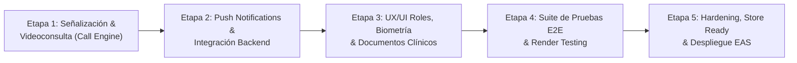
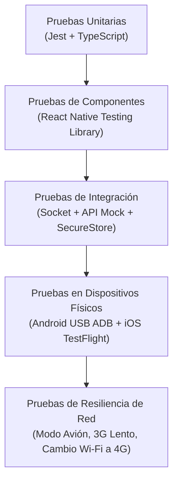

# 📱 Plan Maestro de Ingeniería: Finalización de la App Móvil VetConnect (Expo SDK 54)

## Descripción del Objetivo
Llevar la aplicación móvil de telemedicina veterinaria **VetConnect Mobile** (`@vetconnect/mobile`) desde su estado actual (**Nivel 4.5 Pre-Gold Master**, con 14 suites y 118 tests unitarios pasando) hasta su versión comercial final (**Nivel 5: Gold Master**), lista para publicación y distribución en **Google Play Store** y **Apple App Store**. El plan aborda la resolución de la deuda técnica restante (señalización de videollamadas, pipeline backend de notificaciones push, UI de llamada entrante, navegación dinámica por roles, biometría y tests de renderizado) bajo arquitectura limpia, seguridad clínica (Ley 25.326) y normativas de accesibilidad móvil.

---

## 1. Estructura del Plan (Etapas y Objetivos)

El desarrollo restante se organiza en **5 etapas progresivas**:



### Etapa 1: Motor de Señalización y Experiencia de Llamada Entrante (Días 1 a 4)
- **Objetivo:** Resolver el flujo completo de videoconsulta WebRTC desde el dispositivo móvil, permitiendo alertar al tutor o veterinario con timbre/vibración ante una llamada entrante (`call:incoming`), contestar/rechazar en tiempo real y enlazar de forma transparente con la sala WebRTC (`ConsultationRoom`).

### Etapa 2: Notificaciones Push e Integración Transaccional Backend (Días 5 a 8)
- **Objetivo:** Cablear el ciclo de vida de push notifications en segundo plano y pantalla bloqueada mediante Expo Push API y cerrar la deuda backend (`prisma.notification.create`) para alertar ante triage asignado, nuevos mensajes en chat y recetas emitidas.

### Etapa 3: Segmentación por Rol, Biometría y Gestión de Archivos Clínicos (Días 9 a 12)
- **Objetivo:** Adaptar dinámicamente la navegación (Tabs diferenciados para `CLIENT` vs `VET`), incorporar autenticación biométrica (Face ID / Huella digital), permitir subida de estudios médicos en PDF y captura directa con cámara, e integrar datos clínicos enriquecidos (recetas y reviews en el detalle de la consulta).

### Etapa 4: Cobertura Integral de Pruebas de Render y Validación E2E (Días 13 a 16)
- **Objetivo:** Implementar pruebas de renderizado en React Native Testing Library para las 19 pantallas de la app, simular casos extremos de conectividad (offline, reconexión lenta, token expirado) y auditar WCAG móvil (contrastes, talkback/voiceover).

### Etapa 5: Empaquetado de Producción, Tiendas y Despliegue (Días 17 a 20)
- **Objetivo:** Configuración de credenciales de firma en EAS (`credentials.json`), compilación de AAB (Android App Bundle) e IPA (iOS), submission a Google Play Console (Closed Testing) y Apple TestFlight, y activación del sistema de actualizaciones OTA (Over-The-Air).

---

## 2. Herramientas Externas, Frameworks y Bibliotecas Necesarias

### 2.1 Ecosistema Base (Ya operativo en el proyecto)
- **Framework Core:** React Native `0.81.4` + React `19.1.0`.
- **Plataforma & Tooling:** Expo `~54.0.0` con New Architecture habilitada.
- **Enrutador:** Expo Router `~6.0.0` (file-based navigation con typed routes).
- **Estilos:** NativeWind `^4.1.0` + Tailwind CSS `^3.4.17` + `react-native-css-interop`.
- **Estado Global:** Zustand `^5.0.3` con persistencia en memoria y hardware keychain.
- **Almacenamiento Criptográfico:** `expo-secure-store ~15.0.0` (Keystore en Android / Secure Enclave en iOS).
- **Comunicación:** Axios `^1.12.0` (con cola de reintentos 401 `failedQueue`) y Socket.io Client `^4.8.1`.
- **Contratos:** Zod `^3.24.2` para validación estricta en runtime.

### 2.2 Nuevas Bibliotecas y SDKs a Incorporar
| Biblioteca / Herramienta | Versión Compatible | Propósito Técnico |
|---|---|---|
| `expo-local-authentication` | `~15.0.0` | Autenticación biométrica nativa (Face ID, Touch ID, BiometricPrompt). |
| `expo-document-picker` | `~14.0.0` | Selección y carga de historiales médicos y análisis en formato PDF. |
| `expo-av` | `~15.0.0` | Reproducción de ringtone / timbre de llamada entrante en bucle sonoro. |
| `expo-haptics` | `~14.0.0` | Feedback háptico en botones clínicos de emergencia y patrón de vibración en llamadas. |
| `@react-native-community/netinfo`| `^11.4.1` | Detección reactiva de conectividad para todo el árbol de navegación. |
| `@testing-library/react-native` | `^13.0.0` | Tests de renderizado de componentes y flujos de pantallas. |

### 2.3 Servicios Externos & APIs
- **Servicio de Videoconferencia SFU:** LiveKit Cloud WebRTC (instancia `wss://vetconnect-cloud.livekit.cloud`).
- **Servicio Push:** Expo Push Notification Service (APNs para Apple y FCM v1 para Google).
- **Monitoreo & Crashes:** Sentry React Native (`@sentry/react-native`) para captura de excepciones no controladas.
- **Almacenamiento Cloud:** AWS S3 / Cloudflare R2 con Presigned URLs para subida directa de adjuntos clínicos.
- **Plataformas de Publicación:** Expo Application Services (EAS Build + EAS Submit + EAS Update).

---

## 3. Tareas Específicas de Ingeniería por Etapa

### 📦 Etapa 1: Motor de Señalización & Llamadas (`call-engine`)
1. **Modelado y Tipado de Señalización:**
   - Tipar eventos de llamada en `mobile/src/types/socket.types.ts`: `call:incoming`, `call:answered`, `call:rejected`, `call:missed`.
2. **Servicio y Hook `useIncomingCall`:**
   - Crear `src/services/callSignaling.ts` y hook global en `app/(app)/_layout.tsx`.
   - Al recibir `call:incoming`, disparar `expo-av` (sonido ring) y `expo-haptics` en bucle.
3. **Componente Modal Overlay de Llamada Entrante (`IncomingCallModal.tsx`):**
   - Renderizar sobre cualquier pantalla: Nombre del veterinario/tutor, foto, motivo de triaje, botón verde "Atender" y botón rojo "Rechazar".
   - Al aceptar: detener audio, emitir `call:answered` y navegar automáticamente a `/call/[consultationId]`.
   - Al rechazar: detener audio, emitir `call:rejected` y cerrar modal.
4. **Hardening de la Sala WebView (`call/[consultationId].tsx`):**
   - Corregir el ciclo de permisos de `expo-camera` y `expo-av` (solicitar permisos en hardware antes de montar la WebView).
   - Inyectar el token de sesión de forma segura y escuchar el evento `call:ended` para volver a la app nativa con solicitud de calificación.

### 📦 Etapa 2: Push Notifications & Backend Integration (`push-pipeline`)
1. **Backend: Generación de Entidades `Notification`:**
   - Crear helper `createNotificationAndPush()` en `backend/src/modules/notifications/notifications.service.ts`.
   - Disparar notificaciones en:
     - Asignación de veterinario a consulta (`WAITING` ➔ `ACTIVE`).
     - Mensaje entrante de chat si el destinatario no tiene el socket enfocado en esa sala.
     - Emisión de receta digital médica con QR.
     - Llamada de emergencia entrante (con payload de alta prioridad para despertar la app).
2. **Mobile: Receptor y Manejador en Background:**
   - Configurar `Notifications.setNotificationHandler` en `src/services/notifications.ts` para comportamiento en foreground y background.
   - Manejar la interacción con la notificación: enrutar al deep link correspondiente (`vetconnect://chat/123`, `vetconnect://prescriptions/456`).
3. **Paginación en Pantalla de Notificaciones (`app/(app)/notifications.tsx`):**
   - Implementar infinite scroll con `FlatList`, pull-to-refresh y botón "Marcar todas como leídas".

### 📦 Etapa 3: Adaptación por Rol, Biometría y Documentación Médica (`ui-enrichment`)
1. **Tabs Dinámicos por Rol (`app/(app)/_layout.tsx`):**
   - Si `role === 'VET'`: ocultar pestañas irrelevantes de tutor ("Mascotas", "Nueva Consulta") y mostrar pestañas profesionales ("Guardia Médica", "Historial Clínico", "Perfil SENASA").
   - Si `role === 'CLIENT'`: mostrar "Mis Mascotas", "Pedir Guardia", "Recetas", "Perfil".
2. **Polling Reactivo de Aprobación SENASA:**
   - Para veterinarios en estado `PENDING`, consultar cada 10 segundos el endpoint `/api/users/profile` o escuchar evento socket `vet:approved` para desbloquear la interfaz automáticamente sin forzar logout.
3. **Autenticación Biométrica (`src/lib/biometrics.ts`):**
   - Integrar `LocalAuthentication.authenticateAsync` tras el primer login exitoso.
   - Permitir login rápido en inicios posteriores leyendo las credenciales de `expo-secure-store`.
4. **Carga Multimodal de Archivos (`media.service.ts`):**
   - Integrar `expo-document-picker` para permitir subida de archivos `.pdf`.
   - Agregar validación preventiva de tamaño en cliente (`< 10 MB`) antes de iniciar la subida para evitar consumir datos móviles en vano.
   - Enriquecer la vista `consultation/[id].tsx` para listar las recetas vinculadas (`prescriptions[]`) y mostrar la reseña clínica emitida.

### 📦 Etapa 4: Suite de Pruebas Automatizadas y QA de Calidad (`qa-testing`)
1. **Pruebas Unitarias & Render Testing:**
   - Instalar `@testing-library/react-native`.
   - Crear suites de render para pantallas core:
     - `login.test.tsx` (validación de campos, error de credenciales, login exitoso).
     - `triage.test.tsx` (selección de síntomas, cálculo de urgencia Roja/Amarilla/Verde).
     - `pets.test.tsx` (renderizado de lista, formulario con validación ISO de chip).
     - `chat.test.tsx` (envío con debounce, renderizado de burbujas, banner offline).
2. **Auditoría de Accesibilidad (a11y):**
   - Verificar etiquetas `accessibilityLabel`, `accessibilityRole` y `accessibilityHint` en todos los botones de acción médica.
   - Validar compatibilidad con lectores de pantalla TalkBack (Android) y VoiceOver (iOS).
   - Comprobar escalado dinámico de tipografía (`allowFontScaling={true}`).

### 📦 Etapa 5: Despliegue, Publicación y Tiendas (`stores-deploy`)
1. **Configuración de `eas.json` y Credenciales:**
   - Crear perfiles `development`, `preview` (APK interno) y `production` (AAB/IPA).
   - Generar Keystore de Android gestionada por EAS.
   - Configurar cuenta de desarrollador Apple con certificados de distribución y Provisioning Profiles.
2. **Generación de Assets de Publicación:**
   - Splash screens adaptativos y Adaptive Icons con padding seguro para Android 12+.
   - Generación de capturas de pantalla promocionales en resoluciones oficiales (6.5", 5.5", 12.9" para iOS; 1080x1920 y 1080x2400 para Android).
3. **Cuestionarios de Seguridad y Cumplimiento:**
   - Data Safety Section en Google Play Console (declarar uso de cámara, audio, almacenamiento y cifrado en tránsito HTTPS/WSS).
   - App Privacy Questions en App Store Connect (acceso a cámara/micrófono para videoconsultas de salud animal, sin tracking publicitario).
4. **Despliegue de Actualizaciones OTA (Over-The-Air):**
   - Configurar canal `production` en EAS Update para corregir bugs en JS/TypeScript en segundos sin esperar los días de revisión de las tiendas.

---

## 4. Cronograma Estimado (20 Días de Ejecución / 4 Semanas)

| Semana | Días Hábiles | Hitos y Fases de Trabajo | Entregable Clave |
|---|---|---|---|
| **Semana 1** | Días 1 – 5 | **Etapa 1:** Señalización de llamadas + Ringtone/Haptics + Modal de llamada entrante + Handshake WebRTC en WebView. | Flujo de videollamada móvil de punta a punta probado entre 2 dispositivos. |
| **Semana 2** | Días 6 – 10 | **Etapa 2:** Backend push integration + Manejadores background Expo Push + Paginación de notificaciones. | Notificaciones push reales operando con pantalla apagada en Android e iOS. |
| **Semana 3** | Días 11 – 15 | **Etapa 3 & 4 (Parcial):** Tabs por rol + Biometría + Carga de PDFs + Inicio de suite de render testing con RNTL. | App con UX diferenciada para tutores y veterinarios + 140+ tests en verde. |
| **Semana 4** | Días 16 – 20 | **Etapa 4 (Cierre) & Etapa 5:** Finalización de tests + Compilación AAB/IPA en EAS + Submission a Google Play y TestFlight. | App enviada a revisión en Google Play Console y Apple App Store Connect. |

---

## 5. Recursos Humanos y Técnicos Requeridos

### 5.1 Roles en el Equipo
1. **Tech Lead / Mobile Senior Architect (1):** Supervisión de arquitectura, contratos Zod, gestión de tokens en SecureStore y control de calidad.
2. **Desarrollador React Native / Expo (1 o 2):** Implementación de pantallas, integración de módulos nativos (`expo-av`, `expo-local-authentication`, `expo-document-picker`), layouts en NativeWind.
3. **Backend Engineer (1 - tiempo parcial):** Implementación del despachador push en Express 5 y creación de registros `Notification` en PostgreSQL.
4. **Diseñador UI/UX (Damian Orellana - Colaborativo):** Handoff de especificaciones visuales de llamadas entrantes, empty states de notificaciones y banners adaptativos en Figma.
5. **QA / Automation Engineer (1):** Diseño de matrices de prueba en dispositivos físicos y redacción de tests en `@testing-library/react-native`.

### 5.2 Recursos Técnicos (Hardware y Software)
- **Dispositivos Físicos de Prueba:**
  - 1 teléfono Android con Android 11+ (para pruebas de ADB reverse, permisos de cámara y notificaciones FCM).
  - 1 iPhone con iOS 16+ (para pruebas de Face ID, permisos de WebRTC en Safari WebView y APNs).
- **Cuentas de Desarrollador Oficiales:**
  - Cuenta Google Play Console ($25 USD pago único, verificación D-U-N-S si aplica a empresa).
  - Cuenta Apple Developer Program ($99 USD anuales).
  - Cuenta Expo (EAS Build tier gratuito o plan On-Demand para builds en la nube).
  - Cuenta LiveKit Cloud (instancia SFU activa).
- **Software Local:**
  - Node.js 20 LTS, Git, VS Code / Cursor / Android Studio (para emulador y ADB) y Xcode (en macOS para iOS Simulator).

---

## 6. Resultados Esperados y Entregables por Etapa

| Etapa | Entregable Tangible | Criterio de Aceptación |
|---|---|---|
| **Etapa 1** | Módulo `callSignaling.ts` y componente `IncomingCallModal.tsx`. | Un veterinario llama desde la web y el teléfono suena, vibra y muestra la pantalla modal de atención inmediata. |
| **Etapa 2** | Endpoints de backend emitiendo push + listener móvil en background. | Al agendar una consulta o enviar un mensaje, llega un banner push con el logo oficial y sonido de alerta al celular. |
| **Etapa 3** | Navegación `Tabs` contextual por rol, selector de PDF y módulo Face ID. | Un veterinario solo ve herramientas médicas; un tutor puede entrar con su huella y adjuntar un análisis en PDF de 5 MB. |
| **Etapa 4** | Suite unificada de pruebas con >140 tests automatizados. | `npm test -w mobile` ejecuta pruebas unitarias y de render con 100% de éxito y cero regresiones. |
| **Etapa 5** | Artefacto `.aab` para Android y `.ipa` para iOS subidos a las consolas de desarrollador. | Build aprobado por el validador de Google Play Console y disponible para testers en TestFlight. |

---

## 7. Estrategia de Pruebas y Validación (QA)



### 7.1 Niveles de Prueba
1. **Pruebas de Lógica Pura (Unitarias):**
   - Validación de esquemas Zod (microchip de 15 dígitos, campos obligatorios de mascota).
   - Máquina de estados de triaje (priorización de pacientes rojos sobre verdes).
   - Sincronización incremental del chat (verificar que no se pierdan mensajes perdidos tras reconexión).
2. **Pruebas de Renderizado de UI:**
   - Probar que los modales se abran y cierren correctamente.
   - Probar que el estado de carga (`ActivityIndicator`) y error se muestren honestamente.
   - Verificar la regla de "Cero Métricas Falsas": si el veterinario no tiene opiniones, renderizar `—` y el badge "Nuevo", nunca estrellas inventadas.
3. **Pruebas de Resiliencia en Red:**
   - Pérdida de señal durante el chat: activación inmediata del banner offline y reintento automático con `clientMsgId` al volver la conexión.
   - Expiración de refresh token: el usuario es redirigido limpiamente a la pantalla de login sin errores crudos ni bloqueos de pantalla.

---

## 8. Despliegue, Publicación en Tiendas y Mantenimiento Post-Lanzamiento

### 8.1 Proceso de Publicación en Tiendas

#### Google Play Store (Android):
1. **Compilación de Producción:**
   ```bash
   eas build --platform android --profile production
   ```
2. **Fase de Closed Testing (Pruebas Cerradas):**
   - Requisito obligatorio de Google Play: 14 días de pruebas continuas con al menos 12 testers activos verificados antes de solicitar acceso a producción pública.
3. **Aprobación & Lanzamiento Abierto:**
   - Completar ficha de producto en español neutro, iconografía de alta resolución y política de privacidad accesible en URL pública (`https://vetconnect.com.ar/privacy-policy`).

#### Apple App Store (iOS):
1. **Compilación con EAS:**
   ```bash
   eas build --platform ios --profile production
   ```
2. **Distribución en TestFlight:**
   - Despliegue inmediato para beta testers internos (hasta 100 usuarios) y externos (hasta 10,000 mediante enlace público).
3. **App Store Review:**
   - Proveer credenciales de prueba al equipo de revisión de Apple (una cuenta `CLIENT` con mascota cargada y una cuenta `VET` aprobada).
   - Incluir video demostrativo del funcionamiento de la videoconsulta WebRTC.

### 8.2 Plan de Mantenimiento Post-Lanzamiento (SLA & Operación)
- **Monitoreo en Tiempo Real (Sentry Mobile):**
  - Alerta inmediata en caso de que la tasa de sesiones libres de caídas (*Crash-Free Sessions*) caiga por debajo del **99.5%**.
- **Canal de Actualizaciones Rápidas (EAS Update - OTA):**
  - Para parches críticos en código JavaScript/TypeScript (errores de interfaz, ajustes de textos o bugs de sincronización), desplegar directamente a los usuarios sin esperar el proceso de revisión de las tiendas:
    ```bash
    eas update --branch production --message "fix: resolucion de bug en reconexion de chat"
    ```
- **Compatibilidad con Nuevas Versiones de OS:**
  - Revisiones semestrales para asegurar compatibilidad con las nuevas versiones de Android (ej. Android 16) e iOS (iOS 19/20), actualizando permisos y librerías base.
- **Auditoría Trimestral de Seguridad y Tokens:**
  - Rotación de claves API de servicios de mapas, analíticas y verificación de certificados SSL/TLS para evitar expiraciones en producción.
