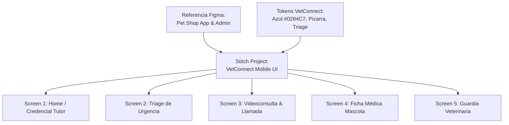

# 🎨 Plan de Diseño: Generación de UI en Stitch para VetConnect Mobile

Este plan detalla la estrategia para crear el proyecto de diseño en **Google Stitch** basado en la referencia de Figma *"Pet Shop App Full admin website dashboard mobile app"*, aplicando una arquitectura visual profesional, iconografía vectorial oficial (`@expo/vector-icons` / Lucide / Feather) y erradicación total de emojis.

---

## 🎯 1. Descripción del Objetivo

Crear un sistema de diseño y conjunto de pantallas en **Google Stitch** (`deviceType: "MOBILE"`) adaptadas a la telemedicina veterinaria de **VetConnect**, combinando:
1. **Estructura Clínica & Credenciales (Inspiración Mi Argentina):** Credencial digital de la mascota con microchip, vacunas al día y estado SENASA.
2. **Jerarquía Visual Moderna (Referencia Pet Shop App Figma):** Tarjetas de contenido con radio `rounded-2xl`, contrastes altos, avatares de pacientes y accesos directos segmentados.
3. **Feedback Táctil & Accesibilidad:** Botones de acción clínica de 48px mínimos con relieve sólido y tipografía legible bajo estándares WCAG 2.1 AAA.
4. **Iconografía Vectorial Limpia:** Sustitución de emojis por iconografía médica y de navegación nativa (`Lucide`, `Ionicons`, `MaterialCommunityIcons`).



---

## ⚠️ User Review Required

> [!IMPORTANT]
> **Enlace del archivo de Figma:** Si tienes el archivo abierto en Figma, puedes compartir la URL completa de tu proyecto (ej. `https://www.figma.com/design/<file_key>/...` o `https://www.figma.com/community/file/...`) para que inspeccionemos directamente las capas, estilos y paleta exacta a través de la API de Figma con tu token. De lo contrario, procederemos a sintetizar la arquitectura visual de la referencia en Stitch.

---

## ❓ Open Questions

> [!NOTE]
> ¿Tienes la URL o File Key específica del archivo en tu cuenta de Figma, o comenzamos de inmediato con la creación del proyecto y la generación de las pantallas en Stitch?

---

## 📋 2. Pantallas a Generar en Stitch

| Pantalla | Propósito y Elementos Clave | Tipo de Dispositivo |
|---|---|---|
| **1. Home Tutor** | Saludo, Credencial Digital de Mascota (DNI, raza, chip, SENASA), Botón CTA de Guardia 24hs, Próximas Consultas y Receta Activa con QR. | `MOBILE` |
| **2. Triage & Solicitud** | Selector de urgencia visual (Rojo, Amarillo, Verde), selector de mascota, campo de síntomas clínicos y botón de ingreso a sala de espera. | `MOBILE` |
| **3. Videoconsulta & Incoming Call** | Modal de llamada entrante con avatar médico y botones de respuesta, sala WebRTC activa con controles de cámara, micrófono y chat médico. | `MOBILE` |
| **4. Ficha de Mascota & Vacunas** | Timeline de vacunación antirrábica/quíntuple, historial de consultas previas, descargas de recetas oficiales y datos del chip. | `MOBILE` |
| **5. Guardia Veterinaria (Vet Workspace)** | Cola de pacientes en sala de espera, botón "Atender consulta", cronómetro de atención activa, evolución diagnóstica y emisión de receta digital. | `MOBILE` |

---

## 🛠️ 3. Pasos de Ejecución Técnica

### Paso 1: Creación del Proyecto en Stitch
- Invocación de `create_project` vía Stitch MCP con el título: `"VetConnect — Telemedicina Veterinaria Mobile"`.

### Paso 2: Creación del Sistema de Diseño (Design System)
- Definición de tokens cromáticos canónicos:
  - Primario: `#0284C7` (Azul Médico)
  - Primario Oscuro: `#0369A1` / `#0F172A`
  - Fondo: `#F8FAFC` (Slate 50) y Superficies `#FFFFFF`
  - Triage Semántico: Rojo (`#EF4444`), Amarillo (`#F59E0B`), Verde SENASA (`#10B981`)
  - Tipografía: Inter / System Sans con pesos `600`, `700` y `800`.

### Paso 3: Generación de Pantallas Móviles (`generate_screen_from_text`)
- Generación secuencial de las 5 pantallas mobile mediante prompts especializados con especificación estricta de componentes, sombras, bordes y sin emojis.

### Paso 4: Revisión de Variantes y Exportación
- Inspección de las pantallas generadas en Stitch (`get_screen` / `list_screens`), generación de variantes si es necesario (`generate_variants`), y reporte de enlaces interactivos.

### Paso 5: Traslado al Código de React Native (Mobile Workspace)
- Traslado del diseño aprobado hacia los componentes nativos de la app (`mobile/src/components/`), integrando `@expo/vector-icons` para una experiencia fluida.

---

## 🧪 4. Plan de Verificación

### Pruebas Automatizadas
```bash
# Validar compilación de componentes y tests del monorepo
npm run typecheck -w mobile
npm test -w mobile
```

### Verificación Visual & Manual
1. Revisión de las pantallas generadas en el dashboard de Stitch.
2. Confirmación de contraste accesible (WCAG 2.1 AA/AAA) en todas las tarjetas y textos.
3. Validación de iconografía vectorial sin artefactos ni emojis en los componentes de la app.
