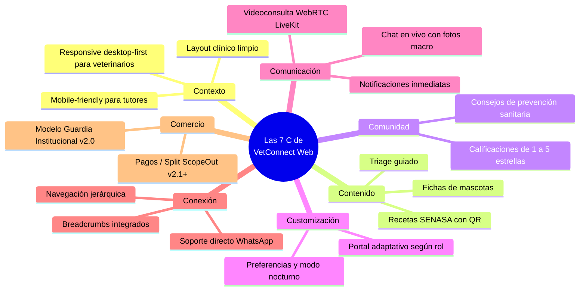

# 🎯 01. Estrategia, Relevamiento & Principios Web — VetConnect

> **Documento:** `docs/web/01_ESTRATEGIA_Y_RELEVAMIENTO.md`  
> **Fase del Proceso:** Fase 1 — Relevamiento y Definición de Objetivos  
> **Área:** Planificación Estratégica, Infraestructura Web & Principios Inmutables de Diseño  
> **Proyecto:** VetConnect — Telemedicina Veterinaria & Gestión Clínica

---

## 1. Relevamiento y Definición de Objetivos (Fase 1)

El desarrollo del sitio web de **VetConnect** no comienza con la selección de tipografías ni con la escritura de código, sino con una comprensión nítida de su razón de existir y del impacto que debe generar en sus usuarios.

### 1.1 Objetivo General de la Plataforma Web
Construir el portal web oficial de telemedicina veterinaria y gestión clínica de referencia para Argentina y Latinoamérica, proporcionando:
- A los **Médicos Veterinarios:** Un entorno de trabajo clínico en escritorio de alta productividad, ágil, seguro y respaldado legalmente para atender videoconsultas, evaluar macro-fotografías de pacientes y emitir recetas electrónicas inmutables con firma digital y código QR.
- A los **Tutores de Mascotas:** Un punto de acceso inmediato, confiable y comprensible para resolver emergencias y dudas de salud de sus animales de compañía mediante triage inteligente y teleconsulta sin necesidad de traslados estresantes.
- A los **Administradores y Reguladores:** Un centro de fiscalización para validar credenciales ante SENASA, consultar bitácoras de auditoría (`AuditLog`) y supervisar el cumplimiento sanitario.

### 1.2 Objetivos Específicos & Métricas de Éxito (KPIs)
- **Tasa de Conversión de Triage:** Más del 85% de los tutores que inician el flujo de consulta deben completar la solicitud en menos de 90 segundos.
- **Tiempo de Conexión de Guardia:** Emparejar y conectar al tutor con un veterinario matriculado online en menos de 3 minutos.
- **Emisión de Prescripción Inmutable:** Reducir el tiempo de confección de una receta médica digital estructurada a menos de 2 minutos post-llamada.
- **Claridad de Propósito (Test de 5 Segundos):** El 95% de los nuevos visitantes debe identificar de qué trata la plataforma en su primera visita.
- **Velocidad de Carga (LCP):** Despliegue del Largest Contentful Paint en menos de 1.8 segundos en conexiones 4G/WiFi promedio.

---

## 2. Los 10 Pasos para Crear la Plataforma Web de VetConnect

El proceso de desarrollo web profesional se traduce en 10 acciones concretas distribuidas en el cronograma de trabajo:

| # | Paso | ¿Qué hacemos en VetConnect? | Tiempo Estimado | Responsable Primario |
|---|---|---|---|---|
| **1** | **Definir objetivos** | Establecer metas clínicas, operativas y legales del portal web | 1-2 días | Product Owner / Tech Lead |
| **2** | **Estudiar al público** | Definir perfiles (Tutores, Veterinarios, Administradores) y contextos | 1 día | Diseñador UX / Equipo Clínico |
| **3** | **Registrar dominio y hosting** | Contratar dominio `vetconnect.com.ar` y configurar servidores VPS/Cloud | 1-2 horas | DevOps / Tech Lead |
| **4** | **Elegir la plataforma** | Arquitectura SPA React 18.3.1 (LTS/Stable) + Vite + Tailwind CSS sobre Express 5 API | 1 día | Arquitecto de Software |
| **5** | **Crear el mapa del sitio** | Elaborar árbol web, jerarquía de 3 niveles, menús y breadcrumbs | 2-4 horas | Diseñador UX/UI |
| **6** | **Diseñar la identidad visual** | Definir tokens, paleta 60-30-10, tipografía y mockups en Figma | 3-7 días | Diseñador UI (Figma Lead) |
| **7** | **Desarrollar el sitio** | Base de Aplicación SPA Implementada (Nivel 4.5 Pre-Gold Master, 29 tests pasando). Fase activa: Refactorización atómica en Storybook (`components/ui/`) y ensamblado de alta fidelidad | 5-20 días | Desarrolladores Frontend |
| **8** | **Cargar el contenido** | Redactar textos clínicos claros, guías de triage y optimizar imágenes | 2-5 días | Copywriter / Especialista Veterinario |
| **9** | **Hacer pruebas (QA)** | Auditoría de usabilidad (Nielsen), accesibilidad WCAG y cross-browser | 2-3 días | QA Engineer / Equipo UX |
| **10** | **Publicar y medir** | Despliegue en producción con SSL, Google Analytics y Search Console | 1 día | DevOps / Tech Lead |

---

## 3. ¿Qué Necesitamos para Diseñar la Web de VetConnect?

Antes de trazar interfaces en Figma o escribir código en React, se definen los pilares fundamentales del proyecto:

### 3.1 Objetivo Claro
VetConnect Web busca brindar atención clínica en tiempo real y gestión documental veterinaria. No es un blog pasivo ni una tienda genérica de alimentos para mascotas: es un **sistema telemédico interactivo de misión crítica**.

### 3.2 Contenido Básico Preparado
- **Textos Institucionales:** Misión, visión médica, marco de respaldo SENASA y leyes de ejercicio profesional veterinario.
- **Catálogo de Servicios:** Teleconsulta inmediata de guardia, consultas programadas, fichas clínicas digitales y emisión de recetas oficiales.
- **Acceso Multicanal & Descarga Móvil:** Enlace y banner en la landing page para descarga directa del instalador Android `.apk` de la app móvil en fase piloto (`/downloads/vetconnect-preview.apk`), facilitando la adopción a costo cero antes de la publicación en Google Play Console (conforme a [`docs/DEPLOY.md`](../DEPLOY.md)).
- **Identidad Corporativa:** Logotipo oficial en formato vectorial SVG (fusión de cruz médica, huella animal y ondas de conectividad).
- **Recursos Fotográficos:** Banco de imágenes de alta resolución de profesionales reales con vestimenta clínica y animales de compañía en ambientes hogareños confortables.

### 3.3 Dominio Oficial
- **Nombre de Dominio:** `vetconnect.com.ar` (y alternativa regional `vetconnect.lat`).
- **Proveedor:** NIC Argentina para el dominio nacional (`.com.ar`).
- **Costo Anual Estimado:** ~$12.000 ARS anuales.
- **Justificación:** Otorga validación de identidad geográfica, confianza a los usuarios locales y mejor posicionamiento SEO en el mercado argentino.

### 3.4 Infraestructura & Hosting (Alineado con DEPLOY.md)
- **Frontend Web SPA:** Alojado oficialmente en CDN edge de alto rendimiento (**Vercel** / Coolify en VPS) con rewrites automáticos en [`web/vercel.json`](../../web/vercel.json).
- **Backend API & WebSockets:** Servidor Node.js 20 con Express 5 administrado mediante **Coolify en VPS Hetzner** dedicado con terminación Traefik TLS 1.3 y certificados Let's Encrypt para HTTPS y WSS.
- **Base de Datos & Cache:** PostgreSQL administrado (Supabase / Postgres 16) y Redis 7 para colas y pub/sub de sockets.
- **Servidor de Medios WebRTC:** LiveKit Cloud SFU para videollamadas 720p sin sobrecarga de CPU en el servidor principal.
- **Distribución Móvil:** Compilaciones con EAS Build (Expo): instalador `.apk` directo en la web para la fase piloto y paquete `.aab` para el lanzamiento comercial en Google Play Store.
- **Costo Mensual Estimado de Infraestructura:** Entre $18.000 y $35.000 ARS mensuales para el entorno inicial de producción (servidor VPS base + Redis + Postgres gestionado).

### 3.5 Presupuesto y Estimación 2026
El presupuesto de diseño y puesta en marcha se alinea con la escala de un desarrollo a medida (Custom Web Application con WebRTC y WebSockets), garantizando una inversión eficiente sin costos ocultos de licencias propietarias recurrentes.

### 3.6 Referentes Visuales y de Experiencia
Para calibrar la estética y la experiencia de usuario de VetConnect, se seleccionaron tres referentes de la industria digital:
1. **Teladoc Health / Oscar Health:** Referente en telemedicina humana. Destaca por su claridad en el triage inicial, su sala de espera interactiva y la disposición minimalista de las recetas médicas digitales.
2. **Chewy Vet Care:** Referente en diseño empático para el cuidado animal. Manejo ejemplar de fichas de mascotas, avatares y lenguaje comprensible para tutores estresados.
3. **Linear / Notion:** Referente en interfaces web profesionales de escritorio. Excelente uso de paleta neutra, tipografía `Inter`, atajos de teclado y distribución de información en tarjetas sin sobrecarga visual.

---

## 4. Las 7 C de VetConnect Web (Marco de Rayport y Jaworski)

El marco clásico de las 7 C permite validar exhaustivamente la solidez del diseño web de la plataforma:

### Detalle Operativo de las 7 C:

1. **Contexto (Diseño y Estructura):**  
   Estilo *Clean Clinical Modernism*. En computadoras de escritorio ofrece una pantalla dividida eficiente para el veterinario (videollamada + ficha médica + evolución clínica simultáneas); en móviles ofrece navegación fluida mediante menú inferior y accesos directos de emergencia.
2. **Contenido (Textos, Datos y Medios):**  
   Información médica estructurada, historias clínicas completas, alertas de vacunación, fichas de triage paso a paso y previsualización de recetas médicas.
3. **Comunidad (Interacción y Respaldo Social):**  
   Sistema de reputación médica con reseñas de 1 a 5 estrellas (ADR-023), verificado por consultas reales y fiscalizado para evitar fraudes o agresiones.
4. **Customización (Personalización):**  
   La interfaz se reconfigura dinámicamente según el rol autenticado (`CLIENT`, `VET`, `ADMIN`). Un veterinario accede a su tablero de guardia, mientras que el tutor visualiza a sus mascotas registradas con sus nombres y fotos.
5. **Comunicación (Diálogo Sistema-Usuario y Usuario-Médico):**  
   Canales sincrónicos multiformato: video 720p de alta definición con bitrate adaptativo, chat de texto con subida de fotografías macro y notificaciones en tiempo real del estado de atención.
6. **Conexión (Vínculos y Navegación):**  
   Arquitectura de navegación con jerarquía en 3 niveles, enlaces breadcrumbs en cada sección clínica y conexión directa con servicios de soporte y emergencias físicas presenciales.
7. **Comercio (Modelo Operativo y Transacciones):**  
   Pasarela de pagos formalmente ScopeOut en v2.0 (modelo de guardia institucional gratuita). Ver [`docs/web/03_REQUERIMIENTOS_Y_PMV.md`](./03_REQUERIMIENTOS_Y_PMV.md).

---

## 5. Los 3 Principios del Diseño Web que Nunca Cambian

Independientemente de las modas visuales, VetConnect Web se rige por tres principios innegociables:

### 5.1 Principio 1: Claridad de Propósito
El tutor que accede al sitio con una mascota en crisis debe comprender en **menos de 5 segundos** qué servicio ofrece VetConnect y qué botón presionar para recibir ayuda. No se ocultan las acciones críticas tras menús complejos ni se muestra publicidad distractiva.

### 5.2 Principio 2: Usabilidad en Cualquier Dispositivo (Responsive & Adaptive)
- **Más del 70% del tráfico de tutores proviene de teléfonos inteligentes.** Por ello, la landing page y el formulario de triage se diseñan bajo la premisa **Mobile-First**.
- **El 90% de los veterinarios de guardia atienden desde computadoras de escritorio o portátiles.** Por tanto, la consola profesional del médico se diseña bajo la premisa **Desktop-Optimized**, aprovechando pantallas anchas (1080p / 1440p) para multitarea clínica sin scroll excesivo.

### 5.3 Principio 3: Velocidad de Carga & La Regla de los 3 Segundos

> [!WARNING]
> **La Regla de los 3 Segundos en Salud Digital:**  
> Un tutor angustiado o un médico de guardia abandona un sitio que tarda más de 3 segundos en responder. Según estudios de Google, el **53% de los usuarios móviles abandona un sitio que supera los 3 segundos de carga**. En una emergencia veterinaria, 3 segundos de pantalla en blanco generan pánico y deserción inmediata hacia una clínica física o una búsqueda informal no calificada.

#### Estrategia Técnica para Garantizar Velocidad Extrema en VetConnect:
1. **Imágenes en Formato Moderno WebP & AVIF:** Todos los avatares, fotos de mascotas y banners institucionales se comprimen y convierten automáticamente, reduciendo su peso entre un 60% y un 80% frente a PNG/JPEG estándar.
2. **Servidores de Baja Latencia en Argentina / Región:** Hosting y CDN con nodos perimetrales en Buenos Aires y San Pablo para garantizar un Tiempo al Primer Byte (TTFB) $< 120\text{ ms}$.
3. **Código Limpio y Moderno:** SPA en React 18.3.1 (LTS/Stable para LiveKit) empaquetada con Vite (cero bloatware, sin dependencias pesadas innecesarias), aplicando división de código (*Code Splitting*) por rutas dinámicas (`React.lazy`).
4. **Caché Inteligente y CDN:** Distribución de activos estáticos (CSS, JS, iconos SVG, fuentes Inter) con encabezados `Cache-Control: public, max-age=31536000, immutable`.
5. **Pre-fetching de Recursos Críticos:** Pre-conexión DNS y precarga de fuentes (`preconnect` y `preload`) en el `<head>` del HTML.

---
*Documento de Estrategia y Relevamiento Web — VetConnect 2026.*
