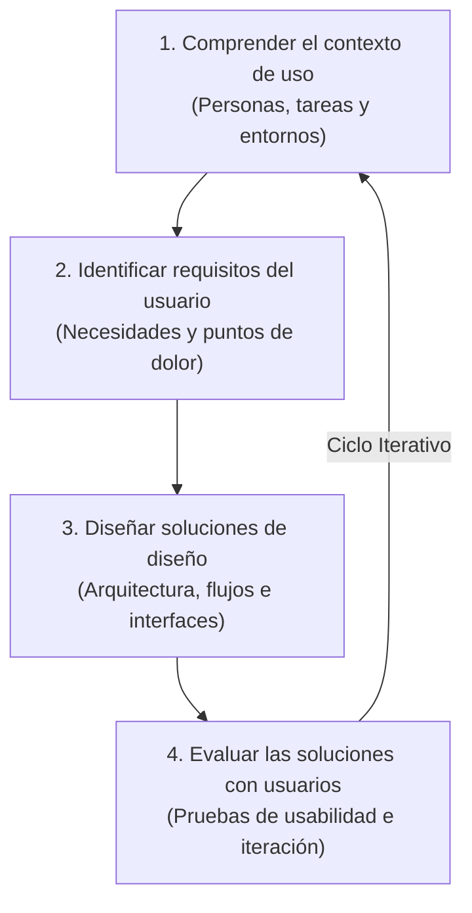
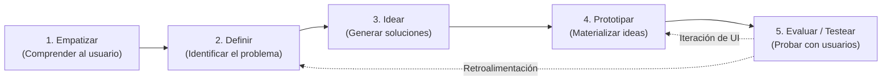

# 🧠 02. Investigación, DCU & Design Thinking — VetConnect

> **Documento:** `docs/web/02_INVESTIGACION_DCU_Y_DESIGN_THINKING.md`  
> **Marco Metodológico:** ISO 9241-210 (Diseño Centrado en el Usuario) & Design Thinking de 5 Etapas  
> **Área:** Investigación de Usuarios, Mapas de Empatía, Accesibilidad Universal & Manifiesto Ético  
> **Proyecto:** VetConnect — Telemedicina Veterinaria & Gestión Clínica

---

## 1. Introducción al Diseño Centrado en el Usuario (DCU)

En el ámbito de la salud y la telemedicina veterinaria, diseñar únicamente desde la perspectiva técnica o del desarrollador es una receta directa para el fracaso. Un software puede tener una base de datos perfectamente normalizada y endpoints rápidos, pero si el tutor de una mascota accidentada no encuentra el botón de auxilio médico en 5 segundos, la experiencia fracasa con consecuencias críticas.

El **Diseño Centrado en el Usuario (DCU)** —concepto acuñado fundamentalmente por Donald Norman en la década de 1980 y estandarizado internacionalmente en la norma **ISO 9241-210**— coloca a las personas, sus emociones, sus contextos reales y sus limitaciones físicas o cognitivas en el centro de cada decisión de diseño.



### 1.1 Usabilidad Según la Norma ISO 9241-11
La norma ISO 9241-11 establece tres pilares cuantitativos y cualitativos para evaluar el éxito de VetConnect Web:
1. **Eficacia:** El grado en que los usuarios logran sus objetivos clínicos específicos (ej. completar el triage, conectarse a la videoconsulta, obtener la receta oficial). Meta en VetConnect: $> 98\%$.
2. **Eficiencia:** Los recursos y el tiempo invertidos por el usuario para alcanzar la meta (ej. menos de 3 clics para solicitar guardia médica, menos de 60 segundos para redactar la evolución clínica).
3. **Satisfacción:** La comodidad, tranquilidad emocional y percepción de profesionalismo experimentadas durante la interacción.

---

## 2. Arquetipos de Usuario y Contexto Real de Uso

El principio fundamental del DCU dicta que *las personas no utilizan productos digitales en condiciones de laboratorio ideales*. La experiencia se transforma drásticamente según el entorno físico y psicológico.

### 2.1 Arquetipo 1: El Tutor de Mascota en Crisis (`CLIENT`)
- **Perfil Sociodemográfico:** Personas de 20 a 65 años, trabajadores o familias con uno o más animales de compañía (perros, gatos, animales pequeños). Nivel tecnológico heterogéneo (desde nativos digitales hasta adultos mayores).
- **Contexto de Uso Extremo:** Son las 23:30 hs. El perro ha ingerido un tóxico o vomita repetidamente. El tutor está angustiado, con taquicardia y sosteniendo al animal agitado con una mano mientras sostiene el teléfono o busca auxilio en su portátil en penumbras.
- **Requisitos de Diseño Derivados:**
  - Botones táctiles de gran tamaño y contraste visible.
  - Preguntas de triage breves y guiadas (evitar redacción de ensayos en un teclado pequeño).
  - Lenguaje empático, libre de tecnicismos médicos incomprensibles.
  - Indicación clara de "Conectando con el médico" y tiempo de espera estimado para calmar la ansiedad.

### 2.2 Arquetipo 2: El Médico Veterinario de Guardia (`VET`)
- **Perfil Sociodemográfico:** Profesionales veterinarios matriculados ante SENASA y colegios profesionales, de 25 a 60 años. Acostumbrados a alta carga horaria, estrés asistencial y escaso tiempo administrativo.
- **Contexto de Uso:** Consultorio o estación de trabajo domiciliaria. Conexión de escritorio con pantalla de 1080p o superior, ratón, teclado y webcam. Puede tener 3 o 4 pacientes en cola de espera simultánea.
- **Requisitos de Diseño Derivados:**
  - Consola de escritorio de alta densidad de información sin saturación visual.
  - Pantalla dividida: Video del paciente a la izquierda, ficha clínica y chat con macro-fotografías al centro, notas de evolución a la derecha.
  - Atajos de teclado para aceptar llamadas, silenciar micrófono y emitir recetas.
  - Validación asistida de fármacos y dosis para prevenir errores de prescripción.

### 2.3 Arquetipo 3: El Administrador / Auditor Regulatorio (`ADMIN`)
- **Perfil Sociodemográfico:** Personal técnico o auditor sanitario institucional responsable de la transparencia y legalidad operativa.
- **Contexto de Uso:** Horario laboral de oficina, navegación mediante navegadores de escritorio modernos.
- **Requisitos de Diseño Derivados:**
  - Tablas estructuradas con filtros avanzados por matrícula, fecha y estado.
  - Visualizador de bitácoras inmutables (`AuditLog`) con registros RFC 3339.
  - Botones de acción con confirmación de dos pasos para revocación de accesos o suspensión de profesionales.

---

## 3. Las 5 Etapas del Design Thinking en VetConnect

El proceso de innovación en VetConnect fusiona el DCU con la metodología de **Design Thinking**, abordando el diseño como un ciclo de experimentación e iteración constante:



### 3.1 Etapa 1: Empatizar (Escucha y Observación Profunda)
- **Investigación de Campo:** Entrevistas a más de 40 tutores de mascotas y 15 veterinarios clínicos de guardia en Buenos Aires y el interior del país.
- **Hallazgos Clave:** El 78% de los tutores declaró haber sentido "desesperación e impotencia" al no saber si un síntoma nocturno ameritaba salir corriendo a una guardia presencial a 15 km de distancia. Por su parte, los veterinarios manifestaron hartazgo de recibir consultas no remuneradas e informales por WhatsApp sin historial previo.

### 3.2 Etapa 2: Definir (El Problema Central del Usuario)
> **Definición del Problema (Point of View):**  
> *"Los tutores de mascotas necesitan una forma inmediata, confiable y guiada de evaluar y atender los signos clínicos de sus animales en momentos de incertidumbre, porque las clínicas físicas nocturnas suelen estar distantes o saturadas y el autodiagnóstico en internet genera decisiones peligrosas."*

### 3.3 Etapa 3: Idear (Exploración de Alternativas)
Se generaron diversas hipótesis de solución:
- Chatbot automatizado de IA diagnóstica *(descartado por riesgos legales y regulatorios ante SENASA)*.
- Sistema de turnos diferidos a 24 horas *(inútil para urgencias clínicas)*.
- **Solución Seleccionada:** Triage algorítmico reactivo en 60 segundos + Matching inmediato con veterinario de guardia online + Videollamada HD con LiveKit SFU + Receta electrónica oficial inmutable con código QR.

### 3.4 Etapa 4: Prototipar (Representaciones Visuales Progresivas)
- **Baja Fidelidad:** Bocetos a mano alzada y esquemas de bloques en papel (Actividad 25).
- **Media Fidelidad:** Wireframes digitales en escala de grises para validar la navegación y la ubicación de controles críticos.
- **Alta Fidelidad:** Prototipo interactivo en Figma desarrollado por el equipo de diseño UI/UX (Damian Orellana), integrando la regla 60-30-10 y componentes accesibles.

### 3.5 Etapa 5: Evaluar / Testear (Validación Iterativa)
- Pruebas de usabilidad cronometradas con tutores reales utilizando el prototipo interactivo.
- Detección de fricciones: Se descubrió que el campo para ingresar el número de microchip confundía a los tutores en el flujo de emergencia. Se resolvió convirtiéndolo en un campo opcional postergable para la ficha general de la mascota.

---

## 4. Mapas de Empatía de VetConnect

El mapa de empatía sintetiza los aspectos psicológicos, sensoriales y conductuales de los dos actores principales del sistema:

### 4.1 Mapa de Empatía: Tutor de Mascota en Emergencia (`CLIENT`)

```
+---------------------------------------------------------------------------------------------------------------+
|                                      MAPA DE EMPATÍA — TUTOR DE MASCOTA                                       |
+-------------------------------------------------------+-------------------------------------------------------+
| ¿QUÉ PIENSA Y SIENTE?                                 | ¿QUÉ VE?                                              |
| • "Tengo miedo de que mi perro empeore de golpe."     | • A su mascota decaída, quejándose o sangrando.       |
| • "No sé si darle una pastilla humana o no."         | • Su casa de noche, la clínica de siempre cerrada.    |
| • Siente culpa, angustia y necesidad de auxilio.      | • Búsquedas alarmistas y contradictorias en Google.   |
+-------------------------------------------------------+-------------------------------------------------------+
| ¿QUÉ ESCUCHA?                                         | ¿QUÉ DICE Y HACE?                                     |
| • Quejidos y respiración entrecortada de su animal.   | • "Por favor, dígame si es grave o si puede esperar." |
| • Familiares nerviosos dando consejos contradictorios.| • Intenta calmar al animal acariciándolo.             |
| • "Los veterinarios de noche te cobran fortunas."     | • Busca en su teléfono una solución inmediata.        |
+-------------------------------------------------------+-------------------------------------------------------+
| FRUSTRACIONES / ESFUERZOS (PAINS)                     | NECESIDADES / MOTIVACIONES (GAINS)                    |
| • No poder trasladar a un animal pesado sin coche.    | • Hablar cara a cara con un profesional en minutos.   |
| • Pérdida de tiempo en salas de espera abarrotadas.   | • Que le expliquen con calma los pasos a seguir.      |
| • La incertidumbre médica que no deja dormir.         | • Una receta digital clara con la medicación exacta.  |
+-------------------------------------------------------+-------------------------------------------------------+
```

### 4.2 Mapa de Empatía: Médico Veterinario de Guardia (`VET`)

```
+---------------------------------------------------------------------------------------------------------------+
|                                    MAPA DE EMPATÍA — VETERINARIO DE GUARDIA                                   |
+-------------------------------------------------------+-------------------------------------------------------+
| ¿QUÉ PIENSA Y SIENTE?                                 | ¿QUÉ VE?                                              |
| • "Necesito ver al paciente con buena iluminación."   | • Pantalla de su computadora con historial clínico.   |
| • "Tengo que registrar todo para cubrirme legalmente."| • Fotos desenfocadas enviadas por tutores nerviosos.  |
| • Siente vocación médica pero fatiga administrativa.  | • Regulaciones exigentes de SENASA y recetas apócrifas|
+-------------------------------------------------------+-------------------------------------------------------+
| ¿QUÉ ESCUCHA?                                         | ¿QUÉ DICE Y HACE?                                     |
| • Al tutor hablando acelerado sin ordenar los datos.  | • "Tranquilo/a, enfóqueme las encías del perro."      |
| • Ruido ambiental del hogar del paciente.             | • Toma notas de evolución mientras realiza preguntas. |
| • Exigencias de inmediatez sin respetar protocolos.   | • Valida antecedentes de vacunas y peso de la mascota.|
+-------------------------------------------------------+-------------------------------------------------------+
| FRUSTRACIONES / ESFUERZOS (PAINS)                     | NECESIDADES / MOTIVACIONES (GAINS)                    |
| • Videollamadas que se cortan o con audio deficiente. | • Estabilidad de video WebRTC y audio cristalino.     |
| • Sistemas médicos complejos con mil campos inútiles. | • Redacción de recetas en 3 clics con firma digital.  |
| • Pacientes que no proporcionan datos clínicos previos| • Respaldo inmutable de cada decisión clínica tomada. |
+-------------------------------------------------------+-------------------------------------------------------+
```

---

## 5. Manifiesto Ético del Diseño en Salud Digital

Inspirados en los debates contemporáneos sobre el diseño de productos digitales (analizados en episodios de referencia como *Abstract: The Art of Design*), en VetConnect adoptamos una **postura ética inquebrantable**:

### 5.1 Responsabilidad Social y Ética del Diseñador
El diseño no es una disciplina neutra: cada decisión de interfaz modifica directamente el comportamiento, la salud mental y, en nuestro caso, la supervivencia de seres sintientes. VetConnect prohíbe explícitamente cualquier mecánica de manipulación o explotación de la vulnerabilidad emocional del tutor.

### 5.2 Rechazo Absoluto a Recursos Nocivos y "Dark Patterns"
- **Prohibición de Retención Artificial de Uso:** VetConnect no busca que el usuario pase horas dentro de la plataforma. La métrica de éxito es **resolver el problema de salud en el menor tiempo posible** para que el tutor se dedique a cuidar a su animal.
- **Cero Notificaciones de Ansiedad o Clickbait:** Prohibido enviar alertas automáticas que simulen falsas alarmas médicas para forzar aperturas de app o visitas al sitio.
- **Transparencia Financiera & Modelo Institucional:** En la versión v2.0, el acceso de triage y guardia telemédica es provisto bajo un modelo de cobertura institucional sin aranceles de entrada. Para la futura incorporación de pasarelas de pago comerciales (v2.1+), las tarifas y honorarios profesionales deberán mostrarse de forma explícita y transparente antes de ingresar al servicio, prohibiendo cargos ocultos o renovaciones no consentidas.
- **Prioridad de Urgencia Vital:** Si las respuestas del triage sugieren riesgo de vida inminente (paro respiratorio, dilatación gástrica, hemorragia activa), el sistema interrumpe cualquier flujo secundario y muestra en pantalla completa las instrucciones de primeros auxilios y la geolocalización de las clínicas físicas de guardia presencial más cercanas.

---
*Documento de Investigación DCU y Design Thinking — VetConnect 2026.*
