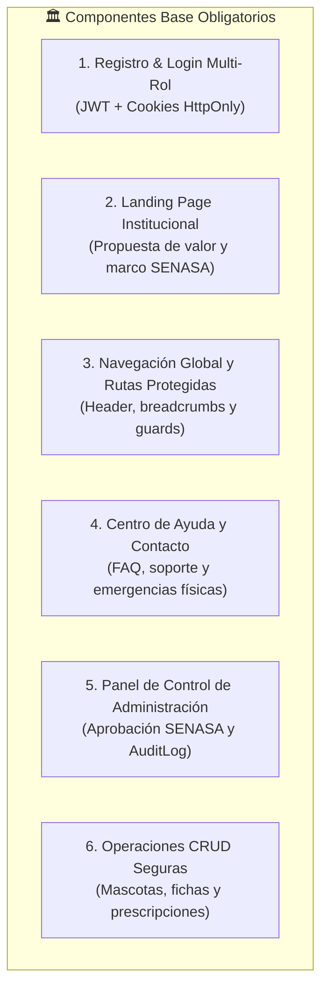
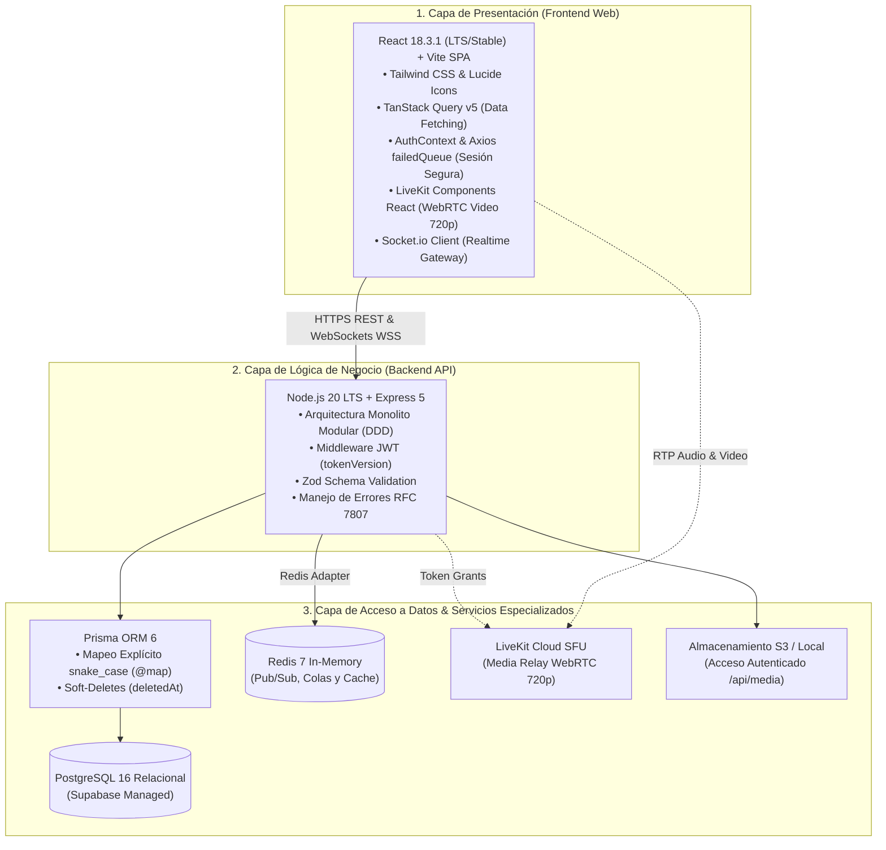

# 📋 03. Requerimientos, PMV & Arquitectura del Sistema — VetConnect

> **Documento:** `docs/web/03_REQUERIMIENTOS_Y_PMV.md`  
> **Marco Metodológico:** Incorpora formalmente la **Actividad 15 – Requerimientos y Producto Mínimo Viable (PMV)**  
> **Área:** Requerimientos de Software, Alcance del PMV y Arquitectura de Sistemas  
> **Proyecto:** VetConnect — Telemedicina Veterinaria & Gestión Clínica

---

## 1. Usuario, Necesidad y Solución Web

> 📌 Ver arquetipos de usuario canónicos y mapas de empatía en [02_INVESTIGACION_DCU_Y_DESIGN_THINKING.md (§2)](./02_INVESTIGACION_DCU_Y_DESIGN_THINKING.md#2-arquetipos-de-usuario-proto-personas).

Todo sistema digital nace a partir de una necesidad insatisfecha. En VetConnect, la necesidad primaria es conectar en tiempo real a tutores de animales en situaciones de duda o urgencia clínica con médicos veterinarios matriculados, eliminando barreras geográficas y reduciendo la incertidumbre médica mediante herramientas telemédicas seguras.

Programar código sin una definición rigurosa de requerimientos produce sistemas caóticos y retrabajo costoso. Por tanto, en esta sección se formalizan las funciones exactas que el portal web ejecutará (**Requerimientos Funcionales**) y los atributos de calidad con los que operará (**Requerimientos No Funcionales**).

---

## 2. Requerimientos del Sistema Web (Actividad 15 — Parte 1)

### 2.1 Requerimientos Funcionales (RF)

Los requerimientos funcionales definen **qué hace el sistema** y las acciones concretas disponibles para los usuarios:

| ID | Nombre | Descripción del Requerimiento | Actor Principal |
|---|---|---|---|
| **RF-WEB-01** | Autenticación y Registro Multi-Rol | El sistema debe permitir el registro e inicio de sesión seguro para tutores (`CLIENT`) y médicos (`VET`), gestionando sesiones mediante JWT con cookies `HttpOnly` e invalidación instantánea por `tokenVersion`. | `CLIENT`, `VET`, `ADMIN` |
| **RF-WEB-02** | Gestión de Ficha Clínica de Mascotas (CRUD) | El sistema debe permitir a los tutores crear, consultar, actualizar y dar de baja lógica (`deletedAt`) a sus mascotas, registrando especie, raza, fecha de nacimiento, peso y microchip ISO. | `CLIENT` |
| **RF-WEB-03** | Triage Telemédico Guiado | El sistema debe proporcionar un cuestionario secuencial reactivo de síntomas que clasifique la urgencia en tres niveles semánticos: Verde (Leve), Amarillo (Moderada) y Rojo (Vital). | `CLIENT` |
| **RF-WEB-04** | Tablero de Guardia Profesional | La web debe ofrecer a los veterinarios un switch de disponibilidad (`isOnline: true/false`), visualizando en tiempo real la cola de pacientes en espera ordenados por urgencia y tiempo de arribo. | `VET` |
| **RF-WEB-05** | Consola de Videoconsulta Telemédica | El sistema debe integrar una sala WebRTC en alta definición (LiveKit SFU 720p) con controles de micrófono, cámara, pantalla completa y finalización de llamada. | `VET`, `CLIENT` |
| **RF-WEB-06** | Chat Sincrónico Multimodal | Durante la consulta médica, el sistema habilita un chat de texto bidireccional con idempotencia (`clientMsgId`) y soporte completo para adjuntar y visualizar macro-fotografías clínicas con visor modal (*Lightbox* con soporte para tecla `Escape`). *(Estado empírico en código: 100% implementado en `ConsultationRoom.tsx`, consumiendo el endpoint activo `POST /api/media` con validación de Magic Bytes y previsualización HD)*. | `VET`, `CLIENT` |
| **RF-WEB-07** | Generador de Recetas Oficiales SENASA | El médico debe poder redactar la prescripción médica estructurada (fármacos, dosis, duración, indicaciones) y firmarla digitalmente, generando un PDF inmutable con código QR de verificación. | `VET` |
| **RF-WEB-08** | Descarga e Historial de Recetas | El tutor debe poder consultar y descargar en cualquier momento las recetas médicas electrónicas asociadas a sus mascotas desde su portal web. | `CLIENT` |
| **RF-WEB-09** | Panel de Fiscalización Administrativa | El sistema debe permitir a los administradores revisar solicitudes de alta de veterinarios, validar su matrícula ante SENASA (`vetStatus: APPROVED/REJECTED`) y revocar accesos. | `ADMIN` |
| **RF-WEB-10** | Trazabilidad y Registro de Auditoría | Cada mutación administrativa y médica crítica genera un registro inmutable en PostgreSQL (`audit_logs`) con marcas de tiempo RFC 3339 (ADR-014). *(El visor visual en UI está planificado como extensión de reportería administrativa avanzada)*. | `ADMIN` |
| **RF-WEB-11** | Acceso Directo a Cola de Triage y Guardia Institucional | El sistema debe permitir al tutor ingresar de forma inmediata a la cola de atención médica tras completar el triage clínico, operando bajo cobertura de guardia médica institucional sin aranceles de entrada en v2.0. | `CLIENT` |
| **RF-WEB-12** | Calificación y Reseñas Médicas | Al finalizar la consulta, el tutor debe poder calificar al profesional de 1 a 5 estrellas con un comentario opcional, recalculando el promedio atómico del médico. | `CLIENT` |

### 2.2 Requerimientos No Funcionales (RNF)

Los requerimientos no funcionales definen **cómo debe comportarse el sistema** en términos de calidad, rendimiento, accesibilidad y seguridad:

| ID | Nombre | Criterio de Calidad y Métrica Objetivo | Norma / Estándar |
|---|---|---|---|
| **RNF-WEB-01** | Responsividad Extrema | La interfaz debe adaptarse fluidamente a dispositivos móviles (360px+), tablets y escritorios (1920px+). | Responsive Web Design |
| **RNF-WEB-02** | Rendimiento y Velocidad (Core Web Vitals) | El Largest Contentful Paint (LCP) debe ser $< 2.0\text{ s}$ y el Interaction to Next Paint (INP) $< 150\text{ ms}$. | Google Core Web Vitals |
| **RNF-WEB-03** | Accesibilidad Digital Inclusiva | La plataforma debe cumplir con el nivel AA de las pautas WCAG 2.1, garantizando contraste mínimo de 4.5:1 y navegación completa por teclado. | WCAG 2.1 Nivel AA |
| **RNF-WEB-04** | Latencia de Mensajería y Señalización | La entrega de mensajes de chat y eventos Socket.io debe mantenerse con un P95 $< 80\text{ ms}$. | RFC Realtime SLAs |
| **RNF-WEB-05** | Seguridad en Sesiones y Cookies Cross-Domain | Los refresh tokens se transmiten en cookies `HttpOnly`. En producción cross-domain (`app.vetconnect.com.ar` hacia `api.vetconnect.com.ar`), requiere estrictamente `SameSite=None; Secure` montado sobre HTTPS en ambos extremos para prevenir el descarte silencioso en navegadores basados en Chromium. | OWASP ASVS Nivel 2 |
| **RNF-WEB-06** | Protección de Datos Personales (PII) | Los correos y teléfonos de los usuarios nunca se expondrán en URLs, tokens JWT de LiveKit ni en endpoints públicos. | Ley N° 25.326 |
| **RNF-WEB-07** | Tolerancia a Fallos e Idempotencia | Los reintentos de mensajes con `clientMsgId` idéntico deben responder HTTP 200 con el registro existente sin duplicar datos en base de datos. | RFC 7231 |
| **RNF-WEB-08** | Disponibilidad del Servicio | El portal web y la API deben garantizar una disponibilidad mínima del 99.5% anual en horario de guardia. | High Availability SLA |

---

## 3. Funcionalidades Base Comunes del Portal Web

Todo proyecto web profesional debe incorporar ciertos componentes mínimos obligatorios. En VetConnect Web se implementan de la siguiente manera:

1. **Página Principal (Landing Page):** Propuesta de valor, acceso rápido al botón de emergencia médica, explicación de cómo funciona en 3 pasos, testimonios de tutores y sellos de habilitación sanitaria.
2. **Registro e Inicio de Sesión:** Pantallas unificadas con selector de rol (`Tutor` / `Veterinario`), validaciones Zod en tiempo real y flujo de recuperación de contraseña.
3. **Apartado Institucional / Legal:** Misión médica, nómina de directores técnicos veterinarios, términos de servicio y políticas de protección de datos (Ley 25.326).
4. **Formulario de Contacto y Soporte:** Canal de asistencia técnica directa para problemas de conectividad, acceso a la cuenta o funcionamiento de la videoconsulta, complementado con botón directo de WhatsApp de soporte.
5. **Operaciones CRUD Universales:** Todas las entidades gestionables (mascotas, consultas, recetas) implementan creación, lectura estructurada, edición controlada y eliminación lógica (*soft-delete* con `deletedAt`).

---

## 4. Definición del Producto Mínimo Viable (PMV — Actividad 15 — Parte 2)

El **Producto Mínimo Viable (PMV)** es la primera versión funcional del sistema diseñada para resolver la necesidad médica esencial sin adornos superfluos: *conectar a un tutor con un veterinario de guardia en una videoconsulta HD y emitir una receta válida con QR*.

### 4.1 Alcance del PMV v2.0 vs. Backlog Futuro (v2.1+)

| Característica / Módulo | Estado en PMV (v2.0) | Justificación de Prioridad |
|---|---|---|
| **Registro y Login con JWT** | ✅ **INCLUIDO** | Crítico para autenticar roles y proteger datos médicos. |
| **Alta y Ficha Clínica de Mascotas** | ✅ **INCLUIDO** | Esencial para que el veterinario sepa a quién está atendiendo. |
| **Triage Guiado de Urgencia** | ✅ **INCLUIDO** | Necesario para clasificar el nivel de riesgo del paciente. |
| **Videoconsulta WebRTC 720p (LiveKit)** | ✅ **INCLUIDO** | Núcleo del servicio de telemedicina sincrónica. |
| **Chat con Subida de Macro-Fotos** | ✅ **INCLUIDO** | Imprescindible para evaluar lesiones en detalle. Backend `POST /api/media` 100%; selector web con Magic Bytes y Lightbox 100% operativo. |
| **Emisión de Receta Digital con QR** | ✅ **INCLUIDO** | Exigencia sanitaria legal ante farmacias y SENASA. |
| **Panel de Fiscalización Admin SENASA**| ✅ **INCLUIDO** | Obligación regulatoria para habilitar veterinarios de guardia. |
| **Modelo de Guardia Médica Institucional** | ✅ **INCLUIDO** | Atención telemédica inmediata post-triage sin aranceles en el MVP. |
| *Pasarela de Pagos / Split Payments* | ⏳ *ScopeOut / Backlog (v2.1+)* | Fuera de alcance para v2.0 (docs/PLAN_DE_PROYECTO_Y_GESTION.md:214). Módulo transaccional planificado para v2.1+. |
| *Veterinarios Favoritos / Re-asignación*| ⏳ *Backlog (v2.1+)* | No esencial para la atención de urgencia inmediata de guardia. |
| *Recordatorio Automático de Vacunas*  | ⏳ *Backlog (v2.1+)* | Funcionalidad diferida de fidelización pos-consulta. |
| *Foro Comunitario entre Tutores*       | ⏳ *Backlog (v2.1+)* | Añade moderación compleja no prioritaria para el PMV. |
| *IA Generativa de Pre-Diagnóstico*     | ❌ *Descartado*    | Riesgo ético y prohibido por la normativa veterinaria vigente. |

---

## 5. Arquitectura de Sistemas & Selección Tecnológica

Para responder técnicamente a la pregunta *¿cómo estará organizado el sistema web?*, VetConnect adopta una **Arquitectura en Capas desacoplada mediante un Monolito Modular**:

### 5.1 Justificación de la Elección Tecnológica:
- **Monolito Modular vs. Microservicios:** VetConnect descarta los microservicios por su complejidad operacional innecesaria en la etapa actual. El Monolito Modular garantiza desacoplamiento limpio mediante módulos aislados (`auth/`, `pets/`, `consultations/`, `media/`) dentro de un único proceso de despliegue predecible y de alto rendimiento.
- **React 18.3.1 (LTS/Stable) + Vite:** Elección arquitectónica validada (commit `2559f55`) para garantizar máxima estabilidad y cero conflictos de *peer-dependencies* con `@livekit/components-react` y `@testing-library/react`. Integra `AuthContext` con almacenamiento de token en memoria y cola de concurrencia Axios (`failedQueue`) para mitigar condiciones de carrera en refresh JWT. React 19 se mantiene en la hoja de ruta de actualización una vez que el ecosistema de LiveKit soporte oficialmente sus peer-deps.
- **Express 5 + Prisma 6:** Combina el framework HTTP más maduro del ecosistema con un ORM de tipos estrictos que elimina por completo discrepancias de contratos entre la base de datos y la interfaz de usuario.
- **Política de Monorepo Limpio (ADR-008):** Conforme a [`docs/DECISIONS.md`](../DECISIONS.md#adr-008), se descarta formalmente el paquete `packages/shared`. La fuente única de verdad para contratos y validaciones reside en los esquemas Zod y DTOs modulares del backend (ubicados canónicamente en `backend/src/modules/*/*.schemas.ts`), los cuales se sincronizan como interfaces TypeScript nativas en web (`web/src/types/`) y mobile, previniendo fallos de tooling y dependencias circulares en builds de Vite y Metro.

### 5.2 Catálogo Canónico de Endpoints Consumidos por la SPA Web

Para garantizar que cualquier agente de IA o desarrollador cuente con el contrato completo y sin ambigüedades, la siguiente matriz detalla el 100% de los endpoints consumidos por la aplicación web, sus esquemas de validación Zod en backend y sus tipos sincronizados en `web/src/types/index.ts`:

| Módulo Backend | Método | Ruta del Endpoint | Uso en Frontend Web (`web/src/`) | Contrato de Request / Response | Esquema Zod Backend (SSOT) |
|---|---|---|---|---|---|
| **`auth`** | `POST` | `/api/auth/register` | `pages/Register.tsx` | Body: `{ email, password, firstName, lastName, role, licenseNumber?, bio? }` → `{ success: true, data: { accessToken, user } }` | `modules/auth/auth.schemas.ts` |
| **`auth`** | `POST` | `/api/auth/login` | `pages/Login.tsx` | Body: `{ email, password }` → `{ success: true, data: { accessToken, user } }` (Cookie: `refreshToken`) | `modules/auth/auth.schemas.ts` |
| **`auth`** | `POST` | `/api/auth/refresh` | `services/api.ts` | Cookie `refreshToken` → `{ success: true, data: { accessToken } }` | `modules/auth/auth.schemas.ts` |
| **`auth`** | `POST` | `/api/auth/logout` | `context/AuthContext.tsx` | Invalida cookie `refreshToken` → `{ success: true, message: "Logged out" }` | `modules/auth/auth.schemas.ts` |
| **`auth`** | `GET` | `/api/auth/me` | `context/AuthContext.tsx` | Header `Bearer ${token}` → `{ success: true, data: { user: UserProfile } }` | `modules/auth/auth.schemas.ts` |
| **`users`** | `GET` | `/api/users/profile` | `context/AuthContext.tsx` | Header `Bearer ${token}` → `{ success: true, data: UserProfile }` | `modules/users/users.schemas.ts` |
| **`users`** | `PATCH` | `/api/users/profile` | `pages/DashboardVet.tsx` | Body: `{ isOnline?: boolean, speciality?: string, bio?: string }` → `{ success: true, data: UserProfile }` | `modules/users/users.schemas.ts` |
| **`pets`** | `GET` | `/api/pets` | `pages/DashboardClient.tsx` | Header `Bearer ${token}` → `{ success: true, data: Pet[] }` | `modules/pets/pets.schemas.ts` |
| **`pets`** | `POST` | `/api/pets` | `pages/DashboardClient.tsx` | Body: `{ name, species, breed, weightKg?, microchip? }` (`breed` min 1 char) → `{ success: true, data: Pet }` | `modules/pets/pets.schemas.ts` |
| **`pets`** | `GET` | `/api/pets/:id` | `pages/DashboardClient.tsx` | Param: `id` (UUID v4) → `{ success: true, data: Pet }` | `modules/pets/pets.schemas.ts` |
| **`pets`** | `PATCH` | `/api/pets/:id` | `pages/DashboardClient.tsx` | Param: `id`, Body: `Partial<PetInput>` → `{ success: true, data: Pet }` | `modules/pets/pets.schemas.ts` |
| **`pets`** | `DELETE` | `/api/pets/:id` | `pages/DashboardClient.tsx` | Param: `id` → Soft-delete (`deletedAt = now`) | `modules/pets/pets.schemas.ts` |
| **`consultations`**| `GET` | `/api/consultations/mine` | `pages/DashboardClient.tsx`, `pages/DashboardVet.tsx` | Retorna consultas asignadas + sala de espera (WAITING). No requiere ni filtra query params. | `modules/consultations/consultations.schemas.ts` |
| **`consultations`**| `POST` | `/api/consultations` | `pages/DashboardClient.tsx` (Triage) | Body: `{ petId, notes }` (La prioridad visual 'GREEN'\|'YELLOW'\|'RED' se antepone en notes como `[Prioridad: ${priority}] ${notes}`) → `{ success: true, data: Consultation }` | `modules/consultations/consultations.schemas.ts` |
| **`consultations`**| `GET` | `/api/consultations/:id` | `pages/ConsultationRoom.tsx` | Param: `id` (UUID v4) → `{ success: true, data: Consultation & { pet, client, vet } }` | `modules/consultations/consultations.schemas.ts` |
| **`calls`** | `POST` | `/api/calls/:id/token` | `pages/ConsultationRoom.tsx` | Param: `id` (Consultation UUID) → `{ success: true, data: { token: string, wsUrl: string } }` (Zero PII) | `modules/calls/calls.schemas.ts` |
| **`prescriptions`**| `GET` | `/api/prescriptions/:id` | `pages/PrescriptionView.tsx` | Param: `id` (UUID v4) → `{ success: true, data: Prescription & { vet, consultation: { pet } } }` | `modules/prescriptions/prescriptions.schemas.ts` |
| **`prescriptions`**| `POST` | `/api/consultations/:id/prescriptions` | `pages/ConsultationRoom.tsx` | Body: `{ medication, dosage, frequency, durationDays, indications }` (`indications` obligatorio min 5 chars) → `{ success: true, data: Prescription }` | `modules/prescriptions/prescriptions.schemas.ts` |
| **`admin`** | `GET` | `/api/admin/vets/pending` | `pages/AdminVets.tsx` | Header `Bearer ${token}` (Role `ADMIN`) → `{ success: true, data: PendingVet[] }` | `modules/admin/admin.schemas.ts` |
| **`admin`** | `PATCH` | `/api/admin/vets/:id/approve`| `pages/AdminVets.tsx` | Param: `id` (Vet UUID) → `{ success: true, data: { id, vetStatus: 'APPROVED' } }` | `modules/admin/admin.schemas.ts` |
| **`admin`** | `PATCH` | `/api/admin/vets/:id/reject` | `pages/AdminVets.tsx` | Param: `id`, Body: `{ reason: string }` → `{ success: true, data: { id, vetStatus: 'REJECTED' } }` | `modules/admin/admin.schemas.ts` |
| **`media`** | `POST` | `/api/media` | `pages/ConsultationRoom.tsx` | `multipart/form-data` (archivo imagen, validación Magic Bytes, cuota diaria) → `{ success: true, data: { id, url, mimeType } }` | `modules/media/media.schemas.ts` |
| **`media`** | `GET` | `/api/media/:id` | `pages/ConsultationRoom.tsx` (Lightbox) | Param: `id` (UUID v4) protegido con control de acceso clínico (Tutor / Veterinario / Admin) | `modules/media/media.schemas.ts` |

---
*Documento de Requerimientos y PMV Web — VetConnect 2026.*
