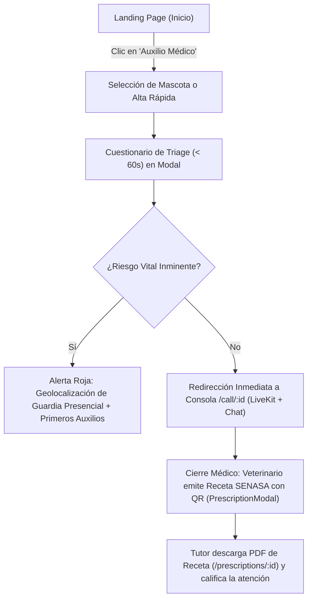

# 🗺️ 04. Arquitectura de Información, Árbol Web & Navegación — VetConnect

> **Documento:** `docs/web/04_ARQUITECTURA_DE_INFORMACION_Y_NAVEGACION.md`  
> **Marco Metodológico:** Incorpora la **Actividad: "Diseñando el mapa de navegación" (Jerarquía, Menús & Breadcrumbs)**  
> **Área:** Arquitectura de la Información (AI), Sistemas de Navegación Global y Flujos de Usuario  
> **Proyecto:** VetConnect — Telemedicina Veterinaria & Gestión Clínica

---

## 1. Fundamentos de la Arquitectura de Información (AI)

La Arquitectura de Información (AI) es la disciplina encargada de organizar, rotular y estructurar los contenidos digitales de una plataforma para que los usuarios encuentren rápidamente lo que buscan y completen sus tareas con el menor esfuerzo cognitivo posible.

En un ecosistema telemédico de misión crítica como **VetConnect**, una AI deficiente puede demorar la atención de un animal en estado crítico. Por ello, la información se organiza siguiendo una estructura jerárquica estricta de **3 niveles**, con navegación contextual y migas de pan (*breadcrumbs*) estandarizadas.

---

## 2. Jerarquía de Contenidos: El Árbol Web de VetConnect (Paso 1)

El mapa del sitio web se divide en tres dominios principales: **Portal Público Institucional**, **Portal Profesional del Veterinario (`VET`)** y **Portal Administrativo y Regulatorio (`ADMIN`)**.

```
[Nivel 1] Inicio (Landing Page — /)
   ├── [Nivel 2] Autenticación & Acceso (/login, /register)
   ├── [Nivel 2] Portal del Tutor (/client/dashboard)
   │    ├── [Nivel 3] Gestión de Mascotas (Alta & Ficha Médica ISO)
   │    └── [Nivel 3] Triage Clínico Reactivo (Modal de Urgencia) ──> Redirección inmediata a /call/:id
   ├── [Nivel 2] Videoconsulta Telemédica HD (/call/:id)
   │    ├── [Nivel 3] Audio/Video WebRTC LiveKit 720p
   │    └── [Nivel 3] Chat Clínico con Adjuntos Fotográficos (/api/media)
   └── [Nivel 2] Receta Digital Oficial SENASA (/prescriptions/:id)
        └── [Página Final] Vista Imprimible A4 & Verificador QR (PrescriptionView.tsx)

### 2.1 Árbol Web del Portal Profesional de Guardia (`VET`) & Panel Admin (`ADMIN`)

```
[Nivel 1] Tablero de Guardia (/vet/dashboard)
   ├── [Nivel 2] Control de Guardia (Switch isOnline & Cola en Espera)
   ├── [Nivel 2] Atención de Consulta (/call/:id)
   │    └── [Modal Clínico] Emisión de Receta Oficial SENASA con QR (PrescriptionModal)
   └── [Nivel 2] Historial de Consultas Atendidas (/vet/dashboard#historial)

[Nivel 1] Panel de Administración SENASA (/admin/vets y /admin/dashboard - Alias equivalentes)
   └── [Nivel 2] Fiscalización de Matrículas Pendientes & AuditLogs (Mapean a AdminVets.tsx)

> 🔒 **Aislamiento de Pacientes & Protección PII (Ley 25.326):**  
> Se descarta formalmente cualquier ruta de "bóveda global de pacientes" abierta (`/patients`). El médico veterinario accede a los datos clínicos del paciente exclusivamente dentro del contexto de una consulta activa asignada, garantizando el secreto médico y la minimización de datos personales.
```

---

## 3. Diseño del Menú Principal de Navegación (Paso 2)

El sistema de menús se compone de un **Header Global de Navegación Superior** adaptativo y un **Menú Lateral / Contextual** dentro de las áreas de trabajo profesionales.

### 3.1 Anatomía del Menú Superior de Escritorio (Desktop Header)

```
+-----------------------------------------------------------------------------------------------------------------------------+
| [🐾 VetConnect]   Servicios ▾   Directorio Médico   Marco Legal SENASA   Ayuda      [Iniciar Sesión]  [🚨 Auxilio Médico]   |
+-----------------------------------------------------------------------------------------------------------------------------+
```

#### Reglas de Distribución e Implementación SPA:
1. **Elementos en Barra Superior (Menú Global Fijo en Landing):**
   - **Isotipo & Nombre:** Enlace directo a la raíz (`/`).
   - **Enlaces Principales (Anclas Internas de la Landing):** *Servicios* (`#servicios` con dropdown o scroll suave), *Directorio Médico* (`#directorio`), *Marco Legal SENASA* (`#marco-legal`) y *Ayuda* (`#ayuda`). En la SPA React, estos elementos operan como **anclas de desplazamiento y modales informativos dentro de la Landing Page**, no como rutas separadas de React Router, garantizando que no se disparen errores de `NotFound.tsx`.
   - **Zona de Acción Rápida (Derecha):** Botón secundario `[Iniciar Sesión]` (navega a `/login`) y botón primario de alto contraste `[🚨 Auxilio Médico / Solicitar Guardia]` (navega a `/login` o modal de triage en `/client/dashboard`).
2. **Elementos en Dropdown Desplegable (*Servicios*):**
   - *Telemedicina de Urgencia (Triage en 60 seg)* (`#como-funciona`)
   - *Ficha Médica Digital & Carnet de Vacunas* (`#ficha-medica`)
   - *Validador de Recetas Oficiales SENASA* (`#recetas-senasa`)

### 3.2 Consola Unificada de Guardia Médica (Portal VET)

El Portal del Veterinario opera bajo una Consola de Trabajo Unificada en Panel Completo (*Full-Width Clinic Console*): Barra superior con switch de presencia ("En Guardia" / "Fuera de Guardia"), KPIs de atención rápida, lista priorizada de pacientes en espera con llamada directa (CTA), y modal flotante de prescripción médica SENASA, optimizada para resolución clínica sin navegación lateral dispersa.

---

## 4. Trazado de Breadcrumbs / Migas de Pan (Paso 3)

Las migas de pan orientan al usuario espacialmente dentro de la plataforma y le permiten retroceder jerárquicamente sin perder el contexto de su búsqueda o tarea clínica.

### 4.1 Formato Estándar de Breadcrumbs en VetConnect
```
Inicio > Categoría (Nivel 1) > Subcategoría (Nivel 2) > Detalle / Acción (Página Actual)
```

### 4.2 Ejemplos Prácticos de Implementación

#### Ejemplo A: Ficha Médica de un Paciente Canino
```
Inicio > Panel del Tutor (/client/dashboard) > Ficha de Mascota: Milo (Labrador - 4 años)
 [🔗]                     [🔗]                                   [Texto Plano]
```

#### Ejemplo B: Emisión de Receta Oficial en Consulta
```
Inicio > Panel Veterinario (/vet/dashboard) > Consulta #3492 (/call/:id [UUID v4]) > Receta SENASA
 [🔗]                    [🔗]                                       [🔗]                 [Texto Plano]
```

#### Ejemplo C: Tutor Verificando una Receta Médica
```
Inicio > Panel del Tutor (/client/dashboard) > Receta Oficial (/prescriptions/:id [UUID v4])
 [🔗]                     [🔗]                                                 [Texto Plano]
```

#### Ejemplo D: Administrador Auditando Matrículas Pendientes
```
Inicio > Panel de Administración (/admin/dashboard) > Fiscalización SENASA (/admin/vets)
 [🔗]                     [🔗]                                       [Texto Plano]
```
*(Nota de Implementación: Todos los parámetros de ruta `:id` corresponden a identificadores canónicos UUID v4 de PostgreSQL/Prisma; los códigos visuales como `#3492` o `RC-2026` son etiquetas amigables renderizadas en la interfaz).*

### 4.3 Reglas de Interacción & Usabilidad de Breadcrumbs:
- **Interoperabilidad de Enlaces:** Todos los elementos previos al último son hipervínculos interactivos con estados de foco (`focus:underline`) y cambio de cursor a puntero.
- **Página Actual no Clicable:** El último elemento representa la pantalla activa; se presenta como texto plano en gris oscuro semibold (`#0F172A`) con el atributo semántico `aria-current="page"`, evitando re-navegaciones redundantes sobre la misma vista.
- **Ubicación Espacial Consistente:** El breadcrumb se ubica siempre en la parte superior del contenido principal, exactamente debajo del header de navegación y con una separación visual limpia de `16px`.
- **Separadores Semánticos:** Se utiliza el carácter chevron accesible (`/` o `›`), implementado mediante SVG o pseudo-elementos CSS con `aria-hidden="true"` para no saturar a usuarios de lectores de pantalla.

---

## 5. Criterios de Evaluación y Autochequeo de Navegación

| Criterio | Descripción del Requisito en VetConnect | Estado de Cumplimiento |
|---|---|---|
| **Jerarquía Clara** | La navegación desciende de lo general a lo específico sin saltear niveles estructurales. | ✅ Cumple (3 niveles estrictos en arquitectura y rutas) |
| **Ubicación del Breadcrumb** | Posicionado en la parte superior del contenido principal, debajo del menú superior. | 🎨 Diseñado en Wireframes / Catálogo Storybook (`Breadcrumbs.tsx`) |
| **Usabilidad del Enlace Final** | El último elemento indica la página actual en texto plano y no es interactivo. | 🎨 Especificado con `aria-current="page"` para el sprint de UI |
| **Consistencia Terminológica** | Los nombres de las secciones en el menú coinciden al 100% con los rótulos de los breadcrumbs. | ✅ Cumple (Taxonomía unificada entre rutas y contratos) |
| **Ergonomía Táctil** | En pantallas móviles, los breadcrumbs admiten desplazamiento horizontal suave (*horizontal scroll*) sin quebrar la maquetación. | 🎨 Diseñado con tokens de accesibilidad para la fase de integración |

---

## 6. Diagrama de Flujo del Usuario (User Journey Telemédico)

El siguiente flujo ilustra el recorrido completo desde la landing page hasta la obtención de la prescripción médica:



> ℹ️ **Nota de Alcance (v2.0 vs. v2.1+):** Conforme a [`docs/PLAN_DE_PROYECTO_Y_GESTION.md:214`](../PLAN_DE_PROYECTO_Y_GESTION.md#L214), la pasarela arancelaria se encuentra formalmente excluida (ScopeOut) del MVP v2.0, garantizando auxilio médico inmediato sin barreras de cobro. La integración de pasarela transaccional se incorporará en el flujo comercial de la versión v2.1+.

---
*Documento de Arquitectura de Información y Navegación — VetConnect 2026.*
