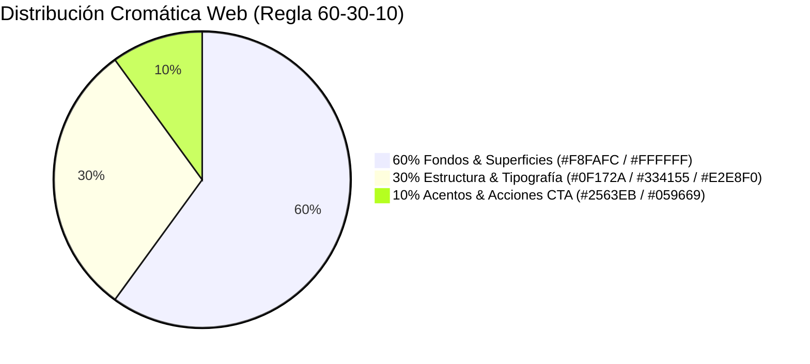
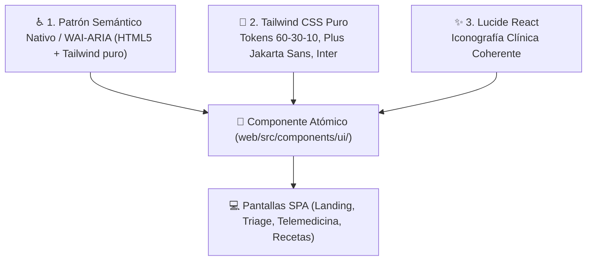
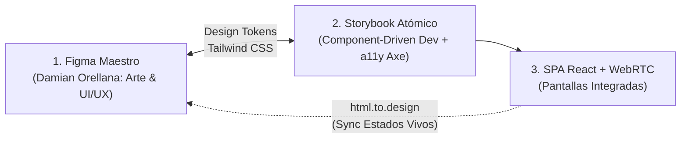

# 🎨 06. Sistema de Diseño Web & UI Kit — VetConnect

> **Documento:** `docs/web/06_SISTEMA_DE_DISENO_UI_KIT.md`  
> **Marco Metodológico:** Incorpora formalmente la **Actividad 26 – Definición del Sistema de Diseño del Producto**  
> **Área:** Sistema de Diseño (Design System), UI Kit Web, Tokens Tailwind CSS & Component-Driven Development (Storybook)  
> 🏛️ **Fuente Única de Verdad (Single Source of Truth - SSOT):** La definición canónica e inmutable de los tokens cromáticos (HEX), tipografía y personalidad de marca reside en [`docs/SISTEMA_DE_DISENO.md`](../SISTEMA_DE_DISENO.md). El presente documento especializa su **implementación técnica en React 18.3.1 LTS + Tailwind CSS, catálogo de Storybook y contratos de props**.
> **Proyecto:** VetConnect — Telemedicina Veterinaria & Gestión Clínica

---

## 1. Identidad Visual & Personalidad de Marca (UI)

El portal web de **VetConnect** no es un catálogo comercial ni una red social informal: es un entorno de salud y telemedicina veterinaria donde se toman decisiones médicas bajo situaciones de alto estrés emocional. Por este motivo, la identidad visual debe transmitir simultáneamente **máxima solvencia científica y calidez empática**.

### 1.1 Nombre y Logotipo Oficial
- **Nombre de Marca:** **VetConnect** *(Conectando la salud animal con tecnología de precisión)*.
- **Isotipo Simbólico:** Fusión vectorial de tres conceptos esenciales:
  1. *La Cruz Médica:* Símbolo universal de habilitación sanitaria y primeros auxilios.
  2. *La Huella Animal:* Representación del afecto y protección hacia perros y gatos.
  3. *Ondas de Conexión en Red:* Metáfora de la teleconsulta en tiempo real vía WebRTC.

### 1.2 Personalidad de la Marca (5 Palabras Clave)
1. 🩺 **Clínica:** Rigurosa, profesional y validada ante SENASA.
2. 🐾 **Empática:** Cálida y sensible ante el dolor del animal y la angustia del tutor.
3. ⚡ **Ágil:** Sin trabas burocráticas ni demoras en momentos de emergencia.
4. 🛡️ **Confiable:** Transparente, inmutable y respetuosa del secreto médico.
5. 🌐 **Accesible:** Clara, legible y utilizable por cualquier persona sin conocimientos técnicos.

### 1.3 Estilo Visual: Clean Clinical Modernism
El portal web adopta el estilo **Clean Clinical Modernism (Modernismo Clínico Limpio)**:
- **Superficies Despejadas:** Fondos neutros y luminosos que eliminan la saturación cognitiva.
- **Bordes Amigables:** Curvaturas redondeadas (`rounded-xl` / 12px en tarjetas e inputs, `rounded-full` en badges y avatares) que suavizan la tensión visual.
- **Elevación por Capas Sutiles:** Sombras difusas (`shadow-sm`, `shadow-md`) que generan profundidad tridimensional sin bordes duros artificiales.

> 🎨 **Directiva de Gobernanza Visual & Sincronización con Figma (Damian Orellana):**  
> El UI Kit y los tokens Tailwind documentados en este archivo representan el sistema de especificaciones acordado con el equipo de diseño y maquetado de UI/UX. Conforme a las directivas de [`AGENTS.md`](../../AGENTS.md) y la metodología de ingeniería colaborativa híbrida detallada en la [Sección 7](#7-metodología-de-sincronización-diseño-código-flujo-híbrido-virtuoso-storybook--figma--htmltodesign), Damian Orellana lidera el diseño visual en Figma mientras los desarrolladores construyen componentes atómicos en Storybook y sincronizan estados en vivo hacia Figma mediante `html.to.design` para la creación del archivo maestro, enriquecimiento estético, empty states e ilustraciones personalizadas sin fricción ni deuda de diseño.

---

## 2. Paleta Cromática Oficial & Regla 60-30-10

Para garantizar armonía visual y contraste accesible (WCAG 2.1 AA/AAA), la paleta se organiza bajo la clásica **regla de distribución cromática 60-30-10**, complementada con colores semánticos de triage:



### Tabla Maestra de Colores y Tokens CSS:

| Proporción | Rol Semántico | Código Hex | Token Tailwind | Ratio Contraste | Uso en Interfaz Web |
|---|---|---|---|---|---|
| **60% Dominante** | Fondo Base Web | `#F8FAFC` | `bg-slate-50` | Neutro | Fondo general del viewport. Sensación de limpieza y orden. |
| | Superficie Tarjeta | `#FFFFFF` | `bg-white` | Neutro | Contenedores clínicos, modales y formularios. |
| **30% Secundario**| Tipografía Mayor | `#0F172A` | `text-slate-900`| **14.2:1 (AAA)** | Títulos principales (H1, H2), nombres de pacientes y datos críticos. |
| | Tipografía Menor | `#334155` | `text-slate-700`| **9.5:1 (AAA)** | Párrafos, notas de evolución y subtítulos. |
| | Bordes y Líneas | `#E2E8F0` | `border-slate-200`| — | Separadores sutiles de tarjetas y tablas. |
| **10% Acento** | Acción Primaria | `#2563EB` | `bg-blue-600` | **4.6:1 (AA)** | Botones de auxilio médico, llamadas y enlaces interactivos. |
| | Éxito y Salud | `#059669` | `bg-emerald-600`| **4.5:1 (AA)** | Badge de veterinario online, recetas validadas y confirmaciones. |
| **Estados Clínicos**| Triage Rojo (Vital) | `#DC2626` | `bg-red-600` | 4.8:1 | Urgencia máxima, paro respiratorio o hemorragia activa. |
| | Triage Amarillo | `#D97706` | `bg-amber-600` | 4.5:1 | Urgencia moderada (claudicaciones, vómitos aislados). |
| | Informativo | `#0284C7` | `bg-sky-600` | 4.7:1 | Consejos de prevención sanitaria y avisos del sistema. |

---

## 3. Tipografía Modular Web

El sistema tipográfico combina la precisión técnica de una fuente para pantallas digitales con la calidez humanista de una fuente moderna:

| Clasificación | Familia Tipográfica | Pesos Utilizados | Justificación Técnica |
|---|---|---|---|
| **Principal (Cuerpo & Datos)** | **Inter** | Regular (400)<br/>Medium (500)<br/>SemiBold (600) | Optimizada para pantallas digitales por Rasmus Andersson. Gran altura de la 'x', números tabulares para dosis y signos vitales, y legibilidad superior en tamaños pequeños. |
| **Secundaria (Títulos & Hero)** | **Plus Jakarta Sans** | SemiBold (600)<br/>Bold (700)<br/>ExtraBold (800) | Rasgos humanistas abiertos que brindan bienvenida y calidez al usuario en encabezados (H1 a H3). |

### Escala Tipográfica Modular (Ratio 1.25 — Major Third):
- **Hero / Display (`H1`):** `32px` (`2rem`) — Plus Jakarta Sans ExtraBold — Títulos de Landing y Triage.
- **Título de Sección (`H2`):** `24px` (`1.5rem`) — Plus Jakarta Sans Bold — Encabezados de paneles y fichas.
- **Subtítulo (`H3`):** `18px` (`1.125rem`) — Plus Jakarta Sans SemiBold — Títulos de tarjetas clínicas y modales.
- **Cuerpo Base (`Body`):** `15px` (`0.9375rem`) — Inter Regular — Textos clínicos, notas de evolución y chats.
- **Metadatos & Labels (`Caption`):** `12px` (`0.75rem`) — Inter Medium — Timestamps, dosificaciones y tags.

---

## 4. Recursos Gráficos

1. **Iconografía (Lucide React Icons):**
   - Trazos lineales con grosor unificado de `2px` y esquinas redondeadas.
   - Metáforas clínicas directas: `Activity` (signos vitales), `Video` (videoconsulta), `FileText` (receta), `ShieldCheck` (SENASA), `AlertCircle` (urgencia).
2. **Ilustraciones Vectoriales (*Empty States*):**
   - Estilo *Flat Minimalist* desaturado en tonos azul clínico y pizarra.
   - Usadas en pantallas vacías ("No hay pacientes en cola de espera", "Buscando médico de guardia"), reduciendo la ansiedad del usuario.
3. **Fotografía Clínica Realista:**
   - Imágenes de médicos reales con uniforme clínico y estetoscopio, de frente y mirando a cámara.
   - Animales de compañía en entornos hogareños relajados, evitando imágenes explícitas de sangre o dolor extremo que aumenten el pánico del tutor.

---

## 5. Catálogo de Componentes UI Web (UI Kit)

### 5.1 Botones Interactivos ([`Button.tsx`](../../web/src/components/ui/Button.tsx))
- **Variante `primary` (CTA / Auxilio Médico):** `bg-blue-600 hover:bg-blue-700 text-white shadow-sm focus:ring-blue-500`
- **Variante `secondary` (Acción Secundaria de Salud / Marca):** `bg-teal-600 hover:bg-teal-700 text-white shadow-sm focus:ring-teal-500`
- **Variante `outline` (Superficie Blanca con Borde):** `border border-slate-300 text-slate-700 hover:bg-slate-50 bg-white`
- **Variante `danger` (Acción Destructiva / Botones):** `bg-rose-600 hover:bg-rose-700 text-white shadow-sm focus:ring-rose-500` (coincidente con `Button.tsx`).
- **Triage Crítico / Alerta Médica (Badges/Indicadores):** `bg-red-600` (`#DC2626`) en indicadores clínicos y alertas de riesgo vital (coincidente con `SISTEMA_DE_DISENO.md`).
- **Radio de Curvatura Estándar:** `rounded-lg` (8px) como estándar base en botones e inputs, coincidente con `Button.tsx`.
- **Variante `ghost` (Acción Sutil sin Contenedor):** `text-slate-600 hover:bg-slate-100 hover:text-slate-900`
- **Tamaños Estándar:** `sm` (`px-2.5 py-1.5 text-xs`), `md` (`px-4 py-2 text-sm`), `lg` (`px-5 py-2.5 text-base`).
- **Estado `isLoading`:** Spinner SVG animado integrado con `aria-hidden="true"` y texto dinámico.

### 5.2 Badges Semánticos de Triage Clínico & Normalización Bilingüe
- **Triage Verde (`success` / `green`):** `bg-emerald-100 text-emerald-800 border border-emerald-200 px-3 py-1 rounded-full text-xs font-semibold`
- **Triage Amarillo (`warning` / `yellow`):** `bg-amber-100 text-amber-800 border border-amber-200 px-3 py-1 rounded-full text-xs font-semibold`
- **Triage Rojo (`danger` / `red`):** `bg-rose-100 text-rose-800 border border-rose-200 px-3 py-1 rounded-full text-xs font-semibold animate-pulse`
- **Estado Online (`online`):** `bg-teal-100 text-teal-800 border border-teal-200 px-3 py-1 rounded-full text-xs font-semibold`
- **Estado Offline / Neutro (`offline` / `neutral`):** `bg-slate-100 text-slate-700 border border-slate-200 px-3 py-1 rounded-full text-xs font-semibold`

> 🩺 **Regla de Negocio Crítica de Triage Bilingüe:**
> En el código del frontend (`DashboardClient.tsx`), el estado visual y la concatenación en `notes` se maneja con la convención oficial `[Prioridad: VERDE|AMARILLO|ROJO]`. En el componente `TriageSelector`, el selector acepta tanto la clave en inglés (`GREEN`) como en español (`VERDE`), normalizando internamente mediante `TRIAGE_EN_TO_ES` / `TRIAGE_ES_TO_EN` exportados en `web/src/types/index.ts` para que `DashboardVet.tsx` y la suite de pruebas `DashboardVet.test.tsx` (que esperan `data-testid="badge-priority-amarillo"`, etc.) funcionen al 100% sin romper tests.

### 5.3 Tarjeta Clínica de Paciente (Pet Card)
- **Contenedor:** Fondo blanco, borde `slate-200`, radio `rounded-xl`, sombra `shadow-sm`.
- **Estructura Interna:** Avatar circular de la mascota (64x64px), nombre en `H2`, badge de especie/raza, microchip ISO validado con icono `ShieldCheck` y botón para ver historial médico completo.

### 5.4 Formularios y Campos de Entrada (Inputs)
- **Estados:**
  - *Default:* Borde `border-slate-300`, fondo blanco, texto `text-slate-900`.
  - *Focused:* Borde azul `border-blue-600` con anillo de foco `ring-2 ring-blue-100`.
  - *Error:* Borde rojo `border-red-500`, icono de advertencia y mensaje de error RFC 7807 debajo en texto `text-red-600 text-xs`.

### 5.5 Arquitectura de Componentes: shadcn/ui Pattern (Tailwind CSS Nativo + Primitivas Progresivas)

Para evitar la deuda técnica de construir componentes interactivos complejos desde cero (lo cual suele descuidar la accesibilidad y el soporte de lectores de pantalla), el UI Kit de VetConnect adopta formalmente el patrón arquitectónico **shadcn/ui**:



#### Estado Real de Implementación vs. Hoja de Ruta:
1. **Estado Actual:** El componente base [`Button.tsx`](../../web/src/components/ui/Button.tsx) y su historia [`Button.stories.tsx`](../../web/src/components/ui/Button.stories.tsx) están implementados con **Tailwind CSS nativo y TypeScript estricto**, con cero dependencias pesadas en runtime.
2. **Convención PascalCase:** Todos los componentes UI residen directamente en `web/src/components/ui/` bajo convención **PascalCase** estricta (`Button.tsx`, `Badge.tsx`, `Input.tsx`, `PetCard.tsx`, etc.), garantizando compatibilidad con sistemas Linux y pipelines de CI.
3. **Control Total del Código:** Los componentes no son una "caja negra" de dependencias externas; el código reside en el repositorio, permitiendo estilizar y auditar cada prop médica directamente en Storybook (`http://localhost:6006`).
4. **Accesibilidad Nivel Oro Integrada:** Cada componente atómico se valida en Storybook con el addon de accesibilidad `@storybook/addon-a11y` (Axe Core), garantizando contraste cromático $\ge 4.5:1$ y atributos semánticos ARIA (`aria-label`, `aria-expanded`, `aria-current`).

> 🛑 **Guardarraíl Imperativo para Agentes de IA (Erradicación Definitiva de Radix UI & shadcn CLI Prohibido):**
> Queda terminantemente prohibido instalar Radix UI (`@radix-ui/*`) o inicializar CLIs externas de shadcn (`npx shadcn@latest init` / `npx shadcn add`). Todos los componentes (incluyendo modales como `PrescriptionModal` y diálogos) se programan con HTML5 semántico nativo (`<dialog>`, roles ARIA `role="dialog"`, `aria-modal="true"`), foco atrapado nativo y Tailwind CSS puro, siguiendo la arquitectura desacoplada y liviana de `Button.tsx`.

---

## 6. Fundamentación en Leyes de UX y Psicología Gestalt

Las decisiones visuales de VetConnect Web se sustentan en principios científicos de percepción y cognición humana:

| Principio / Ley | Enunciado Teórico | Aplicación Práctica en VetConnect Web |
|---|---|---|
| **Ley de Fitts** | El tiempo para alcanzar un objetivo depende de su tamaño y distancia. | Los botones de auxilio y videollamada son grandes (48px de alto) y se ubican en zonas de fácil alcance visual y del ratón. |
| **Ley de Hick** | El tiempo de decisión aumenta con el número de opciones disponibles. | El triage no presenta campos abiertos infinitos, sino opciones guiadas paso a paso con alternativas cerradas y directas. |
| **Ley de Miller** | La memoria de trabajo procesa entre 5 y 7 elementos a la vez. | La información clínica del paciente se organiza en bloques o tarjetas temáticas aisladas (datos, vacunas, recetas), evitando saturar al médico. |
| **Principio de Proximidad (Gestalt)** | Los elementos cercanos entre sí se perciben como un conjunto unitario. | El nombre del paciente, su peso y sus antecedentes se agrupan dentro de una misma tarjeta clínica con fondo blanco. |
| **Principio de Similitud (Gestalt)** | Los elementos visualmente semejantes se asocian con funciones análogas. | Todos los botones de acción médica comparten la misma textura, color azul y radio de curvatura. |
| **Principio de Continuidad (Gestalt)** | El ojo humano tiende a seguir líneas y secuencias continuas. | Los breadcrumbs y los pasos del triage guían la mirada horizontalmente de izquierda a derecha sin interrupciones. |

> 🧩 **Catálogo Interactivo Vivo & Taller de Componentes (Storybook):**  
> Para consultar y manipular interactivamente los átomos, moléculas y variantes de este UI Kit de forma aislada sin levantar el backend ni la base de datos, referirse al documento canónico [`docs/web/11_INTEGRACION_STORYBOOK_Y_TESTSPRITE_QA.md`](./11_INTEGRACION_STORYBOOK_Y_TESTSPRITE_QA.md). El taller se ejecuta localmente mediante `npm run storybook -w web` en `http://localhost:6006` e incorpora auditorías en vivo de contraste y accesibilidad con `@storybook/addon-a11y` (Axe Core).

---

## 7. Metodología de Sincronización Diseño-Código: Flujo Híbrido Virtuoso (Storybook + Figma + html.to.design)

En el desarrollo de software médico de alta fidelidad, la colaboración entre diseño y desarrollo suele verse ralentizada por la desconexión entre herramientas estáticas de prototipado y el código interactivo en producción.

Para **VetConnect Web**, se ha adoptado formalmente el **Modelo de Ingeniería Colaborativa Híbrida**:
🏆 **"Dirección de Arte y UI/UX en Figma (Damian Orellana) + Taller Atómico de Componentes en Storybook + Sincronización Bidireccional con Figma (`html.to.design`)"**

Este enfoque resuelve de forma simétrica las necesidades de diseño y de ingeniería:
1. **Damian Orellana (Técnico Multimedial & Web Lead)** lidera la identidad de marca, dirección de arte, heurísticas visuales y maquetado de experiencia en **Figma**.
2. **El Equipo de Desarrollo** construye los componentes atómicos en **Storybook** utilizando los design tokens sincronizados de Tailwind CSS, validando accesibilidad (WCAG 2.1 AA con Axe Core) y robustez funcional de forma aislada.
3. **Sincronización Bidireccional Continua:** Los estados interactivos complejos (videollamadas WebRTC LiveKit, chat bidireccional con subida de fotos, modales reactivos) se exportan e importan hacia Figma mediante el plugin oficial `html.to.design`, manteniendo el archivo Figma maestro en sincronía pixel-perfect con el código real sin esfuerzo manual redundante.



### 7.1 Complementariedad Estratégica: ¿Por qué este modelo supera al esquema tradicional?
1. **Figma para Visión y Dirección de Arte:**  
   Figma es el entorno ideal para explorar variantes de diseño, paletas cromáticas, flujos de navegación macro y maquetado visual de alta fidelidad sin restricciones técnicas inmediatas.
2. **Storybook para Validación Atómica Aislada:**  
   Storybook permite a los desarrolladores y a Damian probar cada botón, badge de triage, tarjeta de mascota y modal de forma desacoplada, asegurando que cada componente cumpla con las pautas WCAG 2.1 AA antes de ser integrado en una página completa.
3. **El Código Vivo como Verdad Operativa en Red:**  
   Flujos complejos como la desconexión de red en una videoconsulta WebRTC de LiveKit a 720p, el refresco silencioso de cookies `HttpOnly`, o la subida de fotos con inspección de *Magic Bytes* requieren ejecución real en el navegador. La integración de ambos mundos asegura que la experiencia diseñada sea idéntica a la experiencia desplegada.

### 7.2 Procedimiento Operativo Paso a Paso para la Sincronización con Figma:
1. **Construcción en Storybook y SPA:**
   - Diseñar y verificar los componentes en `http://localhost:6006` (`npm run storybook -w web`).
   - Integrar los componentes en las pantallas de la SPA (`npm run dev -w web` o preview en Vercel).
2. **Captura Automatizada con `html.to.design`:**
   - En Figma, abrir el plugin **`html.to.design`** (o *Builder.io / Figma HTML*).
   - Capturar secuencialmente las rutas nucleares de la aplicación:
     - `Landing.tsx` (`/`)
     - `Login.tsx` (`/login`) y `Register.tsx` (`/register`)
     - `DashboardClient.tsx` (`/client/dashboard`) con selector de mascotas y modal de triage
     - `DashboardVet.tsx` (`/vet/dashboard`) con switch de guardia y cola clínica
     - `ConsultationRoom.tsx` (`/call/:id`) con videollamada y chat fotográfico
     - `AdminVets.tsx` (`/admin/vets`) con auditoría SENASA
     - `PrescriptionView.tsx` (`/prescriptions/:id`) con receta oficial y QR
3. **Conversión Vectorial Nativa:**
   - El plugin traduce el DOM renderizado en elementos nativos de Figma con jerarquía de capas, estilos de texto compartidos y paleta cromática unificada en segundos.
4. **Enriquecimiento Visual (Damian Orellana):**
   - Con la estructura ya sincronizada en Figma, Damian Orellana incorpora:
     - Ilustraciones vectoriales personalizadas para *Empty States* (espera de médico de guardia, sin consultas agendadas).
     - Microinteracciones, refinamientos de espaciado y variantes estéticas.
     - Material gráfico promocional e isotipos institucionales.
5. **Incorporación Limpia al Repositorio:**
   - Los assets SVG y micro-ajustes de estilo identificados por Damian se trasladan directamente a los tokens de Tailwind CSS y Storybook, preservando la estabilidad de los 123 tests automatizados del monorepo.

### 7.3 Matriz Comparativa del Modelo Híbrido:

| Criterio de Evaluación | Enfoque Silo: Solo Figma Estático | Enfoque Silo: Solo Código sin Diseño | Modelo VetConnect: Híbrido Virtuoso (Storybook + Figma) |
|---|---|---|---|
| **Liderazgo Visual & Arte** | ✅ Alto (Diseñador protagonista) | ❌ Bajo (Ingenieros sin guía visual) | 🏆 **Óptimo (Damian Orellana lidera el arte en Figma)** |
| **Component-Driven Isolation** | ❌ No aplicable | ⚠️ Parcial | 🏆 **Excelente (Catálogo interactivo en Storybook 8)** |
| **Validación a11y Automatizada** | ❌ Manual y subjetiva | ⚠️ Requiere tests E2E | 🏆 **Integrada con Axe Core (`@storybook/addon-a11y`)** |
| **Validación de WebRTC y Sockets**| ❌ Imposible en Figma | ✅ Real en código | 🏆 **Verificada en vivo y sincronizada a Figma** |
| **Sincronización Diseño-Código** | ❌ Desfase progresivo inevitable | ❌ Sin documentación visual | 🏆 **Automática y continua vía `html.to.design`** |

---

## 8. Contratos Canónicos de Props de UI & Estados Resilientes (Storybook Roadmap)

> 🛑 **ESTADO ACTUAL DEL CÓDIGO:** En `web/src/components/ui/` únicamente existen `Button.tsx` y `Button.stories.tsx`. Los restantes componentes (`Badge`, `Input`, `Avatar`, `PetCard`, etc.) están embebidos monolíticamente en las páginas (`DashboardClient.tsx`, `DashboardVet.tsx`, etc.). La tarea de desarrollo consiste en la extracción progresiva átomo por átomo hacia `components/ui/` con su correspondiente historia de Storybook, sustituyendo el bloque en la página viva y validando que los 29 tests de Vitest se mantengan en verde.

### 8.1 Interfaces TypeScript de Props (Extienden `BaseComponentProps`)

```typescript
export interface BaseComponentProps {
  className?: string;
  'data-testid'?: string; // MANDATORIO: Preserva selectores Vitest
}

export interface ButtonProps extends React.ButtonHTMLAttributes<HTMLButtonElement>, BaseComponentProps {
  variant?: 'primary' | 'secondary' | 'outline' | 'danger' | 'ghost';
  size?: 'sm' | 'md' | 'lg';
  isLoading?: boolean;
}

// 1. Badge
export interface BadgeProps extends BaseComponentProps {
  variant: 'success' | 'warning' | 'danger' | 'info' | 'neutral' | 'online' | 'offline' | 'green' | 'yellow' | 'red';
  size?: 'sm' | 'md';
  children: React.ReactNode;
  icon?: React.ReactNode;
}

// 2. Input
export interface InputProps extends React.InputHTMLAttributes<HTMLInputElement>, BaseComponentProps {
  label: string;
  error?: string;
  helperText?: string;
}

// 3. Avatar
export interface AvatarProps extends BaseComponentProps {
  src?: string | null;
  alt: string;
  size?: 'sm' | 'md' | 'lg';
  status?: 'online' | 'busy' | 'offline';
}

// 4. PetCard
export interface PetCardProps extends BaseComponentProps {
  pet: Pet;
  onSelect?: (pet: Pet) => void;
  onRequestConsultation?: (pet: Pet) => void;
  selected?: boolean;
}

// 5. TriageSelector
export interface TriageSelectorProps extends BaseComponentProps {
  value: TriagePriority | TriagePriorityES;
  onChange: (value: TriagePriority) => void;
  disabled?: boolean;
}

// 6. ChatMessage
export interface ChatMessageProps extends BaseComponentProps {
  message: Message;
  isOwn: boolean;
  onImageClick?: (url: string) => void;
}

// 7. CallControls
export interface CallControlsProps extends BaseComponentProps {
  isMuted: boolean;
  isVideoOff: boolean;
  onToggleAudio: () => void;
  onToggleVideo: () => void;
  onHangUp: () => void;
  connectionState: 'connected' | 'reconnecting' | 'disconnected';
}

// 8. Breadcrumbs
export interface BreadcrumbItem {
  label: string;
  path?: string;
}

export interface BreadcrumbsProps extends BaseComponentProps {
  items: BreadcrumbItem[];
}

// 9. PrescriptionDoc
export interface PrescriptionDocProps extends BaseComponentProps {
  prescription: Prescription;
  qrUrl: string;
  onPrint?: () => void;
}

// 10. PrescriptionModal
export interface PrescriptionModalProps extends BaseComponentProps {
  isOpen: boolean;
  consultationId: string;
  onClose: () => void;
  onSuccess: (prescription: Prescription) => void;
}

// 11. ReviewModal (Post-consulta)
export interface ReviewModalProps extends BaseComponentProps {
  isOpen: boolean;
  consultationId: string;
  onClose: () => void;
  onSubmit: (rating: number, comment?: string) => Promise<void>;
}
```

### 8.2 Directiva de Componentes Atómicos de Presentación (Dumb Components) & Anti-Rotura Vitest
- **Regla de Oro de los Componentes Atómicos (Dumb Components):**
  Los componentes atómicos de `web/src/components/ui/` (`Badge`, `Input`, `Avatar`, `PetCard`, `ChatMessage`, `CallControls`, `PrescriptionDoc`, etc.) son COMPONENTES DE PRESENTACIÓN PUROS (Dumb Components). Queda terminantemente prohibido invocar hooks de TanStack Query (`useQuery`, `useMutation`) adentro de `components/ui/`. Todo componente UI recibe sus datos y sus callbacks mediante `props` puras.

- **Regla para Páginas Contenedoras y Tests:**
  Las páginas existentes (`DashboardClient.tsx`, `DashboardVet.tsx`) actualmente se testean mediante mocks directos de `api.get` y `api.post` sin `QueryClientProvider`. Queda terminantemente prohibido sustituir los bloques `useEffect` por `useQuery` en las páginas hasta que no se configure el helper de test `renderWithClient` en `web/src/__tests__/test-utils.tsx`. La prioridad número 1 es mantener los 29 tests de Vitest en verde.

### 8.3 Estandarización de Clases CSS (Helper `cn`)
Para resolver colisiones de clases en componentes atómicos de `web/src/components/ui/`, se utiliza una función utilitaria liviana `cn(...inputs: (string | undefined | null | false)[]) => string` basada en concatenación y filtrado condicional limpio (`inputs.filter(Boolean).join(' ')`), sin añadir dependencias externas pesadas.

## 9. Inventario Canónico de `data-testid` (Contrato Anti-Regresión Vitest)
Para preservar la estabilidad de los 29 tests de Vitest durante la extracción atómica de componentes, ninguna IA debe modificar los siguientes selectores y textos clave:

| Componente / Pantalla | Selector Requerido (`data-testid` o texto exacto) | Archivo de Test Vinculante |
|---|---|---|
| Formulario Login | `placeholder="ejemplo@vetconnect.com"`, `placeholder="********"`, Botón `"Iniciar Sesión"` | `Login.test.tsx` |
| Formulario Register | Botones con texto exacto `"Soy Tutor de Mascotas"` y `"Soy Veterinario"` | `Register.test.tsx` |
| Dashboard Tutor | Textos de cabecera `"Mis Mascotas"`, `"Solicitar Consulta de Guardia"` | `DashboardClient.test.tsx` |
| Dashboard Vet | Switch con texto `"Disponible para Guardia"`, cabecera `"Sala de Espera"` | `DashboardVet.test.tsx` |
| Sala de Llamada | Botón `"Finalizar Consulta"` / `"Colgar"` | `CallRoom.test.tsx` |

## 10. Secuencia Obligatoria de Extracción Atómica (CDD Roadmap)
El orden de implementación atómica de componentes debe respetar la jerarquía de dependencias:
1. **Fase 1 (Átomos Básicos):** `Badge.tsx`, `Input.tsx`, `Avatar.tsx`
2. **Fase 2 (Moléculas Clínicas):** `PetCard.tsx`, `TriageSelector.tsx`, `Breadcrumbs.tsx`, `ChatMessage.tsx`
3. **Fase 3 (Organismos y Controles Complejos):** `CallControls.tsx`, `PrescriptionDoc.tsx`, `PrescriptionModal.tsx`

### 8.4 Gestión de Estados Resilientes de UI
Todo componente interactivo o contenedor asíncrono debe contemplar explícitamente los 4 estados canónicos de experiencia de usuario:
1. **`loading` (Cargando):** Renderizado de Skeleton loaders animados con Tailwind (`animate-pulse bg-slate-200 rounded-lg`).
2. **`error` (Fallo de Red / API):** Mensaje accesible con formato RFC 7807 y botón de reintento (`Retry`).
3. **`empty` (Estado Vacío):** Ilustración amigable desaturada con llamada a la acción clara (`CTA`).
4. **`reconnecting` (Reconexión de Socket/LiveKit):** Banner superior no intrusivo con spinner avisando restablecimiento de enlace en tiempo real.

---
*Documento de Sistema de Diseño Web y UI Kit — VetConnect 2026.*
