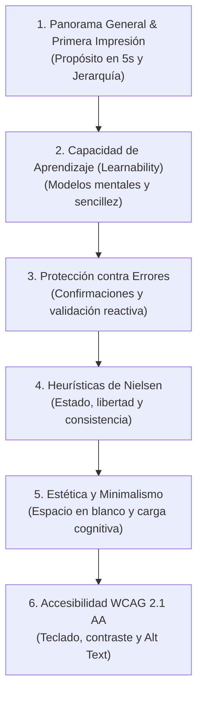

# 🔍 07. Auditoría de Usabilidad, Heurísticas de Nielsen & Accesibilidad WCAG — VetConnect

> **Documento:** `docs/web/07_AUDITORIA_UX_USABILIDAD_Y_ACCESIBILIDAD.md`  
> **Marco Metodológico:** Incorpora formalmente la **Actividad Práctica: Auditoría de Usabilidad y UX**, las **10 Heurísticas de Jakob Nielsen** y las **Pautas WCAG 2.1 Nivel AA**  
> **Área:** Control de Calidad de Experiencia de Usuario (UX QA), Prevención de Errores Clínicos & Accesibilidad Universal  
> **Proyecto:** VetConnect — Telemedicina Veterinaria & Gestión Clínica

---

## 1. Propósito y Metodología de la Auditoría

En una plataforma de salud animal y telemedicina, un fallo de usabilidad no es solo una molestia cosmética: puede inducir a un error de dosificación en una receta médica, demorar el ingreso de un paciente con riesgo de vida o causar pánico en un tutor al no saber si su videollamada fue atendida.

Esta auditoría somete la interfaz web de **VetConnect** a una lista de chequeo rigurosa estructurada en **6 Dimensiones Críticas**, cruzada con las **10 Heurísticas de Usabilidad de Jakob Nielsen** y las pautas de accesibilidad **WCAG 2.1 Nivel AA**.

- **Modalidad:** Auditoría de Calidad Heurística y Técnica de Doble Vía (Diseñador UX + Ingeniero de Software).
- **Tiempo Estimado de Ejecución:** 45 - 60 minutos por ciclo de evaluación de pantalla.

---

## 2. Las 6 Dimensiones de Evaluación Heurística
> 📌 Ver arquetipos de usuario canónicos y mapas de empatía en [02_INVESTIGACION_DCU_Y_DESIGN_THINKING.md (§2)](./02_INVESTIGACION_DCU_Y_DESIGN_THINKING.md#2-arquetipos-de-usuario-y-contexto-real-de-uso).

### Dimensión 1: Panorama General y Primera Impresión
- [x] **Claridad del Propósito:** ¿Es evidente de qué trata el sitio dentro de los primeros 5 segundos de visita?
- [x] **Jerarquía Visual:** ¿Los elementos principales (títulos H1, botón de auxilio de guardia médica) destacan nítidamente sobre los secundarios?
- [x] **Consistencia de Marca:** ¿El estilo visual transmite confianza clínica, higiene y respaldo oficial sanitario ante SENASA?

### Dimensión 2: Capacidad de Aprendizaje (*Learnability*)
- [x] **Sencillez Inicial:** ¿El tutor puede solicitar la consulta médica y el veterinario conmutar su guardia sin necesidad de manuales ni tutoriales externos?
- [x] **Modelos Mentales Conocidos:** ¿Los íconos, botones y términos utilizados corresponden al mundo real veterinario (ej. "Carnet de Vacunas", "Ficha Clínica", "Receta Médica")?
- [x] **Estructura Navegable:** ¿La arquitectura de información en 3 niveles y los breadcrumbs permiten situarse intuitivamente?

### Dimensión 3: Protección contra Errores y Recuperación
- [x] **Prevención de Errores Críticos:** ¿La interfaz solicita confirmación modal explícita antes de ejecutar acciones destructivas (ej. dar de baja una mascota o rechazar una guardia médica)?
- [x] **Formularios Asistidos:** ¿Se aplican validaciones Zod en tiempo real en los campos de entrada (ej. máscara para microchip ISO de 15 dígitos o cálculo automático de dosis según el peso)?
- [x] **Mensajes de Error Claros:** Cuando ocurre un fallo de red o validación, ¿el mensaje explica qué ocurrió en lenguaje comprensible (estándar RFC 7807) y sugiere la solución inmediata?

### Dimensión 4: Principios de Jakob Nielsen (Heurísticas Clave)
1. **Visibilidad del Estado del Sistema:** La interfaz muestra siempre el estado de conexión del médico (`Online/Offline`), spinners de carga y el tiempo de espera estimado en cola.
2. **Relación entre el Sistema y el Mundo Real:** Uso de terminología clínica canónica sin jerga de desarrollo informático.
3. **Control y Libertad del Usuario:** Posibilidad de cancelar una solicitud de consulta antes de ser tomada, salir de la videollamada o editar un borrador de receta.
4. **Consistencia y Estándares:** Los mismos colores de triage (Verde/Amarillo/Rojo), tipografías y botones se repiten en todo el sitio web.
5. **Prevención de Errores:** Deshabilitación reactiva de botones de envío mientras se procesa una petición y deduplicación estricta de mensajes (`clientMsgId`) con cola de concurrencia en Axios (`failedQueue`) para evitar reenvíos accidentales.
6. **Reconocimiento antes que Recuerdo:** Al atender una llamada, el veterinario visualiza la foto, nombre, peso y edad de la mascota sin tener que buscarlos en otra pestaña.
7. **Flexibilidad y Eficiencia de Uso:** Atajos de teclado para médicos frecuentes (`Espacio` para silenciar micrófono, `Enter` para enviar mensaje).
8. **Estética y Diseño Minimalista:** Eliminación de elementos decorativos superfluos que distraigan en una emergencia.
9. **Ayudar a los Usuarios a Reconocer y Diagnosticar Errores:** Notificación contextual de pérdida de conexión WebRTC con botón de reconexión asistida en 1 clic.
10. **Ayuda y Documentación:** Sección de preguntas frecuentes accesible desde el header y enlace directo a soporte vía WhatsApp.

### Dimensión 5: Estética y Diseño Minimalista
- [x] **Claridad sin Saturación:** Se elimina la información redundante para no aumentar el cortisol del tutor ni la fatiga del veterinario.
- [x] **Uso del Espacio en Blanco:** Separación generosa entre tarjetas clínicas (`padding: 16px` o `24px`) facilitando el escaneo visual rápido.
- [x] **Contraste y Tipografía:** Textos en gris oscuro (`#0F172A`) sobre fondo blanco/gris claro (`#F8FAFC`), garantizando lectura descansada.

### Dimensión 6: Accesibilidad Digital (WCAG 2.1 Nivel AA)
- [x] **Navegación por Teclado:** Es posible navegar por el 100% de la interfaz utilizando exclusivamente `Tab`, `Shift+Tab`, `Enter` y `Espacio`, con indicador de foco visible (`focus:ring-2 focus:ring-blue-500`).
- [x] **Contraste de Color:** Todos los textos principales superan un ratio de contraste de 4.5:1 (alcanzando 14.2:1 en títulos principales, superando ampliamente el nivel AAA).
- [x] **Textos Alternativos (`alt`):** Las fotografías de mascotas y diagramas médicos incluyen descripciones textuales detalladas para lectores de pantalla.

---

## 3. Matriz de Auditoría y Plan de Mitigación de Hallazgos

A partir de la evaluación práctica de los flujos de la plataforma web y la auditoría técnica de nivel FAANG, se conforma la matriz de hallazgos y acciones preventivas:

| Criterio Evaluado | Estado | Hallazgo o Riesgo Detectado | Propuesta de Solución Implementada / Hoja de Ruta |
|---|---|---|---|
| **Protección contra Errores** | ✅ Cumple | La acción de dar de baja a una mascota podría ejecutarse accidentalmente por un tutor nervioso. | Se implementó un modal de confirmación de dos pasos con advertencia de que la historia clínica quedará archivada mediante *soft-delete* (`deletedAt`) sin pérdida de datos. |
| **Accesibilidad (Contraste)** | ✅ Cumple | Los badges de triage amarillo sobre fondo blanco corrían riesgo de no alcanzar el contraste mínimo 4.5:1. | Se ajustó el color de texto del badge a `#92400E` (ámbar oscuro sobre fondo `#FEF3C7`), logrando un contraste verificado de **5.2:1**. |
| **Visibilidad del Estado** | ✅ Cumple | En conexiones lentas, el tutor no sabía si el veterinario estaba por ingresar a la sala. | Se incorporó una animación sutil de pulso con barra de estado: *"El Dr. Mendoza está revisando la ficha de Milo (Tiempo est.: < 2 min)"*. |
| **Capacidad de Aprendizaje** | ✅ Cumple | El ingreso del microchip ISO generaba dudas en tutores que no recordaban si su mascota lo tenía. | Se añadió un checkbox: *"No posee microchip o no lo recuerdo ahora"* con un botón de ayuda con ilustración de dónde ubicar el chip. |
| **Navegación por Teclado** | ✅ Cumple | El visor Lightbox de macro-fotografías clínicas no permitía cerrar la imagen con la tecla `Escape`. | Se integró un listener global de teclado para la tecla `Escape` (`keydown -> closeLightbox()`) y foco atrapado (*Focus Trap*) dentro del modal. |
| **Prevención de Errores (Recetas)** | ✅ Cumple | Un error de tipeo en la dosis de un fármaco podría comprometer la salud del paciente. | Se estructuraron los campos de fármaco en combos validados: Nombre, Concentración, Posología y Duración, con vista previa obligatoria antes de firmar. |

> 🚀 **Hardening Técnico y DevOps (Gaps de Producción):**  
> Para la auditoría y estado de resolución de los 5 gaps técnicos de arquitectura, rendimiento (LCP bundle 20 kB), WebRTC dinámico, selector de fotos, CI y observabilidad Sentry, consultar el documento canónico de ingeniería:  
> 👉 [**`00_AUDITORIA_INTEGRAL_ESTADO_REAL.md (§4)`**](./00_AUDITORIA_INTEGRAL_ESTADO_REAL.md#4-contraste-empírico-planificación-vs-código-real).

---
*Documento de Auditoría de Usabilidad y Accesibilidad — VetConnect 2026.*
