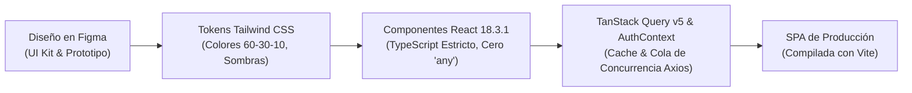
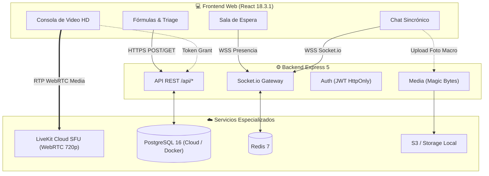
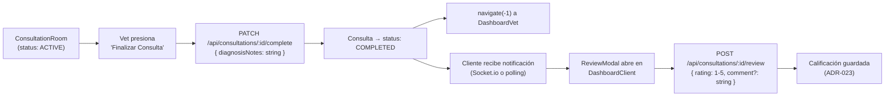

# 🚀 08. Desarrollo, Integraciones & Roadmap Web — VetConnect

> **Documento:** `docs/web/08_DESARROLLO_INTEGRACIONES_Y_ROADMAP.md`  
> **Fases del Proceso:** Fases 4 a 7 — Desarrollo Front-end, Integraciones Back-end, QA & Lanzamiento  
> **Área:** Implementación Técnica, Integraciones Críticas (LiveKit, Socket.io), Frontend Hardening & Despliegue  
> **Proyecto:** VetConnect — Telemedicina Veterinaria & Gestión Clínica

---

## 1. Fase 4: Desarrollo Front-end (React 18.3.1 LTS + Vite)

En esta fase el diseño estructural cobra vida como una aplicación web interactiva de alto rendimiento. Siguiendo los estándares de ingeniería de VetConnect:



### 1.1 Stack Tecnológico del Frontend Web
- **Librería Base:** **React 18.3.1 (LTS/Stable)**. Elección técnica fundamental (commit `2559f55`) para garantizar máxima estabilidad y compatibilidad de *peer-dependencies* con `@livekit/components-react` y `@testing-library/react`. React 19 se mantiene en el radar de migración futura una vez que LiveKit publique soporte oficial.
- **Empaquetador y Build Tool:** **Vite 6** con soporte de Hot Module Replacement (HMR) sub-milisegundo y optimización de assets con Rollup.
- **Estilizado & Tokens:** **Tailwind CSS v3** mapeando con exactitud la paleta 60-30-10 (`#F8FAFC`, `#0F172A`, `#2563EB`, etc.) y las sombras por capas (*layered shadows*).
- **Consumo de Datos & Cache:** **useState + useEffect llamando directamente a api.ts** en las páginas vivas actuales (`DashboardClient.tsx`, `DashboardVet.tsx`, `AdminVets.tsx`). `QueryClientProvider` está configurado en `App.tsx` para adopción futura en componentes atómicos.
- **Gestión de Sesión & Estado:** **React Context (`AuthContext`)** con almacenamiento del `accessToken` estrictamente en memoria de JS y refresco silencioso mediante cookies `HttpOnly` contra `/api/auth/refresh`. Integra un patrón de cola en Axios (`failedQueue`) para mitigar condiciones de carrera ante múltiples llamadas simultáneas con token vencido. *(Nota: Zustand se reserva para la persistencia nativa en la app móvil en `mobile/src/lib/authStore.ts`)*.
- **WebRTC & Video:** **LiveKit Components React** (`@livekit/components-react`), implementando la sala sin duplicar audio renderers (cero eco WebRTC).
- **WebSockets:** **Socket.io Client** con reconexión automática y canal bidireccional por consulta.
- **Taller de Componentes & a11y (CDD):** > 📌 Ver protocolo metodológico de diseño colaborativo y exportación en [06_SISTEMA_DE_DISENO_UI_KIT.md (§7)](./06_SISTEMA_DE_DISENO_UI_KIT.md#7-metodología-híbrida-storybook--figma).
- **QA Autónomo E2E:** **TestSprite MCP** para exploración y verificación autónoma de flujos de caja negra con IA sobre Vercel.

---

## 2. Fase 5: Desarrollo Back-end e Integraciones Críticas

El frontend web se conecta con el cluster backend y servicios externos a través de protocolos seguros y estandarizados:



### 2.1 Integración 1: Videollamadas HD con LiveKit Cloud SFU & Contrato de Sala de Espera
- **Contrato de Navegación y Máquina de Estados (`ConsultationRoom.tsx`):**
  1. Al montar `/call/:id`: Invocar `GET /api/consultations/:id`.
  2. Si `status === 'WAITING'`: Mostrar la UI de **"Sala de Espera: Aguardando asignación de veterinario de guardia..."** y activar polling cada 5s a `GET /api/consultations/:id`. **NO invocar `POST /api/calls/:id/token`** (en `backend/src/modules/calls/calls.service.ts:59`, solicitar token con estado no `ACTIVE` arroja `400 INVALID_CONSULTATION_STATE`).
  3. Cuando el estado transicione a `ACTIVE`: Cancelar el polling, solicitar el token LiveKit con `POST /api/calls/:id/token` y renderizar `<CallRoom>`.
  4. Al presionar "Finalizar Consulta": El médico debe ejecutar `PATCH /api/consultations/:id/complete` `{ diagnosisNotes }` antes de redirigir.
- ⚠️ **Sincronización Canónica de Transición WAITING → ACTIVE:**
  En v2.0, el backend NO emite eventos de Socket.io para la asignación de consultas (`consultation:assigned` no existe en `socket.types.ts`). Por lo tanto, el cliente debe usar exclusivamente polling HTTP cada 5 segundos invocando `GET /api/consultations/:id` mientras el estado sea `WAITING`. Queda terminantemente prohibido registrar listeners socket ficticios.
- El backend responde al token request con el contrato `{ success: true, data: { token, wsUrl } }`.
- El token se genera con identidad opaca (`user.id`) y nombre de pila del médico/tutor, **sin incluir correos ni datos personales (PII)** según las directivas de seguridad de [`AGENTS.md`](../../AGENTS.md) y Ley N° 25.326.
- La sala se monta utilizando `<LiveKitRoom>` configurado en resolución 720p a 24fps con simulcast adaptativo y audio WebRTC sin duplicación de renderers (`<RoomAudioRenderer>` no debe duplicarse si se usa `<VideoConference />`).
- **Requisito de Endurecimiento:** En `ConsultationRoom.tsx`, la URL devuelta en `wsUrl` debe almacenarse y transferirse dinámicamente como prop a `<CallRoom token={livekitToken} serverUrl={livekitWsUrl} />` para evitar fallbacks fijos en caso de migración o balanceo de clusters en LiveKit Cloud.

### 2.2 Integración 2: Mensajería Sincrónica con Socket.io & Fotos Macro
- Conexión persistente autenticada contra el gateway de WebSockets.
- Sala compartida por consulta (`consultation_{id}`).
- Subida de macro-fotografías clínicas mediante `POST /api/media` con validación de *Magic Bytes* (solo JPEG, PNG y WebP médicos legítimos).
- Las fotos se descargan únicamente mediante la ruta autenticada `GET /api/media/:id`, prohibiendo el serving estático público para proteger el secreto médico y la Ley N° 25.326.

### 2.3 Integración 3: Modelo de Guardia Médica Institucional (v2.0) & Hoja de Ruta de Pagos (v2.1+)
> [!NOTE]
> **ScopeOut para v2.0 — Solo Lectura Arquitectónica para v2.1+**  
> Todo el flujo de pasarelas de pago (Mercado Pago / Stripe / Split Payments) queda formalmente catalogado como **Non-Goal / ScopeOut para la versión v2.0**. No se deben codear modelos de pago, endpoints de cobro ni componentes de checkout en esta fase.

- **Decisión de Alcance Canónica:** Conforme a [`docs/PLAN_DE_PROYECTO_Y_GESTION.md:214`](../PLAN_DE_PROYECTO_Y_GESTION.md#L214), la pasarela de pagos es un **Non-Goal / ScopeOut para v2.0**.
- **Comportamiento v2.0:** Al finalizar el triage sin riesgo vital inmediato, el tutor ingresa directamente a la sala de espera interactiva sin fricciones arancelarias, optimizando la adopción y la validación clínica del sistema.
- **Hoja de Ruta Comercial (v2.1+):** Para la futura fase arancelada o privada, se prevé la integración con **Mercado Pago Checkout Pro / Split Payments**, permitiendo la liquidación automática de honorarios médicos y retención de comisiones operativas mediante webhooks seguros (`POST /api/payments/webhook`).

### 2.4 Integración 4: Puente Híbrido Web-Mobile (`ReactNativeWebView.postMessage`)
- La consola de videollamada web está arquitecturada para funcionar de manera desacoplada tanto en navegadores de escritorio como dentro del contenedor nativo de la aplicación móvil de tutores (React Native / Expo SDK 54).
- En [`web/src/components/call/CallRoom.tsx`](../../web/src/components/call/CallRoom.tsx), el sistema implementa un canal de comunicación bidireccional mediante `window.ReactNativeWebView?.postMessage(JSON.stringify({ type, payload }))`:
  - Notifica a la app nativa eventos de ciclo de vida (`CALL_CONNECTED`, `CALL_DISCONNECTED`, `CALL_ERROR`).
  - Permite a la app nativa coordinar el botón flotante de cámara y el panel inferior (*bottom sheet*) de fotos sin interferir con el hilo de audio WebRTC.

### 2.5 Integración 5: Manejo de Cookies Cross-Domain & Certificados SSL
- En [`auth.controller.ts:14`](../../backend/src/modules/auth/auth.controller.ts#L14), la cookie de refresh token se emite con:
  ```typescript
  res.cookie('refreshToken', refreshToken, {
    httpOnly: true,
    secure: isProduction,
    sameSite: isProduction ? 'none' : 'lax',
    maxAge: 7 * 24 * 60 * 60 * 1000
  });
  ```
- **Requisito Crítico en Internet:** Cuando el portal web se aloja en `app.vetconnect.com.ar` y la API en `api.vetconnect.com.ar`, Chromium y Safari exigen obligatoriamente HTTPS con certificados TLS válidos en ambos extremos; de lo contrario, los navegadores descartan silenciosamente las cookies marcadas con `SameSite=None` si no viajan bajo `Secure: true`.
- **CORS Restrictivo en Backend:** En el entorno de producción, la variable `CLIENT_URL` en el `.env` del backend debe configurarse de forma estricta con el dominio público del frontend (`https://app.vetconnect.com.ar`), prohibiendo comodines permisivos (`*`) o referencias a `localhost`.

### 2.6 Integración 6: Flujo de Cierre de Consulta y Calificación Post-Atención

**Protocolo de Cierre y Reseña Médica:**
Cuando el veterinario finaliza la consulta (`PATCH /api/consultations/:id/complete`), el estado pasa a `COMPLETED`. En el tutor, al detectar `status === 'COMPLETED'` (vía polling o evento `call:ended`), `ConsultationRoom.tsx` desmonta `<CallRoom>` y despliega en la misma pantalla el `ReviewModal` como overlay de cierre. Una vez que el tutor envía la calificación (`POST /api/consultations/:id/review`) o presiona "Omitir", la aplicación ejecuta `navigate('/client/dashboard')`.

El ciclo de vida completo de una consulta médica desde el punto de vista del frontend web es:



**Notas de implementación para el agente de IA que construya el frontend:**

1. **Hang-up (VET):** El botón "Finalizar Consulta" en `ConsultationRoom.tsx` debe llamar `PATCH /api/consultations/:id/complete` con `{ diagnosisNotes }` ANTES de navegar. El `navigate(-1)` actual (sin llamar al endpoint) es un gap conocido del MVP v2.0 que debe corregirse en la fase de desarrollo.

2. **Review Modal (CLIENT):** Tras detectar `consultation.status === 'COMPLETED'` (via polling o Socket.io), `DashboardClient.tsx` debe mostrar un `ReviewModal` con un selector de 1 a 5 estrellas y un textarea opcional, ejecutando `POST /api/consultations/:id/review`.

3. **Cancel Flow:** `PATCH /api/consultations/:id/cancel` está disponible para CLIENT y ADMIN. Debe ofrecerse como opción si el tiempo de espera en sala supera un umbral o el tutor decide abandonar.

4. **AuditLog (ADMIN):** Las operaciones de aprobación/rechazo de veterinarios generan registros en `audit_logs` de forma automática en el backend. **No existe un endpoint `GET` de AuditLogs en v2.0** — el visor de auditoría es una característica de reportería administrativa planificada para v2.1+. `AdminVets.tsx` NO debe implementar un componente de AuditLog viewer en v2.0.

### 2.7 Integración 7: Módulos de Administración y Fiscalización SENASA
- **Visualización de Receta Digital SENASA (`GET /api/prescriptions/:id`):**
  - La página [`PrescriptionView.tsx`](../../web/src/pages/PrescriptionView.tsx) consulta este endpoint al montar la vista o cuando un tercero escanea el código QR de la receta.
  - El backend valida la existencia de la receta y retorna la entidad poblada con los datos del profesional emisor (`vet: { firstName, lastName, licenseNumber }`) y el paciente vinculado a la consulta.
- **Fiscalización de Matrículas Veterinarias (`/api/admin/vets/*`):**
  - La consola [`AdminVets.tsx`](../../web/src/pages/AdminVets.tsx) interactúa con el módulo `admin` mediante:
    - `GET /api/admin/vets/pending`: Retorna la lista de profesionales con `vetStatus: 'PENDING'`.
    - `PATCH /api/admin/vets/:id/approve`: Transiciona la cuenta a `vetStatus: 'APPROVED'` y genera un registro en `AuditLog` (`action: 'USER_VERIFIED'`).
    - `PATCH /api/admin/vets/:id/reject`: Requiere cuerpo `{ reason: string }`, transiciona la cuenta a `vetStatus: 'REJECTED'` y genera un registro en `AuditLog` (`action: 'USER_REJECTED'`).
- **Conmutación de Guardia y Perfil (`PATCH /api/users/profile` & `GET /api/auth/me`):**
  - El switch interactivo de guardia en [`DashboardVet.tsx`](../../web/src/pages/DashboardVet.tsx) emite ráfagas `PATCH /api/users/profile` con `{ isOnline: true | false }` para unirse o salir de la cola en vivo de atención.
  - [`AuthContext.tsx`](../../web/src/context/AuthContext.tsx) consume `GET /api/auth/me` con el token de memoria para rehidratar el estado de autenticación tras una recarga de página (*F5*).

---

## 3. Fase 6: Pruebas y Control de Calidad (QA)

Antes de cualquier despliegue a producción, la plataforma web atraviesa un plan de pruebas en múltiples niveles:

### 3.1 Compatibilidad Cross-Browser y Multi-Dispositivo
- **Navegadores Homologados:** Google Chrome (versión 120+), Safari (WebKit 17+ con WebRTC nativo), Mozilla Firefox (125+) y Microsoft Edge.
- **Resoluciones Verificadas:**
  - Móvil: 360x640px, 390x844px (iPhone) y 412x915px (Android).
  - Tablet: 768x1024px (iPad portrait) y 1024x768px (landscape).
  - Escritorio: 1366x768px (laptop estándar), 1920x1080p (Full HD) y 2560x1440p (QHD médico).

### 3.2 Pruebas de Estrés y Core Web Vitals
- **Lighthouse Performance Score:** Meta $> 90$ en escritorio y $> 80$ en móviles.
- **Largest Contentful Paint (LCP):** $< 1.8\text{ s}$.
- **Cumulative Layout Shift (CLS):** $< 0.05$ (cero desplazamientos molestos durante la carga de imágenes).
- **Interaction to Next Paint (INP):** $< 150\text{ ms}$ en formularios de triage y búsqueda de pacientes.

### 3.3 Testing Automatizado & Verificación Empírica Realizada

La suite completa del monorepo cuenta con **36 suites / 123 tests automatizados (100% pasando, 0 fallos)**, cubriendo contratos, autenticación JWT, sockets clínicos, WebRTC LiveKit, navegación y telemetría Sentry en los 3 workspaces (`backend`, `web`, `mobile`).

> 📖 **Registro Canónico de Resultados de Consola:**  
> Para consultar la tabla detallada de tiempos de ejecución por suite, comandos de verificación y métricas de bundle por capa, remitirse al documento canónico:  
> 👉 [**`00_AUDITORIA_INTEGRAL_ESTADO_REAL.md#2-métricas-clave-y-verificación-empírica-en-vivo`**](./00_AUDITORIA_INTEGRAL_ESTADO_REAL.md#2-métricas-clave-y-verificación-empírica-en-vivo).

---

## 4. Los 5 Gaps Críticos de Frontend Hardening (Ruta al Nivel 5: Gold Master)

> 📌 Ver estado detallado y métricas de resolución de los 5 gaps de hardening en [00_AUDITORIA_INTEGRAL_ESTADO_REAL.md (§4)](./00_AUDITORIA_INTEGRAL_ESTADO_REAL.md#4-contraste-empírico-planificación-vs-código-real).

---

## 5. Fase 7: Lanzamiento y Monitoreo Continuo

El proceso de puesta en marcha garantiza estabilidad operativa y observabilidad desde el minuto cero:

### 5.1 Infraestructura de Despliegue (Web & Mobile)
- **Frontend Web SPA en Vercel (Oficial):** Conectar el repositorio, seleccionar carpeta raíz `web`, framework `Vite` y configurar variables de producción (`VITE_API_URL`, `VITE_WS_URL`, `VITE_LIVEKIT_URL`). Despliegue con rewrites automáticos en [`web/vercel.json`](../../web/vercel.json) hacia `index.html`:
  ```json
  {
    "rewrites": [{ "source": "/(.*)", "destination": "/index.html" }]
  }
  ```
- **Backend API & WebSockets en VPS (Coolify + Traefik):** Despliegue en contenedor Docker orquestado conforme al manual maestro [`docs/DEPLOY.md`](../DEPLOY.md) con terminación TLS 1.3 de Let's Encrypt para HTTPS y WSS.
- **Distribución de la App Móvil (Android):**
  - *Fase Piloto Clínica (Cero Costo):* Generar el instalador `.apk` mediante EAS Build (`eas build --platform android --profile preview`) y alojarlo directamente para descarga desde la Landing Page (`/downloads/vetconnect-preview.apk`).
  - *Producción Comercial Masiva:* Generar el `.aab` (`eas build --platform android --profile production`) y publicarlo en Google Play Store tras abonar la tasa única de $25 USD de Google Play Console.
- **Cabeceras de Seguridad HTTP (Helmet):**
  - `Content-Security-Policy (CSP)` estricto permitiendo WebSockets a WSS y flujos de medios a LiveKit.
  - `X-Frame-Options: DENY` (prevención de ataques de Clickjacking).
  - `X-Content-Type-Options: nosniff`.
  - `Strict-Transport-Security (HSTS)` forzado a 1 año.

### 5.2 Analítica y Monitoreo
- **Google Analytics 4 & Search Console:** Seguimiento de conversiones de triage médico, palabras clave de salud animal y tasa de rebote en la landing.
- **Uptime Kuma:** Monitorización continua del endpoint de salud (`https://app.vetconnect.com.ar`) cada 60 segundos con alertas inmediatas.

---

## 6. Cronograma, Roadmap & Mapeo con el Plan Maestro (Sprints 1 al 10)

El desarrollo del portal web no opera en una isla de 4 sprints aislados, sino que se sincroniza directamente con los **10 Sprints oficiales** y las 40 tareas del Product Backlog maestro definidas en [`docs/PLAN_DE_PROYECTO_Y_GESTION.md`](../PLAN_DE_PROYECTO_Y_GESTION.md):

| Sprint Maestro | Tareas PB Asociadas a Web | Enfoque y Entregables en la Capa Web | Estado Real |
|---|---|---|---|
| **Sprint 1 & 2** | PB-01, PB-05, PB-08 | Setup de Monorepo, contratos tipados en Axios (`api.ts`), integración de autenticación JWT y cookies `HttpOnly` con cola `failedQueue`. | ✅ **Completado** |
| **Sprint 3** | PB-09, PB-10, PB-11 | Landing Page institucional responsive, Navbar, layout base multi-rol y enrutamiento protegido en `App.tsx`. | ✅ **Completado** |
| **Sprint 4** | PB-12, PB-14 | Tablero de fiscalización administrativa (`/admin/vets`) para validación SENASA (el backend persiste AuditLogs de forma inmutable; el visor UI queda como ScopeOut para v2.1+). | ✅ **Completado** |
| **Sprint 5** | PB-17 | Formulario de alta y gestión de mascotas (`/client/dashboard`) con validación opcional de microchip ISO de 15 dígitos. | ✅ **Completado** |
| **Sprint 6** | PB-20, PB-23 | Modal de triage clínico en 3 pasos con cálculo automático de urgencia y formulario de soporte. | ✅ **Completado** |
| **Sprint 7** | PB-26, PB-28 | Chat médico bidireccional Socket.io con idempotencia (`clientMsgId`), subida de fotos macroscópicas a `/api/media` y visualizador modal *Lightbox*. | ✅ **Completado** |
| **Sprint 8** | PB-30 | Sala de telemedicina WebRTC HD 720p en [`web/src/pages/ConsultationRoom.tsx`](../../web/src/pages/ConsultationRoom.tsx) vía LiveKit SFU dinámico sin audio duplicado. | ✅ **Completado** |
| **Sprint 9** | PB-33, PB-34, PB-35 | Vista de prescripción oficial SENASA con código QR de verificación (`/prescriptions/:id`), estilos `@media print` A4 y calificación de consultas. | ✅ **Completado** |
| **Sprint 10 (Fase Actual)** | PB-37, PB-38, PB-39, PB-40 | **Frontend Hardening & Elevación Visual:** Code-splitting (`React.lazy()`), Sentry SDK, 123 tests pasando en CI, catálogo de componentes atómicos en Storybook 8 con accesibilidad Axe (`@storybook/addon-a11y`), auditoría autónoma TestSprite y despliegue a producción en Vercel. | 🔄 **En Ejecución (Nivel 4.5 ➔ Nivel 5)** |

### 🎯 Ruta de Ejecución Inmediata (Próximos Pasos Recomendados):
1. **Paso A — Frontend Hardening Técnico:**
   - ✅ **100% COMPLETADO Y VERIFICADO:**
     - Code-splitting con `React.lazy()` en `App.tsx` (Bundle inicial reducido a 20.38 kB).
     - `wsUrl` inyectado dinámicamente en `ConsultationRoom.tsx`.
     - Subida de macro-fotografías en chat clínico con Lightbox modal.
     - Jobs de `web-tests` y `mobile-tests` incorporados en `ci.yml`.
     - Verificación integral verde: `npm run verify:predeploy` (123 tests pasando, 0 errores de compilación).
2. **Paso B — Elevación Visual en Código Vivo (Component-Driven Development con Storybook) y QA Autónomo con TestSprite:**
   - **Taller de Componentes Aislados en Storybook:** Conforme a [`11_INTEGRACION_STORYBOOK_Y_TESTSPRITE_QA.md`](./11_INTEGRACION_STORYBOOK_Y_TESTSPRITE_QA.md), los componentes de interfaz (Botones, Badges de Triaje, Cards de Mascotas, Recetas SENASA) se construyen y auditan de forma atómica en Storybook (`http://localhost:6006`) con el addon `@storybook/addon-a11y` garantizando cumplimiento de WCAG 2.1 AA antes de ser ensamblados en las pantallas principales.
   - **QA E2E Autónomo con TestSprite (MCP):** Una vez desplegada la web en Vercel, el agente de IA de TestSprite ejecuta autónomamente los escenarios clínicos de caja negra (TS-E2E-01 a TS-E2E-08), detectando cualquier regresión o anomalía en producción con grabaciones de video y análisis de causa raíz.
   > 📌 Ver protocolo de diseño colaborativo y exportación en [06_SISTEMA_DE_DISENO_UI_KIT.md (§7)](./06_SISTEMA_DE_DISENO_UI_KIT.md#7-metodología-híbrida-storybook--figma).
3. **Paso C — Puesta en Producción en Internet:**
   - Conectar Vercel con el repositorio para CI/CD automático del frontend (`https://vet-connect-web.vercel.app`).
   - Desplegar API en VPS con Coolify + Traefik TLS 1.3 conforme a [`docs/DEPLOY.md`](../DEPLOY.md).
   - Compilar y publicar el APK piloto en `/downloads/vetconnect-preview.apk`.

---
*Documento de Desarrollo, Integraciones y Roadmap Web — VetConnect 2026.*
