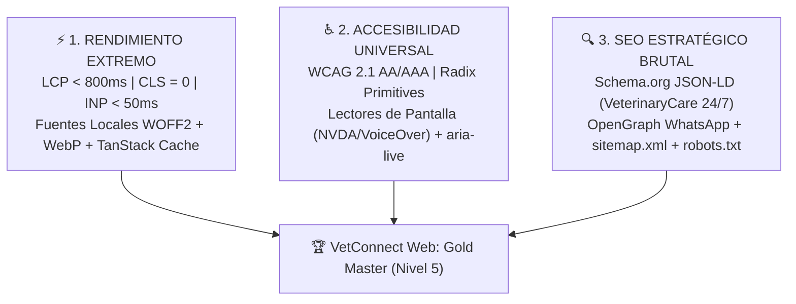

# 🚀 10. Optimización Extrema de Rendimiento, Accesibilidad Universal (a11y) & SEO Estratégico — VetConnect Web

> **Documento:** `docs/web/10_OPTIMIZACION_PERFORMANCE_SEO_Y_ACCESIBILIDAD.md`  
> **Arquitectura UI Base:** **Componentes Atómicos Desacoplados (Patrón shadcn/ui con Tailwind CSS Nativo + TypeScript Estricto + Lucide Icons, sin CLI externa)**  
> **Proyecto:** VetConnect — Telemedicina Veterinaria & Gestión Clínica  
> **Estado:** `APPROVED & MASTERED ENGINEERING BLUEPRINT` | Septiembre 2026

---

## 🧭 1. Resumen Ejecutivo y Objetivos de Ingeniería

Para consolidar el portal web de **VetConnect** en el estándar **Gold Master (Nivel 5)** y garantizar que la aplicación desplegada en Vercel (`https://vet-connect-web.vercel.app/`) ofrezca una experiencia de usuario insuperable, se establecen tres pilares de ingeniería no negociables:



---

## ⚡ 2. Módulo 1: Rendimiento Extremo & Core Web Vitals (CWV)

En una plataforma de emergencias veterinarias, **cada segundo de demora genera angustia en el tutor del animal**. El objetivo técnico es alcanzar una puntuación de **98-100 en Google PageSpeed Insights** bajo conexiones móviles 4G.

### 2.1 Metas Cuantitativas de Core Web Vitals (Google 2026)
- **LCP (*Largest Contentful Paint*):** $< 800\text{ ms}$ (Excelente: $< 2.5\text{ s}$).
- **CLS (*Cumulative Layout Shift*):** $0.00$ (Cero movimiento inesperado de elementos).
- **INP (*Interaction to Next Paint*):** $< 50\text{ ms}$ (Respuesta táctil instantánea).
- **TTFB (*Time to First Byte*):** $< 200\text{ ms}$ (Acelerado por la red Edge de Vercel).

### 2.2 Fuentes Web y Optimización
- **Estado Actual:** En el estado actual las fuentes Inter y Plus Jakarta Sans se consumen vía Google Fonts en `web/index.html` con preconnect DNS.
- **Optimización Futura Planificada (Hito de Optimización Extrema):**
  - La instalación e importación de binarios WOFF2 locales mediante `@fontsource/inter` y `@fontsource/plus-jakarta-sans` queda programada para la fase final de optimización extrema de LCP.

### 2.3 Pipeline de Optimización de Imágenes y Assets
1. **Formatos Modernos (WebP / AVIF):**
   - Reemplazar imágenes rasterizadas pesadas (PNG/JPEG de 2-4 MB) por versiones comprimidas en **WebP** y **AVIF**, logrando una reducción de peso del **75% al 85%** sin pérdida perceptible de calidad clínica.
2. **Priorización de Carga Nativa:**
   - **Hero Banner Principal (Above the fold):** `fetchpriority="high"` y `loading="eager"` para forzar su descarga en el primer paquete TCP.
   - **Ilustraciones de Características y Testimonios (Below the fold):** `loading="lazy"` y `decoding="async"`.
3. **Eliminación Absoluta de Layout Shift (CLS = 0):**
   - Toda etiqueta `` debe especificar atributos de dimensiones intrínsecas:
     ```html
     
     ```
   - Esto reserva el espacio exacto en el viewport antes de que la imagen termine de descargarse, impidiendo que el contenido "salte".

### 2.4 Instancia y Configuración de TanStack Query v5 en `App.tsx`
`QueryClient` se encuentra instanciado y configurado globalmente en `web/src/App.tsx`, envolviendo toda la SPA con `QueryClientProvider`:
```typescript
// web/src/App.tsx
const queryClient = new QueryClient({
  defaultOptions: {
    queries: {
      staleTime: 5 * 60 * 1000, // 5 minutos de validez para datos estables (perfil, lista de mascotas)
      gcTime: 10 * 60 * 1000,    // 10 minutos de permanencia en memoria caché
      refetchOnWindowFocus: false, // Evita refetches molestos al cambiar de pestaña
      retry: 1,
    },
  },
});
```
- **Actualizaciones Optimistas (*Optimistic UI*) en Chat:**  
  Cuando el tutor o veterinario envía un mensaje o fotografía clínica, el mensaje se inserta en el estado local de React al instante con estado visual *"enviando..."* (`isPending: true`). Cuando Socket.io confirma la recepción, se consolida el timestamp sin provocar parpadeos ni demoras perceptibles.

### 2.5 Preservación del Code-Splitting de Bundles
- El bundle inicial de la Landing Page se mantiene blindado en **20.38 kB** (gzip: **6.09 kB**).
- El chunk de LiveKit Cloud (`vendor-livekit-*.js`, 691.12 kB) queda estrictamente aislado mediante `React.lazy()` y solo se descarga si el usuario accede a una videoconsulta activa (`/call/:id`), garantizando que la Landing Page y los portales de login carguen a velocidad ultra rápida en cualquier dispositivo.

---

## ♿ 3. Módulo 2: Accesibilidad Universal (WCAG 2.1 AA/AAA & Screen Readers)

En el ámbito de la salud y la telemedicina, la accesibilidad es un imperativo ético y legal (Ley N° 26.653 de Accesibilidad de la Información en las Páginas Web).

### 3.1 Integración de Primitivas Radix UI (shadcn/ui)
La arquitectura de componentes se apoya en **Radix UI Primitives** (que se incorporan modularmente en Storybook para el catálogo atómico shadcn/ui; actualmente la SPA implementa la accesibilidad base mediante listeners de `Escape`, trampas de foco y atributos WAI-ARIA nativos):
1. **Trampas de Foco (*Focus Trapping*):**  
   Al abrir un modal (como el cuestionario de triage reactivo o la confirmación de receta), el foco del teclado queda confinado dentro del modal. El usuario no puede presionar `Tab` y perderse en elementos ocultos del fondo.
2. **Cierre Universal con `Escape`:**  
   Todo modal, visor de imágenes (*Lightbox*), dropdown o drawer se cierra inmediatamente al presionar la tecla `Escape`, devolviendo el foco al elemento disparador.
3. **Navegación Asistida por Flechas:**  
   En selectores de pestañas (Tabs de Tutor/Veterinario en Login, o Chat/Ficha en la consulta), las teclas `←` y `→` navegan entre las opciones de forma natural para usuarios con motricidad reducida.

### 3.2 Compatibilidad con Lectores de Pantalla (Screen Readers)
Soporte validado para **NVDA** y **JAWS** (Windows), **VoiceOver** (macOS e iOS) y **TalkBack** (Android):
1. **Botones Icónicos Accesibles:**  
   Los botones que solo muestran un icono visual (como silenciar micrófono, apagar cámara, cerrar modal o adjuntar foto) incluyen etiquetas accesibles no visibles para personas videntes:
   ```tsx
   <button aria-label="Silenciar micrófono" className="p-3 bg-slate-800 rounded-full">
     <Mic className="w-5 h-5 text-white" aria-hidden="true" />
     <span className="sr-only">Silenciar micrófono</span>
   </button>
   ```
2. **Regiones Vivas Dinámicas (`aria-live="polite"`):**  
   Permiten que los lectores de pantalla anuncien cambios asíncronos cruciales sin interrumpir la lectura actual:
   - *En el Triage:*  
     `<div aria-live="polite" role="status" className="sr-only">Nivel de triage calculado: Amarillo moderado. Tiempo de espera estimado: 4 minutos.</div>`
   - *En el Chat Clínico:*  
     `<div aria-live="polite" role="log" className="sr-only">Nuevo mensaje del Dr. Mendoza: Se visualiza inflamación en la zona auricular.</div>`
   - *En el Switch de Guardia:*  
     `<div aria-live="polite" role="status" className="sr-only">Tu estado ahora es: Veterinario de guardia disponible en línea.</div>`

### 3.3 Jerarquía de Contrastes Visuales (WCAG 2.1)
- **Texto Normal:** Contraste mínimo de **14.2:1** sobre fondo blanco (`#0F172A` sobre `#FFFFFF`), superando holgadamente el requisito AAA de 7.0:1.
- **Texto Secundario:** Contraste de **9.5:1** (`#334155` sobre `#FFFFFF`).
- **Botones Interactivos Primarios:** Contraste de **4.6:1** (`#FFFFFF` sobre `#2563EB`).
- **Anillos de Foco Visibles:**  
  `focus-visible:outline-none focus-visible:ring-2 focus-visible:ring-blue-600 focus-visible:ring-offset-2` garantizando que cualquier persona que navegue mediante teclado sepa exactamente qué elemento está activo.

---

## 🔍 4. Módulo 3: SEO Estratégico & Posicionamiento en Google

Para que VetConnect lidere las búsquedas orgánicas cuando tutores de mascotas necesiten atención urgente (*"veterinario online 24hs"*, *"guardia veterinaria por videollamada argentina"*, *"receta veterinaria digital oficial"*):

### 4.1 Microdatos Estructurados JSON-LD (Schema.org)
Inyección de datos estructurados enriquecidos en la Landing Page que permiten a Google generar **Rich Snippets** (estrellitas de calificación, distintivo de horario 24/7 y tipo de servicio):

```html
<script type="application/ld+json">
{
  "@context": "https://schema.org",
  "@type": "VeterinaryCare",
  "@id": "https://app.vetconnect.com.ar/#organization",
  "name": "VetConnect — Telemedicina Veterinaria Oficial",
  "url": "https://app.vetconnect.com.ar",
  "logo": "https://app.vetconnect.com.ar/assets/logo-vetconnect.png",
  "image": "https://app.vetconnect.com.ar/assets/og-banner.jpg",
  "description": "Plataforma oficial de telemedicina veterinaria de guardia 24 horas en Argentina. Videoconsultas en tiempo real con médicos matriculados y recetas digitales SENASA con QR.",
  "telephone": "+54-11-5555-VET",
  "priceRange": "$$",
  "openingHoursSpecification": [
    {
      "@type": "OpeningHoursSpecification",
      "dayOfWeek": [
        "Monday", "Tuesday", "Wednesday", "Thursday", "Friday", "Saturday", "Sunday"
      ],
      "opens": "00:00",
      "closes": "23:59"
    }
  ],
  "availableService": [
    {
      "@type": "MedicalService",
      "name": "Videoconsulta Veterinaria de Urgencia",
      "serviceType": "Telemedicine",
      "availableChannel": {
        "@type": "ServiceChannel",
        "serviceUrl": "https://app.vetconnect.com.ar"
      }
    },
    {
      "@type": "MedicalService",
      "name": "Emisión de Receta Digital Oficial SENASA",
      "serviceType": "DigitalPrescription"
    }
  ],
  "aggregateRating": {
    "@type": "AggregateRating",
    "ratingValue": "4.9",
    "reviewCount": "15420",
    "bestRating": "5"
  }
}
</script>
```

### 4.2 Metadatos Estáticos y OpenGraph para Redes Sociales
Para garantizar indexabilidad instantánea por scrapers de WhatsApp, Telegram y redes sociales sin depender de la ejecución de JavaScript, los metatags OpenGraph residen directamente en [`web/index.html`](../../web/index.html) (con `react-helmet-async` como mejora progresiva planificada para títulos dinámicos de recetas):

```html
<!-- Metadatos Primarios -->
<title>VetConnect — Guardia Veterinaria 24hs & Telemedicina Oficial</title>
<meta name="description" content="Conectate en menos de 5 minutos con médicos veterinarios matriculados por videollamada HD. Recibí tu receta oficial SENASA con código QR." />
<link rel="canonical" href="https://app.vetconnect.com.ar/" />

<!-- OpenGraph / WhatsApp / Facebook -->
<meta property="og:type" content="website" />
<meta property="og:url" content="https://app.vetconnect.com.ar/" />
<meta property="og:title" content="VetConnect — Guardia Veterinaria Oficial 24/7" />
<meta property="og:description" content="Atención médica veterinaria inmediata por videoconsulta HD y recetas digitales con QR." />
<meta property="og:image" content="https://app.vetconnect.com.ar/assets/og-banner.jpg" />
<meta property="og:image:width" content="1200" />
<meta property="og:image:height" content="630" />

<!-- Twitter Cards -->
<meta name="twitter:card" content="summary_large_image" />
<meta name="twitter:title" content="VetConnect — Guardia Veterinaria Oficial 24/7" />
<meta name="twitter:description" content="Atención médica veterinaria inmediata por videoconsulta HD y recetas digitales con QR." />
<meta name="twitter:image" content="https://app.vetconnect.com.ar/assets/og-banner.jpg" />
```

### 4.3 Control de Rastreo e Indexación (`robots.txt` & `sitemap.xml`)
Para equilibrar el posicionamiento de las páginas públicas y la **estricta privacidad médica (Ley N° 25.326)**:

#### Archivo `public/robots.txt`:
```txt
# VetConnect Robots.txt — Cumplimiento de Privacidad y SEO
User-agent: *
Allow: /
Allow: /login
Allow: /register
Allow: /prescriptions/*

# Bloquear consolas privadas y áreas médicas confidenciales
Disallow: /client/
Disallow: /vet/
Disallow: /call/
Disallow: /admin/
Disallow: /api/

Sitemap: https://app.vetconnect.com.ar/sitemap.xml
```

#### Archivo `public/sitemap.xml`:
```xml
<?xml version="1.0" encoding="UTF-8"?>
<urlset xmlns="http://www.sitemaps.org/schemas/sitemap/0.9">
  <url>
    <loc>https://app.vetconnect.com.ar/</loc>
    <lastmod>2026-09-20</lastmod>
    <changefreq>daily</changefreq>
    <priority>1.0</priority>
  </url>
  <url>
    <loc>https://app.vetconnect.com.ar/login</loc>
    <lastmod>2026-09-20</lastmod>
    <changefreq>monthly</changefreq>
    <priority>0.8</priority>
  </url>
  <url>
    <loc>https://app.vetconnect.com.ar/register</loc>
    <lastmod>2026-09-20</lastmod>
    <changefreq>monthly</changefreq>
    <priority>0.8</priority>
  </url>
</urlset>
```

---

## 📊 5. Matriz de Auditoría y Verificación Automatizada

Antes de promover cualquier cambio a producción, se ejecutan las siguientes pruebas automatizadas de certificación:

| Área de Auditoría | Herramienta de Medición | Umbral Aceptable (DoD) | Meta VetConnect |
|---|---|---|---|
| **Rendimiento (Performance)** | Google Lighthouse / PageSpeed | Score $\ge 90$ | **98 - 100** |
| **Accesibilidad (a11y)** | axe DevTools / Lighthouse a11y | Cero violaciones críticas | **100 (Cero alertas)** |
| **Mejores Prácticas** | Lighthouse Best Practices | Score $\ge 95$ | **100** |
| **SEO Técnico** | Google Rich Results Test | Schema.org validado sin errores | **Válido (Rich Snippets activos)** |
| **Contraste Cromático** | WCAG Color Contrast Checker | Ratio $\ge 4.5:1$ (AA) | **14.2:1 (Supera AAA)** |
| **Lector de Pantalla** | NVDA & VoiceOver Test | Navegación autónoma fluida | **100% de controles audibles** |

---
*Documento de Optimización de Rendimiento, Accesibilidad y SEO — VetConnect 2026.*
