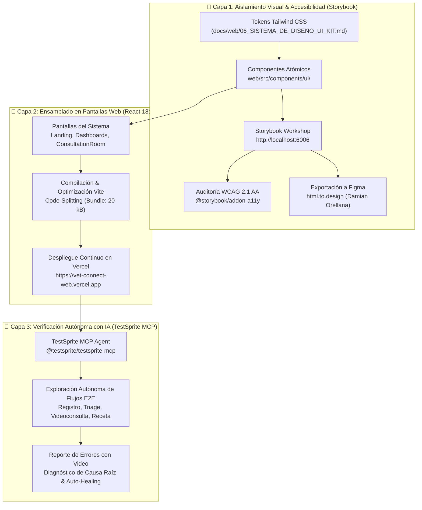
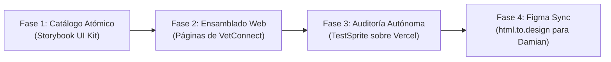

# 🧪 11. Plan Maestro de Integración: Storybook & TestSprite (Living UI Kit & AI-Agentic QA)

> **Documento:** `docs/web/11_INTEGRACION_STORYBOOK_Y_TESTSPRITE_QA.md`  
> **Área:** Desarrollo Basado en Componentes (CDD), Catálogo Visual Aislado, Auditoría de Accesibilidad WCAG AA y Testing E2E Autónomo con IA  
> **Proyecto:** VetConnect — Telemedicina Veterinaria & Gestión Clínica  
> **Criterio de Evaluación:** Staff Frontend Engineer / FAANG Tier | Septiembre 2026  
> **Estado:** 📋 **PLAN MAESTRO APROBADO & LISTO PARA EJECUCIÓN**

---

## 🧭 1. Fundamentos y Objetivos Estratégicos

El presente documento establece el protocolo oficial de ingeniería para incorporar **Storybook** y **TestSprite** dentro del ciclo de desarrollo de VetConnect. 

En un sistema de telemedicina crítica con videollamadas WebRTC, chat sincrónico y recetas digitales SENASA, el testing no puede limitarse a pruebas unitarias en consola (`jest` / `vitest`). Se requiere una estrategia dual que cubra:
1. **La Micro-Fidelidad Visual y de Accesibilidad (Aislamiento):** Garantizada por **Storybook** como taller atómico de componentes UI antes de acoplarlos a las pantallas completas.
2. **La Macro-Fidelidad Operativa y de Flujos Reales (Caja Negra):** Garantizada por **TestSprite** como agente autónomo con Inteligencia Artificial que explora, interactúa y valida la aplicación desplegada en **Vercel** (`https://vet-connect-web.vercel.app`) simulando tutores y veterinarios reales.



---

## 🎨 2. Módulo 1: Protocolo de Desarrollo con Storybook (Component-Driven Development)

### 2.1 Rol de Storybook en VetConnect
Storybook opera como el **taller de desarrollo aislado** del equipo de frontend. Permite:
* Diseñar y probar cada botón, tarjeta o modal **sin levantar el servidor backend Express**, sin depender de la base de datos PostgreSQL y sin tener que iniciar sesión manualmente una y otra vez.
* Proveer al **Técnico Multimedial (Damian Orellana)** de un catálogo visual interactivo de todos los componentes del sistema con sus estados (`default`, `hover`, `active`, `disabled`, `loading`, `error`).
* Exportar componentes vectoriales directamente a Figma mediante el plugin `html.to.design` con un solo clic.

### 2.2 Estructura y Configuración Técnica
* **Configuración del Servidor:** [`web/.storybook/main.ts`](../../web/.storybook/main.ts) configurado con el framework `@storybook/react-vite` y resolución de módulos compatible con monorepos.
* **Integración de Estilos de Marca:** [`web/.storybook/preview.tsx`](../../web/.storybook/preview.tsx) importa directamente [`web/src/index.css`](../../web/src/index.css) garantizando que todos los tokens Tailwind CSS (paleta azul `#2563EB`, esmeralda `#059669`, sombras y bordes redondeados) se reflejen fielmente.
* **Addons Activos:**
  - `@storybook/addon-essentials`: Controles interactivos (props editables en tiempo real), acciones y vista previa responsiva.
  - `@storybook/addon-a11y`: Motor de pruebas de accesibilidad basado en **Axe Core**, que evalúa contraste de color, roles ARIA y accesibilidad por teclado.
  - `@storybook/addon-interactions`: Simulación de eventos y clics dentro de las historias.

### 2.3 Taxonomía de Componentes a Desarrollar en Storybook

| Nivel Atómico | Componente | Ubicación en Código | Estados / Variantes Requeridas |
|---|---|---|---|
| **Átomo** | `Button` | `web/src/components/ui/Button.tsx` | `primary`, `secondary`, `outline`, `danger`, `ghost`, `sm`, `md`, `lg`, `isLoading`, `disabled` |
| **Átomo** | `Badge` (Triage) | `web/src/components/ui/Badge.tsx` | `green` (No urgente), `yellow` (Urgencia moderada), `red` (Emergencia crítica), `online`, `offline` |
| **Átomo** | `Input` | `web/src/components/ui/Input.tsx` | `default`, `focused`, `error` (mensaje de validación Zod), `disabled`, con icono prefijo |
| **Átomo** | `Avatar` | `web/src/components/ui/Avatar.tsx` | Especie animal (perro, gato), foto de perfil tutor, avatar veterinario con badge online |
| **Molécula** | `PetCard` | `web/src/components/ui/PetCard.tsx` | Nombre, especie, raza, peso, microchip ISO 11784/11785, botón de solicitar consulta |
| **Molécula** | `TriageSelector` | `web/src/components/ui/TriageSelector.tsx` | Selección de síntomas (dificultad respiratoria, trauma, vómitos) y cálculo visual de severidad |
| **Molécula** | `ChatMessage` | `web/src/components/ui/ChatMessage.tsx` | Mensaje entrante / saliente, texto, foto clínica adjunta con apertura modal Lightbox, timestamp |
| **Molécula** | `CallControls` | `web/src/components/ui/CallControls.tsx` | Micrófono on/off, cámara on/off, colgar llamada, indicador de calidad WebRTC |
| **Molécula** | `Breadcrumbs` | `web/src/components/ui/Breadcrumbs.tsx` | Rutas jerárquicas (items: label, href, active), separador Chevron accesible, roles ARIA `nav` y `aria-label="Breadcrumb"` |
| **Organismo** | `PrescriptionModal` | `web/src/components/ui/PrescriptionModal.tsx` | Formulario veterinario oficial para emitir receta con diagnóstico, fármaco, dosis y matrícula |
| **Organismo** | `PrescriptionDoc` | `web/src/components/ui/PrescriptionDoc.tsx` | Formato A4 oficial SENASA con código QR dinámico y estilos para `@media print` |

### 2.4 Estrategia de Refactorización Progresiva (De Páginas Monolíticas a Componentes Atómicos)
Las pantallas en `web/src/pages/` operan actualmente como prototipos de alta madurez funcional (Nivel 4.5). Para evitar duplicación visual y maximizar la reutilización, la elevación de UI sigue el siguiente protocolo de 3 pasos:
1. **Paso A — Extracción Atómica:** Se extraen los bloques JSX embebidos en `pages/` (`DashboardClient.tsx`, `DashboardVet.tsx`, `ConsultationRoom.tsx`) hacia componentes aislados y estrictamente tipados en `web/src/components/ui/`.
2. **Paso B — Creación de Historias en Storybook:** Para cada componente extraído, se crea su archivo `.stories.tsx` con soporte de controles, variantes interactivas y verificación de contraste/ARIA mediante `@storybook/addon-a11y`.
3. **Paso C — Reemplazo Limpio en Páginas Vivas:** Las páginas importan los nuevos componentes atómicos sin alterar la lógica de negocio ni las llamadas a API/WebSockets, preservando en todo momento los 29 tests web en verde.

### 2.5 Comando Operativo
```bash
# Iniciar el taller interactivo de Storybook
npm run storybook -w web
# Acceso en navegador: http://localhost:6006

# Compilar Storybook para despliegue estático o revisión de diseño
npm run build-storybook -w web
```

---

## 🤖 3. Módulo 2: Protocolo de QA Autónomo con TestSprite (Agentic E2E Testing)

### 3.1 Rol de TestSprite en VetConnect
TestSprite es un **agente autónomo de pruebas de software impulsado por Inteligencia Artificial**. A diferencia de los tests tradicionales donde un ingeniero escribe assertions fijas, TestSprite:
1. Recibe la URL del entorno desplegado en Vercel (`https://vet-connect-web.vercel.app`) y la especificación funcional de VetConnect.
2. Analiza el DOM, infiere la intención del usuario y **navega de forma autónoma**: completa campos de texto, pulsa botones, evalúa estados de espera y valida transiciones de pantalla.
3. Si detecta un fallo (ej. un modal que no abre, una validación errónea, un botón inerte o una llamada de red fallida), genera un **informe forense completo con video, capturas de pantalla y sugerencia de solución técnica**.

### 3.2 Configuración y Disponibilidad Operativa del Servidor MCP
TestSprite MCP es un servicio complementario asistido por el usuario que requiere una API Key activa provista en la configuración de MCP:

```json
{
  "mcpServers": {
    "testsprite": {
      "command": "npx",
      "args": [
        "-y",
        "@testsprite/testsprite-mcp@latest",
        "server"
      ],
      "env": {
        "API_KEY": "${TESTSPRITE_API_KEY}"
      }
    }
  }
}
```

> ⚠️ **Guardarraíl Operativo para Agentes de IA:**  
> Si el servidor MCP `testsprite` no se encuentra activo o no cuenta con `TESTSPRITE_API_KEY`, el agente **NO debe detener su flujo ni fallar**. La batería canónica y primaria de verificación automatizada local son los tests unitarios y de integración de Vitest (`npm test -w web`), `@testing-library/react` y el Storybook Test Runner. TestSprite opera como una capa de auditoría E2E complementaria sobre URLs públicas en Vercel.

### 3.3 Matriz de Escenarios de Prueba E2E para TestSprite

| ID Escenario | Flujo Clínico / Operativo | Acciones del Agente de IA | Criterio de Éxito Validado |
|---|---|---|---|
| **TS-E2E-01** | **Landing Page & Acceso Inicial** | Navega por la Landing, verifica enlaces de navegación, prueba responsividad móvil y hace clic en "Ingresar". | La página carga en < 1s, los botones de autenticación redirigen a `/login` sin errores de consola. |
| **TS-E2E-02** | **Registro y Onboarding de Tutor** | Rellena el formulario de registro con datos válidos (`CLIENT`), verifica validaciones de contraseña segura. | Recibe token, cookie de sesión y redirige exitosamente al Dashboard del Tutor (`/client/dashboard`). |
| **TS-E2E-03** | **Gestión de Mascotas (CRUD)** | Abre el modal de agregar mascota, ingresa especie, raza, peso y microchip de 15 dígitos. | La tarjeta de la mascota aparece en la lista con su avatar correspondiente y datos correctos. |
| **TS-E2E-04** | **Triaje Clínico y Espera de Guardia** | Selecciona mascota, marca síntomas agudos (ej. convulsión / disnea), evalúa cálculo de prioridad roja. | La consulta se crea en estado `WAITING_ROOM` con badge de severidad y contador de triaje activo. |
| **TS-E2E-05** | **Flujo Veterinario (Recepción)** | Inicia sesión como `VET`, activa el interruptor de guardia (`isOnline = true`), atiende consulta en espera. | La consulta transiciona a estado `ACTIVE` y habilita la sala de consulta telemédica (`/call/:id`). |
| **TS-E2E-06** | **Videoconsulta & Chat Fotográfico** | Ingresa a `/call/:id`, verifica montaje de controles de llamada y envío de mensaje de chat. | Conexión WebSocket establecida, mensajes se renderizan en pantalla y botón de colgar funciona. |
| **TS-E2E-07** | **Emisión y Validación de Receta** | El veterinario abre el modal de receta, prescribe medicación y genera la vista oficial con QR. | La receta muestra firma, matrícula profesional y el botón `window.print()` se ejecuta correctamente. |
| **TS-E2E-08** | **Auditoría de Matrículas SENASA** | Inicia sesión como `ADMIN`, accede a `/admin/vets`, revisa veterinario pendiente y pulsa "Aprobar". | Estado del veterinario cambia a `APPROVED` y desaparece de la cola de pendientes. |

---

## 📅 4. Plan de Ejecución Secuencial (Fases de Trabajo)

El trabajo conjunto entre Storybook y TestSprite se estructura en 4 fases ordenadas que garantizan cero retrabajo y máxima calidad:



### 🔹 Fase 1: Construcción de la Biblioteca de Componentes en Storybook
1. Desarrollar los componentes atómicos en `web/src/components/ui/` utilizando Tailwind CSS y primitivas accesibles.
2. Escribir las historias interactivas (`.stories.tsx`) para cada componente cubriendo todos sus estados y casos borde.
3. Ejecutar la auditoría de accesibilidad con `@storybook/addon-a11y` hasta obtener **0 violaciones WCAG 2.1 AA**.

### 🔹 Fase 2: Ensamblado y Refactor Visual de las Pantallas Web
1. Reemplazar los elementos HTML crudos de las páginas actuales (`Landing.tsx`, `DashboardClient.tsx`, `DashboardVet.tsx`, `ConsultationRoom.tsx`, `AdminVets.tsx`, `PrescriptionView.tsx`) por los componentes atómicos probados en Storybook.
2. Garantizar que la lógica de negocio, hooks de TanStack Query, llamadas Axios y Socket.io permanezcan intactos.
3. Verificar que la suite de pruebas unitarias (`npm test -w web`) mantenga sus **29 tests en verde**.

### 🔹 Fase 3: Despliegue en Vercel & Auditoría Autónoma con TestSprite
1. Desplegar los cambios a Vercel con `git push`.
2. Invocar a TestSprite mediante su servidor MCP para ejecutar la batería de pruebas autónomas sobre la URL pública en vivo:
   > *"TestSprite, ejecuta los escenarios TS-E2E-01 a TS-E2E-08 sobre https://vet-connect-web.vercel.app y genera el informe de hallazgos."*
3. Analizar los reportes de video y capturas de pantalla de TestSprite; corregir iterativamente cualquier anomalía detectada.

### 🔹 Fase 4: Exportación Vectorial a Figma para el Diseñador Multimedial
Se sigue el flujo canónico de sincronización bidireccional mediante `html.to.design` detallado en [**`06_SISTEMA_DE_DISENO_UI_KIT.md#7-metodología-de-sincronización-diseño-código-flujo-híbrido-virtuoso-storybook--figma--htmltodesign`**](./06_SISTEMA_DE_DISENO_UI_KIT.md#7-metodología-de-sincronización-diseño-código-flujo-híbrido-virtuoso-storybook--figma--htmltodesign) para entregar a Damian Orellana los frames vectoriales nativos para su supervisión visual.

---

## 🎯 5. Criterios de Aceptación y Definition of Done (DoD)

Para considerar concluida la integración de estas herramientas en la siguiente fase de desarrollo:
* [ ] **Storybook:** Todos los componentes de `web/src/components/ui/` cuentan con su archivo `.stories.tsx` con controles interactivos configurados.
* [ ] **Accesibilidad:** Cero alertas críticas de contraste o atributos ARIA en el panel de `@storybook/addon-a11y`.
* [ ] **Compilación:** `npm run build-storybook -w web` compila limpiamente en menos de 10 segundos.
* [ ] **TestSprite:** Ejecución exitosa de los flujos nucleares de tutor, veterinario y administrador sobre Vercel sin excepciones no controladas.
* [ ] **Cero Regresiones:** Los **123 tests automatizados** del monorepo continúan pasando al 100% y el bundle inicial de la Landing se mantiene en **~20 kB**.

---
*Documento Canónico de Integración Storybook & TestSprite — VetConnect 2026.*
