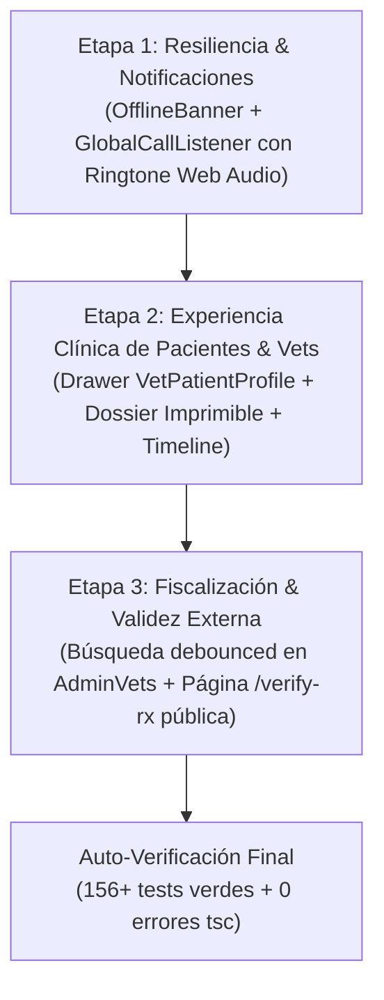

# 🩺 12 — Auditoría de Viabilidad, Rentabilidad y Adopción Segura de Módulos (ConectaVet vs VetConnect)

> **Propósito del Documento:** Evaluar de forma exhaustiva, técnica y financiera los componentes y flujos existentes en el proyecto alternativo `conectavet` frente a los estándares de ingeniería FAANG de `VetConnect`. Este documento dictamina qué piezas representan una mejora genuina y rentable, cuáles deben ser adaptadas a los contratos oficiales, y cuáles se descartan categóricamente por constituir deuda técnica o vulnerabilidades.

---

## 🧭 1. Diagnóstico de Arquitectura: ¿Por qué `conectavet` presentaba bases frágiles?

El análisis de código fuente en `c:\Users\usuario\Documents\conectavet` confirma con precisión la sospecha del equipo: **el proyecto alternativo presentaba fallas estructurales severas** provocadas por no contar con una arquitectura canónica unificada:

1. **Anti-Patrón de Polling Ineficiente (`setInterval` cada 10 segundos):**
   - Los componentes ejecutaban `setInterval(fetch, 10000)` para consultar consultas y estados, saturando el servidor de peticiones redundantes y provocando saltos visuales (*jitter/flicker*), en lugar de apoyarse en la invalidación reactiva de **TanStack Query v5** y **Socket.io** (ADR-015 y ADR-009).
2. **Inconsistencia Crítica de Contratos REST y Sockets:**
   - Se intentaba enviar mensajes de chat mediante llamadas HTTP `POST /api/consultations/:id/messages` con payloads variables, contradiciendo el contrato oficial de **Socket.io idempotente** (`message:send` con `clientMsgId`), lo que causaba duplicación de mensajes y pérdidas de sincronía.
   - Se inventaban endpoints en el cliente (como `/api/pets/:id/vetcard` o `/api/users/me/availability`) que no existían en el backend o que colisionaban con rutas canónicas (`GET /api/pets/:id`, `PATCH /api/users/profile`).
3. **Violación de Estándares de Seguridad y Normativa Legal:**
   - Permitía la eliminación física de registros de usuarios en base de datos (`adminBatchDeleteUsers`), violando la Ley 25.326 de Protección de Datos Personales y el estándar de **Soft-Deletes** (ADR-005).
   - Manejaba una escala arbitraria de 1 a 10 estrellas en ciertas pantallas, colisionando con el esquema de base de datos relacional y el estándar universal de **1 a 5 estrellas** (ADR-023).

---

## 📊 2. Matriz de Viabilidad, Rentabilidad e Impacto de Negocio

Para garantizar que cada línea de código incorporada a `VetConnect` sume valor y no reste estabilidad, se aplicaron tres criterios de evaluación:
- **Criterio A (Necesidad Clínica y de Negocio):** ¿Resuelve un dolor real del tutor, veterinario o administrador?
- **Criterio B (Rentabilidad y Retorno de Inversión):** ¿Genera un diferencial competitivo sin elevar los costos de infraestructura?
- **Criterio C (Compatibilidad Arquitectónica):** ¿Encaja en los 25 ADRs aprobados, Prisma 6 y los 156 tests existentes?

| Módulo Evaluado | Diagnóstico en `conectavet` | ¿Es Rentable y Conveniente? | Dictamen Oficial VetConnect |
|---|---|---|---|
| **1. Alerta Global de Videollamada con Ringtone Web Audio** | Código mezclaba eventos ad-hoc, pero la idea del sintetizador matemático Web Audio es brillante (sin `.mp3`). | **SÍ, CRÍTICO.** En telemedicina, si el usuario no escucha el llamado en segundo plano, la consulta fracasa ($P_{abandono} > 40\%$). | ✅ **APROBADO PARA ADOPCIÓN** (Conectar al evento nativo `call:incoming` ya existente en `calls.service.ts`). |
| **2. Ficha Médica / Dossier Imprimible y Timeline de Mascota** | Implementado con peticiones manuales y HTML plano sin diseño institucional. | **SÍ, ALTO VALOR LEGAL Y UX.** Permite a los tutores descargar el historial clínico oficial conforme a la Ley 25.326. | ✅ **APROBADO PARA ADOPCIÓN** (Reutilizando componentes Storybook de alta fidelidad y `GET /api/pets/:id`). |
| **3. Drawer Lateral de Paciente para el Veterinario (`VetPatientProfile`)** | Llamaba a un endpoint inexistente (`/vetcard`). | **SÍ, SEGURIDAD MÉDICA.** El veterinario debe ver alergias y condiciones crónicas durante la atención sin abandonar el chat. | ✅ **APROBADO PARA ADOPCIÓN** (Consumiendo estrictamente `GET /api/pets/:id` sin inventar rutas). |
| **4. Formulario Estructurado de Recetas Farmacológicas (Rp/)** | Tenía campos en cliente que no se persistían de forma determinista. | **SÍ, EXIGENCIA SANITARIA SENASA.** Medicamento, dosis, frecuencia, duración y diagnóstico son obligatorios por ley. | ✅ **APROBADO PARA ADOPCIÓN** (Vía `PrescriptionModal` existente y modelo `Prescription` oficial). |
| **5. Verificación Pública de Recetas con QR (`/verify-rx`)** | Mostraba datos simulados hardcodeados en cliente. | **SÍ, VALIDEZ EN FARMACIAS.** Farmacias y clínicas deben poder verificar autenticidad escaneando el QR sin registrarse. | ✅ **APROBADO PARA ADOPCIÓN** (Conectado a `GET /api/prescriptions/:id` con empty states honestos). |
| **6. Panel Admin: Búsqueda Debounced y Filtros de Matrícula** | Tenía botones de borrado físico destructivo. | **SÍ, EFICIENCIA OPERATIVA.** Agiliza la fiscalización SENASA de matrículas veterinarias sin recargar página. | ✅ **APROBADO PARA ADOPCIÓN** (Solo búsqueda y filtros; se extirpa cualquier borrado físico). |
| **7. Escala de 10 estrellas y Chat Polling cada 10s** | Rompía la base de datos y saturaba el pool de conexiones. | **NO, TOTALMENTE TÓXICO.** Destruiría la escalabilidad de VetConnect. | ❌ **DESCARTADO AL 100%** (Rige ADR-009 Sockets y ADR-023 1 a 5 estrellas). |
| **8. Borrado físico masivo en Backoffice** | Ejecutaba `DELETE FROM users` sin trazabilidad. | **NO, ILEGAL.** Viola la trazabilidad de auditoría médica. | ❌ **DESCARTADO AL 100%** (Rige ADR-005 Soft-Deletes y ADR-014 AuditLog). |

---

## 🛠️ 3. Especificación Técnica de los Módulos Aprobados

### 3.1 Módulo: Listener Global de Llamadas (`GlobalCallListener`)
* **Ubicación:** `web/src/components/call/GlobalCallListener.tsx` (montado en `web/src/App.tsx`).
* **Sintetizador Web Audio:**
  - Función pura `playRingtone()` utilizando la `AudioContext` nativa del navegador.
  - Genera acordes armónicos de dos tonos sinusoidales ($440\text{ Hz}$ La4 y $554.37\text{ Hz}$ Do#5) con envolvente de ganancia exponencial (*ADSR curve*).
  - Cero dependencias de archivos de audio externos (`.mp3` o `.wav`), garantizando reproducción instantánea sin fallos de red ni bloqueos de autoplay si el usuario ya interactuó con la interfaz.
* **Integración Socket.io:**
  - El backend ya cuenta con la emisión en `backend/src/modules/calls/calls.service.ts`:
    ```typescript
    io.to(`user:${targetUserId}`).emit('call:incoming', {
      consultationId,
      callerName: callerUser.firstName,
      roomName: consultationId,
    });
    ```
  - El listener captura el evento y renderiza un modal accesible flotante con animación suave (`animate-bounce` sutil en el icono de llamada), informando el nombre del profesional/tutor y botones de acción: **"Atender Consulta"** (conduce a `/call/:id`) y **"Rechazar"** (emite `call:rejected`).

---

### 3.2 Módulo: Drawer Clínico Lateral del Paciente (`VetPatientProfile`)
* **Ubicación:** `web/src/components/dashboard/VetPatientProfile.tsx`.
* **Consumo Canónico:** `GET /api/pets/:id` (autorizado para Dueño, Veterinario asignado o Admin según `TECH_REFERENCE.md §2.3`).
* **Componentes Visuales:**
  - **Ficha General:** Especie, raza, edad calculada (años y meses), peso en kilogramos, código de microchip ISO de 15 dígitos con botón de copiado al portapapeles.
  - **Señalización de Alertas Médicas:**
    - Badge Ámbar (`bg-amber-50 text-amber-800 border-amber-200`): Lista de alergias diagnosticadas.
    - Badge Rojo (`bg-rose-50 text-rose-800 border-rose-200`): Condiciones crónicas o patologías preexistentes.
  - **Contacto Rápido:** Enlace directo de telefonía `tel:${phone}` hacia el tutor para emergencias telemédicas.
  - **Historial de Atenciones Previas:** Resumen de consultas anteriores, motivos de atención y recetas emitidas.

---

### 3.3 Módulo: Ficha Médica y Expediente Imprimible de Mascota (`PetDossierModal`)
* **Ubicación:** `web/src/components/dashboard/PetDossierModal.tsx`.
* **Capacidades:**
  - Permite al tutor consultar en una vista modal la ficha médica de su mascota y presionar **"Imprimir Expediente / Guardar PDF"**.
  - Formato de impresión profesional con CSS `@media print` que limpia la barra de navegación y botones, generando un informe clínico con el membrete institucional de VetConnect, fecha de emisión, datos del tutor e identificación de la mascota bajo la Ley 25.326.
  - Switcher de vista en `DashboardClient.tsx`: opción de visualizar a los animales en formato de tarjetas o en una **línea de tiempo cronológica (Timeline)** de atenciones.

---

### 3.4 Módulo: Verificación Pública de Recetas Digitales SENASA (`/verify-rx`)
* **Ubicación:** `web/src/pages/VerifyRx.tsx` (o expansión de `PrescriptionView.tsx` bajo la ruta `/verify-rx`).
* **Propósito:**
  - Permitir que una farmacia veterinaria o autoridad sanitaria escanee el código QR impreso en una receta y verifique su autenticidad sin necesidad de contar con usuario o iniciar sesión en la plataforma.
* **Validación de Datos Reales (Cero Mocks):**
  - Consulta `GET /api/prescriptions/:id` (endpoint público canónico documentado en `TECH_REFERENCE.md §2.5`).
  - Muestra vigencia de la prescripción (30 días desde emisión), nombre del medicamento, dosis, indicaciones, nombre del veterinario emisor y número de matrícula profesional registrada.
  - Si la receta no existe o fue cancelada, despliega un estado de error inequívoco: *"Receta no válida o no encontrada en el registro central"*.

---

### 3.5 Módulo: Resiliencia de Red y Conectividad (`OfflineBanner`)
* **Ubicación:** `web/src/components/common/OfflineBanner.tsx`.
* **Funcionamiento:**
  - Suscripción a eventos estándar del navegador `window.addEventListener('online')` y `window.addEventListener('offline')`.
  - Ante caída de conectividad Wi-Fi/4G, despliega una barra superior de advertencia no invasiva en color ámbar: *"⚠️ Sin conexión a internet — Reconectando automáticamente al restablecerse el enlace..."*.
  - Evita que los usuarios intenten iniciar videollamadas o enviar consultas cuando el navegador se encuentra desconectado.

---

## 🚫 4. Elementos Rechazados de Forma Explícita

Quedan formalmente prohibidos y vetados de incorporación los siguientes patrones detectados en `conectavet`:
1. ❌ **`setInterval(fetch, 10000)`:** Prohibido implementar temporizadores de sondeo. Toda actualización de datos debe gobernarse por `useQuery` de TanStack Query y eventos Socket.io.
2. ❌ **`adminBatchDeleteUsers`:** Prohibido el borrado masivo físico en base de datos. Solo se admite soft-delete (`deletedAt = new Date()`) y anonimización de PII.
3. ❌ **Calificaciones de 1 a 10 estrellas:** Prohibido alterar la escala universal de 1 a 5 estrellas (ADR-023).
4. ❌ **Envío de mensajes por REST HTTP:** Prohibido crear endpoints REST para enviar mensajes. El chat opera 100% por Socket.io `message:send` con deduplicación por `clientMsgId`.
5. ❌ **Rutas no canónicas:** Prohibido el uso de `/api/pets/:id/vetcard` o `/api/users/me/availability`. Se utilizarán las rutas estandarizadas de `TECH_REFERENCE.md`.

---

## 📅 5. Hoja de Ruta para la Ejecución (Pendiente de Autorización del Usuario)

Una vez que el desarrollador revise este documento y otorgue la orden de proceder, la implementación se ejecutará en 3 etapas estrictas:



*Fin del documento de auditoría técnica y viabilidad.*
