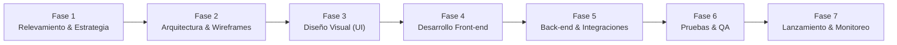

# 🌐 Planificación Integral de Diseño Web — VetConnect

> **Directorio de Documentación Técnica:** `docs/web/`  
> **Proyecto:** VetConnect — Plataforma Integral de Telemedicina Veterinaria & Gestión Clínica  
> **Área:** Diseño de Experiencia de Usuario (UX), Interfaz de Usuario (UI) & Arquitectura Web Frontend  
> **Estado:** `APPROVED & MASTERED WEB PLANNING SPECIFICATION`  
> **Fecha:** Septiembre 2026 | **Versión:** 2.0 (Alineada Post-Auditoría FAANG)  
> **Cumplimiento Normativo:** ISO 9241-210 (DCU), ISO 9241-11 (Usabilidad), WCAG 2.1 Nivel AA, Ley N° 25.326 y Regulaciones Sanitarias SENASA.

---

## 🧭 1. Propósito y Alcance de este Directorio

El presente directorio reúne y consolida toda la planificación estratégica, metodológica, visual y técnica del **Frontend Web de VetConnect**. 

A diferencia de la aplicación móvil (orientada primordialmente al tutor de mascotas en movimiento), el **Portal Web de VetConnect** se concibe como una solución integral multi-rol que satisface con grado profesional las necesidades operativas de:
1. **Médicos Veterinarios de Guardia (`VET`):** Consola clínica de alta productividad para gestión de turnos, videoconsultas WebRTC en alta definición (LiveKit 720p), chat sincrónico con inspección fotográfica macroscópica de pacientes, redacción de historias clínicas y emisión digital de recetas oficiales con firma electrónica y código QR para validación farmacéutica.
2. **Administradores y Reguladores (`ADMIN`):** Panel de control para fiscalización de matrículas profesionales SENASA, monitoreo de métricas operativas y auditoría inmutable de eventos (`AuditLog`).
3. **Tutores de Mascotas (`CLIENT`):** Portal de autoservicio web para registro de animales, solicitud de triage telemédico de urgencia, consulta de recetas históricas y agendamiento clínico.

> 🔒 **Aviso de Preservación Arquitectónica:**  
> Esta suite documental en `docs/web/` se nutre de los contratos y especificaciones canónicas maestras ubicadas en la raíz de `docs/` ([`SPEC.md`](../SPEC.md), [`PLAN_DE_PROYECTO_Y_GESTION.md`](../PLAN_DE_PROYECTO_Y_GESTION.md), [`SISTEMA_DE_DISENO.md`](../SISTEMA_DE_DISENO.md), [`DECISIONS.md`](../DECISIONS.md), [`TECH_REFERENCE.md`](../TECH_REFERENCE.md) y [`ARCHITECTURE.md`](../ARCHITECTURE.md)), sin alterar ninguno de dichos archivos fundamentales.

---

### 🔬 2. Nivel de Madurez Actual de la Web: Nivel 4.5 / 5 (Pre-Gold Master / Staging Ready)

A partir de la auditoría técnica integral y la ejecución del plan de *Frontend Hardening* ([`00_AUDITORIA_INTEGRAL_ESTADO_REAL.md`](./00_AUDITORIA_INTEGRAL_ESTADO_REAL.md)), se establece el estado real de ingeniería del portal web:

```
[ Nivel 1: Ideación & Specs ] ──> [ Nivel 2: Scaffolding Core ] ──> [ Nivel 3: MVP Funcional ] ──> [ Nivel 3.5: RC ] ──> [ 📍 Nivel 4.5: Pre-Gold Master ] ──> [ Nivel 5: Gold Master ]
                                                                                                                          (ESTADO ACTUAL VERIFICADO)            (Lanzamiento Producción)
```

- **Estado Actual (Nivel 4.5):** La web cuenta con una **SPA React 18.3.1 + Tailwind CSS v3 completamente funcional y endurecida para producción**. La lógica clínica, autenticación JWT con cookies `HttpOnly`, colas de concurrencia Axios (`failedQueue`), WebSockets de chat con transferencia de fotos clínicas, WebRTC con LiveKit SFU 720p con inyección dinámica de `wsUrl`, code-splitting con `React.lazy()` y CRUDs de pacientes están 100% operativos y verificados empíricamente:

> 🛑 **Aviso Crítico para Agentes de IA y Subagentes Autónomos:**  
> El repositorio **NO es pre-código ni parte de cero absoluto**. Los tres workspaces (`backend/`, `web/`, `mobile/`) se encuentran plenamente estructurados con 123 tests unitarios y de integración pasando al 100%. Queda terminantemente prohibido ejecutar comandos de scaffolding destructivos (como `npm create vite@latest`, `npm init`, o purgar carpetas existentes). El trabajo sobre la web consiste exclusivamente en **refactorización atómica progresiva en Storybook (`components/ui/`), ensamblado visual y optimización**, preservando el código funcional y los tests verdes existentes.

#### 📊 Verificación Empírica & Estado de Producción:
La suite completa del monorepo cuenta con **36 suites / 123 tests PASSED (0 fallos)**, typecheck estricto sin errores y bundle de entrada optimizado a 20.38 kB. Los 5 gaps críticos de frontend hardening (Code-Splitting, Inyección dinámica `wsUrl`, selector de macro-fotos en chat, pipeline CI y observabilidad Sentry con cookies cross-domain) se encuentran **100% implementados y verificados**. El desglose pormenorizado de pruebas, métricas de bundle y bitácora técnica se encuentra centralizado en el documento canónico:
👉 [**`00_AUDITORIA_INTEGRAL_ESTADO_REAL.md` — Auditoría Integral de Estado Real**](./00_AUDITORIA_INTEGRAL_ESTADO_REAL.md)

#### ⚖️ Alineación Arquitectónica, Alcance v2.0 y Correspondencia de Código:
El mapeo uno a uno entre especificación planificada y archivos de código fuente (`web/src/pages/`, `context/`, `services/`) está documentado en [**`00_AUDITORIA_INTEGRAL_ESTADO_REAL.md#4-contraste-empírico-planificación-vs-código-real`**](./00_AUDITORIA_INTEGRAL_ESTADO_REAL.md#4-contraste-empírico-planificación-vs-código-real).

- **Estrategia Colaborativa Híbrida (Storybook + Figma + `html.to.design`):** Conforme a [`06_SISTEMA_DE_DISENO_UI_KIT.md`](./06_SISTEMA_DE_DISENO_UI_KIT.md#7-metodología-de-sincronización-diseño-código-flujo-híbrido-virtuoso-storybook--figma--htmltodesign), Damian Orellana lidera el diseño visual en Figma mientras el equipo de desarrollo construye componentes atómicos testeados en Storybook con tokens Tailwind sincronizados. Los estados vivos e interactivos de la SPA se sincronizan con Figma mediante `html.to.design`, asegurando consistencia sin trabajo duplicado ni bloqueos.
- **Modelo de Acceso en v2.0 (Sin Pasarela de Pago):** Conforme a [`docs/PLAN_DE_PROYECTO_Y_GESTION.md:214`](../PLAN_DE_PROYECTO_Y_GESTION.md#L214), la pasarela de pagos es formalmente **ScopeOut para v2.0**, operando bajo modelo de guardia institucional sin barreras arancelarias de entrada en el PMV (pagos diferidos a v2.1+).

---

## 🗺️ 3. Mapa y Estructura de Documentación Web

La planificación web está estructurada de manera modular y secuencial en los siguientes documentos:

```
docs/web/
├── README.md                                         # Este documento (índice maestro, madurez y mapa metodológico)
├── 00_AUDITORIA_INTEGRAL_ESTADO_REAL.md              # Documento canónico de auditoría técnica FAANG y preparación para producción
├── 01_ESTRATEGIA_Y_RELEVAMIENTO.md                   # Fase 1: Brief, 10 pasos, 7 Cs, 3 principios y modelo institucional
├── 02_INVESTIGACION_DCU_Y_DESIGN_THINKING.md          # DCU (ISO 9241-210/11), Design Thinking, mapas de empatía y ética
├── 03_REQUERIMIENTOS_Y_PMV.md                        # Actividad 15: Requerimientos funcionales/no funcionales y PMV v2.0
├── 04_ARQUITECTURA_DE_INFORMACION_Y_NAVEGACION.md      # Árbol web jerárquico, menús globales/dropdowns y breadcrumbs
├── 05_WIREFRAMING_Y_PROTOTIPADO_BAJA_FIDELIDAD.md      # Actividad 25: Wireframes funcionales interactivos (Nivel 4.5)
├── 06_SISTEMA_DE_DISENO_UI_KIT.md                    # Actividad 26: Regla 60-30-10, tokens Tailwind y arquitectura shadcn/ui
├── 07_AUDITORIA_UX_USABILIDAD_Y_ACCESIBILIDAD.md     # Checklist de auditoría, 10 Heurísticas de Nielsen y WCAG AA
├── 08_DESARROLLO_INTEGRACIONES_Y_ROADMAP.md          # Fases 4-7: React 18.3.1 LTS, LiveKit, Express 5, QA y Hardening
├── 09_PLANIFICACION_UI_ALTA_FIDELIDAD_CODE_FIRST.md  # Paso 6: Especificación de alta fidelidad, tokens y puente a Figma
├── 10_OPTIMIZACION_PERFORMANCE_SEO_Y_ACCESIBILIDAD.md # Fases 6-7: Rendimiento extremo CWV, a11y WCAG AAA y SEO Schema.org
└── 11_INTEGRACION_STORYBOOK_Y_TESTSPRITE_QA.md       # Fases 3-7: Catálogo Storybook aislado, a11y Axe y QA Autónomo con TestSprite MCP
```

---

## 🔄 4. Ciclo de Diseño y Desarrollo Web Profesional

El proyecto adopta el proceso estándar de la industria estructurado en **7 Fases Principales** y **10 Pasos Operativos**:



### Tabla de Equivalencia Metodológica:

| Fase del Proceso | Paso Concreto | Documento de Referencia | Entregable Principal |
|---|---|---|---|
| **Fase 1: Relevamiento y Estrategia** | Paso 1: Definir objetivos<br/>Paso 2: Estudiar al público<br/>Paso 3: Dominio y hosting<br/>Paso 4: Elegir plataforma | [`01_ESTRATEGIA_Y_RELEVAMIENTO.md`](./01_ESTRATEGIA_Y_RELEVAMIENTO.md)<br/>[`02_INVESTIGACION_DCU_Y_DESIGN_THINKING.md`](./02_INVESTIGACION_DCU_Y_DESIGN_THINKING.md) | Brief, análisis competitivo, personas, mapas de empatía y presupuesto. |
| **Fase 2: Arquitectura de Información & Wireframes** | Paso 5: Crear mapa del sitio y wireframes | [`03_REQUERIMIENTOS_Y_PMV.md`](./03_REQUERIMIENTOS_Y_PMV.md)<br/>[`04_ARQUITECTURA_DE_INFORMACION_Y_NAVEGACION.md`](./04_ARQUITECTURA_DE_INFORMACION_Y_NAVEGACION.md)<br/>[`05_WIREFRAMING_Y_PROTOTIPADO_BAJA_FIDELIDAD.md`](./05_WIREFRAMING_Y_PROTOTIPADO_BAJA_FIDELIDAD.md) | Árbol web, menús, breadcrumbs y maquetación funcional interactiva (Nivel 4.5). |
| **Fase 3: Diseño Visual (UI)** | Paso 6: Diseñar identidad visual y mockups de alta fidelidad | [`06_SISTEMA_DE_DISENO_UI_KIT.md`](./06_SISTEMA_DE_DISENO_UI_KIT.md)<br/>[`09_PLANIFICACION_UI_ALTA_FIDELIDAD_CODE_FIRST.md`](./09_PLANIFICACION_UI_ALTA_FIDELIDAD_CODE_FIRST.md)<br/>[`11_INTEGRACION_STORYBOOK_Y_TESTSPRITE_QA.md`](./11_INTEGRACION_STORYBOOK_Y_TESTSPRITE_QA.md) | Guía de estilos, tokens Tailwind CSS, UI Kit shadcn/ui, catálogo Storybook y estrategia Code-First a Figma. |
| **Fase 4: Desarrollo Front-end** | Paso 7: Desarrollar el sitio (Código UI) | [`08_DESARROLLO_INTEGRACIONES_Y_ROADMAP.md`](./08_DESARROLLO_INTEGRACIONES_Y_ROADMAP.md)<br/>[`11_INTEGRACION_STORYBOOK_Y_TESTSPRITE_QA.md`](./11_INTEGRACION_STORYBOOK_Y_TESTSPRITE_QA.md) | SPA React 18.3.1 + Vite, Component-Driven Development con Storybook, responsive y accesible. |
| **Fase 5: Desarrollo Back-end e Integraciones** | Paso 7 (Cont.): Conexión de servicios y APIs | [`08_DESARROLLO_INTEGRACIONES_Y_ROADMAP.md`](./08_DESARROLLO_INTEGRACIONES_Y_ROADMAP.md) | REST APIs, Socket.io, LiveKit WebRTC y modelo de guardia institucional (Pagos ScopeOut v2.0). |
| **Fase 6: Pruebas, QA & Rendimiento** | Paso 8: Cargar contenido<br/>Paso 9: Hacer pruebas (QA) | [`07_AUDITORIA_UX_USABILIDAD_Y_ACCESIBILIDAD.md`](./07_AUDITORIA_UX_USABILIDAD_Y_ACCESIBILIDAD.md)<br/>[`10_OPTIMIZACION_PERFORMANCE_SEO_Y_ACCESIBILIDAD.md`](./10_OPTIMIZACION_PERFORMANCE_SEO_Y_ACCESIBILIDAD.md)<br/>[`11_INTEGRACION_STORYBOOK_Y_TESTSPRITE_QA.md`](./11_INTEGRACION_STORYBOOK_Y_TESTSPRITE_QA.md) | Matriz WCAG AAA, lectores de pantalla, heurísticas, Core Web Vitals y auditoría autónoma E2E con TestSprite MCP. |
| **Fase 7: Lanzamiento, SEO y Monitoreo** | Paso 10: Publicar y medir | [`08_DESARROLLO_INTEGRACIONES_Y_ROADMAP.md`](./08_DESARROLLO_INTEGRACIONES_Y_ROADMAP.md)<br/>[`10_OPTIMIZACION_PERFORMANCE_SEO_Y_ACCESIBILIDAD.md`](./10_OPTIMIZACION_PERFORMANCE_SEO_Y_ACCESIBILIDAD.md)<br/>[`11_INTEGRACION_STORYBOOK_Y_TESTSPRITE_QA.md`](./11_INTEGRACION_STORYBOOK_Y_TESTSPRITE_QA.md) | Frontend Hardening, Vercel/Coolify, SSL TLS 1.3, SEO Schema.org, Sentry y suite TestSprite continua. |

---

## ⚡ 5. Cómo Utilizar esta Documentación

- **Para Diseñadores UI/UX:** Consultar `06_SISTEMA_DE_DISENO_UI_KIT.md`, `09_PLANIFICACION_UI_ALTA_FIDELIDAD_CODE_FIRST.md` y `11_INTEGRACION_STORYBOOK_Y_TESTSPRITE_QA.md` para explorar los componentes aislados en Storybook (`http://localhost:6006`), auditar estados de UI y sincronizar con Figma vía `html.to.design`.
- **Para Desarrolladores Frontend:** Consultar `06_SISTEMA_DE_DISENO_UI_KIT.md`, `08_DESARROLLO_INTEGRACIONES_Y_ROADMAP.md`, `10_OPTIMIZACION_PERFORMANCE_SEO_Y_ACCESIBILIDAD.md` y `11_INTEGRACION_STORYBOOK_Y_TESTSPRITE_QA.md` para el desarrollo de componentes en Storybook, integración en pantallas de React 18, accesibilidad WCAG y ejecución de TestSprite.
- **Para Auditores y Líderes de Proyecto:** Utilizar `07_AUDITORIA_UX_USABILIDAD_Y_ACCESIBILIDAD.md`, `10_OPTIMIZACION_PERFORMANCE_SEO_Y_ACCESIBILIDAD.md` y `11_INTEGRACION_STORYBOOK_Y_TESTSPRITE_QA.md` como lista de chequeo indispensable y matriz de escenarios E2E.

---
*Planificación Web VetConnect 2026 — Grupo Pinnacle.*
